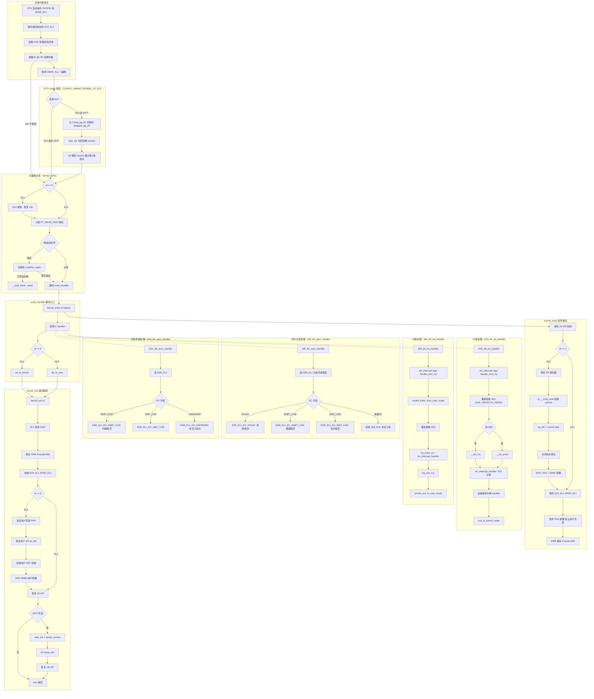

# ARM64 Linux 内核中断与异常 Entry 分析

## 1 概述

ARM64 Linux 内核使用一套标准的异常向量表处理所有中断、系统调用和异常。当异常发生时，CPU 硬件自动完成 PSTATE 保存、SP 切换和向量表跳转；软件（内核）在向量表中完成现场保存、异常分发和处理、现场恢复。

本分析基于 `arch/arm64/kernel/entry.S` 和 `arch/arm64/kernel/entry-common.c`。

---

## 2 ARM64 异常向量表

### 2.1 向量表布局

```asm
// arch/arm64/kernel/entry.S:593
.align	11
SYM_CODE_START(vectors)
    // —— 第1组：el1t（异常不升级EL，使用SP_EL0）——
    kernel_ventry	1, t, 64, sync      // Synchronous EL1t
    kernel_ventry	1, t, 64, irq        // IRQ EL1t
    kernel_ventry	1, t, 64, fiq        // FIQ EL1t
    kernel_ventry	1, t, 64, error      // Error EL1t

    // —— 第2组：el1h（异常不升级EL，使用SP_EL1）——
    kernel_ventry	1, h, 64, sync      // Synchronous EL1h
    kernel_ventry	1, h, 64, irq        // IRQ EL1h
    kernel_ventry	1, h, 64, fiq        // FIQ EL1h
    kernel_ventry	1, h, 64, error      // Error EL1h

    // —— 第3组：el0 64-bit（异常升级到EL1，源自64位用户态）——
    kernel_ventry	0, t, 64, sync      // Synchronous 64-bit EL0
    kernel_ventry	0, t, 64, irq        // IRQ 64-bit EL0
    kernel_ventry	0, t, 64, fiq        // FIQ 64-bit EL0
    kernel_ventry	0, t, 64, error      // Error 64-bit EL0

    // —— 第4组：el0 32-bit（异常升级到EL1，源自32位兼容用户态）——
    kernel_ventry	0, t, 32, sync      // Synchronous 32-bit EL0
    kernel_ventry	0, t, 32, irq        // IRQ 32-bit EL0
    kernel_ventry	0, t, 32, fiq        // FIQ 32-bit EL0
    kernel_ventry	0, t, 32, error      // Error 32-bit EL0
SYM_CODE_END(vectors)
```

### 2.2 四组向量选择规则

| 组 | kernel_ventry 参数 | 选择条件 | 典型场景 |
|--|--|--|--|
| **el1t** | `1, t, 64` | 异常发生在**EL1（内核态）**，且异常时使用 **SP_EL0**（`SPSel=0`） | Linux 内核默认在 EL1 使用 SP_EL1，此组**不会进入** |
| **el1h** | `1, h, 64` | 异常发生在**EL1（内核态）**，且异常时使用 **SP_EL1**（`SPSel=1`） | 内核态硬件中断、内核 oops、SError |
| **el0 64-bit** | `0, t, 64` | 异常从 **EL0（用户态）** 升级到 EL1，运行 **AArch64** 指令 | 系统调用、用户态缺页、用户态 IRQ |
| **el0 32-bit** | `0, t, 32` | 异常从 **EL0（用户态）** 升级到 EL1，运行 **AArch32** 指令 | 32 位兼容程序的系统调用/异常 |

### 2.3 核心选择逻辑

ARMv8 异常向量选择由三个因素决定：

```
异常向量索引 = f(目标EL, 源EL是否等于目标EL, 异常前使用的SP)
```

执行流程：

```
异常发生
  │
  ├─ 目标EL == 当前EL?  (没有异常级别切换)
  │     ├─ 使用 SP_EL0?  →  el1t 组 (Linux 不用)
  │     └─ 使用 SP_EL1?  →  el1h 组 (内核态中断/异常)
  │
  └─ 目标EL > 当前EL?  (从用户态 EL0 升级到 EL1)
        ├─ AArch64 程序  →  el0 64-bit 组
        └─ AArch32 程序  →  el0 32-bit 组
```

---

## 3 kernel_ventry 宏

`kernel_ventry` 是向量表中每个 entry 的入口宏，执行**栈分配、溢出检测和跳转**。

```asm
.macro kernel_ventry, el:req, ht:req, regsize:req, label:req
    .align 7                          // 128字节对齐

    // [仅 EL0] 处理 tramp_vector 的清理
    .if \el == 0
    b   .Lskip_tramp_vectors_cleanup  // 跳过 (被tramp绕过)
    // 恢复 x30 (从 tpidrro_el0 备份恢复)
    mrs x30, tpidrro_el0
    msr tpidrro_el0, xzr
.Lskip_tramp_vectors_cleanup:
    .endif

    sub sp, sp, #PT_REGS_SIZE         // 分配 pt_regs 栈空间

    // 栈溢出检测: THREAD_SHIFT bit 检查
    add sp, sp, x0
    sub x0, sp, x0
    tbnz x0, #THREAD_SHIFT, 0f       // 溢出? -> 跳转 0
    sub x0, sp, x0                    // 恢复 x0
    sub sp, sp, x0                    // 恢复 sp

    b   el\el\ht\()_\regsize\()_\label  // 跳转 entry_handler

0:  // 栈溢出处理
    msr tpidr_el0, x0                 // 备份原始 SP
    sub x0, sp, x0                    // 恢复原始 x0
    msr tpidrro_el0, x0               // 备份原始 x0
    adr_this_cpu sp, overflow_stack + OVERFLOW_STACK_SIZE  // 切换到溢出栈
    // 检查是否已在溢出栈上
    mrs x0, tpidr_el0
    sub x0, sp, x0
    tst x0, #~(OVERFLOW_STACK_SIZE - 1)
    b.ne __bad_stack                  // 不在溢出栈范围内 -> panic
    // 已在溢出栈上，恢复并继续
    sub sp, sp, x0
    mrs x0, tpidrro_el0
    b   el\el\ht\()_\regsize\()_\label

.org .Lventry_start + 128             // 强制 128 字节
.endm
```

### 关键流程

```
异常到达
  │
  ├─ EL0 来源: 跳过 tramp_cleanup 指令, 恢复 x30
  │
  ├─ 分配 PT_REGS_SIZE 栈帧 (sp -= PT_REGS_SIZE)
  │
  ├─ 栈溢出检测 (vmap stack)
  │     ├─ 正常 → 跳转 entry_handler
  │     └─ 溢出 → 切换到 overflow_stack, 继续处理或 __bad_stack
  │
  └─ 跳转到 el{el}{ht}_{regsize}_{label} (实际 handler)
```

---

## 4 entry_handler 宏

`entry_handler` 宏展开为实际的异常入口函数，完成**现场保存**、**C 函数调用**、**异常返回**。

```asm
.macro entry_handler el:req, ht:req, regsize:req, label:req
SYM_CODE_START_LOCAL(el\el\ht\()_\regsize\()_\label)
    kernel_entry \el, \regsize       // 保存通用寄存器 + 内核环境初始化

    mov x0, sp                        // pt_regs 作为参数
    bl  el\el\ht\()_\regsize\()_\label\()_handler  // 调用 C handler

    // 根据来源选择返回路径
    .if \el == 0
    b   ret_to_user                   // EL0来源 → 返回用户态
    .else
    b   ret_to_kernel                 // EL1来源 → 返回内核态
    .endif
SYM_CODE_END(el\el\ht\()_\regsize\()_\label)
.endm
```

展开示例：

```
el1h_64_irq:      // kernel_ventry 跳转至此
    kernel_entry 1, 64   // 现场保存
    mov x0, sp
    bl  el1h_64_irq_handler  // → handle_arch_irq
    b   ret_to_kernel

el0t_64_sync:
    kernel_entry 0, 64   // 现场保存 + 用户态上下文初始化
    mov x0, sp
    bl  el0t_64_sync_handler  // → 分析 ESR → 系统调用/缺页/...
    b   ret_to_user
```

### entry_handler 展开清单

```asm
// 16 个 handler 全部由 entry_handler 宏展开
entry_handler 1, t, 64, sync     entry_handler 1, t, 64, irq
entry_handler 1, t, 64, fiq      entry_handler 1, t, 64, error
entry_handler 1, h, 64, sync     entry_handler 1, h, 64, irq
entry_handler 1, h, 64, fiq      entry_handler 1, h, 64, error
entry_handler 0, t, 64, sync     entry_handler 0, t, 64, irq
entry_handler 0, t, 64, fiq      entry_handler 0, t, 64, error
entry_handler 0, t, 32, sync     entry_handler 0, t, 32, irq
entry_handler 0, t, 32, fiq      entry_handler 0, t, 32, error
```

---

## 5 kernel_entry 现场保存

`kernel_entry` 宏保存异常发生时的 CPU 上下文，并根据来源（EL0/EL1）做不同的初始化。

### 5.1 通用保存 (所有 EL)

```
// 保存 x0-x29 到栈上
stp x0, x1, [sp, #16*0]  ...  stp x28, x29, [sp, #16*14]

// 保存 ELR_EL1 (返回PC) 和 SPSR_EL1 (PSTATE)
mrs x22, elr_el1
mrs x23, spsr_el1
stp lr, x21, [sp, #S_LR]     // LR = x30, x21 = 原始SP
stp x22, x23, [sp, #S_PC]     // PC = ELR, PSTATE = SPSR
```

### 5.2 EL0 来源特殊处理

当 `el == 0`（来自用户态）时，`kernel_entry` 额外执行：

```
1. 清空通用寄存器 (clear_gp_regs)       // 防止内核泄露用户态数据
2. mrs x21, sp_el0                     // 保存用户态栈指针
3. ldr_this_cpu tsk, __entry_task      // 获取 current task
4. msr sp_el0, tsk                     // sp_el0 → current task (快速访问)
5. 关闭单步调试 (disable_step_tsk)
6. MTE 异步标签检查
7. 指针认证 (PAC) 内核密钥安装
8. SSBD (Spectre v4 缓解)
9. GCR 配置 (MTE)
10. Shadow Call Stack 加载
11. NO_SYSCALL 标记
```

### 5.3 EL1 来源特殊处理

当 `el == 1`（来自内核态）时，额外执行：

```
1. add x21, sp, #PT_REGS_SIZE  // 计算原始SP
2. get_current_task tsk         // 从 sp_el0 获取 current
```

### 5.4 PAN (Privileged Access Never)

```asm
// 软件 PAN: 进入内核时禁用用户页表 (ttbr0_el1 置零)
#ifdef CONFIG_ARM64_SW_TTBR0_PAN
alternative_if_not ARM64_HAS_PAN
    bl  __swpan_entry_el\el
alternative_else_nop_endif
#endif
```

### 5.5 Pseudo-NMI PMR 保存

```asm
// 使用 ICC_PMR_EL1 实现伪 NMI
#ifdef CONFIG_ARM64_PSEUDO_NMI
    mrs_s x20, SYS_ICC_PMR_EL1       // 保存 PMR
    str w20, [sp, #S_PMR]
    mov x20, #GIC_PRIO_IRQON | GIC_PRIO_PSR_I_SET
    msr_s SYS_ICC_PMR_EL1, x20       // 设置 PMR 允许 IRQ
#endif
```

---

## 6 kernel_exit 异常返回

`kernel_exit` 宏完成所有现场恢复，执行 `eret` 指令返回。

### 6.1 主要流程

```
kernel_exit el
  │
  ├─ [EL1] 禁用 DAIF (disable_daif)
  │
  ├─ 恢复 ICC_PMR_EL1 (Pseudo-NMI)
  │
  ├─ 加载 ELR_EL1, SPSR_EL1
  │
  ├─ [EL0] 软件 PAN 恢复 (ttbr0_el1)
  │      恢复用户 SP (sp_el0)
  │      SCS 保存
  │      MTE 清除异步标签
  │      用户 PAC 密钥安装
  │      用户 GCR 配置
  │      SSBD 禁用
  │
  ├─ 设置 ELR_EL1, SPSR_EL1
  │
  ├─ 恢复 x0-x29
  │
  ├─ [EL0] KPTI: 切换回 tramp_pg_dir
  │      → 通过 tramp_exit 返回用户态
  │
  ├─ 恢复 x30 (LR)
  ├─ sp += PT_REGS_SIZE
  │
  ├─ 分支预测屏障 (Spectre v2)
  │
  └─ eret   // 返回
```

### 6.2 KPTI tramp_exit (CONFIG_UNMAP_KERNEL_AT_EL0)

当从 EL0 进入时，内核使用 `tramp_pg_dir`（仅含内核必要映射），返回用户态前需要切换回去：

```asm
// kernel_exit 0 (返回用户态)
alternative_insn "b .L_skip_tramp_exit", nop, ARM64_UNMAP_KERNEL_AT_EL0

msr far_el1, x29
ldr_this_cpu x30, this_cpu_vector, x29    // 获取当前 CPU tramp_vector
tramp_alias x29, tramp_exit                // 获取 tramp_exit 地址
msr vbar_el1, x30                          // 临时切换向量表
ldr lr, [sp, #S_LR]                       // 恢复 x30
add sp, sp, #PT_REGS_SIZE                  // 恢复 SP
br  x29                                    // → tramp_exit

// tramp_exit (arch/arm64/kernel/entry.S:847)
tramp_unmap_kernel x29    // 切换到 tramp_pg_dir (移除内核页表)
mrs x29, far_el1          // 恢复 x29
eret                      // 返回用户态
sb
```

---

## 7 异常分发 (C 语言层)

每个 entry_handler 调用的 C handler 在 `entry-common.c` 中实现。

### 7.1 el1h_64_irq (内核态硬件中断)

```c
asmlinkage void noinstr el1h_64_irq_handler(struct pt_regs *regs)
{
    el1_interrupt(regs, handle_arch_irq);
}

static void noinstr el1_interrupt(struct pt_regs *regs,
                                  void (*handler)(struct pt_regs *))
{
    write_sysreg(DAIF_PROCCTX_NOIRQ, daif);     // 重新使能 IRQ

    if (IS_ENABLED(CONFIG_ARM64_PSEUDO_NMI) && regs_irqs_disabled(regs))
        __el1_pnmi(regs, handler);              // 伪 NMI 路径
    else
        __el1_irq(regs, handler);               // 普通 IRQ 路径
}
```

### 7.2 el0t_64_irq (用户态硬件中断)

```c
asmlinkage void noinstr el0t_64_irq_handler(struct pt_regs *regs)
{
    el0_interrupt(regs, handle_arch_irq);
}

static void noinstr el0_interrupt(struct pt_regs *regs,
                                  void (*handler)(struct pt_regs *))
{
    arm64_enter_from_user_mode(regs);            // RCU / context tracking
    write_sysreg(DAIF_PROCCTX_NOIRQ, daif);      // 重新使能 IRQ

    irq_enter_rcu();
    do_interrupt_handler(regs, handler);          // → handle_arch_irq
    irq_exit_rcu();

    arm64_exit_to_user_mode(regs);               // 检查信号/调度
}
```

### 7.3 el0t_64_sync (用户态同步异常 - 含系统调用)

```c
asmlinkage void noinstr el0t_64_sync_handler(struct pt_regs *regs)
{
    unsigned long esr = read_sysreg(esr_el1);

    switch (ESR_ELx_EC(esr)) {
    case ESR_ELx_EC_SVC64:       // svc 指令 → 系统调用
        el0_svc(regs);           // → do_el0_svc → invoke_syscall
                                 // 详细流程见 §8.3
        break;
    case ESR_ELx_EC_DABT_LOW:    // 数据访问异常 (用户态缺页)
        el0_da(regs, esr);
        break;
    case ESR_ELx_EC_IABT_LOW:    // 指令访问异常 (用户态缺页)
        el0_ia(regs, esr);
        break;
    case ESR_ELx_EC_FP_ASIMD:    // 浮点/SIMD 访问
        el0_fpsimd_acc(regs, esr);
        break;
    case ESR_ELx_EC_SVE:         // SVE 访问
        el0_sve_acc(regs, esr);
        break;
    case ESR_ELx_EC_SME:         // SME 访问
        el0_sme_acc(regs, esr);
        break;
    case ESR_ELx_EC_SYS64:       // MSR/MRS/SYS 指令
    case ESR_ELx_EC_WFx:
        el0_sys(regs, esr);
        break;
    case ESR_ELx_EC_UNKNOWN:     // 未定义指令
        el0_undef(regs, esr);
        break;
    // ... BTI, MOPS, GCS, 断点, 单步, 观察点 等
    default:
        el0_inv(regs, esr);
    }
}
```

### 7.4 el1h_64_sync (内核态同步异常)

```c
asmlinkage void noinstr el1h_64_sync_handler(struct pt_regs *regs)
{
    unsigned long esr = read_sysreg(esr_el1);

    switch (ESR_ELx_EC(esr)) {
    case ESR_ELx_EC_DABT_CUR:    // 内核态数据访问异常
    case ESR_ELx_EC_IABT_CUR:    // 内核态指令访问异常
        el1_abort(regs, esr);    // → 内核缺页处理/oops
        break;
    case ESR_ELx_EC_PC_ALIGN:    // PC 对齐异常
        el1_pc(regs, esr);
        break;
    case ESR_ELx_EC_SYS64:       // 未定义系统指令
    case ESR_ELx_EC_UNKNOWN:
        el1_undef(regs, esr);
        break;
    case ESR_ELx_EC_BTI:         // BTI 异常
        el1_bti(regs, esr);
        break;
    // ...
    default:
        el1_inv(regs, esr);
    }
}
```

---

## 8 中断处理深入分析

### 8.1 el1_interrupt 内核态中断路径

```
el1h_64_irq (汇编)
  └─ kernel_entry 1, 64             // 保存内核态上下文
  └─ el1h_64_irq_handler (C)        // entry-common.c:513
       └─ el1_interrupt(regs, handle_arch_irq)  // entry-common.c:502
            ├─ DAIF.PROCCTX_NOIRQ 设置 (重新使能 IRQ)
            ├─ [Pseudo-NMI] ? __el1_pnmi : __el1_irq
            │
            ├─ __el1_irq 路径:
            │    ├─ enter_from_kernel_mode(regs)    // lockdep/RCU
            │    ├─ irq_enter_rcu()
            │    ├─ do_interrupt_handler(regs, handle_arch_irq)  // GIC
            │    │    └─ handle_arch_irq(regs)
            │    │         └─ gic_handle_irq()
            │    │              └─ generic_handle_domain_irq()
            │    │                   └─ nvme_irq() 等设备驱动
            │    ├─ irq_exit_rcu()
            │    └─ exit_to_kernel_mode(regs, state)  // 信号/调度检查
            │
            └─ __el1_pnmi 路径:
                 ├─ irqentry_nmi_enter(regs)
                 ├─ do_interrupt_handler(regs, handle_arch_irq)
                 └─ irqentry_nmi_exit(regs, state)
  └─ ret_to_kernel
       └─ kernel_exit 1              // 恢复内核态上下文，eret
```

### 8.2 el0_interrupt 用户态中断路径

```
el0t_64_irq (汇编)
  └─ kernel_entry 0, 64             // 保存用户态上下文 + 初始化内核环境
  └─ el0t_64_irq_handler (C)        // entry-common.c:827
       └─ el0_interrupt(regs, handle_arch_irq)
            ├─ arm64_enter_from_user_mode(regs)   // RCU / context tracking
            ├─ DAIF.PROCCTX_NOIRQ (重新使能 IRQ)
            ├─ irq_enter_rcu()
            ├─ do_interrupt_handler(regs, handle_arch_irq)  // GIC 分发
            ├─ irq_exit_rcu()
            └─ arm64_exit_to_user_mode(regs)      // 检查信号, 需要调度则 TIF 标记
  └─ ret_to_user
       ├─ enable_step_tsk (单步调试处理)
       └─ kernel_exit 0              // 恢复用户态上下文 → tramp_exit → eret
```

### 8.3 系统调用路径 (el0_svc)

`el0_svc` 是用户态系统调用的核心处理函数，由 `el0t_64_sync_handler` 在检测到 `ESR_ELx_EC_SVC64` 异常类型时调用。

```
el0t_64_sync                                         // entry_handler 汇编入口
  ├── kernel_entry 0, 64                             // 保存用户态上下文 + 内核环境初始化
  │   ├── 保存 x0-x29 到栈上
  │   ├── 保存 ELR_EL1 (返回PC) 和 SPSR_EL1 (PSTATE)
  │   ├── 清空通用寄存器 (clear_gp_regs)              // 防内核泄露用户态数据
  │   ├── 从 __entry_task 加载 current task           // ldr_this_cpu tsk, __entry_task
  │   ├── sp_el0 = current task                       // 快速访问 current
  │   ├── 关闭单步调试 (disable_step_tsk)
  │   ├── MTE / PAC / SSBD 配置                       // 硬件安全特性初始化
  │   ├── 软件 PAN: 禁用用户页表 (ttbr0_el1 置零)      // Privileged Access Never
  │   └── PMR 保存 (Pseudo-NMI)                       // ICC_PMR_EL1
  │
  ├── mov x0, sp                                      // pt_regs 作为参数
  ├── bl el0t_64_sync_handler                         // → entry-common.c
  │   └── el0t_64_sync_handler(regs)
  │       └── switch (ESR_ELx_EC(esr))                // 读 ESR_EL1 分析异常类型
  │           └── case ESR_ELx_EC_SVC64:              // SVC 指令 → 系统调用
  │               └── el0_svc(regs)                    // entry-common.c:718
  │                   ├── arm64_enter_from_user_mode(regs)   // RCU / context tracking
  │                   │   └── __enter_from_user_mode
  │                   │       └── enter_from_user_mode       // arm64: 空实现
  │                   ├── cortex_a76_erratum_1463225_svc_handler()  // A76 CPU errata workaround
  │                   ├── fpsimd_syscall_enter()       // 保存 FP/SIMD 状态并关闭
  │                   │                               // 内核态默认禁用浮点/SIMD
  │                   ├── local_daif_restore(DAIF_PROCCTX)  // 恢复 DAIF flag，允许 IRQ
  │                   ├── do_el0_svc(regs)                    // syscall.c:149
  │                   │   └── el0_svc_common(regs,            // syscall.c:73
  │                   │       regs->regs[8],                   // x8 传递系统调用号
  │                   │       __NR_syscalls, sys_call_table)
  │                   │       │
  │                   │       │  // regs->regs[8]  = 系统调用号 (如 __NR_read=63)
  │                   │       │  // sys_call_table  = 系统调用函数指针数组
  │                   │       │  // sys_call_table[scno] = 对应的 sys_xxx 函数
  │                   │       │
  │                   │       ├── regs->orig_x0 = regs->regs[0]  // 保存原始参数
  │                   │       ├── regs->syscallno = scno          // 记录系统调用号
  │                   │       ├── 检查 _TIF_MTE_ASYNC_FAULT 等线程标志
  │                   │       ├── syscall_trace_enter(regs)       // ptrace/seccomp 跟踪
  │                   │       ├── invoke_syscall(regs, scno, ...) // syscall.c:38
  │                   │       │   ├── add_random_kstack_offset()  // 随机化内核栈偏移
  │                   │       │   ├── syscall_fn = sys_call_table[scno]  // 查表获取函数指针
  │                   │       │   │   // 使用 array_index_nospec() 防止 Spectre v1 绕过
  │                   │       │   ├── __invoke_syscall(regs, syscall_fn) // syscall.c:33
  │                   │       │   │   └── syscall_fn(regs)        // 执行系统调用函数
  │                   │       │   │       // 函数名规则: __arm64_sys_##sname
  │                   │       │   │       // 如 __arm64_sys_read → sys_read
  │                   │       │   │       // 返回值通过 syscall_set_return_value() 设置
  │                   │       │   └── choose_random_kstack_offset()  // 栈偏移随机化
  │                   │       └── [trace_exit] syscall_trace_exit(regs)  // 退出跟踪
  │                   ├── arm64_exit_to_user_mode(regs)     // 检查信号/调度/resched
  │                   │   ├── -- TIF_NEED_RESCHED → schedule()
  │                   │   ├── TIF_SIGPENDING → do_signal()
  │                   │   └── TIF_NOTIFY_RESUME → do_notify_resume()
  │                   └── fpsimd_syscall_exit()             // 恢复 FP/SIMD 状态
  │
  └── b ret_to_user                                 // 返回用户态路径

ret_to_user (entry.S)
  ├── enable_step_tsk (单步调试处理)
  └── kernel_exit 0                                 // 恢复用户态上下文
      ├── [EL1] 禁用 DAIF (disable_daif)
      ├── 恢复 ICC_PMR_EL1 (Pseudo-NMI)
      ├── 加载 ELR_EL1, SPSR_EL1
      ├── 软件 PAN 恢复 (ttbr0_el1 恢复用户页表)
      ├── 恢复用户 SP (sp_el0)
      ├── SCS 保存 / MTE 清除异步标签
      ├── 用户 PAC 密钥安装 / 用户 GCR 配置 / SSBD 禁用
      ├── 恢复 x0-x29
      ├── KPTI: vbar_el1 = tramp_vectors, br tramp_exit
      │   └── tramp_unmap_kernel: ttbr1_el1 → tramp_pg_dir (移出内核映射)
      │       // 后续用户态无法访问内核页表 (Meltdown 缓解)
      └── eret                                      // 返回用户态，恢复 PSTATE
```

### 8.4 内核态 vs 用户态中断核心差异

| 差异点 | el1h (内核态) | el0 (用户态) |
|--|--|--|
| 上下文保存 | 保留内核寄存器值 | 清空 GP 寄存器 |
| task 指针 | 从 sp_el0 获取 current | 从 __entry_task per-cpu 变量加载 |
| 栈指针 | 已在内核栈上 | 从 sp_el0 获取，切到内核栈 |
| PAN | 从可能已禁用用户页表 | 需要禁用用户页表 |
| 返回路径 | `ret_to_kernel` | `ret_to_user` (KPTI tramp_exit) |
| 信号/调度 | 在 `exit_to_kernel_mode` 检查 | 在 `arm64_exit_to_user_mode` 检查 |

---

## 9 KPTI 熔断 (KAISER) 处理

### 9.1 背景

当 `CONFIG_UNMAP_KERNEL_AT_EL0` 开启时（Meltdown 漏洞缓解），用户态执行时内核页表不可见。异常/中断进入内核的路径：

```
用户态 (tramp_pg_dir, 无内核映射)
  │
  异常/中断
  │
  ├─ vbar_el1 → tramp_vectors (单独页表中的向量副本)
  │
  ├─ tramp_ventry:
  │    ├─ 保存 x30 到 tpidrro_el0
  │    ├─ tramp_map_kernel: ttbr1_el1 → swapper_pg_dir (映射内核)
  │    ├─ vbar_el1 → vectors (切换到完整向量表)
  │    └─ ret → vectors 中的 kernel_ventry (跳过第一条指令)
  │
  └─ 正常 entry 路径 (kernel_ventry → kernel_entry → ...)
```

### 9.2 返回路径

```
kernel_exit 0
  └─ KPTI 检查
       └─ vbar_el1 → tramp_vectors
       └─ br → tramp_exit
            └─ tramp_unmap_kernel: ttbr1_el1 → tramp_pg_dir (移出内核映射)
            └─ eret → 用户态
```

---

## 10 完整流程图



---

## 11 完整函数/异常向量调用链

| 步骤 | 位置 | 说明 |
|--|--|--|
| 1 | `vectors` | 异常向量表 (entry.S:593) |
| 2 | `kernel_ventry` | 向量表 entry 宏 (entry.S:64) |
| 3 | `el{el}{ht}_{rs}_{label}` | `entry_handler` 宏展开的函数名 |
| 4 | `kernel_entry` | 现场保存宏 (entry.S:233) |
| 5 | `el{...}_handler()` | C 语言异常处理函数 (entry-common.c) |
| 6a | `el1h_64_irq_handler()` | 内核态 IRQ (entry-common.c:513) |
| 6b | `el1_interrupt()` | 内核态中断分发 (entry-common.c:502) |
| 6c | `__el1_irq()` | 普通 IRQ 路径 (entry-common.c:489) |
| 6d | `do_interrupt_handler()` | 调用`handle_arch_irq` → GIC |
| 6e | `__el1_pnmi()` | 伪 NMI 路径 (entry-common.c:479) |
| 7a | `el0t_64_irq_handler()` | 用户态 IRQ (entry-common.c:827) |
| 7b | `el0_interrupt()` | 用户态中断分发 (entry-common.c:805) |
| 7c | `el0t_64_sync_handler()` | 用户态同步异常 (entry-common.c:737) |
| 7d | `el0_svc()` | 系统调用入口 (entry-common.c:718) |
| 7e | `el1h_64_sync_handler()` | 内核态同步异常 (entry-common.c:430) |
| 8 | `ret_to_user` / `ret_to_kernel` | 返回路径选择 (entry.S:683/687) |
| 9 | `kernel_exit` | 现场恢复宏 (entry.S:392) |
| 10 | `tramp_exit` | KPTI 用户态返回 (entry.S:847) |
| 11 | `eret` | 异常返回指令 |

---

## 12 不同场景 Entry 对照表

| 场景 | 向量组 | 入口 handler | C handler | 返回路径 |
|--|--|--|--|--|
| **NVMe 中断 (内核态)** | el1h | `el1h_64_irq` | `el1h_64_irq_handler` | `ret_to_kernel` |
| **NVMe 中断 (用户态)** | el0 64 | `el0t_64_irq` | `el0t_64_irq_handler` | `ret_to_user` |
| **read/write 系统调用** | el0 64 | `el0t_64_sync` | `el0t_64_sync_handler` → `el0_svc` | `ret_to_user` |
| **用户态缺页** | el0 64 | `el0t_64_sync` | `el0t_64_sync_handler` → `el0_da` | `ret_to_user` |
| **内核 oops (空指针)** | el1h | `el1h_64_sync` | `el1h_64_sync_handler` → `el1_abort` | `ret_to_kernel` |
| **SError (总线错误)** | 取决于来源 | `*_error` | `*_error_handler` → `do_serror` | 取决于来源 |
| **FIQ (快速中断)** | 取决于来源 | `*_fiq` | `*_fiq_handler` → `handle_arch_fiq` | 取决于来源 |
| **32位兼容程序系统调用** | el0 32 | `el0t_32_sync` | `el0t_32_sync_handler` → `el0_svc_compat` | `ret_to_user` |

---

## 13 完整硬件+软件执行流程

```
用户态进程执行
  │
  ├── syscall (SVC #0)
  │    └── CPU 硬件: EL0→EL1, vbar_el1 → vectors
  │         └── KPTI: tramp_vectors → swapper_pg_dir → vectors
  │              └── kernel_ventry 0,t,64,sync
  │                   └── el0t_64_sync
  │                        ├── kernel_entry 0,64 (保存用户上下文)
  │                        └── el0t_64_sync_handler
  │                             └── ESR.SVC64 → el0_svc → do_el0_svc
  │                                  └── invoke_syscall → sys_read/write
  │                                       └── ... VFS → ext4 → block → NVMe
  │                        └── ret_to_user
  │                             └── kernel_exit 0 → tramp_exit → eret
  │
  ├── NVMe 中断 (CPU 执行内核代码时)
  │    └── CPU 硬件: 无 EL 切换, vbar_el1 → vectors
  │         └── kernel_ventry 1,h,64,irq
  │              └── el1h_64_irq
  │                   ├── kernel_entry 1,64 (保存内核上下文)
  │                   └── el1h_64_irq_handler → gic_handle_irq → nvme_irq
  │                   └── ret_to_kernel
  │                        └── kernel_exit 1 → eret
  │
  └── NVMe 中断 (CPU 执行用户代码时)
       └── CPU 硬件: EL0→EL1, vbar_el1 → vectors
            └── KPTI: tramp_vectors → swapper_pg_dir → vectors
                 └── kernel_ventry 0,t,64,irq
                      └── el0t_64_irq
                           ├── kernel_entry 0,64 (保存用户上下文)
                           └── el0t_64_irq_handler → gic_handle_irq → nvme_irq
                           └── ret_to_user
                                └── kernel_exit 0 → tramp_exit → eret
```

---

## 14 关键配置影响

| 内核配置 | 影响 |
|--|--|
| `CONFIG_UNMAP_KERNEL_AT_EL0` | 使能 KPTI，所有 EL0→EL1 入口经 tramp_vectors 切换页表 |
| `CONFIG_MITIGATE_SPECTRE_BRANCH_HISTORY` | 在 tramp_ventry 中添加 BHB 缓解（loop/fw/insn 三种） |
| `CONFIG_ARM64_PSEUDO_NMI` | 使能伪 NMI，el1_interrupt 区分 __el1_irq / __el1_pnmi |
| `CONFIG_ARM64_SW_TTBR0_PAN` | 软件 PAN，内核态禁止访问用户页表 |
| `CONFIG_ARM64_PTR_AUTH` | 指针认证 (PAC)，每个 task 切换时安装/卸载密钥 |
| `CONFIG_ARM64_MTE` | 内存标签扩展，entry/exit 时检查/配置 GCR |
