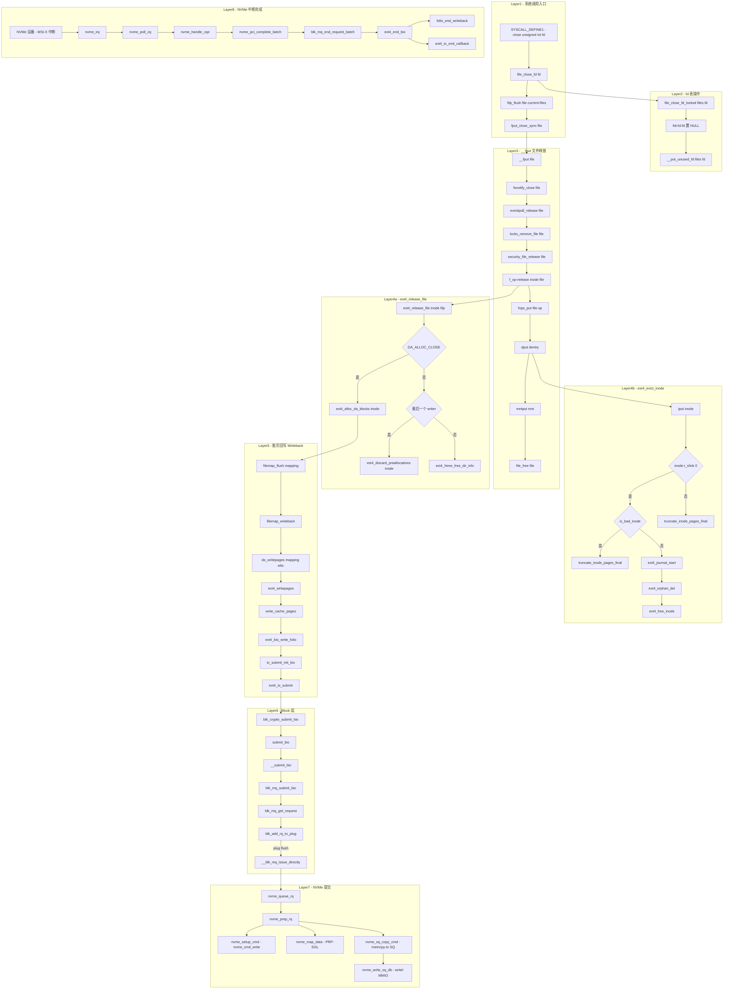

# close 系统调用完整路径分析

## 1 概述

close 系统调用用于关闭一个文件描述符。与 read/write 不同，close 的路径主要涉及**文件描述符的清理**和**文件资源的释放**，在特定场景（文件有未落盘的延迟分配块）下才会触发脏数据回写，从而进入 Block 层和 NVMe 驱动。

### 关键特点

- close 的 fd 清理是**同步**的（立即从 fdtable 中移除）
- 文件对象（struct file）的最终释放可能是**同步**（返回用户态路径）或**异步**（task_work/deferred fput）
- ext4 没有实现 `f_op->flush`，所以 `filp_flush` 对 ext4 文件是**空操作**
- 若文件打开了 `EXT4_STATE_DA_ALLOC_CLOSE` 且有延迟分配块，`ext4_release_file` 会触发脏数据回写
- 通过 `dput` → `iput` → `ext4_evict_inode` 链可触发 inode 回收

---

## 2 涉及的内核层

| 层 | 说明 |
|--|--|
| **Syscall Entry** | close 系统调用分发 (fs/open.c) |
| **fd Table** | 文件描述符表清理 (fs/file.c) |
| **VFS** | 文件结构和 dentry 释放 (fs/file_table.c, fs/dcache.c) |
| **ext4** | ext4_release_file / 延迟分配回写 (fs/ext4/file.c, inode.c) |
| **Page Cache** | 脏页回写 (writeback path, 仅条件触发) |
| **Block Layer** | blk-mq 提交 (block/blk-core.c, blk-mq.c) |
| **NVMe 驱动** | 命令提交 + 中断完成 (drivers/nvme/host/pci.c) |

---

## 3 系统调用入口

### 3.1 SYSCALL_DEFINE1(close) - fs/open.c:1498

```c
SYSCALL_DEFINE1(close, unsigned int, fd)
{
    int retval;
    struct file *file;

    file = file_close_fd(fd);          // 从 fdtable 移除 fd
    if (!file)
        return -EBADF;

    retval = filp_flush(file, current->files);  // 调用 f_op->flush (ext4 无)

    // 返回用户态，使用同步 fput
    fput_close_sync(file);

    if (likely(retval == 0))
        return 0;
    return retval;
}
```

关键点：
- `file_close_fd` 是**同步**的，立即从 fdtable 清除 fd 条目
- `fput_close_sync` 是 `__fput` 的同步版本，与 `__fput_sync` 等价但针对 last-reference 场景优化
- 由于已确定返回用户态，不需要 defer fput

### 3.2 close_fd - fs/file.c:744（其他内核路径）

```c
int close_fd(unsigned fd)
{
    struct files_struct *files = current->files;
    struct file *file;

    spin_lock(&files->file_lock);
    file = file_close_fd_locked(files, fd);   // 持锁移除 fd
    spin_unlock(&files->file_lock);
    if (!file)
        return -EBADF;

    return filp_close(file, files);   // filp_flush + fput_close(deferred)
}
```

与系统调用版本的区别：
- `close_fd` 使用 `fput_close`（deferred 版本），通过 task_work 或 delayed work 执行 `__fput`
- `SYSCALL_DEFINE1(close)` 使用 `fput_close_sync`（同步版本），直接调用 `__fput`

---

## 4 fd 表操作层

### 4.1 file_close_fd - fs/file.c:889

```c
struct file *file_close_fd(unsigned int fd)
{
    struct files_struct *files = current->files;
    struct file *file;

    spin_lock(&files->file_lock);
    file = file_close_fd_locked(files, fd);
    spin_unlock(&files->file_lock);
    return file;
}
```

调用 `file_close_fd_locked` 完成实际工作。

### 4.2 file_close_fd_locked - fs/file.c:725

```c
struct file *file_close_fd_locked(struct files_struct *files, unsigned fd)
{
    struct fdtable *fdt = files_fdtable(files);
    struct file *file;

    if (fd >= fdt->max_fds)
        return NULL;
    fd = array_index_nospec(fd, fdt->max_fds);
    file = rcu_dereference_raw(fdt->fd[fd]);
    if (file) {
        rcu_assign_pointer(fdt->fd[fd], NULL);   // 清空 fd 槽位
        __put_unused_fd(files, fd);              // 回收 fd 号
    }
    return file;
}
```

核心行为：
1. 校验 fd 范围
2. 从 fdtable 的 `fd[]` 数组中取出 file 指针
3. 将 fd 槽位置为 NULL
4. 调用 `__put_unused_fd` 在 `open_fds` 位图中清除对应位（fd 号可重用）
5. 返回 file 指针（引用计数未变，调用者负责后续放回）

---

## 5 VFS 文件释放层

### 5.1 filp_flush - fs/open.c:1462

```c
static int filp_flush(struct file *filp, fl_owner_t id)
{
    int retval = 0;

    if (CHECK_DATA_CORRUPTION(file_count(filp) == 0, ...))
        return 0;

    if (filp->f_op->flush)
        retval = filp->f_op->flush(filp, id);    // ext4 无 flush

    if (likely(!(filp->f_mode & FMODE_PATH))) {
        dnotify_flush(filp, id);      // dnotify 清理
        locks_remove_posix(filp, id); // POSIX 锁清理
    }
    return retval;
}
```

> ext4 的 `file_operations` 没有实现 `.flush`，所以 `f_op->flush` 为 NULL，此函数仅做 dnotify 和 lock 清理。

### 5.2 __fput - fs/file_table.c:467（核心释放函数）

```c
static void __fput(struct file *file)
{
    struct dentry *dentry = file->f_path.dentry;
    struct vfsmount *mnt = file->f_path.mnt;
    struct inode *inode = file->f_inode;
    fmode_t mode = file->f_mode;

    if (unlikely(!(file->f_mode & FMODE_OPENED)))
        goto out;

    fsnotify_close(file);                       // 文件系统事件通知
    eventpoll_release(file);                     // epoll 清理
    locks_remove_file(file);                     // 文件锁清理
    security_file_release(file);                  // LSM 钩子

    if (unlikely(file->f_flags & FASYNC))
        if (file->f_op->fasync)
            file->f_op->fasync(-1, file, 0);    // FASYNC 清理

    if (file->f_op->release)
        file->f_op->release(inode, file);        // → ext4_release_file

    fops_put(file->f_op);                        // module_put
    put_file_access(file);
    dput(dentry);                                // 释放 dentry → 可能触发 iput
    mntput(mnt);                                 // 释放 mount
out:
    file_free(file);                             // 释放 file 对象
}
```

### 5.3 fput 的 defer 机制

`__fput` 可以通过三种方式执行：

| 入口 | 执行方式 | 使用场景 |
|--|--|--|
| `fput_close_sync` | 同步，直接调用 `__fput` | `SYSCALL_DEFINE1(close)` 返回用户态时 |
| `fput_close` / `fput` | task_work (TWA_RESUME) → `____fput` | 内核路径 close_fd，当前进程退出时执行 |
| fallback | delayed work (delayed_fput_work) | task_work 添加失败时 |

---

## 6 ext4 文件系统层

### 6.1 ext4_release_file - fs/ext4/file.c:229

```c
static int ext4_release_file(struct inode *inode, struct file *filp)
{
    // 情况1：需要立即分配延迟块（DA_ALLOC_CLOSE）
    if (ext4_test_inode_state(inode, EXT4_STATE_DA_ALLOC_CLOSE)) {
        ext4_alloc_da_blocks(inode);              // → 触发脏页回写
        ext4_clear_inode_state(inode, EXT4_STATE_DA_ALLOC_CLOSE);
    }

    // 情况2：最后一个 writer 丢弃预分配块
    if ((filp->f_mode & FMODE_WRITE) &&
            (atomic_read(&inode->i_writecount) == 1) &&
            !EXT4_I(inode)->i_reserved_data_blocks) {
        down_write(&EXT4_I(inode)->i_data_sem);
        ext4_discard_preallocations(inode);       // 丢弃预分配
        up_write(&EXT4_I(inode)->i_data_sem);
    }

    // 情况3：dx 目录释放 htree 信息
    if (is_dx(inode) && filp->private_data)
        ext4_htree_free_dir_info(filp->private_data);

    return 0;
}
```

### 6.2 DA_ALLOC_CLOSE 回写路径

当文件使用延迟分配（delalloc）且设置 `EXT4_STATE_DA_ALLOC_CLOSE` 时：

```
ext4_release_file
  └─ ext4_alloc_da_blocks(inode)
       └─ filemap_flush(inode->i_mapping)      // mm/filemap.c:450
            └─ filemap_writeback(mapping, ...)  // mm/filemap.c:371
                 └─ do_writepages(mapping, wbc) // mm/page-writeback.c:2564
                      └─ mapping->a_ops->writepages()
                           └─ ext4_writepages  // fs/ext4/inode.c:3089
```

> `ext4_alloc_da_blocks` 在 i_reserved_data_blocks > 0 时调用 `filemap_flush`，该函数使用 `WB_SYNC_NONE` 模式（非阻塞），只发起回写但不等待完成。

### 6.3 ext4_writepages 回写路径

```
ext4_writepages
  └─ write_cache_pages(mapping, wbc, __mpage_da_writepage)
       └─ __mpage_da_writepage
            └─ mpage_da_map_blocks            // 块映射 + 分配
            └─ mpage_da_submit_io             // 提交 I/O
                 └─ ext4_bio_write_folio      // fs/ext4/page-io.c:458
                      └─ io_submit_add_bh     // 构造 BIO
                      └─ ext4_io_submit        // 提交 BIO
                           └─ blk_crypto_submit_bio(io->io_bio)
```

BIO 构造关键参数：
- `bio_alloc(bdev, BIO_MAX_VECS, REQ_OP_WRITE, GFP_NOIO)`
- `bio->bi_end_io = ext4_end_bio`（回写完成回调）
- `bio->bi_iter.bi_sector = bh->b_blocknr * (bh->b_size >> 9)`

### 6.4 dput → iput → ext4_evict_inode 链

`__fput` 中调用 `dput(dentry)` 释放 dentry：

```
dput(dentry)                             // fs/dcache.c:919
  └─ fast_dput() 成功 → 返回
  └─ finish_dput(dentry)
       └─ __dentry_kill(dentry)          // fs/dcache.c:647
            └─ dentry_unlink_inode(dentry)  // fs/dcache.c:451
                 └─ iput(inode)           // 释放 inode 引用
                      └─ iput_final(inode) // fs/inode.c
                           └─ sb->s_op->evict_inode(inode)
                                └─ ext4_evict_inode  // fs/ext4/inode.c:170
```

#### ext4_evict_inode 流程

```c
void ext4_evict_inode(struct inode *inode)
{
    if (inode->i_nlink) {
        // 文件仍有链接：仅截断 page cache
        truncate_inode_pages_final(&inode->i_data);
        goto no_delete;     // 跳过删除
    }

    // i_nlink == 0：需要删除 inode
    truncate_inode_pages_final(&inode->i_data);
    // ... 启动 journal 事务 ...
    ext4_orphan_del(handle, inode);       // 从孤儿链删除
    ext4_mark_inode_dirty(handle, inode); // 标记脏
    ext4_free_inode(handle, inode);       // 释放 inode 块
}
```

---

## 7 块设备层（回写路径）

### 7.1 submit_bio 路径

```
blk_crypto_submit_bio(bio)         // block/blk-crypto.c 或 inline
  └─ submit_bio(bio)               // block/blk-core.c:992
       └─ submit_bio_noacct(bio)
            └─ __submit_bio(bio)   // block/blk-core.c:636
                 └─ blk_mq_submit_bio(bio)  // block/blk-mq.c:3151
```

### 7.2 blk_mq_submit_bio

```
blk_mq_submit_bio(bio)
  ├─ blk_ia_range_merge_bio(bio)      // I/O 范围合并
  ├─ bio->bi_end_io = bi_end_io       // 保存完成回调
  ├─ blk_mq_get_bio_set_tag_set(bio)  // 获取 tag
  ├─ blk_mq_get_request(q, bio)       // 分配 request
  ├─ blk_mq_rq_ctx_init(rq, ...)      // 初始化 request
  ├─ blk_mq_bio_to_request(rq, bio)   // 绑定 bio 到 request
  ├─ blk_check_plug_flush(plug, rq)   // flush 检查
  ├─ blk_add_rq_to_plug(plug, rq)     // 尝试 plug 聚合
  └─ 或直接提交:
       └─ blk_mq_try_issue_directly(hctx, rq)
            └─ __blk_mq_issue_directly
                 └─ hctx->ops->queue_rq → nvme_queue_rq
```

---

## 8 NVMe 驱动层

### 8.1 命令提交

```
nvme_queue_rq(hctx, bd)                 // drivers/nvme/host/pci.c:1405
  └─ nvme_prep_rq(req)                  // nvme_prep_rq:1368
       ├─ nvme_setup_cmd(ns, req, cmd)  // nvme/core.c:1081
       │    └─ nvme_setup_rw(ns, req, cmd, nvme_cmd_write)  // 写命令
       └─ nvme_map_data(req, cmd)       // DMA 映射 (PRP/SGL)
  └─ nvme_sq_copy_cmd(nvmeq, req)       // pci.c:730 - memcpy 到 SQ 环
  └─ nvme_write_sq_db(nvmeq)            // pci.c:713 - 写门铃寄存器
       └─ writel(nvmeq->sq_tail_doorbell_addr, db_value)  // MMIO
```

### 8.2 写命令 vs 读命令

| 操作 | nvme_cmd_opcode | bio 方向 |
|--|--|--|
| 读 | `nvme_cmd_read` | READ |
| 写 | `nvme_cmd_write` | WRITE |

其余流程（DMA 映射、SQ 拷贝、门铃写入）完全一致。

### 8.3 中断完成

写命令完成路径：

```
nvme_irq(irq, nvmeq)                    // pci.c:1599
  └─ nvme_poll_cq(nvmeq, ...)           // pci.c:1578
       ├─ nvme_handle_cqe(nvmeq, cqe)   // pci.c:1531
       │    ├─ nvme_find_rq(hctx, cqe)  // 找到完成 request
       │    └─ blk_mq_add_to_batch(req) // 批量完成
       └─ nvme_ring_cq_doorbell(nvmeq)  // 写 CQ 门铃
  └─ nvme_pci_complete_batch(breq)      // 批量完成
       └─ blk_mq_end_request_batch()
            └─ bio_endio(bio)
                 └─ bio->bi_end_io()    // → ext4_end_bio
                      └─ folio_end_writeback(folio)
                      └─ ext4_io_end_callback()
                           └─ ext4_finish_bio()
```

---

## 9 文件关闭的四种场景

| 场景 | 条件 | 触发路径 |
|--|--|--|
| **只读关闭** | 文件只读打开，无延迟分配 | `sys_close` → `__fput` → `ext4_release_file` (仅丢弃预分配) → `dput` → `file_free` |
| **写关闭（有延迟块）** | 写打开，`DA_ALLOC_CLOSE` 标志 | 同上 + `ext4_alloc_da_blocks` → `filemap_flush` → do_writepages → ext4 → block → NVMe |
| **写关闭（无延迟块）** | 写打开，无延迟分配块 | 同只读关闭 |
| **最后一个 dentry 释放** | 无其他引用 | `dput` → `iput` → `ext4_evict_inode` → truncate/释放 inode |

---

## 10 完整流程 Mermaid 流程图



---

## 11 完整函数调用链

| 步骤 | 函数 | 文件:行号 | 层 |
|--|--|--|--|
| 1 | `SYSCALL_DEFINE1(close, fd)` | fs/open.c:1498 | Syscall |
| 2 | `file_close_fd(fd)` | fs/file.c:889 | fd Table |
| 3 | `file_close_fd_locked(files, fd)` | fs/file.c:725 | fd Table |
| 4 | `__put_unused_fd(files, fd)` | fs/file.c | fd Table |
| 5 | `filp_flush(file, current->files)` | fs/open.c:1462 | VFS |
| 6 | `fput_close_sync(file)` | fs/file_table.c:595 | VFS |
| 7 | `__fput(file)` | fs/file_table.c:467 | VFS |
| 8 | `eventpoll_release(file)` | fs/file_table.c:484 | VFS |
| 9 | `locks_remove_file(file)` | fs/file_table.c:485 | VFS |
| 10 | `f_op->release(inode, file)` | fs/file_table.c:493 | VFS |
| 11 | `ext4_release_file(inode, filp)` | fs/ext4/file.c:229 | ext4 |
| 12 | `ext4_alloc_da_blocks(inode)` | fs/ext4/inode.c:3378 | ext4 |
| 13 | `filemap_flush(mapping)` | mm/filemap.c:450 | Page Cache |
| 14 | `do_writepages(mapping, wbc)` | mm/page-writeback.c:2564 | Page Cache |
| 15 | `ext4_writepages(mapping, wbc)` | fs/ext4/inode.c:3089 | ext4 |
| 16 | `ext4_bio_write_folio(io, folio, len)` | fs/ext4/page-io.c:458 | ext4 |
| 17 | `ext4_io_submit(io)` | fs/ext4/page-io.c:398 | ext4 |
| 18 | `blk_crypto_submit_bio(bio)` | block/blk-crypto.c | Block |
| 19 | `submit_bio(bio)` | block/blk-core.c:992 | Block |
| 20 | `blk_mq_submit_bio(bio)` | block/blk-mq.c:3151 | Block |
| 21 | `nvme_queue_rq(hctx, bd)` | drivers/nvme/host/pci.c:1405 | NVMe |
| 22 | `nvme_prep_rq(req)` | drivers/nvme/host/pci.c:1368 | NVMe |
| 23 | `nvme_setup_cmd(ns, req, cmd)` | drivers/nvme/host/core.c:1081 | NVMe |
| 24 | `nvme_sq_copy_cmd(nvmeq, req)` | drivers/nvme/host/pci.c:730 | NVMe |
| 25 | `nvme_write_sq_db(nvmeq)` | drivers/nvme/host/pci.c:713 | NVMe |
| 26 | `nvme_irq(irq, nvmeq)` | drivers/nvme/host/pci.c:1599 | NVMe |
| 27 | `nvme_poll_cq(nvmeq, ...)` | drivers/nvme/host/pci.c:1578 | NVMe |
| 28 | `nvme_handle_cqe(nvmeq, cqe)` | drivers/nvme/host/pci.c:1531 | NVMe |
| 29 | `blk_mq_end_request_batch(...)` | block/blk-mq.c | Block |
| 30 | `ext4_end_bio(bio)` | fs/ext4/page-io.c | ext4 |
| 31 | `dput(dentry)` | fs/dcache.c:919 | VFS |
| 32 | `iput(inode)` | fs/inode.c:1978 | VFS |
| 33 | `ext4_evict_inode(inode)` | fs/ext4/inode.c:170 | ext4 |

> 步骤 12-30 仅在 `DA_ALLOC_CLOSE` 且 `i_reserved_data_blocks > 0` 时执行。
> 步骤 31-33 仅在 dentry 引用计数归零时触发。

---

## 12 关键数据结构

```
struct files_struct               struct file
+------------------------+        +----------------------+
| file_lock (spinlock)   |        | f_path.dentry        |
| fdt → fdtable          |        | f_path.mnt           |
| open_fds (bitmap)      |        | f_inode              |
+------------------------+        | f_mode               |
                                  | f_op → file_operations|
struct fdtable                    | f_flags              |
+------------------------+        | f_ref (file_ref_t)   |
| max_fds                |        +----------------------+
| fd[] (struct file**)   |
+------------------------+        struct inode
                                  +----------------------+
                                  | i_mode / i_nlink     |
                                  | i_count (refcount)   |
                                  | i_mapping → address_space
                                  | i_sb → super_block   |
                                  | i_dentry (alias list)|
                                  +----------------------+

struct ext4_inode_info            struct dentry
+------------------------+        +----------------------+
| i_reserved_data_blocks |        | d_inode              |
| i_disksize             |        | d_parent             |
+------------------------+        | d_lockref (refcount) |
                                  | d_op → dentry_ops    |
                                  | d_flags              |
                                  +----------------------+
```

---

## 13 优化机制

### 13.1 fput 延迟释放

- **task_work**: 当前进程返回用户态前执行 `____fput`，避免在中断/softirq 中执行耗时操作
- **delayed fput work**: 当 task_work 添加失败，使用系统 workqueue 延迟执行

### 13.2 file_ref_put_close 优化

`fput_close_sync` 使用 `file_ref_put_close` 快速判断：
- 如果 refcount 已从 1 变为 NOREF（最后引用），直接调用 `__fput`
- 避免了额外的原子操作和分支

### 13.3 DA_ALLOC_CLOSE 回写优化

- `filemap_flush` 使用 `WB_SYNC_NONE`（非阻塞），仅发起回写不等待
- 实际 I/O 提交后立即返回，不阻塞 close 调用者
- 写完成由 `ext4_end_bio` 异步回调处理

### 13.4 批量完成

NVMe `nvme_pci_complete_batch` 使用 `blk_mq_end_request_batch` 批量完成多个 request，减少锁竞争和函数调用开销。

---

## 14 总结

close 系统调用完整路径总结：

```
用户态 close(fd)
  │
  ├─(1) fd 清理 (同步)
  │   └─ file_close_fd → 清空 fd 槽位 + 回收 fd 号
  │
  ├─(2) VFS 清理 (条件触发 flush)
  │   └─ filp_flush → dnotify + POSIX locks (ext4 无 flush)
  │
  ├─(3) 文件对象释放 (同步/异步)
  │   └─ __fput
  │        ├─ epoll / lock / security 清理
  │        ├─ ext4_release_file
  │        │    ├─ 丢弃预分配块
  │        │    └─ DA_ALLOC_CLOSE → filemap_flush (脏页回写起点)
  │        ├─ dput → iput → ext4_evict_inode (可选)
  │        └─ file_free
  │
  └─[脏页回写路径 - 条件触发]
       └─ filemap_flush → do_writepages → ext4_writepages
            → ext4_bio_write_folio → ext4_io_submit
            → blk_crypto_submit_bio → submit_bio
            → blk_mq_submit_bio → nvme_queue_rq
            → nvme_prep_rq → nvme_sq_copy_cmd
            → nvme_write_sq_db (writel MMIO)
            → [NVMe 完成中断]
            → nvme_irq → nvme_poll_cq → nvme_handle_cqe
            → blk_mq_end_request_batch → ext4_end_bio
            → folio_end_writeback
```

close 是典型的**控制路径远长于数据路径**的系统调用。大多数 close 调用仅涉及 fd 表和 VFS 层的元数据操作，只有在回写脏数据时才触及存储栈的最底层（NVMe 门铃寄存器写入）。
