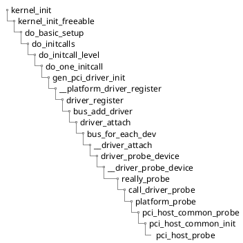
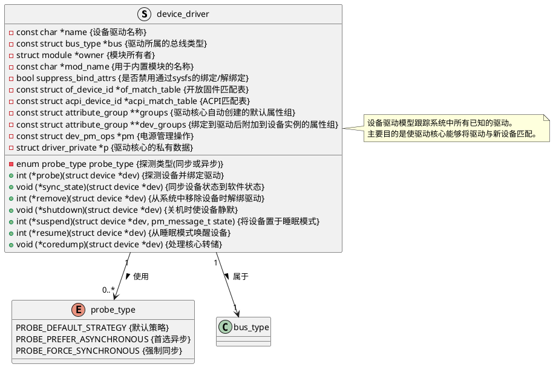
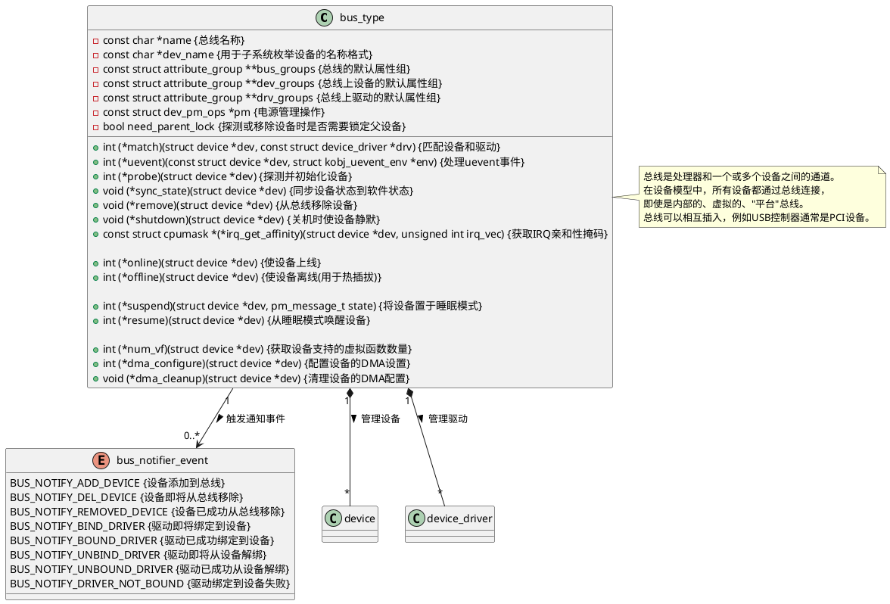

# pci bus probe过程

宏 module_platform_driver(gen_pci_driver) 会展开两个函数，并放到initcall

* gen_pci_driver_init, 该函数调用下面的register函数注册 gen_pci_driver

```c
#define platform_driver_register(drv) \
	__platform_driver_register(drv, THIS_MODULE)

static struct platform_driver gen_pci_driver = {
	.driver = {
		.name = "pci-host-generic",
		.of_match_table = gen_pci_of_match,
	},
	.probe = pci_host_common_probe,
	.remove = pci_host_common_remove,
};
```

* gen_pci_driver_exit



# device_driver结构体



# bus_type结构体



# device结构体

```plantuml

@startuml

title Linux Kernel struct device Class Diagram

struct device {
--Basic Device Information--
- kobj: kobject <<内核对象结构>>
- parent: device* <<父设备指针>>
- p: device_private* <<驱动核心私有数据>>
- init_name: const char* <<设备初始名称>>
- type: const device_type* <<设备类型>>
--Bus and Driver Information--
- bus: const bus_type* <<所属总线类型>>
- driver: device_driver* <<绑定的驱动>>
- platform_data: void* <<平台特定数据>>
- driver_data: void* <<驱动私有数据>>
- mutex: mutex <<同步互斥锁>>
--Power Management--
- power: dev_pm_info <<电源管理信息>>
- pm_domain: dev_pm_domain* <<电源域>>
--Device Links--
- links: dev_links_info <<设备链接信息>>
--Energy Model--
- em_pd: em_perf_domain* <<能耗模型性能域>>
--Pin Control--
- pins: dev_pin_info* <<引脚控制信息>>
--MSI Interrupt--
- msi: dev_msi_info <<MSI中断信息>>
--DMA Operations--
- dma_ops: const dma_map_ops* <<DMA映射操作>>
- dma_mask: u64* <<DMA掩码>>
- coherent_dma_mask: u64 <<一致性DMA掩码>>
- bus_dma_limit: u64 <<总线DMA限制>>
- dma_range_map: const bus_dma_region* <<DMA范围映射>>
- dma_parms: device_dma_parameters* <<DMA参数>>
- dma_pools: list_head <<DMA池列表>>
- dma_mem: dma_coherent_mem* <<一致性DMA内存>>
- cma_area: cma* <<连续内存分配区>>
- dma_io_tlb_mem: io_tlb_mem* <<软件IO TLB内存>>
- dma_io_tlb_pools: list_head <<IO TLB内存池>>
- dma_io_tlb_lock: spinlock_t <<IO TLB锁>>
- dma_uses_io_tlb: bool <<使用IO TLB标志>>
--Architecture Specific--

- archdata: dev_archdata <<架构特定数据>>
--Device Tree--
- of_node: device_node* <<设备树节点>>
- fwnode: fwnode_handle* <<固件设备节点>>
--NUMA--
- numa_node: int <<NUMA节点号>>
--Device Identity--
- devt: dev_t <<设备号>>
- id: u32 <<设备实例ID>>
--Device Resources--
- devres_lock: spinlock_t <<资源锁>>
- devres_head: list_head <<资源列表头>>
--Class and Attributes--
- class: const class* <<设备类>>
- groups: const attribute_group** <<属性组>>
--Release and IOMMU--
- release: void (*)(device*) <<释放回调函数>>
- iommu_group: iommu_group* <<IOMMU组>>
- iommu: dev_iommu* <<IOMMU运行时数据>>
--Physical Location--
- physical_location: device_physical_location* <<物理位置信息>>
- removable: device_removable <<可移动属性>>
--Device State Flags--
- offline_disabled: bool <<禁用离线标志>>
- offline: bool <<离线状态>>
- of_node_reused: bool <<设备树节点重用>>
- state_synced: bool <<状态已同步>>
- can_match: bool <<可匹配标志>>
- dma_coherent: bool <<DMA一致性标志>>
- dma_ops_bypass: bool <<DMA操作旁路>>
- dma_skip_sync: bool <<跳过DMA同步>>
- dma_iommu: bool <<使用IOMMU DMA>>
--IOMMU Operations--
+ {static} device_iommu_mapped(dev: device*): bool <<检查设备是否使用IOMMU>>
--Device Name Operations--
+ {static} dev_name(dev: const device*): const char* <<获取设备名称>>
+ {static} dev_bus_name(dev: const device*): const char* <<获取总线/类名称>>
+ {static} dev_set_name(dev: device*, name: const char*, ...): int <<设置设备名称>>
--NUMA Operations--
+ {static} dev_to_node(dev: device*): int <<获取NUMA节点>>
+ {static} set_dev_node(dev: device*, node: int): void <<设置NUMA节点>>
--MSI Operations--
+ {static} dev_get_msi_domain(dev: const device*): irq_domain* <<获取MSI域>>
+ {static} dev_set_msi_domain(dev: device*, d: irq_domain*): void <<设置MSI域>>
--Driver Data Operations--
+ {static} dev_get_drvdata(dev: const device*): void* <<获取驱动私有数据>>
+ {static} dev_set_drvdata(dev: device*, data: void*): void <<设置驱动私有数据>>
--Power Subsystem Data--
+ {static} dev_to_psd(dev: device*): pm_subsys_data* <<获取电源子系统数据>>
--Uevent Operations--
+ {static} dev_get_uevent_suppress(dev: const device*): unsigned int <<获取uevent抑制标志>>
+ {static} dev_set_uevent_suppress(dev: device*, val: int): void <<设置uevent抑制标志>>
--Device Registration Status--
+ {static} device_is_registered(dev: device*): int <<检查设备是否已注册>>
--Async Suspend Operations--
+ {static} device_enable_async_suspend(dev: device*): void <<启用异步挂起>>
+ {static} device_disable_async_suspend(dev: device*): void <<禁用异步挂起>>
+ {static} device_async_suspend_enabled(dev: device*): bool <<检查异步挂起是否启用>>
--Power Management Operations--
+ {static} device_pm_not_required(dev: device*): bool <<检查是否需要电源管理>>
+ {static} device_set_pm_not_required(dev: device*): void <<设置不需要电源管理>>
+ {static} dev_pm_syscore_device(dev: device*, val: bool): void <<设置系统核心设备>>
+ {static} dev_pm_set_driver_flags(dev: device*, flags: u32): void <<设置驱动标志>>
+ {static} dev_pm_test_driver_flags(dev: device*, flags: u32): bool <<测试驱动标志>>
+ {static} dev_pm_smart_suspend(dev: device*): bool <<智能挂起检查>>
+ {static} dev_pm_set_strict_midlayer(dev: device*, val: bool): void <<设置严格中间层>>
+ {static} dev_pm_strict_midlayer_is_set(dev: device*): bool <<检查严格中间层是否设置>>
--Device Lock Operations--
+ {static} device_lock(dev: device*): void <<锁定设备>>
+ {static} device_lock_interruptible(dev: device*): int <<可中断锁定设备>>
+ {static} device_trylock(dev: device*): int <<尝试锁定设备>>
+ {static} device_unlock(dev: device*): void <<解锁设备>>
+ {static} device_lock_assert(dev: device*): void <<断言设备已锁定>>
--Sync State Operations--
+ {static} dev_has_sync_state(dev: device*): bool <<检查是否有同步状态>>
+ {static} dev_set_drv_sync_state(dev: device*, fn: void (*)(device*)): int <<设置驱动同步状态>>
--Removable Operations--
+ {static} dev_set_removable(dev: device*, removable: device_removable): void <<设置可移除属性>>
+ {static} dev_is_removable(dev: device*): bool <<检查设备是否可移除>>
+ {static} dev_removable_is_valid(dev: device*): bool <<检查可移动属性是否有效>>
--Device Registration Operations--
+ {static} device_register(dev: device*): int <<注册设备>>
+ {static} device_unregister(dev: device*): void <<注销设备>>
+ {static} device_initialize(dev: device*): void <<初始化设备>>
+ {static} device_add(dev: device*): int <<添加设备>>
+ {static} device_del(dev: device*): void <<删除设备>>
--Child Device Operations--
+ {static} device_for_each_child(parent: device*, data: void*, fn: device_iter_t): int <<遍历子设备>>
+ {static} device_for_each_child_reverse(parent: device*, data: void*, fn: device_iter_t): int <<反向遍历子设备>>
+ {static} device_for_each_child_reverse_from(parent: device*, from: device*, data: void*, fn: device_iter_t): int <<从指定设备反向遍历>>
+ {static} device_find_child(parent: device*, data: const void*, match: device_match_t): device* <<查找子设备>>
+ {static} device_find_child_by_name(parent: device*, name: const char*): device* <<按名称查找子设备>>
+ {static} device_find_any_child(parent: device*): device* <<查找任意子设备>>
--Device Rename and Move--
+ {static} device_rename(dev: device*, new_name: const char*): int <<重命名设备>>
+ {static} device_move(dev: device*, new_parent: device*, dpm_order: dpm_order): int <<移动设备>>
+ {static} device_change_owner(dev: device*, kuid: kuid_t, kgid: kgid_t): int <<更改设备所有者>>
--Offline Operations--
+ {static} device_supports_offline(dev: device*): bool <<检查是否支持离线>>
+ {static} device_offline(dev: device*): int <<设备离线>>
+ {static} device_online(dev: device*): int <<设备上线>>
--Firmware Node Operations--
+ {static} set_primary_fwnode(dev: device*, fwnode: fwnode_handle*): void <<设置主固件节点>>
+ {static} set_secondary_fwnode(dev: device*, fwnode: fwnode_handle*): void <<设置次固件节点>>
+ {static} device_set_node(dev: device*, fwnode: fwnode_handle*): void <<设置设备节点>>
--Device Tree Operations--
+ {static} device_add_of_node(dev: device*, of_node: device_node*): int <<添加设备树节点>>
+ {static} device_remove_of_node(dev: device*): void <<移除设备树节点>>
+ {static} device_set_of_node_from_dev(dev: device*, dev2: const device*): void <<从其他设备设置设备树节点>>
+ {static} get_dev_from_fwnode(fwnode: fwnode_handle*): device* <<从固件节点获取设备>>
+ {static} dev_of_node(dev: device*): device_node* <<获取设备树节点>>
--VF Operations--
+ {static} dev_num_vf(dev: device*): int <<获取虚拟功能数量>>
--Root Device Operations--
+ {static} __root_device_register(name: const char*, owner: module*): device* <<注册根设备>>
+ {static} root_device_register(name: const char*): device* <<注册根设备(宏)>>
+ {static} root_device_unregister(root: device*): void <<注销根设备>>
--Platform Data Operations--
+ {static} dev_get_platdata(dev: const device*): void* <<获取平台数据>>
--Driver Binding Operations--
+ {static} device_driver_attach(drv: const device_driver*, dev: device*): int <<附加驱动到设备>>
+ {static} device_bind_driver(dev: device*): int <<绑定驱动>>
+ {static} device_release_driver(dev: device*): void <<释放驱动>>
+ {static} device_attach(dev: device*): int <<附加设备>>
+ {static} driver_attach(drv: const device_driver*): int <<附加驱动>>
+ {static} device_initial_probe(dev: device*): void <<初始探测>>
+ {static} device_reprobe(dev: device*): int <<重新探测>>
+ {static} device_is_bound(dev: device*): bool <<检查设备是否已绑定>>
--Device Creation Operations--
+ {static} device_create(cls: const class*, parent: device*, devt: dev_t, drvdata: void*, fmt: const char*, ...): device* <<创建设备>>
+ {static} device_create_with_groups(cls: const class*, parent: device*, devt: dev_t, drvdata: void*, groups: const attribute_group**, fmt: const char*, ...): device* <<创建设备(带属性组)>>
+ {static} device_destroy(cls: const class*, devt: dev_t): void <<销毁设备>>
--Attribute Group Operations--
+ {static} device_add_groups(dev: device*, groups: const attribute_group**): int <<添加属性组>>
+ {static} device_remove_groups(dev: device*, groups: const attribute_group**): void <<移除属性组>>
+ {static} device_add_group(dev: device*, grp: const attribute_group*): int <<添加单个属性组>>
+ {static} device_remove_group(dev: device*, grp: const attribute_group*): void <<移除单个属性组>>
+ {static} devm_device_add_group(dev: device*, grp: const attribute_group*): int <<资源管理方式添加属性组>>
--Reference Counting Operations--
+ {static} get_device(dev: device*): device* <<增加设备引用计数>>
+ {static} put_device(dev: device*): void <<减少设备引用计数>>
+ {static} kill_device(dev: device*): bool <<杀死设备>>
--System Operations--
+ {static} devtmpfs_mount(): int <<挂载devtmpfs>>
+ {static} device_shutdown(): void <<关闭所有设备>>
--Driver String--
+ {static} dev_driver_string(dev: const device*): const char* <<获取驱动名称字符串>>
--Device Link Operations--
+ {static} device_link_add(consumer: device*, supplier: device*, flags: u32): device_link* <<添加设备链接>>
+ {static} device_link_del(link: device_link*): void <<删除设备链接>>
+ {static} device_link_remove(consumer: void*, supplier: device*): void <<移除设备链接>>
+ {static} device_links_supplier_sync_state_pause(): void <<暂停供应商同步状态>>
+ {static} device_links_supplier_sync_state_resume(): void <<恢复供应商同步状态>>
+ {static} device_link_wait_removal(): void <<等待链接移除>>
+ {static} device_link_test(link: const device_link*, flags: u32): bool <<测试链接标志>>
}
@enduml


```


