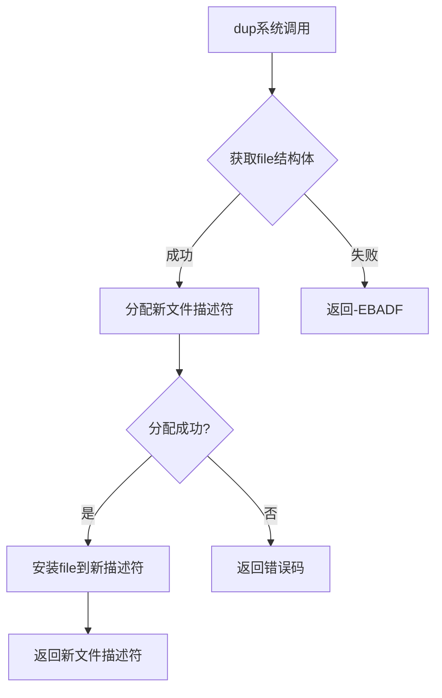

# dup系统调用流程分析

## 1. dup系统调用入口

```C
SYSCALL_DEFINE1(dup, unsigned int, fildes)
```

## 2. dup系统调用流程

### 2.1 主要流程

1. **获取文件描述符对应的file结构体**
   - 使用`fget_raw()`函数获取原始文件描述符对应的file结构体
   - 如果获取失败，返回-EBADF

2. **分配新的文件描述符**
   - 使用`get_unused_fd_flags()`分配一个未使用的文件描述符
   - 参数flags为0，表示不设置特殊标志

3. **安装file结构体到新文件描述符**
   - 使用`fd_install()`将file结构体安装到新的文件描述符上

4. **返回新文件描述符**
   - 成功时返回新的文件描述符
   - 失败时返回负的错误码

### 2.2 关键函数调用链

```
dup (系统调用入口)
├── fget_raw()
│   └── __fget()
│       └── __fget_files()
│           └── __fget_files_rcu()
├── get_unused_fd_flags()
│   └── alloc_fd()
│       ├── expand_files()
│       │   └── expand_fdtable()
│       └── find_next_fd()
└── fd_install()
    └── fd_install_slowpath()
```

## 3. 流程图



## 4. 关键点分析

1. **文件描述符复制**
   - dup系统调用创建一个新的文件描述符，该描述符与原始描述符指向相同的file结构体
   - 新的文件描述符使用最小的未使用描述符编号

2. **引用计数处理**
   - 使用`fget_raw()`增加file结构的引用计数
   - 新文件描述符安装后，两个描述符共享同一个file结构体

3. **错误处理**
   - 如果原始文件描述符无效，返回-EBADF
   - 如果无法分配新的文件描述符，返回相应的错误码

4. **并发安全**
   - 使用RCU机制确保在多核环境下的安全性
   - 文件描述符表的访问受到适当的锁保护

## 5. 与其他dup相关调用的关系

1. **dup2**
   - 允许指定目标文件描述符编号
   - 如果目标编号已被占用，会先关闭该描述符

2. **dup3**
   - 在dup2基础上增加了flags参数
   - 可以设置O_CLOEXEC标志

3. **receive_fd**
   - 用于跨进程传递文件描述符
   - 通过UNIX域套接字或其他IPC机制

这个流程展示了dup系统调用的基本实现，它通过复制文件描述符来实现文件共享，同时确保了操作的原子性和安全性。