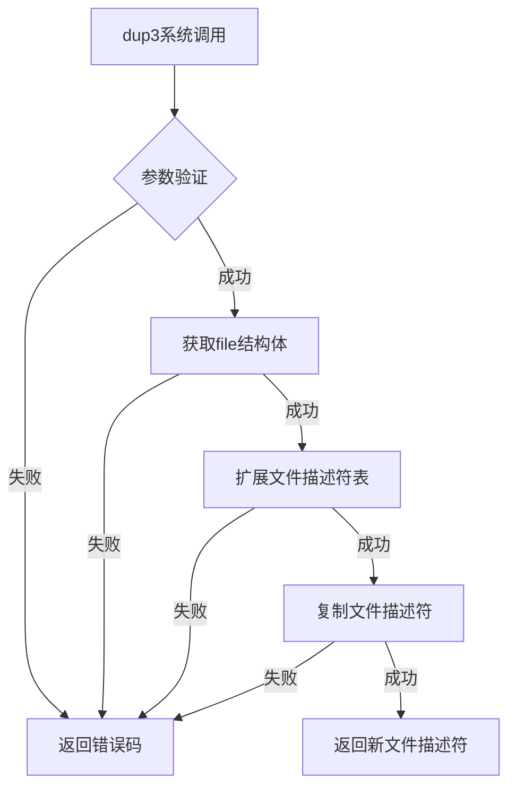

# dup3系统调用流程分析

## 1. dup3系统调用入口

```C
SYSCALL_DEFINE3(dup3, unsigned int, oldfd, unsigned int, newfd, int, flags)
```

## 2. dup3系统调用流程

### 2.1 主要流程

1. **参数验证**
   - 检查flags参数是否合法（只允许O_CLOEXEC）
   - 检查oldfd和newfd是否相同
   - 检查newfd是否超过进程最大文件描述符限制

2. **获取文件描述符对应的file结构体**
   - 使用`files_lookup_fd_locked()`获取原始文件描述符对应的file结构体
   - 如果获取失败，返回-EBADF

3. **扩展文件描述符表**
   - 使用`expand_files()`确保文件描述符表足够大
   - 如果扩展失败，返回相应的错误码

4. **复制文件描述符**
   - 使用`do_dup2()`执行实际的复制操作
   - 处理目标文件描述符可能已经存在的情况

5. **返回结果**
   - 成功时返回新的文件描述符
   - 失败时返回负的错误码

### 2.2 关键函数调用链

```
dup3 (系统调用入口)
├── ksys_dup3()
│   ├── 参数验证
│   ├── expand_files()
│   │   ├── alloc_fdtable()
│   │   ├── copy_fdtable()
│   │   └── free_fdtable_rcu()
│   └── do_dup2()
│       ├── files_lookup_fd_locked()
│       ├── get_file()
│       ├── rcu_assign_pointer()
│       ├── __set_open_fd()
│       └── filp_close()
└── 返回结果
```

## 3. 流程图



## 4. 关键点分析

1. **参数验证**
   - flags参数只允许O_CLOEXEC
   - oldfd和newfd不能相同
   - newfd不能超过进程的RLIMIT_NOFILE限制

2. **文件描述符复制**
   - dup3允许指定目标文件描述符编号
   - 如果目标编号已被占用，会先关闭该描述符
   - 支持O_CLOEXEC标志，可以设置新文件描述符在执行exec时自动关闭

3. **错误处理**
   - 如果原始文件描述符无效，返回-EBADF
   - 如果无法扩展文件描述符表，返回-EMFILE
   - 如果目标文件描述符正在被其他线程使用，返回-EBUSY

4. **并发安全**
   - 使用spin_lock保护文件描述符表的并发访问
   - 使用RCU机制确保在多核环境下的安全性
   - 使用atomic操作确保引用计数的正确性

## 5. 与其他dup相关调用的关系

1. **dup**
   - 创建最小的未使用文件描述符
   - 不支持指定目标文件描述符
   - 不支持O_CLOEXEC标志

2. **dup2**
   - 允许指定目标文件描述符编号
   - 如果目标编号已被占用，会先关闭该描述符
   - 不支持O_CLOEXEC标志

3. **receive_fd**
   - 用于跨进程传递文件描述符
   - 通过UNIX域套接字或其他IPC机制

这个流程展示了dup3系统调用的完整实现，它通过复制文件描述符来实现文件共享，同时提供了比dup和dup2更多的控制选项，确保了操作的原子性和安全性。