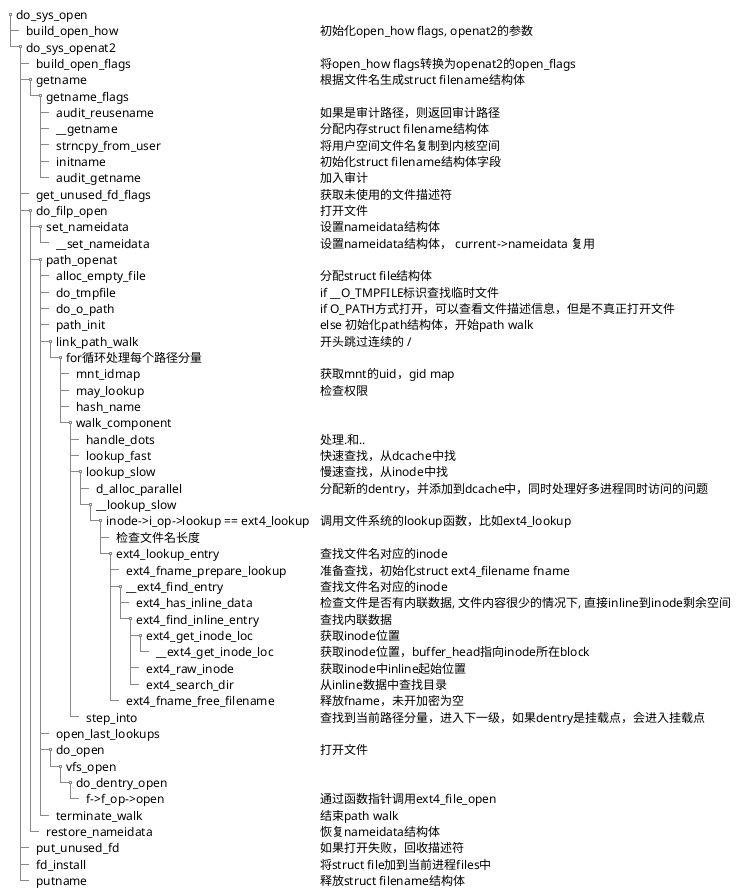
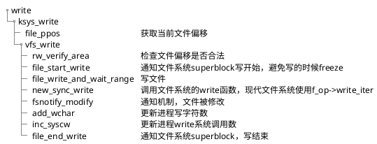

# ***open***

open相关的系统调用有open，openat，openat2，creat，creat会调用open

**Linux 6.18 中 open、openat、openat2 系统调用的区别**

## 1. **历史演进和基本对比**

| 特性                 | **open**    | **openat**      | **openat2**      |
| -------------------- | ----------------- | --------------------- | ---------------------- |
| **引入时间**   | Unix 早期         | POSIX.1-2008          | Linux 5.6              |
| **系统调用号** | `__NR_open` (5) | `__NR_openat` (257) | `__NR_openat2` (437) |
| **设计理念**   | 简单、传统        | 相对路径、目录fd      | 可扩展、安全           |
| **参数传递**   | 离散参数          | 离散参数              | 结构体参数             |
| **扩展性**     | 差                | 中等                  | 优秀                   |
| **安全特性**   | 基础              | 中等                  | 高级                   |
| **现代推荐**   | 遗留兼容          | 广泛使用              | 新代码首选             |

## 2. **函数原型对比**

### **open**

```c
#include <fcntl.h>
int open(const char *pathname, int flags);
int open(const char *pathname, int flags, mode_t mode);
```

### **openat**

```c
#include <fcntl.h>
int openat(int dirfd, const char *pathname, int flags);
int openat(int dirfd, const char *pathname, int flags, mode_t mode);
```

### **openat2**

```c
#define _GNU_SOURCE
#include <fcntl.h>
#include <sys/types.h>

struct open_how {
    __u64 flags;        /* O_* flags */
    __u64 mode;         /* Mode for O_CREAT */
    __u64 resolve;      /* RESOLVE_* flags */
};

int openat2(int dirfd, const char *pathname,
            struct open_how *how, size_t size);
```

## 3. **参数设计的演进**

### **open 的离散参数**

```c
// 问题：扩展困难，新标志无处可放
int fd = open("/path/file", O_RDWR | O_CLOEXEC | O_TMPFILE, 0644);
// 如果想添加新的打开方式，只能增加新的 flag 位
```

### **openat 的改进**

```c
// 添加了 dirfd 参数，但仍然是离散参数
int fd = openat(dirfd, "file", O_RDONLY | O_NOFOLLOW, 0644);
// 仍然受限于 flags 位域
```

### **openat2 的结构体设计**

```c
struct open_how how = {
    .flags = O_RDWR | O_CLOEXEC,
    .mode = 0644,
    .resolve = RESOLVE_BENEATH | RESOLVE_NO_MAGICLINKS,
};
int fd = openat2(dirfd, "file", &how, sizeof(how));

// 优势：可以通过扩展结构体添加新功能
// 后向兼容：size 参数允许版本检查
```

## 6. **RESOLVE 标志详解**

### **RESOLVE 标志的作用域**

```c
// openat2 特有的 resolve 字段
u64 resolve;  // 路径解析控制标志
```

### **可用的 RESOLVE 标志**

```c
// 在 open_how 结构体中使用
#define RESOLVE_NO_XDEV       0x01  /* 不允许跨越设备边界 */
#define RESOLVE_NO_MAGICLINKS 0x02  /* 不解析魔法链接 */
#define RESOLVE_NO_SYMLINKS   0x04  /* 不解析任何符号链接 */
#define RESOLVE_BENEATH       0x08  /* 路径必须在 dirfd 之下 */
#define RESOLVE_IN_ROOT       0x10  /* 将根视为 dirfd 指定的目录 */
#define RESOLVE_CACHED        0x20  /* 只使用缓存中的条目（Linux 6.0+） */
```

### **标志组合示例**

```c
// 安全沙盒场景
struct open_how how = {
    .flags = O_RDONLY,
    .resolve = RESOLVE_BENEATH |        // 不能向上逃逸
               RESOLVE_NO_SYMLINKS |    // 防止符号链接攻击
               RESOLVE_NO_XDEV |        // 不能跨设备
               RESOLVE_NO_MAGICLINKS,   // 防止魔法链接
};

// 容器内安全打开
int fd = openat2(container_root_fd, "app/config.json", &how, sizeof(how));
```

## 8. **路径解析行为差异**

### **不同系统调用的行为**

```c
int dir_fd = open("/mnt/data", O_RDONLY | O_DIRECTORY);

// 1. open - 总是从当前工作目录开始
open("../external/secret.txt", O_RDONLY);  // 成功，可逃逸

// 2. openat - 相对于 dir_fd，但可能跟随符号链接
openat(dir_fd, "config", O_RDONLY);  // 成功，打开 /etc/passwd

// 3. openat2 - 可限制各种逃逸
struct open_how how = {
    .flags = O_RDONLY,
    .resolve = RESOLVE_BENEATH | RESOLVE_NO_SYMLINKS | RESOLVE_NO_XDEV,
};

openat2(dir_fd, "../external/secret.txt", &how, sizeof(how));  // 失败，RESOLVE_BENEATH
openat2(dir_fd, "config", &how, sizeof(how));  // 失败，RESOLVE_NO_SYMLINKS
openat2(dir_fd, "file.txt", &how, sizeof(how));  // 成功，安全打开
```

## 9. **魔法链接（Magic Links）处理**

### **什么是魔法链接**

```c
// 特殊文件系统中的链接，如 procfs
/proc/self/exe      -> 当前进程的可执行文件
/proc/self/fd/0     -> 标准输入
/proc/<pid>/root    -> 进程的根目录
```

### **处理差异**

```c
int proc_fd = open("/proc/self", O_RDONLY | O_DIRECTORY);

// open/openat: 可以遍历魔法链接
openat(proc_fd, "exe", O_RDONLY);  // 成功，打开当前可执行文件
openat(proc_fd, "fd/0", O_RDONLY); // 成功，打开标准输入

// openat2: 可以禁止魔法链接
struct open_how how = {
    .flags = O_RDONLY,
    .resolve = RESOLVE_NO_MAGICLINKS,
};

openat2(proc_fd, "exe", &how, sizeof(how));   // 失败，ENOENT
openat2(proc_fd, "fd/0", &how, sizeof(how));  // 失败，ENOENT
```

### 16. **完整对比表**

| 维度                   | **open** | **openat** | **openat2**       |
| ---------------------- | -------------- | ---------------- | ----------------------- |
| **路径解析起点** | 当前工作目录   | dirfd 或 CWD     | dirfd 或 CWD            |
| **符号链接处理** | O_NOFOLLOW     | O_NOFOLLOW       | RESOLVE_NO_SYMLINKS     |
| **逃逸防护**     | 无             | 有限             | RESOLVE_BENEATH/IN_ROOT |
| **魔法链接**     | 支持           | 支持             | RESOLVE_NO_MAGICLINKS   |
| **跨设备限制**   | 无             | 无               | RESOLVE_NO_XDEV         |
| **参数扩展**     | 无法扩展       | 难以扩展         | 易于扩展                |
| **版本管理**     | 无             | 无               | size 参数版本检查       |
| **安全性**       | 低             | 中               | 高                      |
| **性能**         | 最优           | 中等             | 略低但可接受            |
| **兼容性**       | 最好           | 好               | Linux 5.6+              |
| **推荐场景**     | 遗留代码       | 一般应用         | 安全关键应用            |

## **总结**

在 Linux 6.18 中：

1. **`open`** 主要用于兼容性，新代码应避免使用
2. **`openat`** 是目前的主流选择，平衡了功能和兼容性
3. **`openat2`** 是未来的方向，提供了最强的安全特性和扩展性

对于新项目，特别是安全敏感的应用，强烈推荐使用 `openat2`。它的结构体设计确保了向后兼容，同时提供了防止各种路径遍历攻击的能力。对于需要支持老内核的系统，可以回退到 `openat`，但应避免使用原始的 `open`。

## **do_sys_open代码执行flow**

path lookup过程是顺着dentry树从上到下查找的，如果遇到符号链接，会沿着符号链接进入下一级目录，如果遇到挂载点，会进入挂载点，如果遇到文件，则打开文件。



# ***write***



# pr debug 文件

open.c
namei.c
