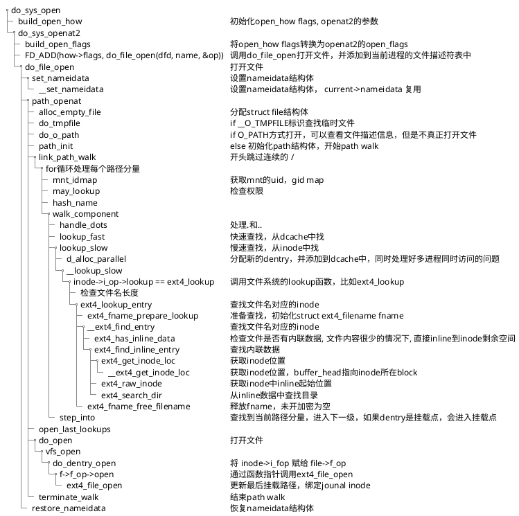
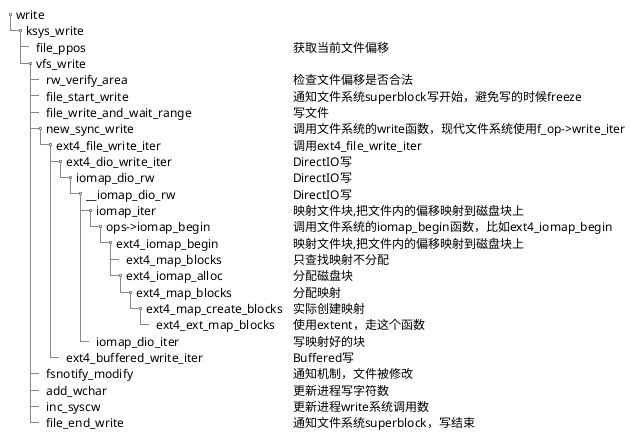

# ***open***

**完整对比表**

| 维度                   | **open** | **openat** | **openat2**       |
| ---------------------- | -------------- | ---------------- | ----------------------- |
| **路径解析起点** | 当前工作目录   | dirfd 或 CWD     | dirfd 或 CWD            |
| **符号链接处理** | O_NOFOLLOW     | O_NOFOLLOW       | RESOLVE_NO_SYMLINKS     |
| **逃逸防护**     | 无             | 有限             | RESOLVE_BENEATH/IN_ROOT |
| **魔法链接**     | 支持           | 支持             | RESOLVE_NO_MAGICLINKS   |
| **跨设备限制**   | 无             | 无               | RESOLVE_NO_XDEV         |
| **参数扩展**     | 无法扩展       | 难以扩展         | 易于扩展                |
| **版本管理**     | 无             | 无               | size 参数版本检查       |
| **安全性**       | 低             | 中               | 高                      |
| **性能**         | 最优           | 中等             | 略低但可接受            |
| **兼容性**       | 最好           | 好               | Linux 5.6+              |
| **推荐场景**     | 遗留代码       | 一般应用         | 安全关键应用            |

在 Linux 6.18 中：

1. **`open`** 主要用于兼容性，新代码应避免使用
2. **`openat`** 是目前的主流选择，平衡了功能和兼容性
3. **`openat2`** 是未来的方向，提供了最强的安全特性和扩展性

对于新项目，特别是安全敏感的应用，强烈推荐使用 `openat2`。它的结构体设计确保了向后兼容，同时提供了防止各种路径遍历攻击的能力。对于需要支持老内核的系统，可以回退到 `openat`，但应避免使用原始的 `open`。

## **do_sys_open代码执行flow**

    path lookup过程是顺着dentry树从上到下查找的，如果遇到符号链接，会沿着符号链接进入下一级目录，如果遇到挂载点，会进入挂载点，如果遇到文件，则打开文件。**执行流程分析**

1. **系统调用入口与参数转换：**do_sys_open 首先调用 build_open_how 初始化 open_how 结构体（支持 openat2 参数），随后进入 do_sys_openat2 调用 build_open_flags 将其转换为内核内部的 open_flags 结构。
2. **文件描述符分配与路径查找：**通过 get_unused_fd_flags 分配 fd，然后调用 do_filp_open 进入 VFS 路径查找核心。path_init 初始化查找起点，link_path_walk 逐级解析路径分量。
3. **目录项查找与 EXT4 inode 读取**：在 walk_component 中，优先调用 lookup_fast 查找 dcache；若未命中，则进入 lookup_slow 调用 ext4_lookup。EXT4 通过 ext4_find_entry 遍历目录项，若目标 inode 不在内存，则调用 __ext4_get_inode_loc 计算磁盘物理块位置，并通过 sb_bread 触发块 I/O 读取。
4. **NVMe 块设备 I/O 提交与完成：**sb_bread 构造 buffer_head 并向通用块层提交 bio。请求到达 NVMe 驱动后，被转化为 NVMe Read 命令（SQE）提交至 SQ 队列，并写 Doorbell 寄存器通知控制器。控制器 DMA 读取完成后产生 CQE 中断，驱动在中断上下文释放 bio 完成回调，将数据写入页缓存并唤醒等待进程。
5. **文件结构初始化与绑定：**回到 VFS 层，open_last_lookups 和 do_open 被调用，进入 vfs_open -> do_dentry_open。在此将 inode->i_fop（即 ext4_file_operations）赋给 file->f_op，并调用 ext4_file_open 完成文件系统特定逻辑。最后 fd_install 将 file 与 fd 绑定。

### 执行flow

```mermaid
flowchart TD
    A([用户态调用 open/openat/openat2]) --> B[do_sys_open]
  
    subgraph VFS系统调用层
        B --> C[build_open_how<br/>初始化open_how, 支持openat2参数]
        C --> D[do_sys_openat2]
        D --> E[build_open_flags<br/>转换open_how为内核open_flags]
        E --> F[get_unused_fd_flags<br/>分配文件描述符fd]
        F --> G[do_filp_open]
    end

    G --> H[path_openat]

    subgraph VFS路径解析层
        H --> I[alloc_empty_file<br/>分配struct file结构体]
        I --> J[path_init<br/>初始化查找起点与nameidata]
        J --> K[link_path_walk<br/>逐级解析路径分量]
    
        K --> L{处理路径分量}
        L --> M[may_lookup<br/>检查目录执行权限]
        M --> N[walk_component]
    
        N --> O{dcache是否命中?}
        O -- 是 --> V[step_into<br/>进入下一级/处理挂载点]
    
        O -- 否 --> P[lookup_slow]
        P --> Q[d_alloc_parallel<br/>分配dentry加入dcache]
        Q --> R[__lookup_slow]
    end

    subgraph EXT4文件系统层
        R --> S[ext4_lookup<br/>EXT4目录项查找]
        S --> T[ext4_lookup_entry]
        T --> U{检查inline data?}
    
        U -- 是 --> U1[ext4_find_inline_entry<br/>从inode内联数据中查找]
    
        U -- 否 --> U2[__ext4_find_entry<br/>从磁盘目录块中查找]
    
        U1 --> U3[ext4_get_inode_loc<br/>获取目标inode磁盘位置]
        U2 --> U3
    
        U3 --> U4[__ext4_get_inode_loc<br/>计算block_group与block偏移]
        U4 --> U5[sb_bread<br/>读取inode所在磁盘块]
    end

    subgraph NVMe块设备驱动层
        U5 --> V1[构造bio与buffer_head<br/>提交块I/O请求]
        V1 --> V2[通用块层处理<br/>合并与调度]
        V2 --> V3[NVMe驱动<br/>bio转化为NVMe Read SQE]
        V3 --> V4[提交至SQ队列<br/>写Doorbell寄存器通知控制器]
        V4 --> V5[NVMe控制器<br/>执行DMA读取磁盘数据]
        V5 --> V6[完成中断CQE<br/>触发NVMe中断处理]
        V6 --> V7[块层完成回调<br/>数据写入页缓存,唤醒等待进程]
    end

    V7 --> V

    V --> W{路径是否解析完毕?}
    W -- 否 --> K
    W -- 是 --> X[open_last_lookups<br/>最后一级组件查找与打开]

    subgraph VFS文件打开层
        X --> Y[do_open]
        Y --> Z[vfs_open]
        Z --> AA[do_dentry_open<br/>file->f_op = inode->i_fop]
        AA --> AB[f->f_op->open<br/>调用ext4_file_open]
    
        subgraph EXT4特定打开逻辑
            AB --> AC[ext4_file_open<br/>更新挂载路径,绑定journal inode]
        end
    
        AC --> AD[fd_install<br/>将file结构与fd绑定到进程]
    end

    AD --> AE([返回fd给用户态])

```

### 函数调用栈

# ***ksys_write***

### Buffer Write执行流程分析

1. **VFS写操作准备**：`ksys_write` 获取文件偏移后调用 `vfs_write`，经过权限校验（`rw_verify_area`）和写保护加锁（`file_start_write`），最终调用 `new_sync_write` 进入 `f_op->write_iter`，即 `ext4_file_write_iter`。
2. **Buffered Write入口**：对于非 DirectIO 的写操作，进入 `ext4_buffered_write_iter`。该函数获取 `inode` 锁，调用通用写函数 `generic_perform_write`。
3. **页缓存与块映射**：`generic_perform_write` 通过循环处理写入：先调用 `ext4_da_write_begin` 获取或分配页缓存（folio），拷贝用户态数据，再调用 `ext4_da_write_end` 标记页脏并处理延迟分配。
4. **EXT4延迟分配与Extent树**：在 `ext4_da_write_begin` 中，若页缓存未映射磁盘块，会调用 `ext4_block_write_begin` -> `ext4_da_get_block_prep`。EXT4采用延迟分配，此时仅标记 `EXT4_MAP_DELAYED` 并在内存的 Extent Status Tree 中插入 Delayed Extent，**不立即分配物理磁盘块**。
5. **脏页回写与物理块分配**：当内核线程（如 `writeback`）触发脏页回写时，调用 `ext4_writepages` -> `mpage_map_and_submit`。此时才真正分配物理块，调用 `ext4_ext_map_blocks` -> `ext4_ext_insert_extent` 修改 EXT4 Extent 树，将逻辑块映射到 NVMe 物理块。
6. **NVMe块设备I/O提交与完成**：分配完物理块后，构造 `bio` 提交至通用块层。NVMe 驱动将其转化为 NVMe Write SQE 提交至 SQ 队列，写 Doorbell 寄存器通知控制器。NVMe 控制器执行 DMA 写入，完成后产生 CQE 中断，驱动在中断中完成回调，清理脏页标记。

---

### 详细流程图与注释

```mermaid
flowchart TD
    A([用户态调用 write]) --> B[ksys_write]
  
    subgraph VFS系统调用层
        B --> C[file_ppos<br/>获取当前文件偏移]
        C --> D[vfs_write]
        D --> E[rw_verify_area<br/>检查文件偏移与锁是否合法]
        E --> F[file_start_write<br/>通知sb写开始,防止freeze]
        F --> G[new_sync_write<br/>调用f_op->write_iter]
        G --> H[ext4_file_write_iter]
    end

    H --> I{是否为DirectIO?}

    I -- 是 --> J[ext4_dio_write_iter<br/>DirectIO写路径]
    I -- 否 --> K[ext4_buffered_write_iter<br/>Buffered写路径]

    subgraph EXT4 Buffered写准备
        K --> L[ext4_write_begin<br/>或ext4_da_write_begin]
        L --> M[generic_perform_write<br/>循环处理写入]
        M --> N[aops->write_begin == ext4_da_write_begin]
    end

    subgraph EXT4延迟分配与页缓存
        N --> O[write_begin_get_folio<br/>获取或创建页缓存folio]
        O --> P[ext4_block_write_begin<br/>检查buffer_head映射状态]
        P --> Q{页缓存块是否已映射?}
    
        Q -- 是 --> R[copy_page_from_iter<br/>将用户态数据拷贝至页缓存]
        Q -- 否 --> S[ext4_da_get_block_prep<br/>延迟分配回调]
    
        S --> T[ext4_map_blocks<br/>查找映射,不分配物理块]
        T --> U[ext4_es_insert_extent<br/>在内存Extent Status Tree插入DELAYED标记]
        U --> R
    end

    subgraph EXT4写结束与脏页标记
        R --> V[aops->write_end == ext4_da_write_end]
        V --> W[ext4_da_do_write_end<br/>标记folio为脏]
        W --> X[解锁folio,唤醒等待该页的进程]
    end

    X --> Y{用户数据是否写完?}
    Y -- 否 --> M
    Y -- 是 --> Z[更新inode大小与时间戳]

    subgraph 内核脏页回写线程
        Z --> AA[writeback内核线程唤醒]
        AA --> AB[ext4_writepages<br/>回写脏页]
        AB --> AC[mpage_map_and_submit<br/>遍历脏页获取物理块映射]
    end

    subgraph EXT4物理块分配
        AC --> AD{物理块是否已分配?}
        AD -- 是 --> AG[构造bio提交写请求]
        AD -- 否 --> AE[ext4_ext_map_blocks<br/>分配物理磁盘块]
        AE --> AF[ext4_ext_insert_extent<br/>修改EXT4 Extent树,分配NVMe物理块号]
        AF --> AG
    end

    subgraph NVMe块设备驱动层
        AG --> AH[构造bio结构<br/>提交块I/O写请求]
        AH --> AI[通用块层处理<br/>合并与调度]
        AI --> AJ[NVMe驱动<br/>bio转化为NVMe Write SQE]
        AJ --> AK[提交至SQ队列<br/>写Doorbell寄存器通知控制器]
        AK --> AL[NVMe控制器<br/>执行DMA写入磁盘数据]
        AL --> AM[完成中断CQE<br/>触发NVMe中断处理]
        AM --> AN[块层完成回调<br/>清除脏页标记,唤醒等待进程]
    end

    AN --> AO([写操作完成])

    subgraph VFS系统调用层收尾
        Z --> AP[fsnotify_modify<br/>通知文件被修改]
        AP --> AQ[add_wchar & inc_syscw<br/>更新进程统计信息]
        AQ --> AR[file_end_write<br/>通知sb写结束]
        AR --> AS([返回写入字节数给用户态])
    end
```

### Direct IO 执行流程分析

1. **DIO写入口与迭代初始化**：在 `ext4_file_write_iter` 中判断为 DirectIO 后，进入 `ext4_dio_write_iter`。该函数处理 DIO 相关的锁（取消 inode 锁以避免死锁，获取 dio 锁），随后调用 `iomap_dio_rw` -> `__iomap_dio_rw` 初始化 `iomap_dio` 结构。
2. **块映射与物理块分配**：在 `__iomap_dio_rw` 的循环中，调用 `iomap_iter` 进行文件逻辑块到磁盘物理块的映射。通过 `ops->iomap_begin` 即 `ext4_iomap_begin`，EXT4 先调用 `ext4_map_blocks` 查找映射，若未分配则调用 `ext4_iomap_alloc` -> `ext4_map_blocks` (带 `EXT4_GET_BLOCKS_CREATE`) 触发实际的物理块分配。
3. **映射状态转换**：在 `ext4_set_iomap` 中，将 EXT4 的 `map->m_flags` 转换为 iomap 的通用标志。对于 DIO 写分配的新块，会同时设置 `EXT4_MAP_MAPPED` 和 `EXT4_MAP_UNWRITTEN`，此时 `ext4_set_iomap` 优先检查 `EXT4_MAP_UNWRITTEN`，将 `iomap->type` 设为 `IOMAP_UNWRITTEN`，确保在 IO 完成时能正确触发 `end_io` 将 unwritten extent 转换为 written。
4. **Bio构造与NVMe提交**：映射完成后，`iomap_dio_iter` 遍历映射好的区间，调用 `bio_iov_iter_get_pages` 构造 `bio`，直接将用户态地址映射到 NVMe 驱动。请求经通用块层到达 NVMe 驱动，转化为 NVMe Write SQE 提交至 SQ 队列并写 Doorbell。
5. **NVMe完成中断与Unwritten转换**：NVMe 控制器 DMA 写入完成后产生 CQE 中断，驱动在中断上下文调用 iomap 的 `iomap_dio_complete`。如果之前分配的是 Unwritten 块，此时会调用 `ext4_end_io_end` -> `ext4_convert_unwritten_extents` 将 Extent 标记为已写入，保证数据一致性。

---

### Direct IO 详细流程图与注释

```mermaid
flowchart TD
    A([用户态调用 write with O_DIRECT]) --> B[ext4_file_write_iter]
  
    B --> C{是否为DirectIO?}
    C -- 是 --> D[ext4_dio_write_iter]

    subgraph EXT4 DIO准备与锁控制
        D --> E[处理inode锁<br/>避免DIO与缓冲写死锁]
        E --> F[iomap_dio_rw]
        F --> G[__iomap_dio_rw<br/>初始化iomap_dio结构]
    end

    G --> H[iomap_iter<br/>迭代处理文件偏移]

    subgraph EXT4 iomap块映射
        H --> I[ops->iomap_begin == ext4_iomap_begin]
        I --> J[ext4_map_blocks<br/>查找逻辑块映射]
        J --> K{物理块是否已分配?}
    
        K -- 是 --> L[ext4_set_iomap<br/>转换映射状态为iomap格式]
        K -- 否 --> M[ext4_iomap_alloc<br/>分配物理磁盘块]
        M --> N[ext4_map_blocks<br/>带EXT4_GET_BLOCKS_CREATE标志]
        N --> O[ext4_ext_map_blocks<br/>修改EXT4 Extent树分配物理块]
        O --> L
    end

    subgraph iomap状态转换
        L --> P{检查map->m_flags}
        P -- EXT4_MAP_UNWRITTEN --> Q[iomap->type = IOMAP_UNWRITTEN<br/>标记为未写入,需在IO完成时转换]
        P -- EXT4_MAP_MAPPED --> R[iomap->type = IOMAP_MAPPED<br/>已映射的物理块]
    end

    Q --> S[iomap_dio_iter<br/>根据映射构造并提交Bio]
    R --> S

    subgraph NVMe块设备驱动层
        S --> T[bio_iov_iter_get_pages<br/>将用户态页面映射到Bio]
        T --> U[通用块层处理<br/>合并与调度]
        U --> V[NVMe驱动<br/>bio转化为NVMe Write SQE]
        V --> W[提交至SQ队列<br/>写Doorbell寄存器通知控制器]
        W --> X[NVMe控制器<br/>执行DMA写入磁盘数据]
        X --> Y[完成中断CQE<br/>触发NVMe中断处理]
    end

    Y --> Z{IO是否有错误?}
    Z -- 是 --> AA[iomap_dio_end_io<br/>返回错误,不转换Extent]
    Z -- 否 --> AB[iomap_dio_end_io<br/>块层完成回调]

    subgraph EXT4 Unwritten Extent转换
        AB --> AC[iomap_dio_complete<br/>等待DIO完成]
        AC --> AD{iomap->type == IOMAP_UNWRITTEN?}
        AD -- 否 --> AE([DIO写完成])
        AD -- 是 --> AF[ext4_end_io_end<br/>处理IO结束向量]
        AF --> AG[ext4_convert_unwritten_extents<br/>将Unwritten标记转为Written]
        AG --> AH[ext4_ext_mark_initialized<br/>更新Extent树状态]
        AH --> AE
    end
```

# pr debug 文件

open.c
namei.c
