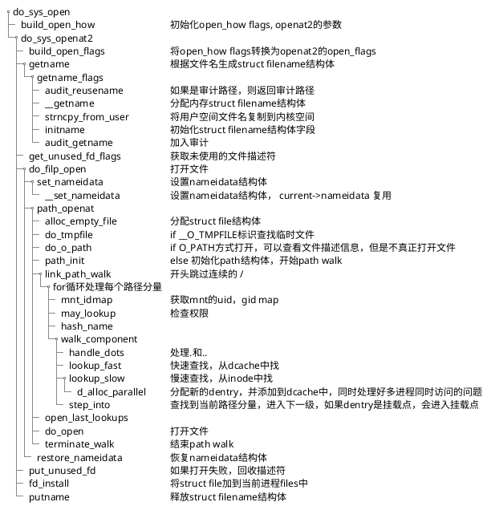
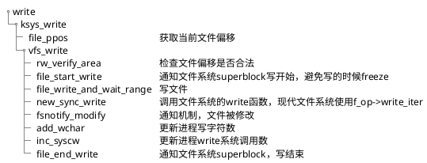

# ***open***

open相关的系统调用有open，openat，openat2，creat，creat会调用open

**Linux 6.18 中 open、openat、openat2 系统调用的区别**

## 1. **历史演进和基本对比**

| 特性                 | **open**    | **openat**      | **openat2**      |
| -------------------- | ----------------- | --------------------- | ---------------------- |
| **引入时间**   | Unix 早期         | POSIX.1-2008          | Linux 5.6              |
| **系统调用号** | `__NR_open` (5) | `__NR_openat` (257) | `__NR_openat2` (437) |
| **设计理念**   | 简单、传统        | 相对路径、目录fd      | 可扩展、安全           |
| **参数传递**   | 离散参数          | 离散参数              | 结构体参数             |
| **扩展性**     | 差                | 中等                  | 优秀                   |
| **安全特性**   | 基础              | 中等                  | 高级                   |
| **现代推荐**   | 遗留兼容          | 广泛使用              | 新代码首选             |

## 2. **函数原型对比**

### **open**

```c
#include <fcntl.h>
int open(const char *pathname, int flags);
int open(const char *pathname, int flags, mode_t mode);
```

### **openat**

```c
#include <fcntl.h>
int openat(int dirfd, const char *pathname, int flags);
int openat(int dirfd, const char *pathname, int flags, mode_t mode);
```

### **openat2**

```c
#define _GNU_SOURCE
#include <fcntl.h>
#include <sys/types.h>

struct open_how {
    __u64 flags;        /* O_* flags */
    __u64 mode;         /* Mode for O_CREAT */
    __u64 resolve;      /* RESOLVE_* flags */
};

int openat2(int dirfd, const char *pathname,
            struct open_how *how, size_t size);
```

## 3. **参数设计的演进**

### **open 的离散参数**

```c
// 问题：扩展困难，新标志无处可放
int fd = open("/path/file", O_RDWR | O_CLOEXEC | O_TMPFILE, 0644);
// 如果想添加新的打开方式，只能增加新的 flag 位
```

### **openat 的改进**

```c
// 添加了 dirfd 参数，但仍然是离散参数
int fd = openat(dirfd, "file", O_RDONLY | O_NOFOLLOW, 0644);
// 仍然受限于 flags 位域
```

### **openat2 的结构体设计**

```c
struct open_how how = {
    .flags = O_RDWR | O_CLOEXEC,
    .mode = 0644,
    .resolve = RESOLVE_BENEATH | RESOLVE_NO_MAGICLINKS,
};
int fd = openat2(dirfd, "file", &how, sizeof(how));

// 优势：可以通过扩展结构体添加新功能
// 后向兼容：size 参数允许版本检查
```

## 4. **内核实现差异**

### **open 的实现**

```c
// fs/open.c
SYSCALL_DEFINE3(open, const char __user *, filename,
                int, flags, umode_t, mode)
{
    if (force_o_largefile())
        flags |= O_LARGEFILE;
    return do_sys_open(AT_FDCWD, filename, flags, mode);
}
```

### **openat 的实现**

```c
SYSCALL_DEFINE4(openat, int, dfd, const char __user *, filename,
                int, flags, umode_t, mode)
{
    if (force_o_largefile())
        flags |= O_LARGEFILE;
    return do_sys_open(dfd, filename, flags, mode);
}
```

### **openat2 的实现**

```c
// fs/open.c
SYSCALL_DEFINE4(openat2, int, dfd, const char __user *, filename,
                struct open_how __user *, how, size_t, usize)
{
    int err;
    struct open_how tmp;
  
    BUILD_BUG_ON(sizeof(struct open_how) < OPEN_HOW_SIZE_VER0);
    BUILD_BUG_ON(sizeof(struct open_how) != OPEN_HOW_SIZE_LATEST);
  
    if (usize < OPEN_HOW_SIZE_VER0)
        return -EINVAL;
  
    err = copy_struct_from_user(&tmp, sizeof(tmp), how, usize);
    if (err)
        return err;
  
    // 验证参数
    err = prepare_open_how(&tmp);
    if (err)
        return err;
  
    // 调用通用函数，但传入 open_how 结构
    return do_sys_openat2(dfd, filename, &tmp);
}
```

## 5. **do_sys_openat2 核心函数**

```c
// fs/open.c
static long do_sys_openat2(int dfd, const char __user *filename,
                           struct open_how *how)
{
    struct open_flags op;
    int fd = build_open_flags(how, &op);  // 构建打开标志
    struct filename *tmp;
    int lookup_flags = 0;
  
    if (fd)
        return fd;
  
    // 获取文件名
    tmp = getname(filename);
    if (IS_ERR(tmp))
        return PTR_ERR(tmp);
  
    // 设置查找标志，基于 how->resolve
    if (how->resolve & RESOLVE_NO_XDEV)
        lookup_flags |= LOOKUP_NO_XDEV;
    if (how->resolve & RESOLVE_NO_MAGICLINKS)
        lookup_flags |= LOOKUP_NO_MAGICLINKS;
    if (how->resolve & RESOLVE_NO_SYMLINKS)
        lookup_flags |= LOOKUP_NO_SYMLINKS;
    if (how->resolve & RESOLVE_BENEATH)
        lookup_flags |= LOOKUP_BENEATH;
    if (how->resolve & RESOLVE_IN_ROOT)
        lookup_flags |= LOOKUP_IN_ROOT;
  
    fd = get_unused_fd_flags(how->flags);
    if (fd >= 0) {
        struct file *f = do_filp_open(dfd, tmp, &op, lookup_flags);
        if (IS_ERR(f)) {
            put_unused_fd(fd);
            fd = PTR_ERR(f);
        } else {
            fsnotify_open(f);
            fd_install(fd, f);
        }
    }
  
    putname(tmp);
    return fd;
}
```

## 6. **RESOLVE 标志详解**

### **RESOLVE 标志的作用域**

```c
// openat2 特有的 resolve 字段
u64 resolve;  // 路径解析控制标志
```

### **可用的 RESOLVE 标志**

```c
// 在 open_how 结构体中使用
#define RESOLVE_NO_XDEV       0x01  /* 不允许跨越设备边界 */
#define RESOLVE_NO_MAGICLINKS 0x02  /* 不解析魔法链接 */
#define RESOLVE_NO_SYMLINKS   0x04  /* 不解析任何符号链接 */
#define RESOLVE_BENEATH       0x08  /* 路径必须在 dirfd 之下 */
#define RESOLVE_IN_ROOT       0x10  /* 将根视为 dirfd 指定的目录 */
#define RESOLVE_CACHED        0x20  /* 只使用缓存中的条目（Linux 6.0+） */
```

### **标志组合示例**

```c
// 安全沙盒场景
struct open_how how = {
    .flags = O_RDONLY,
    .resolve = RESOLVE_BENEATH |        // 不能向上逃逸
               RESOLVE_NO_SYMLINKS |    // 防止符号链接攻击
               RESOLVE_NO_XDEV |        // 不能跨设备
               RESOLVE_NO_MAGICLINKS,   // 防止魔法链接
};

// 容器内安全打开
int fd = openat2(container_root_fd, "app/config.json", &how, sizeof(how));
```

## 7. **安全特性对比**

### **TOCTTOU 攻击防护**

```c
// open/opent 的 TOCTTOU 问题
int unsafe_open(const char *path) {
    struct stat st;
  
    // 检查阶段
    if (stat(path, &st) == 0 && S_ISREG(st.st_mode)) {
        // 攻击者可以在这里替换符号链接
  
        // 使用阶段
        return open(path, O_RDONLY);  // 可能打开不同文件
    }
    return -1;
}

// openat2 的安全版本
int safe_openat2(int dirfd, const char *path) {
    struct open_how how = {
        .flags = O_RDONLY | O_NOFOLLOW,
        .resolve = RESOLVE_NO_SYMLINKS | RESOLVE_BENEATH,
    };
  
    int fd = openat2(dirfd, path, &how, sizeof(how));
    if (fd < 0)
        return -1;
  
    // 打开后检查（安全）
    struct stat st;
    if (fstat(fd, &st) < 0 || !S_ISREG(st.st_mode)) {
        close(fd);
        return -1;
    }
  
    return fd;
}
```

## 8. **路径解析行为差异**

### **路径遍历对比**

```bash
# 文件系统结构
/mnt/
├── external/    # 不同挂载点
│   └── secret.txt
└── data/
    ├── config -> /etc/passwd  # 符号链接
    └── file.txt
```

### **不同系统调用的行为**

```c
int dir_fd = open("/mnt/data", O_RDONLY | O_DIRECTORY);

// 1. open - 总是从当前工作目录开始
open("../external/secret.txt", O_RDONLY);  // 成功，可逃逸

// 2. openat - 相对于 dir_fd，但可能跟随符号链接
openat(dir_fd, "config", O_RDONLY);  // 成功，打开 /etc/passwd

// 3. openat2 - 可限制各种逃逸
struct open_how how = {
    .flags = O_RDONLY,
    .resolve = RESOLVE_BENEATH | RESOLVE_NO_SYMLINKS | RESOLVE_NO_XDEV,
};

openat2(dir_fd, "../external/secret.txt", &how, sizeof(how));  // 失败，RESOLVE_BENEATH
openat2(dir_fd, "config", &how, sizeof(how));  // 失败，RESOLVE_NO_SYMLINKS
openat2(dir_fd, "file.txt", &how, sizeof(how));  // 成功，安全打开
```

## 9. **魔法链接（Magic Links）处理**

### **什么是魔法链接**

```c
// 特殊文件系统中的链接，如 procfs
/proc/self/exe      -> 当前进程的可执行文件
/proc/self/fd/0     -> 标准输入
/proc/<pid>/root    -> 进程的根目录
```

### **处理差异**

```c
int proc_fd = open("/proc/self", O_RDONLY | O_DIRECTORY);

// open/openat: 可以遍历魔法链接
openat(proc_fd, "exe", O_RDONLY);  // 成功，打开当前可执行文件
openat(proc_fd, "fd/0", O_RDONLY); // 成功，打开标准输入

// openat2: 可以禁止魔法链接
struct open_how how = {
    .flags = O_RDONLY,
    .resolve = RESOLVE_NO_MAGICLINKS,
};

openat2(proc_fd, "exe", &how, sizeof(how));   // 失败，ENOENT
openat2(proc_fd, "fd/0", &how, sizeof(how));  // 失败，ENOENT
```

## 10. **版本管理和兼容性**

### **size 参数的作用**

```c
// openat2 的版本管理机制
int openat2(int dirfd, const char *pathname,
            struct open_how *how, size_t size);

// 使用示例：检查版本兼容性
struct open_how how = {
    .flags = O_RDONLY,
    .resolve = RESOLVE_BENEATH,
};

// 内核会检查 size，只处理已知字段
int fd = openat2(dirfd, "file", &how, sizeof(how));

// 如果未来扩展了 open_how 结构体
struct open_how_extended {
    struct open_how base;
    u64 new_feature;  // 新字段
};

// 旧程序使用较小 size，内核忽略新字段
fd = openat2(dirfd, "file", &how_ext, OPEN_HOW_SIZE_VER0);
```

### **内核中的版本检查**

```c
// fs/open.c
static int prepare_open_how(struct open_how *how)
{
    // 确保 flags 有效
    if (how->flags & ~VALID_OPEN_FLAGS)
        return -EINVAL;
  
    // 确保 resolve 标志有效
    if (how->resolve & ~VALID_RESOLVE_FLAGS)
        return -EINVAL;
  
    // 如果指定了 O_PATH，检查 resolve 标志兼容性
    if (how->flags & O_PATH) {
        if (how->resolve & RESOLVE_NO_XDEV)
            return -EINVAL;
    }
  
    return 0;
}
```

## 11. **实际应用场景**

### **容器运行时**

```c
// 容器实现中的安全文件访问
int container_open_file(const char *container_path) {
    struct open_how how = {
        .flags = O_RDONLY | O_CLOEXEC,
        .resolve = RESOLVE_BENEATH |          // 防止逃逸到宿主机
                   RESOLVE_NO_SYMLINKS |      // 防止符号链接攻击
                   RESOLVE_NO_MAGICLINKS |    // 防止通过/proc逃逸
                   RESOLVE_NO_XDEV,           // 防止跨挂载点
    };
  
    return openat2(container_root_fd, container_path, 
                   &how, sizeof(how));
}
```

### **Web 服务器安全**

```c
// 安全的静态文件服务
int safe_serve_file(const char *request_path) {
    struct open_how how = {
        .flags = O_RDONLY | O_NOFOLLOW | O_CLOEXEC,
        .resolve = RESOLVE_BENEATH | RESOLVE_NO_SYMLINKS,
    };
  
    int docroot_fd = open("/var/www", O_RDONLY | O_DIRECTORY);
    if (docroot_fd < 0)
        return -1;
  
    int fd = openat2(docroot_fd, request_path, &how, sizeof(how));
    close(docroot_fd);
  
    return fd;
}
```

### **SUID/SGID 程序**

```c
// 安全地打开用户指定文件
int suid_safe_open(const char *user_path) {
    struct open_how how = {
        .flags = O_RDONLY | O_NOFOLLOW,
        .resolve = RESOLVE_IN_ROOT | RESOLVE_NO_SYMLINKS,
    };
  
    // 切换到安全目录
    int safe_dir_fd = open("/safe/directory", O_RDONLY | O_DIRECTORY);
  
    // RESOLVE_IN_ROOT 将 "/" 解释为 safe_dir_fd
    return openat2(safe_dir_fd, user_path, &how, sizeof(how));
}
```

## 12. **性能考虑**

### **开销对比**

```c
// 基准测试示例
void benchmark_open_calls(const char *path) {
    struct timespec start, end;
  
    // 1. open
    clock_gettime(CLOCK_MONOTONIC, &start);
    int fd1 = open(path, O_RDONLY);
    clock_gettime(CLOCK_MONOTONIC, &end);
  
    // 2. openat
    clock_gettime(CLOCK_MONOTONIC, &start);
    int fd2 = openat(AT_FDCWD, path, O_RDONLY);
    clock_gettime(CLOCK_MONOTONIC, &end);
  
    // 3. openat2
    struct open_how how = { .flags = O_RDONLY };
    clock_gettime(CLOCK_MONOTONIC, &start);
    int fd3 = openat2(AT_FDCWD, path, &how, sizeof(how));
    clock_gettime(CLOCK_MONOTONIC, &end);
}
```

### **性能分析**

- **open**: 最轻量，但功能有限
- **openat**: 稍重，支持相对路径
- **openat2**: 最重，但提供最多安全功能
- **实际差异**: 对于大多数应用，性能差异可忽略不计

## 13. **内核内部路径查找差异**

### **lookup_flags 的传递**

```c
// fs/namei.c
static struct file *path_openat(struct nameidata *nd,
                                const struct open_flags *op,
                                unsigned flags)
{
    // open/openat: flags 来自 op->lookup_flags
    // openat2: flags 包含 RESOLVE_* 转换的 LOOKUP_* 标志
  
    if (flags & LOOKUP_BENEATH) {
        // 确保不向上逃逸
        if (nd->path.mnt != nd->root.mnt ||
            !path_is_under(&nd->path, &nd->root))
            return ERR_PTR(-EXDEV);
    }
  
    if (flags & LOOKUP_NO_SYMLINKS) {
        // 不解析符号链接
        nd->flags |= LOOKUP_NOSYMLINKS;
    }
  
    // ... 继续路径查找
}
```

## 14. **错误处理差异**

### **错误返回码**

```c
// open/openat: 传统错误码
open("/nonexistent", O_RDONLY);      // ENOENT
open("/root/secret", O_RDONLY);      // EACCES (权限不足)

// openat2: 新增错误码
struct open_how how = {
    .flags = O_RDONLY,
    .resolve = RESOLVE_BENEATH,
};

openat2(dirfd, "../escape", &how, sizeof(how));  // EXDEV (尝试逃逸)
openat2(dirfd, "symlink", &how, sizeof(how));    // ELOOP  (符号链接)
```

## 15. **选择指南**

### **何时使用 open**

```c
// 1. 简单脚本或工具
// 2. 不需要相对路径或安全特性的场景
// 3. 需要最大兼容性（老系统）

if (simple_tool || maximum_compatibility) {
    return open(path, flags, mode);
}
```

### **何时使用 openat**

```c
// 1. 需要相对路径访问
// 2. 避免 TOCTTOU 问题
// 3. 多目录并行操作
// 4. 容器内路径操作

if (relative_paths || container_code || avoid_toctou) {
    return openat(dirfd, path, flags, mode);
}
```

### **何时使用 openat2**

```c
// 1. 需要高级安全特性
// 2. 处理不受信任的路径
// 3. SUID/SGID 程序
// 4. 沙盒环境
// 5. 新代码，希望面向未来

if (security_critical || untrusted_paths || sandbox || future_proof) {
    struct open_how how = {
        .flags = flags,
        .mode = mode,
        .resolve = security_flags,
    };
    return openat2(dirfd, path, &how, sizeof(how));
}
```

## 16. **完整对比表**

| 维度                   | **open** | **openat** | **openat2**       |
| ---------------------- | -------------- | ---------------- | ----------------------- |
| **路径解析起点** | 当前工作目录   | dirfd 或 CWD     | dirfd 或 CWD            |
| **符号链接处理** | O_NOFOLLOW     | O_NOFOLLOW       | RESOLVE_NO_SYMLINKS     |
| **逃逸防护**     | 无             | 有限             | RESOLVE_BENEATH/IN_ROOT |
| **魔法链接**     | 支持           | 支持             | RESOLVE_NO_MAGICLINKS   |
| **跨设备限制**   | 无             | 无               | RESOLVE_NO_XDEV         |
| **参数扩展**     | 无法扩展       | 难以扩展         | 易于扩展                |
| **版本管理**     | 无             | 无               | size 参数版本检查       |
| **安全性**       | 低             | 中               | 高                      |
| **性能**         | 最优           | 中等             | 略低但可接受            |
| **兼容性**       | 最好           | 好               | Linux 5.6+              |
| **推荐场景**     | 遗留代码       | 一般应用         | 安全关键应用            |

## **总结**

在 Linux 6.18 中：

1. **`open`** 主要用于兼容性，新代码应避免使用
2. **`openat`** 是目前的主流选择，平衡了功能和兼容性
3. **`openat2`** 是未来的方向，提供了最强的安全特性和扩展性

对于新项目，特别是安全敏感的应用，强烈推荐使用 `openat2`。它的结构体设计确保了向后兼容，同时提供了防止各种路径遍历攻击的能力。对于需要支持老内核的系统，可以回退到 `openat`，但应避免使用原始的 `open`。

## **代码执行flow**

path lookup过程是顺着dentry树从上到下查找的，如果遇到符号链接，会沿着符号链接进入下一级目录，如果遇到挂载点，会进入挂载点，如果遇到文件，则打开文件。



# ***write***

