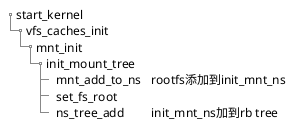

# 根目录创建过程

```plantuml
@startsalt
{{T
+ start_kernel
++ vfs_caches_init
+++ mnt_init
++++ init_mount_tree
+++++ mnt_add_to_ns     | rootfs添加到init_mnt_ns
+++++ set_fs_root
+++++ ns_tree_add       | init_mnt_ns加到rb tree
}}
@endsalt
```
