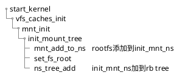
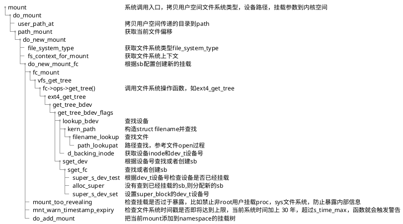

# 根目录创建过程

```plantuml
@startsalt
{{T
+ start_kernel
++ vfs_caches_init
+++ mnt_init
++++ init_mount_tree
+++++ mnt_add_to_ns     | rootfs添加到init_mnt_ns
+++++ set_fs_root
+++++ ns_tree_add       | init_mnt_ns加到rb tree
}}
@endsalt
```

# 文件系统类型

```plantuml
@startuml
object file_systems {
    struct file_system_type *
    --
    **链表起点**
}

object sysfs_fs_type  {
    struct file_system_type
    --
    name = "sysfs"
    init_fs_context = sysfs_init_fs_context
    kill_sb = sysfs_kill_sb
    fs_flags = FS_USERNS_MOUNT
    next = shmem_fs_type
}

object shmem_fs_type  {
    struct file_system_type
    --
    name = "tmpfs"
    init_fs_context = shmem_init_fs_context
    parameters = shmem_fs_parameters
    kill_sb = kill_litter_super
    fs_flags = FS_USERNS_MOUNT | FS_ALLOW_IDMAP | FS_MGTIME
    next = bd_type
}

object bd_type  {
    struct file_system_type
    --
    name = "bdev"
    init_fs_context = bd_init_fs_context
    kill_sb = kill_anon_super
    next = proc_fs_type
}

object proc_fs_type {
    struct file_system_type
    --
    name = "proc"
    init_fs_context = proc_init_fs_context
    parameters = proc_fs_parameters
    kill_sb = proc_kill_sb
    fs_flags = FS_USERNS_MOUNT | FS_DISALLOW_NOTIFY_PERM
    next = cgroup_fs_type
}

object cgroup_fs_type {
    struct file_system_type
    --
    name = "cgroup"
    init_fs_context = cgroup_init_fs_context
    parameters = cgroup1_fs_parameters
    kill_sb = cgroup_kill_sb
    fs_flags = FS_USERNS_MOUNT
    next = cgroup2_fs_type
}

object cgroup2_fs_type {
    struct file_system_type
    --
    name = "cgroup2"
    init_fs_context = cgroup_init_fs_context
    parameters = cgroup2_fs_parameters
    kill_sb = cgroup_kill_sb
    fs_flags = FS_USERNS_MOUNT
    next = dev_fs_type
}

object dev_fs_type {
    struct file_system_type
    --
    name = "devtmpfs"
    init_fs_context = devtmpfs_init_fs_context
    next = configfs_fs_type
}

object configfs_fs_type {
    struct file_system_type
    --
    name = "configfs"
    init_fs_context = configfs_init_fs_context
    kill_sb = kill_litter_super
    next = debug_fs_type
}

object debug_fs_type {
    struct file_system_type
    --
    name = "debugfs"
    init_fs_context = debugfs_init_fs_context
    parameters = debugfs_param_specs
    kill_sb = kill_litter_super
    next = fs_type
}

object fs_type {
    struct file_system_type
    --
    name = "securityfs"
    init_fs_context = securityfs_init_fs_context
    kill_sb = kill_litter_super
    next = sock_fs_type
}

object sock_fs_type {
    struct file_system_type
    --
    name = "sockfs"
    init_fs_context = sockfs_init_fs_context
    kill_sb = kill_anon_super
    next = bpf_fs_type
}

object bpf_fs_type {
    struct file_system_type
    --
    name = "bpf"
    init_fs_context = bpf_init_fs_context
    parameters = bpf_fs_parameters
    kill_sb = bpf_kill_super
    fs_flags = FS_USERNS_MOUNT
    next = pipe_fs_type
}

object pipe_fs_type {
    struct file_system_type
    --
    name = "pipefs"
    init_fs_context = pipefs_init_fs_context
    kill_sb = kill_anon_super
    next = ramfs_fs_type
}

object ramfs_fs_type {
    struct file_system_type
    --
    name = "ramfs"
    init_fs_context = ramfs_init_fs_context
    parameters = ramfs_fs_parameters
    kill_sb = ramfs_kill_sb
    fs_flags = FS_USERNS_MOUNT
    next = hugetlbfs_fs_type
}

object hugetlbfs_fs_type {
    struct file_system_type
    --
    name = "hugetlbfs"
    init_fs_context = hugetlbfs_init_fs_context
    parameters = hugetlb_fs_parameters
    kill_sb = kill_litter_super
    fs_flags = FS_ALLOW_IDMAP
    next = rpc_pipe_fs_type
}

object rpc_pipe_fs_type {
    struct file_system_type
    --
    name = "rpc_pipefs"
    init_fs_context = rpc_init_fs_context
    kill_sb = rpc_kill_sb
    next = devpts_fs_type
}

object devpts_fs_type {
    struct file_system_type
    --
    name = "devpts"
    init_fs_context = devpts_init_fs_context
    parameters = devpts_param_specs
    kill_sb = devpts_kill_sb
    fs_flags = FS_USERNS_MOUNT
    next = ext4_fs_type
}

object ext4_fs_type {
    struct file_system_type
    --
    name = "ext4"
    init_fs_context = ext4_init_fs_context
    parameters = ext4_param_specs
    kill_sb = ext4_kill_sb
    fs_flags = FS_REQUIRES_DEV | FS_ALLOW_IDMAP | FS_MGTIME
    next = NULL
}


file_systems -down-> sysfs_fs_type
sysfs_fs_type::next -down-> shmem_fs_type
shmem_fs_type::next -down-> bd_type
bd_type::next -down-> proc_fs_type
proc_fs_type::next -down-> cgroup_fs_type
cgroup_fs_type::next -down-> cgroup2_fs_type
cgroup2_fs_type::next -down-> dev_fs_type
dev_fs_type::next -down-> configfs_fs_type
configfs_fs_type::next -down-> debug_fs_type
debug_fs_type::next -down-> fs_type
fs_type::next -down-> sock_fs_type
sock_fs_type::next -down-> bpf_fs_type
bpf_fs_type::next -down-> pipe_fs_type
pipe_fs_type::next -down-> ramfs_fs_type
ramfs_fs_type::next -down-> hugetlbfs_fs_type
hugetlbfs_fs_type::next -down-> rpc_pipe_fs_type
rpc_pipe_fs_type::next -down-> devpts_fs_type
devpts_fs_type::next -down-> ext4_fs_type

@enduml

```

# 挂载过程

```plantuml
@startsalt
{{T
+ mount | 系统调用入口，拷贝用户空间文件系统类型，设备路径，挂载参数到内核空间
++ do_mount
+++ user_path_at    | 拷贝用户空间传递的目录到path
+++ path_mount | 获取当前文件偏移
++++ do_new_mount
+++++ file_system_type | 获取文件系统类型file_system_type
+++++ fs_context_for_mount | 获取文件系统上下文
+++++ do_new_mount_fc   | 根据sb配置创建新的挂载
++++++ fc_mount
+++++++ vfs_get_tree
++++++++ fc->ops->get_tree()    | 调用文件系统操作函数，如ext4_get_tree
+++++++++ ext4_get_tree
++++++++++ get_tree_bdev
+++++++++++ get_tree_bdev_flags
++++++++++++ lookup_bdev    | 查找设备
+++++++++++++ kern_path | 构造struct filename并查找
++++++++++++++ filename_lookup | 查找文件
+++++++++++++++ path_lookupat | 路径查找，参考文件open过程
+++++++++++++ d_backing_inode | 获取设备inode和dev_t设备号
++++++++++++ sget_dev       | 根据设备号查找或者创建sb
+++++++++++++ sget_fc       | 查找或者创建sb
++++++++++++++ super_s_dev_test | 根据dev_t设备号检查设备是否已经挂载
++++++++++++++ alloc_super | 没有查到已经挂载的sb,则分配新的sb
++++++++++++++ super_s_dev_set | 设置super_block的dev_t设备号
++++++ mount_too_revealing  | 检查挂载是否过于暴露，比如禁止非root用户挂载proc，sys文件系统，防止暴露内部信息
++++++ mnt_warn_timestamp_expiry    | 检查文件系统时间戳是否即将达到上限，当前系统时间加上 30 年，超过s_time_max，函数就会触发警告
++++++ do_add_mount | 把当前mount添加到namespace的挂载树
}}


@endsalt
```
