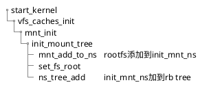
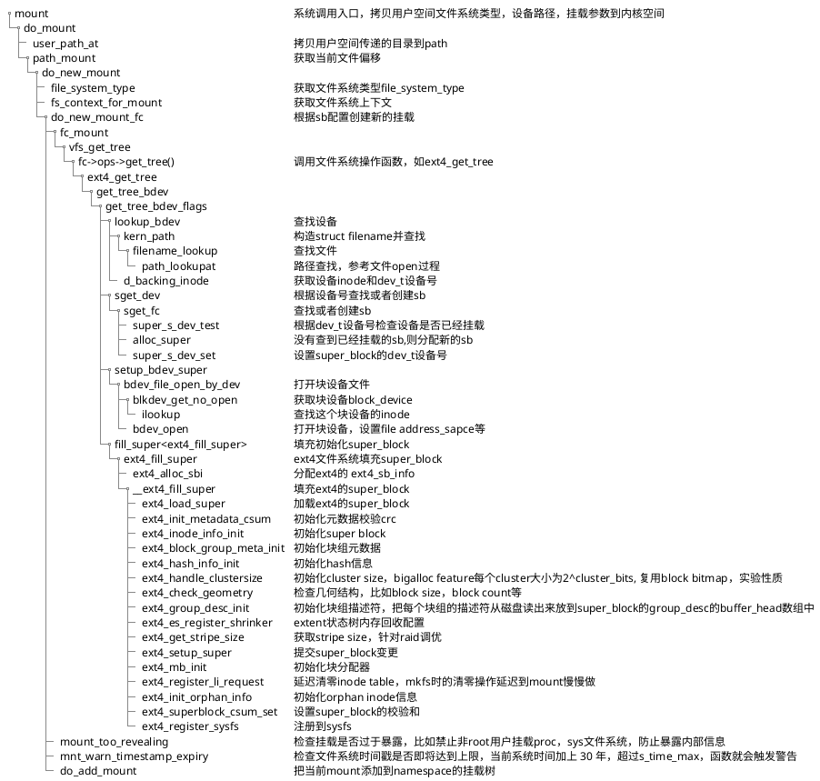

# 根目录创建过程

```plantuml
@startsalt
{{T
+ start_kernel
++ vfs_caches_init
+++ mnt_init
++++ init_mount_tree
+++++ mnt_add_to_ns     | rootfs添加到init_mnt_ns
+++++ set_fs_root
+++++ ns_tree_add       | init_mnt_ns加到rb tree
}}
@endsalt
```

# 文件系统类型

```plantuml
@startuml
object file_systems {
    struct file_system_type *
    --
    **链表起点**
}

object sysfs_fs_type  {
    struct file_system_type
    --
    name = "sysfs"
    init_fs_context = sysfs_init_fs_context
    kill_sb = sysfs_kill_sb
    fs_flags = FS_USERNS_MOUNT
    next = shmem_fs_type
}

object shmem_fs_type  {
    struct file_system_type
    --
    name = "tmpfs"
    init_fs_context = shmem_init_fs_context
    parameters = shmem_fs_parameters
    kill_sb = kill_litter_super
    fs_flags = FS_USERNS_MOUNT | FS_ALLOW_IDMAP | FS_MGTIME
    next = bd_type
}

object bd_type  {
    struct file_system_type
    --
    name = "bdev"
    init_fs_context = bd_init_fs_context
    kill_sb = kill_anon_super
    next = proc_fs_type
}

object proc_fs_type {
    struct file_system_type
    --
    name = "proc"
    init_fs_context = proc_init_fs_context
    parameters = proc_fs_parameters
    kill_sb = proc_kill_sb
    fs_flags = FS_USERNS_MOUNT | FS_DISALLOW_NOTIFY_PERM
    next = cgroup_fs_type
}

object cgroup_fs_type {
    struct file_system_type
    --
    name = "cgroup"
    init_fs_context = cgroup_init_fs_context
    parameters = cgroup1_fs_parameters
    kill_sb = cgroup_kill_sb
    fs_flags = FS_USERNS_MOUNT
    next = cgroup2_fs_type
}

object cgroup2_fs_type {
    struct file_system_type
    --
    name = "cgroup2"
    init_fs_context = cgroup_init_fs_context
    parameters = cgroup2_fs_parameters
    kill_sb = cgroup_kill_sb
    fs_flags = FS_USERNS_MOUNT
    next = dev_fs_type
}

object dev_fs_type {
    struct file_system_type
    --
    name = "devtmpfs"
    init_fs_context = devtmpfs_init_fs_context
    next = configfs_fs_type
}

object configfs_fs_type {
    struct file_system_type
    --
    name = "configfs"
    init_fs_context = configfs_init_fs_context
    kill_sb = kill_litter_super
    next = debug_fs_type
}

object debug_fs_type {
    struct file_system_type
    --
    name = "debugfs"
    init_fs_context = debugfs_init_fs_context
    parameters = debugfs_param_specs
    kill_sb = kill_litter_super
    next = fs_type
}

object fs_type {
    struct file_system_type
    --
    name = "securityfs"
    init_fs_context = securityfs_init_fs_context
    kill_sb = kill_litter_super
    next = sock_fs_type
}

object sock_fs_type {
    struct file_system_type
    --
    name = "sockfs"
    init_fs_context = sockfs_init_fs_context
    kill_sb = kill_anon_super
    next = bpf_fs_type
}

object bpf_fs_type {
    struct file_system_type
    --
    name = "bpf"
    init_fs_context = bpf_init_fs_context
    parameters = bpf_fs_parameters
    kill_sb = bpf_kill_super
    fs_flags = FS_USERNS_MOUNT
    next = pipe_fs_type
}

object pipe_fs_type {
    struct file_system_type
    --
    name = "pipefs"
    init_fs_context = pipefs_init_fs_context
    kill_sb = kill_anon_super
    next = ramfs_fs_type
}

object ramfs_fs_type {
    struct file_system_type
    --
    name = "ramfs"
    init_fs_context = ramfs_init_fs_context
    parameters = ramfs_fs_parameters
    kill_sb = ramfs_kill_sb
    fs_flags = FS_USERNS_MOUNT
    next = hugetlbfs_fs_type
}

object hugetlbfs_fs_type {
    struct file_system_type
    --
    name = "hugetlbfs"
    init_fs_context = hugetlbfs_init_fs_context
    parameters = hugetlb_fs_parameters
    kill_sb = kill_litter_super
    fs_flags = FS_ALLOW_IDMAP
    next = rpc_pipe_fs_type
}

object rpc_pipe_fs_type {
    struct file_system_type
    --
    name = "rpc_pipefs"
    init_fs_context = rpc_init_fs_context
    kill_sb = rpc_kill_sb
    next = devpts_fs_type
}

object devpts_fs_type {
    struct file_system_type
    --
    name = "devpts"
    init_fs_context = devpts_init_fs_context
    parameters = devpts_param_specs
    kill_sb = devpts_kill_sb
    fs_flags = FS_USERNS_MOUNT
    next = ext4_fs_type
}

object ext4_fs_type {
    struct file_system_type
    --
    name = "ext4"
    init_fs_context = ext4_init_fs_context
    parameters = ext4_param_specs
    kill_sb = ext4_kill_sb
    fs_flags = FS_REQUIRES_DEV | FS_ALLOW_IDMAP | FS_MGTIME
    next = NULL
}


file_systems -down-> sysfs_fs_type
sysfs_fs_type::next -down-> shmem_fs_type
shmem_fs_type::next -down-> bd_type
bd_type::next -down-> proc_fs_type
proc_fs_type::next -down-> cgroup_fs_type
cgroup_fs_type::next -down-> cgroup2_fs_type
cgroup2_fs_type::next -down-> dev_fs_type
dev_fs_type::next -down-> configfs_fs_type
configfs_fs_type::next -down-> debug_fs_type
debug_fs_type::next -down-> fs_type
fs_type::next -down-> sock_fs_type
sock_fs_type::next -down-> bpf_fs_type
bpf_fs_type::next -down-> pipe_fs_type
pipe_fs_type::next -down-> ramfs_fs_type
ramfs_fs_type::next -down-> hugetlbfs_fs_type
hugetlbfs_fs_type::next -down-> rpc_pipe_fs_type
rpc_pipe_fs_type::next -down-> devpts_fs_type
devpts_fs_type::next -down-> ext4_fs_type

@enduml

```

# 挂载树结构

```plantuml
@startuml
!theme plain
skinparam classAttributeIconSize 0
skinparam object {
  BackgroundColor LightGray
  BorderColor Black
  FontName Monospaced
}

' ========== 命名空间层 ==========
object "init_mnt_ns\n(初始挂载命名空间)" as init_ns #LightBlue {
  root = mount_root
}

' ========== mount 层 ==========
object "mount_root\n(根挂载 - rootfs)" as mount_root #LightGreen {
  mnt_parent = mount_root
  mnt_mountpoint = dentry_root
  mnt_root = dentry_root
  mnt.mnt_sb = sb_rootfs
}

object "mount_proc\n(挂载 /proc)" as mount_proc #LightYellow {
  mnt_parent = mount_root
  mnt_mountpoint = dentry_proc
  mnt_root = dentry_proc_root
  mnt.mnt_sb = sb_proc
}

object "mount_sys\n(挂载 /sys)" as mount_sys #LightCoral {
  mnt_parent = mount_root
  mnt_mountpoint = dentry_sys
  mnt_root = dentry_sys_root
  mnt.mnt_sb = sb_sysfs
}

object "mount_nvme\n(挂载 NVMe 盘到 /mnt/nvme)" as mount_nvme #Lavender {
  mnt_parent = mount_root
  mnt_mountpoint = dentry_nvme
  mnt_root = dentry_nvme_root
  mnt.mnt_sb = sb_ext4
}

' ========== dentry 层 (父文件系统视角 - rootfs) ==========
object "dentry: /\n(根目录)" as dentry_root {
  d_name = "/"
  d_parent = dentry_root
  d_inode = inode_root
  flags = 0
}

object "dentry: /proc" as dentry_proc {
  d_name = "proc"
  d_parent = dentry_root
  d_inode = inode_proc
  flags = DCACHE_MOUNTED
}

object "dentry: /sys" as dentry_sys {
  d_name = "sys"
  d_parent = dentry_root
  d_inode = inode_sys
  flags = DCACHE_MOUNTED
}

object "dentry: /mnt" as dentry_mnt {
  d_name = "mnt"
  d_parent = dentry_root
  d_inode = inode_mnt
  flags = 0
}

object "dentry: /mnt/nvme" as dentry_nvme {
  d_name = "nvme"
  d_parent = dentry_mnt
  d_inode = inode_nvme
  flags = DCACHE_MOUNTED
}

' ========== dentry 层 (子文件系统根目录) ==========
object "dentry: proc 根目录" as dentry_proc_root {
  d_name = "/"
  d_parent = dentry_proc_root
  d_inode = inode_proc_root
  flags = 0
}

object "dentry: sys 根目录" as dentry_sys_root {
  d_name = "/"
  d_parent = dentry_sys_root
  d_inode = inode_sys_root
  flags = 0
}

object "dentry: nvme 根目录" as dentry_nvme_root {
  d_name = "/"
  d_parent = dentry_nvme_root
  d_inode = inode_nvme_root
  flags = 0
}

' ========== mountpoint 层 ==========
object "mountpoint: /proc" as mp_proc #MistyRose {
  m_dentry = dentry_proc
  m_list -> mount_proc : "连接"
}

object "mountpoint: /sys" as mp_sys #MistyRose {
  m_dentry = dentry_sys
  m_list -> mount_sys : "连接"
}

object "mountpoint: /mnt/nvme" as mp_nvme #MistyRose {
  m_dentry = dentry_nvme
  m_list -> mount_nvme : "连接"
}

' ========== 关系连线 ==========
' 命名空间到根挂载
init_ns --> mount_root : "root 指针"

' 挂载之间的父子关系
mount_proc --> mount_root : "mnt_parent"
mount_sys --> mount_root : "mnt_parent"
mount_nvme --> mount_root : "mnt_parent"

' 根挂载的挂载点（指向自身）
mount_root --> dentry_root : "mnt_mountpoint / mnt_root"

' 子挂载的 mnt_mountpoint 指向父 FS 中的 dentry
mount_proc --> dentry_proc : "mnt_mountpoint"
mount_sys --> dentry_sys : "mnt_mountpoint"
mount_nvme --> dentry_nvme : "mnt_mountpoint"

' 子挂载的 mnt_root 指向自己的根 dentry
mount_proc --> dentry_proc_root : "mnt_root"
mount_sys --> dentry_sys_root : "mnt_root"
mount_nvme --> dentry_nvme_root : "mnt_root"

' 挂载点关联
dentry_proc --> mp_proc : "通过 mountpoint 关联"
dentry_sys --> mp_sys : "通过 mountpoint 关联"
dentry_nvme --> mp_nvme : "通过 mountpoint 关联"

' dentry 父子关系
dentry_proc --> dentry_root : "d_parent"
dentry_sys --> dentry_root : "d_parent"
dentry_mnt --> dentry_root : "d_parent"
dentry_nvme --> dentry_mnt : "d_parent"

' 根挂载的 mnt_parent 指向自身
mount_root --> mount_root : "mnt_parent = self"

' ========== 图例说明 ==========
note right of init_ns
  <b>Linux 挂载树结构</b>
  
  <b>挂载点层次：</b>
  • /proc → proc 文件系统
  • /sys  → sysfs 文件系统
  • /mnt/nvme → ext4 文件系统 (NVMe 盘)
  
  <b>dentry 路径：</b>
  /mnt/nvme 的父 dentry 是 /mnt
  /mnt 的父 dentry 是 /
end note

note bottom of dentry_nvme
  <b>DCACHE_MOUNTED</b>
  访问 /mnt/nvme 时触发穿越
  进入 NVMe 盘的根目录
end note

@enduml
```

# 挂载过程

```plantuml
@startsalt
{{T
+ mount | 系统调用入口，拷贝用户空间文件系统类型，设备路径，挂载参数到内核空间
++ do_mount
+++ user_path_at    | 拷贝用户空间传递的目录到path
+++ path_mount | 获取当前文件偏移
++++ do_new_mount
+++++ file_system_type | 获取文件系统类型file_system_type
+++++ fs_context_for_mount | 获取文件系统上下文
+++++ do_new_mount_fc   | 根据sb配置创建新的挂载
++++++ fc_mount
+++++++ vfs_get_tree
++++++++ fc->ops->get_tree()    | 调用文件系统操作函数，如ext4_get_tree
+++++++++ ext4_get_tree
++++++++++ get_tree_bdev
+++++++++++ get_tree_bdev_flags
++++++++++++ lookup_bdev    | 查找设备
+++++++++++++ kern_path | 构造struct filename并查找
++++++++++++++ filename_lookup | 查找文件
+++++++++++++++ path_lookupat | 路径查找，参考文件open过程
+++++++++++++ d_backing_inode | 获取设备inode和dev_t设备号
++++++++++++ sget_dev       | 根据设备号查找或者创建sb
+++++++++++++ sget_fc       | 查找或者创建sb
++++++++++++++ super_s_dev_test | 根据dev_t设备号检查设备是否已经挂载
++++++++++++++ alloc_super | 没有查到已经挂载的sb,则分配新的sb
++++++++++++++ super_s_dev_set | 设置super_block的dev_t设备号
++++++++++++ setup_bdev_super
+++++++++++++ bdev_file_open_by_dev | 打开块设备文件
++++++++++++++ blkdev_get_no_open   | 获取块设备block_device
+++++++++++++++ ilookup  | 查找这个块设备的inode
++++++++++++++ bdev_open    | 打开块设备，设置file address_sapce等
++++++++++++ fill_super<ext4_fill_super> | 填充初始化super_block
+++++++++++++ ext4_fill_super   | ext4文件系统填充super_block
++++++++++++++ ext4_alloc_sbi | 分配ext4的 ext4_sb_info
++++++++++++++ __ext4_fill_super | 填充ext4的super_block
+++++++++++++++ ext4_load_super | 加载ext4的super_block
+++++++++++++++ ext4_init_metadata_csum | 初始化元数据校验crc
+++++++++++++++ ext4_inode_info_init    | 初始化super block
+++++++++++++++ ext4_block_group_meta_init | 初始化块组元数据
+++++++++++++++ ext4_hash_info_init | 初始化hash信息
+++++++++++++++ ext4_handle_clustersize | 初始化cluster size，bigalloc feature每个cluster大小为2^cluster_bits, 复用block bitmap，实验性质
+++++++++++++++ ext4_check_geometry | 检查几何结构，比如block size，block count等
+++++++++++++++ ext4_group_desc_init | 初始化块组描述符，把每个块组的描述符从磁盘读出来放到super_block的group_desc的buffer_head数组中
+++++++++++++++ ext4_es_register_shrinker | extent状态树内存回收配置
+++++++++++++++ ext4_get_stripe_size | 获取stripe size，针对raid调优
+++++++++++++++ ext4_setup_super | 提交super_block变更
+++++++++++++++ ext4_mb_init | 初始化块分配器
+++++++++++++++ ext4_register_li_request | 延迟清零inode table，mkfs时的清零操作延迟到mount慢慢做
+++++++++++++++ ext4_init_orphan_info | 初始化orphan inode信息
+++++++++++++++ ext4_superblock_csum_set | 设置super_block的校验和
+++++++++++++++ ext4_register_sysfs | 注册到sysfs
++++++ mount_too_revealing  | 检查挂载是否过于暴露，比如禁止非root用户挂载proc，sys文件系统，防止暴露内部信息
++++++ mnt_warn_timestamp_expiry    | 检查文件系统时间戳是否即将达到上限，当前系统时间加上 30 年，超过s_time_max，函数就会触发警告
++++++ do_add_mount | 把当前mount添加到namespace的挂载树
}}


@endsalt
```
