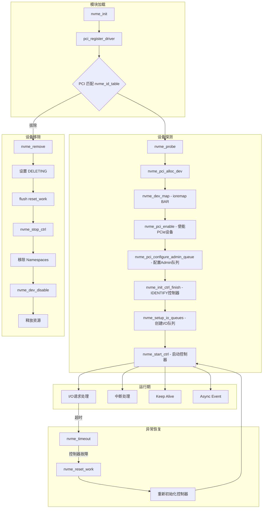
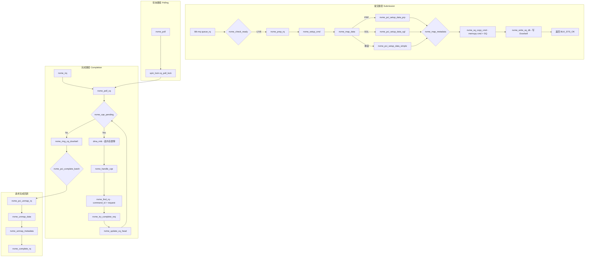
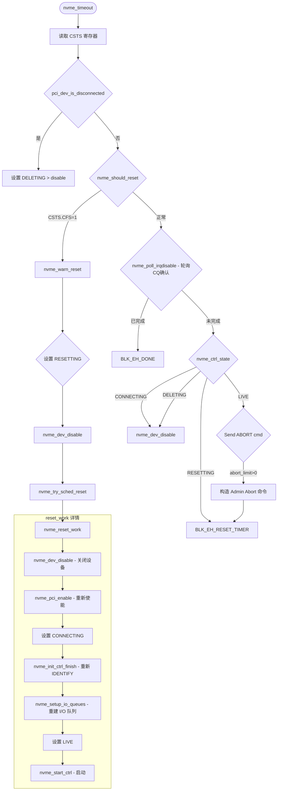
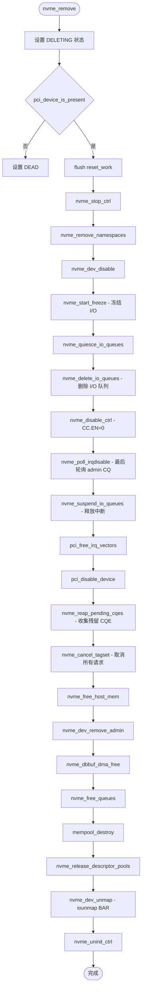

# NVMe PCIe Host 驱动分析文档

## 1. 概述

NVMe（Non-Volatile Memory Express）PCIe Host 驱动是 Linux 内核中用于管理 NVMe SSD 的核心驱动程序。该驱动位于 `drivers/nvme/host/pci.c`，采用 PCIe 总线协议与 NVMe 控制器通信。

### 代码架构分层

```
┌─────────────────────────────────────┐
│          Block Layer (blk-mq)       │  ← 通用块层
├─────────────────────────────────────┤
│    nvme-core (core.c / ioctl.c)     │  ← NVMe 协议核心层
├─────────────────────────────────────┤
│       nvme (pci.c - PCIe 驱动)       │  ← PCIe 传输层
├─────────────────────────────────────┤
│         PCIe 总线 / NVMe 控制器       │  ← 硬件
└─────────────────────────────────────┘
```

### 模块依赖

根据 Makefile 定义：
- **nvme-core.o**: core.o, ioctl.o, sysfs.o, pr.o 等核心功能
- **nvme.o**: pci.o（PCIe 传输层）
- 其他传输方式: rdma.o（RDMA）、fc.o（Fibre Channel）、tcp.o（TCP）

---

## 2. 核心数据结构

### 2.1 nvme_dev —— PCIe 设备结构体

```c
struct nvme_dev {
    struct nvme_queue *queues;           // 所有队列（admin + I/O）
    struct blk_mq_tag_set tagset;        // I/O 队列标签集
    struct blk_mq_tag_set admin_tagset;  // Admin 队列标签集
    u32 __iomem *dbs;                    // Doorbell 寄存器映射
    struct device *dev;                  // PCIe 设备
    unsigned online_queues;              // 在线队列数
    unsigned max_qid;                    // 最大队列 ID
    unsigned io_queues[HCTX_MAX_TYPES];  // 不同类型 I/O 队列数
    unsigned int num_vecs;               // 中断向量数
    u32 q_depth;                         // 队列深度
    int io_sqes;                         // I/O SQ Entry 大小(2^sqes)
    u32 db_stride;                       // Doorbell 步长
    void __iomem *bar;                   // BAR 映射地址
    unsigned long bar_mapped_size;       // BAR 映射大小
    struct mutex shutdown_lock;          // 关闭/复位锁
    bool subsystem;                      // 是否支持 NVM Subsystem Reset
    u64 cmb_size;                        // Controller Memory Buffer 大小
    bool cmb_use_sqes;                   // 使用 CMB 存放 SQ
    u32 cmbsz, cmbloc;                   // CMB 大小/位置寄存器值
    struct nvme_ctrl ctrl;               // 通用控制器（父类）
    u32 last_ps;                         // 上次电源状态
    bool hmb;                            // Host Memory Buffer 启用标志
    /* Shadow Doorbell Buffer */
    __le32 *dbbuf_dbs, *dbbuf_eis;      // Shadow Doorbell 缓冲区
    /* Host Memory Buffer */
    u64 host_mem_size;                   // HMB 大小
    struct nvme_host_mem_buf_desc *host_mem_descs;
    struct nvme_descriptor_pools descriptor_pools[];  // DMA 池（per-NUMA）
};
```

### 2.2 nvme_queue —— NVMe 队列结构体

每个队列由一个 Submission Queue (SQ) 和 Completion Queue (CQ) 组成：

```c
struct nvme_queue {
    struct nvme_dev *dev;                // 所属设备
    struct nvme_descriptor_pools pools;  // DMA 描述符池
    spinlock_t sq_lock;                  // SQ 自旋锁
    void *sq_cmds;                       // SQ 命令缓冲区（DMA 一致内存）
    struct nvme_completion *cqes;        // CQ 完成条目缓冲区（DMA 一致内存）
    dma_addr_t sq_dma_addr;              // SQ DMA 地址
    dma_addr_t cq_dma_addr;              // CQ DMA 地址
    u32 __iomem *q_db;                   // 队列 Doorbell 寄存器
    u32 q_depth;                         // 队列深度
    u16 cq_vector;                       // CQ 中断向量号
    u16 sq_tail, last_sq_tail;           // SQ 尾指针
    u16 cq_head;                         // CQ 头指针
    u16 qid;                             // 队列 ID（0=admin）
    u8 cq_phase;                         // CQ 阶段位（用于检测新完成项）
    u8 sqes;                            // SQ Entry 大小
    unsigned long flags;                 // 标志位
#define NVMEQ_ENABLED     0              // 队列已启用
#define NVMEQ_SQ_CMB      1              // SQ 位于 CMB
#define NVMEQ_DELETE_ERROR 2             // 删除出错
#define NVMEQ_POLLED       3             // 轮询队列（无中断）
};
```

### 2.3 nvme_iod —— I/O 请求描述符

```c
struct nvme_iod {
    struct nvme_request req;             // 请求基类
    struct nvme_command cmd;             // NVMe 命令
    u8 flags;                            // 标志位
    u8 nr_descriptors;                   // PRP/SGL 描述符数量
    size_t total_len;                    // 数据总长度
    struct dma_iova_state dma_state;     // DMA IOVA 状态
    void *descriptors[NVME_MAX_NR_DESCRIPTORS]; // PRP/SGL 描述符指针
    struct nvme_dma_vec *dma_vecs;       // DMA 向量数组
    unsigned int nr_dma_vecs;            // DMA 向量数
    dma_addr_t meta_dma;                 // 元数据 DMA 地址
    struct nvme_sgl_desc *meta_descriptor; // 元数据 SGL 描述符
};
```

### 2.4 nvme_ctrl —— 通用控制器（核心层）

位于 `nvme.h`，是 PCIe/RDMA/FC/TCP 各传输方式的统一抽象：

- **状态机**: `NEW → CONNECTING → LIVE ↔ RESETTING → DELETING → DEAD`
- **关键字段**: admin_q、tagset、cap、vs、oncs、oacs 等能力寄存器缓存
- **工作机制**: reset_work（复位工作项）、ka_work（Keep Alive）、scan_work（命名空间扫描）

---

## 3. NVMe 控制器状态机

```
                 ┌──────────┐
                 │   NEW    │  ← 初始分配
                 └────┬─────┘
                      │ nvme_init_ctrl_finish()
                      ▼
              ┌───────────────┐
         ┌────│  CONNECTING   │◄──────────────┐
         │    └───────┬───────┘               │
         │            │ 配置完成                │
         │            ▼                        │
         │    ┌───────────────┐                │
         │    │     LIVE      │    reset_work  │
         │    └───┬───┬───────┘  ─────────────┘
         │        │   │
         │        │   │ 异常/超时
         │        │   ▼
         │        │ ┌───────────────┐
         │        │ │  RESETTING    │── 重新使能设备 → CONNECTING → LIVE
         │        │ └───────────────┘
         │        │
         │        │ 删除/移除
         │        ▼
         │  ┌──────────────┐
         │  │   DELETING   │
         │  └──────┬───────┘
         │         │ Async Event 处理完毕
         │         ▼
         │  ┌──────────────────┐
         │  │ DELETING_NOIO    │
         │  └──────┬───────────┘
         │         │ Namespace 移除完成
         │         ▼
         │  ┌──────────────┐
         └──│     DEAD     │  ← 终态
            └──────────────┘
```

---

## 4. 关键流程分析

### 4.1 设备初始化流程 (nvme_probe)

```
nvme_probe(pdev, id)
│
├─ nvme_pci_alloc_dev()
│  ├─ 分配 nvme_dev (含 per-NUMA descriptor_pools)
│  ├─ INIT_WORK(&ctrl.reset_work, nvme_reset_work)
│  ├─ 分配 queues 数组 (nr_allocated_queues)
│  ├─ nvme_init_ctrl() → 设置状态为 NEW
│  │  ├─ 初始化 spinlock / srcu / workqueue
│  │  ├─ scan_work / async_event_work / ka_work 等
│  │  ├─ 分配 instance id (nvme0, nvme1...)
│  │  └─ 初始化 ctrl_device 字符设备
│  ├─ DMA mask 设置 (64bit / 48bit quirk)
│  └─ 设置 max_hw_sectors、max_segments
│
├─ nvme_add_ctrl() → 注册 ctrl_device
│
├─ nvme_dev_map()
│  ├─ pci_request_mem_regions()
│  └─ nvme_remap_bar() → ioremap BAR
│
├─ nvme_pci_alloc_iod_mempool()
│
├─ nvme_pci_enable()
│  ├─ pci_enable_device_mem()
│  ├─ pci_set_master()
│  ├─ pci_alloc_irq_vectors() (预分配 1 个向量)
│  ├─ 读取 CAP 寄存器: q_depth / db_stride
│  ├─ nvme_map_cmb() → 映射 Controller Memory Buffer
│  └─ nvme_pci_configure_admin_queue()
│     ├─ nvme_remap_bar() (扩展 BAR 映射)
│     ├─ nvme_disable_ctrl() → 关闭控制器
│     ├─ nvme_alloc_queue(0, NVME_AQ_DEPTH) → 分配 admin 队列
│     ├─ 写 AQA/ASQ/ACQ 寄存器
│     ├─ nvme_enable_ctrl() → 使能控制器
│     ├─ nvme_init_queue() → 初始化队列
│     └─ queue_request_irq() → 注册 admin 队列中断
│
├─ nvme_alloc_admin_tag_set() → 创建 admin blk-mq tagset
│
├─ 设置状态为 CONNECTING
│
├─ nvme_init_ctrl_finish()
│  ├─ 读取 VS 寄存器
│  ├─ nvme_init_identify() → 发送 IDENTIFY 命令
│  │  ├─ ADMIN: 获取控制器属性 (onncs, oacs, sqsize 等)
│  │  └─ NAMESPACE: 扫描命名空间
│  ├─ nvme_configure_apst()
│  └─ nvme_configure_timestamp()
│
├─ nvme_dbbuf_dma_alloc() → 分配 Shadow Doorbell 缓冲区
├─ nvme_setup_host_mem() → 分配 Host Memory Buffer (可选)
├─ nvme_setup_io_queues()
│  ├─ nvme_set_queue_count() → 协商 I/O 队列数
│  ├─ nvme_setup_irqs() → 分配 MSI/MSI-X 中断
│  │  ├─ nvme_calc_irq_sets() → 计算 default/read/poll 队列分布
│  │  └─ pci_alloc_irq_vectors_affinity()
│  └─ nvme_create_io_queues()
│     ├─ nvme_alloc_queue() → 分配 SQ/CQ DMA 缓冲区
│     └─ nvme_create_queue() (循环)
│        ├─ adapter_alloc_cq() → admin 命令创建 CQ
│        ├─ adapter_alloc_sq() → admin 命令创建 SQ
│        ├─ nvme_init_queue()
│        ├─ queue_request_irq() → 注册中断
│        └─ 设置 NVMEQ_ENABLED
│
├─ nvme_alloc_io_tag_set() → 创建 I/O blk-mq tagset
├─ nvme_dbbuf_set() → 通知控制器 Shadow Doorbell 地址
├─ 设置状态为 LIVE
├─ nvme_start_ctrl()
│  ├─ nvme_enable_aen() → 注册异步事件通知
│  ├─ nvme_queue_scan() → 扫描命名空间
│  └─ nvme_unquiesce_io_queues()
└─ flush_work(&scan_work) → 等待扫描完成
```

### 4.2 I/O 请求提交流程

```
nvme_queue_rq(hctx, bd)
│
├─ 检查 NVMEQ_ENABLED 状态
├─ nvme_check_ready() → 检查控制器状态是否为 LIVE
│
├─ nvme_prep_rq()
│  ├─ nvme_setup_cmd() → 构造 NVMe 命令 (core 层)
│  ├─ nvme_map_data() → DMA 映射数据缓冲区
│  │  ├─ nvme_pci_setup_data_simple() — 单段快速路径
│  │  ├─ nvme_pci_setup_data_prp() — PRP 列表方式
│  │  └─ nvme_pci_setup_data_sgl() — SGL 方式
│  └─ nvme_map_metadata() → DMA 映射元数据(保护信息)
│
├─ spin_lock(&sq_lock)
├─ nvme_sq_copy_cmd() → memcpy 命令到 SQ
├─ nvme_write_sq_db() → 写 Doorbell 通知控制器
└─ spin_unlock(&sq_lock)

// 批处理路径 (多个请求)
nvme_queue_rqs(rqlist)
├─ 遍历请求，根据 nvmeq 分组
├─ nvme_prep_rq_batch() → 准备每个请求
├─ nvme_submit_cmds() → 批量提交到同一个队列
│  ├─ 循环 nvme_sq_copy_cmd()
│  └─ 最后 nvme_write_sq_db(true)
└─ 将失败的请求放入 requeue_list
```

### 4.3 中断完成流程

```
nvme_irq(irq, data)
│
└─ nvme_poll_cq(nvmeq, &iob)
   │
   ├─ while (nvme_cqe_pending())  → 检查 CQ 阶段位
   │  ├─ dma_rmb()               → DMA 读内存屏障
   │  ├─ nvme_handle_cqe()
   │  │  ├─ nvme_complete_async_event() — AEN 特殊处理
   │  │  └─ nvme_find_rq() → 根据 command_id 找到 request
   │  │     └─ nvme_try_complete_req()
   │  │        ├─ 设置 status / result
   │  │        └─ blk_mq_complete_request_remote()
   │  └─ nvme_update_cq_head()
   │
   └─ nvme_ring_cq_doorbell() → 写 CQ Doorbell (通知控制器释放 CQE)
```

### 4.4 控制器复位流程 (nvme_reset_work)

```
nvme_reset_work(work)
│
├─ nvme_dev_disable(dev, false)
│  ├─ nvme_start_freeze() → 冻结 I/O
│  ├─ nvme_quiesce_io_queues()
│  ├─ nvme_delete_io_queues() → 删除 I/O 队列 (admin cmd)
│  │  ├─ __nvme_delete_io_queues(SQ) → 逐个删除
│  │  └─ __nvme_delete_io_queues(CQ) → 逐个删除
│  ├─ nvme_disable_ctrl() → 设置 CC.EN=0
│  ├─ nvme_suspend_io_queues() → 挂起队列 + 释放中断
│  ├─ pci_free_irq_vectors()
│  └─ pci_disable_device()
│
├─ nvme_pci_enable() → 重新使能 PCIe 设备
├─ 设置状态 CONNECTING
├─ nvme_init_ctrl_finish() → 重新初始化
├─ nvme_dbbuf_dma_alloc() / nvme_setup_host_mem()
├─ nvme_setup_io_queues() → 重新创建 I/O 队列
├─ nvme_dbbuf_set() / nvme_unquiesce_io_queues()
├─ nvme_pci_update_nr_queues()
│  └─ blk_mq_update_nr_hw_queues()
├─ 设置状态 LIVE
└─ nvme_start_ctrl()
```

### 4.5 超时处理 (nvme_timeout)

```
nvme_timeout(req)
│
├─ 检查 PCIe 设备是否断开 → 设置 DELETING 状态
├─ 检查是否处于终态 → 直接 disable
├─ 检查 CSTS.CFS / NSSRO → 控制器故障，触发 reset
├─ 轮询 CQ（防止假中断丢失）
│  ├─ poll 队列: nvme_poll()
│  └─ 中断队列: nvme_poll_irqdisable() → disable_irq + poll + enable_irq
├─ 如果请求已完成 → 返回 BLK_EH_DONE
│
├─ 根据控制器状态处理:
│  ├─ CONNECTING/DELETING → 标记 CANCELLED + disable
│  ├─ RESETTING → 返回 BLK_EH_RESET_TIMER
│  └─ LIVE → 发送 ABORT 命令
│     ├─ atomic_dec(&abort_limit)
│     ├─ 构造 nvme_admin_abort_cmd
│     ├─ blk_execute_rq_nowait(abort_req)
│     └─ 返回 BLK_EH_RESET_TIMER
│
└─ 若需要 reset:
   ├─ 设置 RESETTING 状态
   ├─ nvme_dev_disable()
   └─ nvme_try_sched_reset() → schedule reset_work
```

---

## 5. 关键特性

### 5.1 PRP 与 SGL 数据描述方式

NVMe 支持两种描述数据传输方式：

| 特性 | PRP (Physical Region Page) | SGL (Scatter Gather List) |
|------|---------------------------|---------------------------|
| 描述格式 | PRP1 + PRP2，PRP2 可为链表 | SGL 段描述符链表 |
| 适用场景 | 传统方式，所有控制器支持 | 较新控制器，支持非对齐传输 |
| 切换阈值 | 默认 32KB 以下倾向 PRP | 大于等于 sgl_threshold 时用 SGL |
| 页面间隙 | 不支持 | 支持 |

判断入口：`nvme_pci_use_sgls()`：
- 如果 `req_phys_gap_mask()` 检测到页面间隙 → 强制 SGL
- 如果是用户命令（passthrough）→ 强制 SGL
- 如果平均段大小 >= sgl_threshold → 使用 SGL

### 5.2 Shadow Doorbell Buffer (SDBB)

NVMe 1.3+ 可选特性，通过主机内存中的影子门铃减少 MMIO 写操作：

```
初始化: nvme_dbbuf_dma_alloc() → 分配 DMA 一致内存
配置:   nvme_dbbuf_set() → admin 命令设置主机地址
运行:   nvme_dbbuf_update_and_check_event()
        1. wmb() + 写影子门铃
        2. mb() + 读取事件索引
        3. 如果不需要触发中断 → 跳过 MMIO
        4. 否则 writel() → 写实际门铃寄存器
```

### 5.3 Controller Memory Buffer (CMB)

NVMe 1.2+ 特性，控制器提供片上内存用于存放 SQ 条目：

- 检测: `nvme_map_cmb()` → 读取 CMBSZ/CMBLOC 寄存器
- 使用: `nvme_alloc_sq_cmds()` → 优先从 CMB 分配 SQ
- 条件: `use_cmb_sqes` 模块参数控制（默认开启）

### 5.4 Host Memory Buffer (HMB)

NVMe 1.2+ 特性，主机分配内存给控制器加速：

- 分配策略: `nvme_alloc_host_mem()` → 从大到小尝试
- 单段: IOMMU 合并支持时使用 dma_alloc_noncontiguous
- 多段: 按 chunk_size 分段分配，每段不超过 MAX_ORDER
- 模块参数: `max_host_mem_size_mb = 128`（默认上限）

### 5.5 中断与队列映射

```
队列类型:
├─ HCTX_TYPE_DEFAULT — 默认读写队列
├─ HCTX_TYPE_READ   — 专用读队列（可选）
└─ HCTX_TYPE_POLL   — 轮询队列（无中断）

中断分配:
├─ nvme_setup_irqs()
│  ├─ pre_vectors = 1 (admin 队列固定占用向量 0)
│  ├─ nvme_calc_irq_sets() 回调
│  └─ pci_alloc_irq_vectors_affinity()
│
└─ 队列创建时:
   ├─ 中断队列: vector = qid (num_vecs > 1)
   └─ poll 队列: 设置 NVMEQ_POLLED，不注册中断
```

### 5.6 硬件 quirk 机制

驱动通过 `nvme_id_table` 中的 `driver_data` 字段为不同设备启用 workaround：

| Quirk 标志 | 问题描述 |
|-----------|---------|
| NVME_QUIRK_STRIPE_SIZE | 需要对齐 stripe size |
| NVME_QUIRK_DELAY_BEFORE_CHK_RDY | 检查 RDY 前需要延迟 |
| NVME_QUIRK_NO_APST | 禁用自动电源状态转换 |
| NVME_QUIRK_SINGLE_VECTOR | 所有队列共享一个向量 |
| NVME_QUIRK_BROKEN_MSI | MSI 中断不工作，只使用 INTx |
| NVME_QUIRK_DISABLE_WRITE_ZEROES | Write Zeroes 命令有问题 |
| NVME_QUIRK_BOGUS_NID | 命名空间标识符错误 |

---

## 6. 整体流程图

### 6.1 驱动生命周期总图



### 6.2 初始化流程详细图

```mermaid
graph TB
    START([PCI Probe]) --> ALLOC[nvme_pci_alloc_dev]
    ALLOC --> INIT_CTRL[nvme_init_ctrl - 状态: NEW]
    INIT_CTRL --> ADD_CTRL[nvme_add_ctrl]
    ADD_CTRL --> MAP[nvme_dev_map - pci_request_mem_regions]
    MAP --> ENABLE[nvme_pci_enable]
    
    ENABLE --> READ_CAP[读取 CAP 寄存器]
    READ_CAP --> CMB[nvme_map_cmb - 映射 CMB]
    CMB --> CONF_ADMIN[nvme_pci_configure_admin_queue]
    
    CONF_ADMIN --> DISABLE_CTRL[nvme_disable_ctrl - CC.EN=0]
    DISABLE_CTRL --> ALLOC_ADMINQ[nvme_alloc_queue - 分配 Admin SQ/CQ]
    ALLOC_ADMINQ --> WRITE_REG[写 AQA/ASQ/ACQ 寄存器]
    WRITE_REG --> ENABLE_CTRL[nvme_enable_ctrl - CC.EN=1]
    ENABLE_CTRL --> INIT_ADMINQ[nvme_init_queue]
    INIT_ADMINQ --> REQ_IRQ[queue_request_irq - 注册中断]
    REQ_IRQ --> TAG_ADMIN[nvme_alloc_admin_tag_set]
    
    TAG_ADMIN --> STATE_CONN[设置状态: CONNECTING]
    STATE_CONN --> FINISH[nvme_init_ctrl_finish]
    
    FINISH --> IDENTIFY[nvme_init_identify]
    IDENTIFY --> ID_ADMIN[Admin IDENTIFY - 读取控制器能力]
    ID_ADMIN --> ID_NS[Namespace IDENTIFY - 扫描命名空间]
    ID_NS --> APST[nvme_configure_apst]
    APST --> DBBUF[nvme_dbbuf_dma_alloc]
    DBBUF --> HMB[nvme_setup_host_mem]
    
    HMB --> SETUP_IO[nvme_setup_io_queues]
    SETUP_IO --> SET_QCNT[nvme_set_queue_count - 协商队列数]
    SET_QCNT --> SETUP_IRQ[nvme_setup_irqs - 分配中断向量]
    SETUP_IRQ --> CREATE_Q[nvme_create_io_queues]
    CREATE_Q --> ALLOC_IO[nvme_alloc_queue - 分配SQ/CQ]
    ALLOC_IO --> ALLOC_CQ[adapter_alloc_cq - Admin cmd: 创建CQ]
    ALLOC_CQ --> ALLOC_SQ[adapter_alloc_sq - Admin cmd: 创建SQ]
    ALLOC_SQ --> INIT_IOQ[nvme_init_queue]
    INIT_IOQ --> REQ_IRQ2[queue_request_irq]
    REQ_IRQ2 --> TAG_IO[nvme_alloc_io_tag_set]
    
    TAG_IO --> DBBUF_SET[nvme_dbbuf_set - 配置 Shadow Doorbell]
    DBBUF_SET --> STATE_LIVE[设置状态: LIVE]
    STATE_LIVE --> START_CTRL[nvme_start_ctrl]
    START_CTRL --> AEN[nvme_enable_aen]
    AEN --> SCAN[nvme_queue_scan - 扫描 Namespace]
    SCAN --> DONE([设备就绪])
```



### 6.3 I/O 提交与完成流程



### 6.4 超时处理与复位流程



### 6.5 设备移除流程



---

## 7. 文件清单

| 文件 | 说明 |
|------|------|
| `drivers/nvme/host/pci.c` | PCIe 传输层主文件 (4307 行) |
| `drivers/nvme/host/nvme.h` | 通用头文件，控制器/命名空间/请求结构体定义 |
| `drivers/nvme/host/core.c` | 核心协议层，IDENTIFY/状态机/Keep Alive 等 |
| `drivers/nvme/host/ioctl.c` | 用户态 ioctl/uring_cmd 接口 |
| `drivers/nvme/host/sysfs.c` | sysfs 属性接口 |
| `drivers/nvme/host/multipath.c` | 多路径支持 (ANA) |
| `drivers/nvme/host/fabrics.c` | Fabrics 传输层共享代码 |
| `drivers/nvme/host/pr.c` | 持久性预留 (Persistent Reservation) |
| `drivers/nvme/host/zns.c` | Zoned Namespace 支持 |
| `drivers/nvme/host/hwmon.c` | 硬件监控接口 |
| `drivers/nvme/host/trace.c` | ftrace 追踪点 |
| `drivers/nvme/host/auth.c` | DHCHAP 认证 (主机端) |
| `drivers/nvme/host/constants.c` | NVMe 状态码/操作码字符串 |
| `drivers/nvme/host/fault_inject.c` | 故障注入调试 |
| `drivers/nvme/host/trace.h` | 追踪事件头文件 |
| `drivers/nvme/host/fabrics.h` | Fabrics 传输头文件 |
