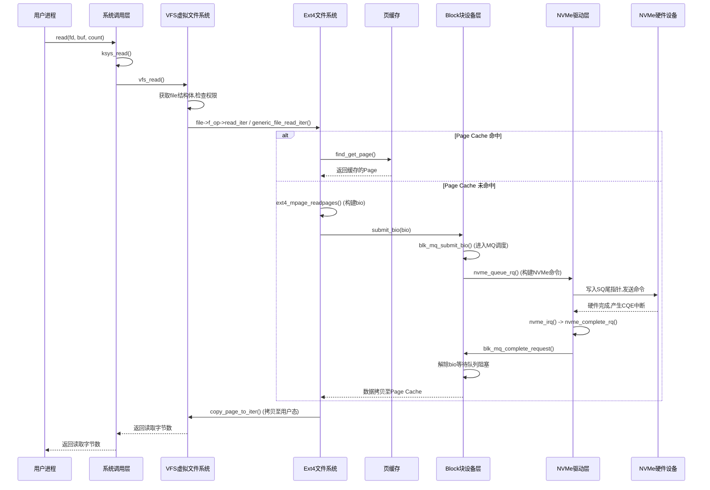

# Linux `read` 系统调用完整流程解析：从 VFS 到 NVMe 驱动

本文将从 `/home/louis/code/linux/fs/read_write.c` 中的 `ksys_read` 函数开始，详细梳理一个 `read` 系统调用如何穿透 VFS 层、Ext4 文件系统层、Block 块设备层，最终到达 NVMe 驱动层发送命令，并在数据读取完成后返回给用户进程的完整生命周期。

---

## 一、 整体架构流程图

以下是 `read` 系统调用从用户态发起，到内核态处理，再返回数据的完整流程图：



---

## 二、 详细流程梳理

### 1. 系统调用层与 VFS 层入口

当用户态进程调用 `read(fd, buf, count)` 时，通过软中断（如 `int 0x80` 或 `syscall` 指令）进入内核，最终调用到 `ksys_read`。

**代码路径：`/home/louis/code/linux/fs/read_write.c`**

```c
ssize_t ksys_read(unsigned int fd, char __user *buf, size_t count)
{
    struct fd f = fdget_pos(fd);
    ssize_t ret = -EBADF;

    if (f.file) {
        loff_t pos = file_pos_read(f.file);
        ret = vfs_read(f.file, buf, count, &pos);
        if (ret >= 0)
            file_pos_write(f.file, pos);
        fdput_pos(f);
    }
    return ret;
}
```

**VFS 层处理 (`vfs_read`)：**
1. 通过 `fdget_pos` 获取当前进程的 `fdtable`，进而找到对应的 `struct file` 结构体。
2. 检查文件模式、权限（如 `FMODE_READ`）。
3. 调用 `vfs_read`，如果 `file->f_op->read` 存在（老式驱动），则调用它；否则调用 `new_sync_read`，最终调用 `file->f_op->read_iter`。现代文件系统（包括 ext4）均采用 `read_iter` 接口。

---

### 2. VFS 到 Ext4 文件系统层

Ext4 在注册时，会将 `ext4_file_operations` 赋给 `file->f_op`。

**代码路径：`fs/ext4/file.c`**
```c
const struct file_operations ext4_file_operations = {
    .read_iter  = ext4_file_read_iter,
    // ...
};
```

**流程：**
1. `vfs_read` 调用 `ext4_file_read_iter`。
2. `ext4_file_read_iter` 进行一些 ext4 特有的检查（如是否加密文件、是否为 inline data），然后调用 VFS 的通用读函数 `generic_file_read_iter`。
3. `generic_file_read_iter` 最终调用 `generic_file_buffered_read`，这是页缓存的通用处理逻辑。

---

### 3. 页缓存 与 Ext4 的交互

`generic_file_buffered_read` 的核心逻辑是查找 Page Cache：
- **命中**：如果数据已经在内存中，直接通过 `copy_page_to_iter` 将数据拷贝到用户态的 `buf` 中，流程结束。
- **未命中**：分配新的 Page，并调用 `mapping->a_ops->readpage` 或 `readpages` 从磁盘读取数据。

Ext4 的地址空间操作集为 `ext4_aops`：
**代码路径：`fs/ext4/inode.c`**
```c
static const struct address_space_operations ext4_aops = {
    .readpage       = ext4_readpage,
    .readpages      = ext4_readpages,
    // ...
};
```

**Ext4 构建读请求：**
1. VFS 调用 `ext4_readpages`（现代内核倾向于调用 `readpages` 批量读）。
2. `ext4_readpages` 调用 `ext4_mpage_readpages`。
3. `ext4_mpage_readpages` 的核心工作是：将逻辑文件偏移量转换为磁盘的物理块号，并构建内核的 I/O 请求结构体 `struct bio`。

---

### 4. Block 块设备层

Ext4 将构建好的 `bio` 提交给 Block 层。

**代码调用链：**
`ext4_mpage_readpages` -> `submit_bio` -> `submit_bio_noacct` -> `blk_mq_submit_bio`

**Block 层的职责：**
1. **合并与排序**：将 `bio` 与电梯队列中的请求合并（如果物理地址相邻）。
2. **分配请求**：将 `bio` 封装为 `struct request`（代表一个具体的块设备指令）。
3. **软件队列排队**：将 `request` 放入对应的软件队列（硬件上下文）。
4. **硬件队列映射**：通过哈希映射，将请求导向特定的 NVMe 硬件队列 `struct blk_mq_hw_ctx`。
5. **触发执行**：调用 `blk_mq_run_hw_queue`，最终调用 `q->mq_ops->queue_rq`，即 NVMe 驱动注册的回调函数。

---

### 5. NVMe 驱动层与命令发送

NVMe 驱动在初始化时注册了 `nvme_mq_ops`：
**代码路径：`drivers/nvme/host/pci.c` (或 core.c)**
```c
static const struct blk_mq_ops nvme_mq_ops = {
    .queue_rq     = nvme_queue_rq,
    // ...
};
```

**NVMe 发送命令过程：**
1. Block 层调用 `nvme_queue_rq`。
2. 驱动从 NVMe 的 Submission Queue (SQ) 中获取一个空槽位。
3. 驱动将 `request` 转换为 NVMe 规范定义的 `struct nvme_command`（填写 Opcode 为 `nvme_cmd_read`，PRP1/PRP2 指向物理内存地址等）。
4. 将命令写入 SQ，并更新 SQ 的尾指针（SQ Tail Doorbell 寄存器），**这一步触发了硬件开始工作**。

---

### 6. 硬件执行与中断返回

**数据读取与中断：**
1. NVMe 控制器看到 SQ 有新命令，通过 DMA 引擎直接将磁盘数据读取到命令中 PRP 指向的物理内存（即 Page Cache 对应的物理页）。
2. 读取完成后，控制器将完成信息写入 Completion Queue (CQ)，并触发 MSI-X 中断。

**中断处理与数据返回：**
1. CPU 响应中断，进入 `nvme_irq` -> `nvme_complete_rq`。
2. 驱动从 CQ 中获取完成状态，通过 `blk_mq_complete_request` 将完成事件上报给 Block 层。
3. Block 层调用 `bio_endio`，唤醒之前阻塞在等待 Page Cache I/O 完成的进程（在 `generic_file_buffered_read` 中等待的 `wait_on_page_locked_killable`）。
4. 此时，数据已经从 NVMe 磁盘通过 DMA 拷贝到了 Page Cache 中。

---

### 7. 数据拷贝回用户空间与系统调用返回

1. Page Cache 的 I/O 状态被标记为 Uptodate（数据有效）且解锁。
2. 进程被唤醒，从睡眠中恢复执行。
3. `generic_file_buffered_read` 继续执行 `copy_page_to_iter`，通过 CPU 指令将 Page Cache 中的数据**拷贝到用户态的 `buf` 中**。
4. 更新 `struct file` 中的文件偏移量 `f_pos`。
5. 沿着调用栈原路返回：`ext4_file_read_iter` -> `vfs_read` -> `ksys_read`。
6. `ksys_read` 将读取的字节数作为返回值，通过系统调用出口返回给用户态进程。

至此，一次完整的 `read` 系统调用流程结束。

---

## 三、 核心数据结构流转总结

| 阶段 | 核心数据结构 | 作用 |
| :--- | :--- | :--- |
| **VFS层** | `struct file` | 代表进程打开的文件实例，包含偏移量、操作集 |
| **VFS层** | `struct address_space` | 管理文件的 Page Cache，连接 inode 和物理页 |
| **Ext4层** | `struct bio` | 描述一个块 I/O 请求，包含磁盘扇区号和内存页向量 |
| **Block层** | `struct request` | 封装 bio，包含硬件队列状态、调度信息 |
| **NVMe层** | `struct nvme_command` | 符合 NVMe 规范的硬件命令格式 |
| **NVMe层** | SQ / CQ | 驱动与硬件通信的环形缓冲区 |

**总结：** 
Linux 的 I/O 栈是一个高度分层的架构。VFS 提供了统一的抽象，Ext4 负责文件逻辑到磁盘逻辑的映射，Block 层负责 I/O 调度和多队列管理，NVMe 驱动负责将抽象请求转化为具体的硬件协议。数据流动的核心是 **"先到 Page Cache，缺页则构建 bio 交由底层 DMA 读取，读回后唤醒进程并拷贝至用户态"**。