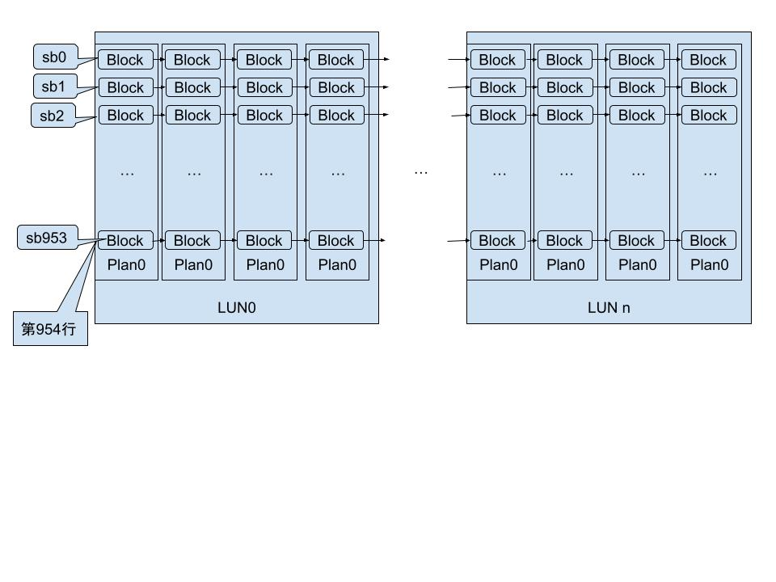
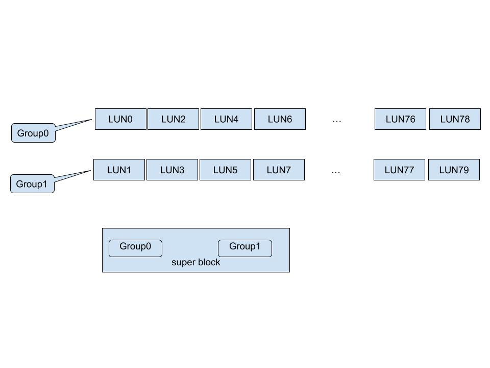
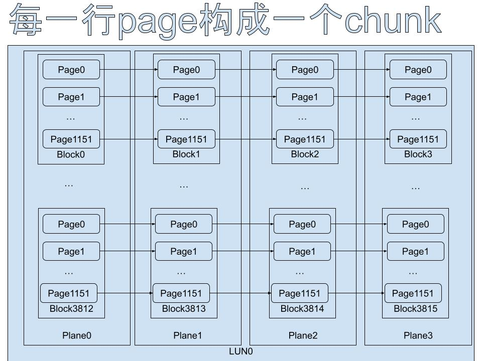
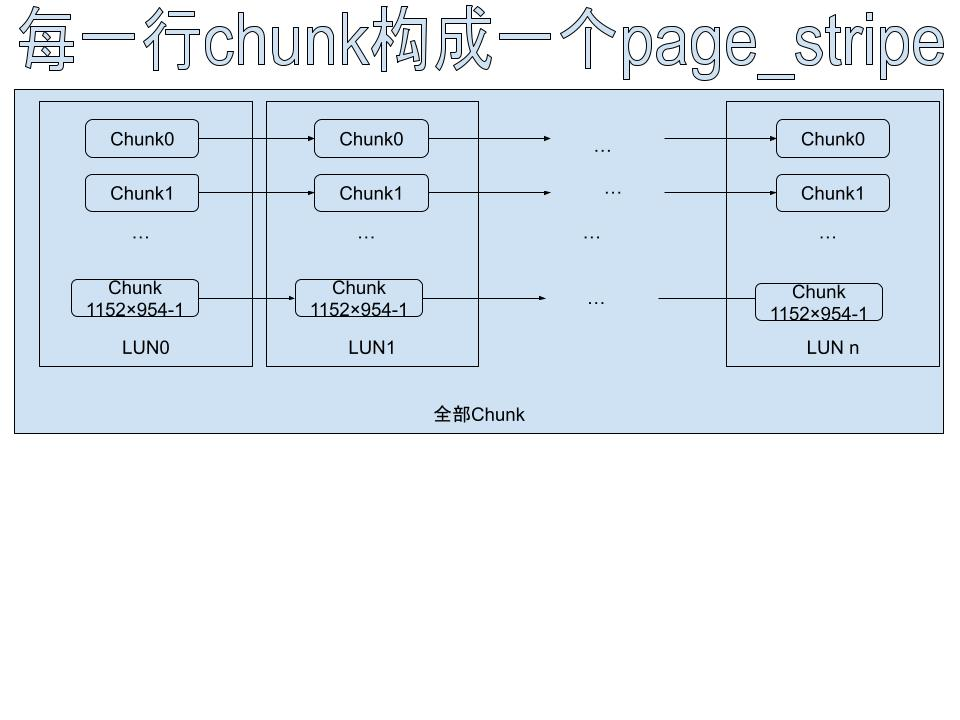
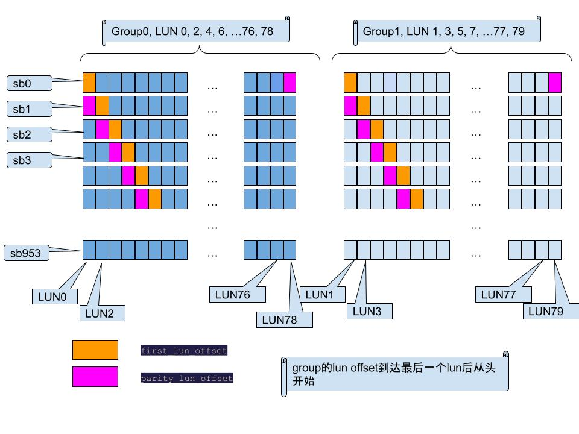

### linux-venice
芯片: SM8266  
channel个数: 16  
> 一个channel是一组IO等信号线

lun个数: 80  
每个channel的lun个数: 5  
每个lun的plane个数: 4  
sector大小: 4K  
> sector是驱动定义的, nand没有这个概念, sector地址需要转成page地址才能发送给nand

每个page的sector个数: 4  
每个block的page个数: 1152  
每个lun的block个数: 3816  
每个plane的block数量: 954  
super block数量: 954 
> sb数量和plane的block数量保持一致, 所有plane的相同编号的block组成一个sb  
sb_header: super block的第一个lun的chunk0, 第一个lun是group0的first_lun_offset  
head_index: stream编号, 一共两个stream

芯片backend: 2  
> 每个backend管理一半的lun  

group数量: 2  
> 两个backend管理的lun奇偶交叉编号, 划分成两个group, 一个group占一个backend一半的lun, 一个sb包含两个group  
> 

wordline数量: 384  
> 1. TLC模式, 每个wordline包含3个page, page连续编号,LSB,CSB,MSB;
> 2. 在SLC模式下, 每个wordline一个page,顺序编号

chunk: 一个lun内plane中相同编号的page组成一个chunk  

page_stripe: 每个lun的相同编号的chunk组成一个page_stripe  

parity lun: group中的一个lun, 不存放数据, 存放该group的异或值, 如果其中一个lun损坏, 可用来恢复数据  
parity_lun_offset: super block中group该parity lun的编号  
first_lun_offset: super block中group第一个lun编号  

epilog: 包含epilog_head和索引表, 表项索引为物理地址, 条目内容包含LBA  

cold_index/hot_index: 关联open_head, 一般情况下用户写数据用hot_index, gc使用cold_index