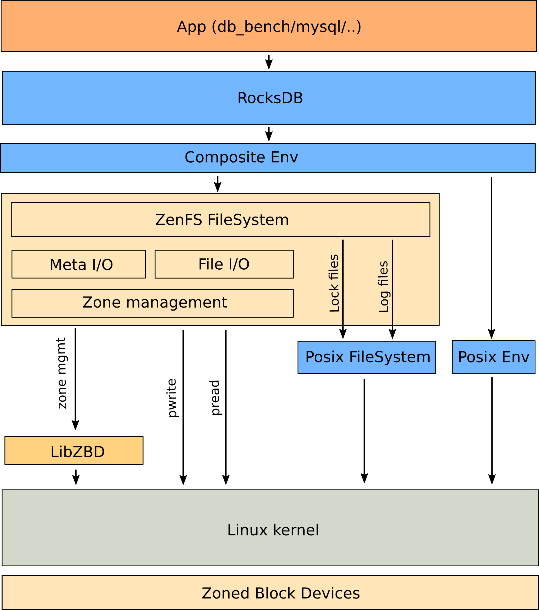

# zenfs
## 架构

ZenFS 实现 FileSystem API，并将所有数据文件存储到原始分区块设备上。日志和锁定文件存储在可配置目录下的默认文件系统中。区域管理通过 libzbd 完成，ZenFS io 通过正常的 pread/pwrite 调用完成。

## 文件系统实现
文件被映射到一组extent：
1. extent是块设备上的块对齐的连续区域
2. extent不跨越zone
3. 一个zone可能包含多个extent
4. 来自不同文件的extent可能共享zone

## 垃圾收集
ZenFS 在当前的实现状态下异常懒惰，并且不进行任何垃圾收集。随着文件被删除，已用容量zone计数器会下降，当它达到零时，可以重置和重复使用zone。

## 元数据
元数据存储在块设备的第一个zone的滚动日志中。
每个有效的元数据区包含：
1. 具有当前序列号和全局文件系统元数据的超级块
2. 文件系统中所有文件的至少一个快照
3. 增量文件系统更新（新文件、新扩展、删除、重命名等）