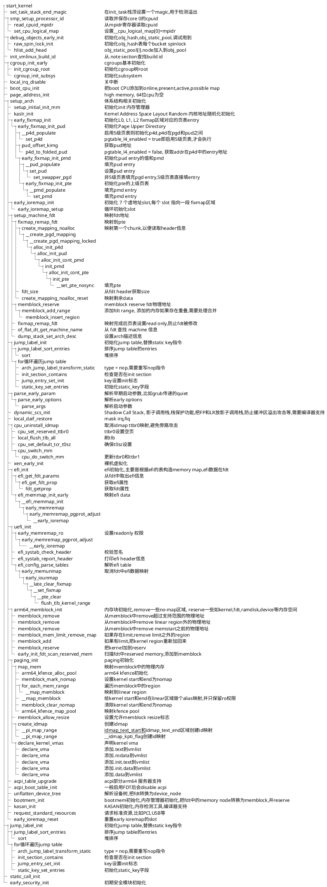

# start_kernel流程

## start kernel流程概览

由head.S跳转到start_kernel函数开始执行内核初始化流程：

```plantuml
@startsalt
{
{T
+ start_kernel
++ set_task_stack_end_magic     | 在init_task栈顶设置一个magic,用于检测溢出
++ smp_setup_processor_id       | 读取并保存core 0的cpuid
+++ read_cpuid_mpidr             | 从mpidr寄存器读取cpuid
+++ set_cpu_logical_map          | 设置__cpu_logical_map[0]=mpidr
++ debug_objects_early_init     | 初始化obj_hash,obj_static_pool,调试用到
+++ raw_spin_lock_init           | 初始化obj_hash表每个bucket spinlock
+++ hlist_add_head               | obj_static_pool[i].node加入到obj_pool
++ init_vmlinux_build_id         | 从.note section查找build id
++ cgroup_init_early            | cgroups基本初始化
+++ init_cgroup_root             | 初始化cgroup树root
+++ cgroup_init_subsys           | 初始化subsystem
++ local_irq_disable            | 关中断
++ boot_cpu_init                | 把boot CPU添加到online,present,active,possible map
++ page_address_init            | high memory, 64位cpu为空
++ setup_arch                   | 体系结构相关初始化
+++ setup_initial_init_mm       | 初始化init 内存管理器
+++ kaslr_init                  | Kernel Address Space Layout Random 内核地址随机化初始化
+++ early_fixmap_init           | 初始化L0, L1, L2 fixmap区域对应的页表entry
++++ early_fixmap_init_pud       | 初始化Page Upper Directory
+++++ __p4d_populate             | 启用5级页表则初始化p4d,p4d在pgd和pud之间
++++++ set_p4d                    | pgtable_l4_enabled = true即启用5级页表,才会执行
+++++ pud_offset_kimg            | 获取pud地址
++++++ p4d_to_folded_pud         | pgtable_l4_enabled = false, 获取addr在p4d中的entry地址
+++++ early_fixmap_init_pmd       | 初始化pud entry的值和pmd
++++++ __pud_populate            | 填充pud entry
+++++++ set_pud                   | 设置pud entry
++++++++ set_swapper_pgd        | 非5级页表填充pgd entry,5级页表直接填entry
++++++ early_fixmap_init_pte      | 初始化pte的上级页表
+++++++ __pmd_populate          | 填充pmd entry
++++++++ set_pmd                | 填充pmd entry
+++ early_ioremap_init          | 初始化 7 个虚地址slot,每个 slot 指向一段 fixmap区域
++++ early_ioremap_setup         | 循环初始化slot
+++ setup_machine_fdt           | 映射fdt地址
++++ fixmap_remap_fdt             | 映射到pte
+++++ create_mapping_noalloc      | 映射第一个chunk,以便读取header信息
++++++ __create_pgd_mapping
+++++++__create_pgd_mapping_locked
++++++++ alloc_init_p4d
+++++++++ alloc_init_pud
++++++++++ alloc_init_cont_pmd
+++++++++++ init_pmd
++++++++++++ alloc_init_cont_pte
+++++++++++++ init_pte
++++++++++++++ __set_pte_nosync  | 填充pte
+++++ fdt_size                   | 从fdt header获取size
+++++ create_mapping_noalloc_reset| 映射剩余data
++++ memblock_reserve            | memblock reserve fdt物理地址
+++++ memblock_add_range          | 添加fdt range, 添加的内存如果存在重叠,需要处理合并
++++++ memblock_insert_region
++++ fixmap_remap_fdt              | 映射完成后页表设置read only,防止fdt被修改
++++ of_flat_dt_get_machine_name | 从 fdt 查找 machine 信息
++++ dump_stack_set_arch_desc    | 设置arch描述信息
+++ jump_label_init             | 初始化jump table,替换static key指令
++++ jump_label_sort_entries      | 排序jump table的entries
+++++ sort                       | 堆排序
++++ for循环遍历jump table
+++++ arch_jump_label_transform_static| type = nop,需要重写nop指令
+++++ init_section_contains        | 检查是否在init section
+++++ jump_entry_set_init         | key设置init标志
+++++ static_key_set_entries       | 初始化static_key字段
+++ parse_early_param           | 解析早期启动参数,比如grub传递的quiet
++++ parse_early_options        | 解析early options
+++++ parse_args                 | 解析启动参数
+++ dynamic_scs_init            | Shadow Call Stack, 影子调用栈,栈保护功能,把FP和LR放影子调用栈,防止缓冲区溢出攻击等,需要编译器支持
+++ local_daif_restore          | mask irq,fiq
+++ cpu_uninstall_idmap         | 取消idmap ttbr0映射,避免旁路攻击
++++ cpu_set_reserved_ttbr0      | ttbr0设置空页
++++ local_flush_tlb_all         | 刷tlb
++++ cpu_set_default_tcr_t0sz    | 确保t0sz设置
++++ cpu_switch_mm
+++++ cpu_do_switch_mm           | 更新ttbr0和ttbr1
+++ xen_early_init              | 裸机虚拟化
+++ efi_init                    | efi初始化,主要是根据efi的表构造memory map,efi数据在fdt
++++ efi_get_fdt_params          | 从fdt中取出efi信息
+++++ efi_get_fdt_prop            | 获取efi属性
++++++ fdt_getprop                | 获取fdt属性
++++ efi_memmap_init_early       | 映射efi data
+++++ __efi_memmap_init
++++++ early_memremap
+++++++ early_memremap_pgprot_adjust
++++++++ __early_ioremap
+++ uefi_init
++++ early_memremap_ro           | 设置readonly 权限
+++++ early_memremap_pgprot_adjust
+++++++ __early_ioremap
++++ efi_systab_check_header     | 校验签名
++++ efi_systab_report_header    | 打印efi header信息
++++ efi_config_parse_tables     | 解析efi table
+++++ early_memunmap             | 取消fdt中efi数据映射
++++++ early_iounmap
+++++++ __late_clear_fixmap
++++++++ __set_fixmap
+++++++++ __pte_clear
++++++++++ flush_tlb_kernel_range
+++ arm64_memblock_init         | 内存块初始化,remove一些no-map区域, reserve一些如kernel,fdt,ramdisk,device等内存空间
++++ memblock_remove  | 从memblock中remove超过支持范围的物理地址
++++ memblock_remove  | 从memblock中remove linear region外的物理地址
++++ memblock_remove | 从memblock中remove memstart之前的物理地址
++++ memblock_mem_limit_remove_map | 如果存在limit,remove limit之外的region
++++ memblock_add | 如果有limit,把kernel region重新加回来
++++ memblock_reserve | 把kernel加到reserv
++++ early_init_fdt_scan_reserved_mem | 扫描fdt中reserved memory,添加到memblock
+++ paging_init                 | paging初始化
++++ map_mem                    | 映射memblock中的物理内存
+++++ arm64_kfence_alloc_pool    | arm64 kfence初始化
+++++ memblock_mark_nomap        | 设置kernel start和end为nomap
+++++ for_each_mem_range         | 遍历memblock中的region
++++++ __map_memblock            | 映射到linear region
+++++ __map_memblock             | 给kernel start和end在linear区域做个alias映射,并只保留ro权限
+++++ memblock_clear_nomap       | 清除kernel start和end为nomap
+++++ arm64_kfence_map_pool      | 映射kfence pool
++++ memblock_allow_resize        | 设置允许memblock resize标志
++++ create_idmap               | 创建idmap
+++++ __pi_map_range             | __idmap_text_start和__idmap_text_end区域创建id映射
+++++ __pi_map_range             | __idmap_kpti_flag创建id映射
++++ declare_kernel_vmas        | 声明kernel vma
+++++ declare_vma                | 添加.text到vmlist
+++++ declare_vma                | 添加.rodata到vmlist
+++++ declare_vma                | 添加.init.text到vmlist
+++++ declare_vma                | 添加.init.data到vmlist
+++++ declare_vma                | 添加.data到vmlist
+++ acpi_table_upgrade          | acpi部分arm64 服务器支持
+++ acpi_boot_table_init        | 一般启用FDT后会disable acpi
+++ unflatten_device_tree       | 解析设备树,把fdt转换为device_node
+++ bootmem_init                | bootmem初始化,内存管理器初始化,把fdt中的memory node转换为memblock,并reserve
+++ kasan_init                  | KASAN初始化,内存检测工具,编译器支持
+++ request_standard_resources  | 请求标准资源,比如PCI,USB等
+++ early_ioremap_reset         | 重置early ioremap的slot
++ jump_label_init             | 初始化jump table,替换static key指令
+++ jump_label_sort_entries      | 排序jump table的entries
++++ sort                       | 堆排序
+++ for循环遍历jump table
++++ arch_jump_label_transform_static| type = nop,需要重写nop指令
++++ init_section_contains        | 检查是否在init section
++++ jump_entry_set_init         | key设置init标志
++++ static_key_set_entries       | 初始化static_key字段
++ static_call_init
++ early_security_init          | 初期安全模块初始化


}
}
@endsalt
```
