# 8. RCU 机制

## 8.1 概述

RCU (Read-Copy-Update) 是一种无锁同步机制，允许多个读者并发访问共享数据，而写者通过"复制-修改-提交"的方式更新数据，并延迟回收旧版本。

**核心思想：**

- 读者无锁：读操作没有任何锁开销（不需要原子操作、内存屏障）
- 写者复制：修改数据时先复制一份，在副本上修改
- 延迟回收：等待所有现有读者完成后再释放旧数据

**宽限期 (Grace Period) 概念：**

```
                                        ┌─ 宽限期 ─┐
读者 1:  ──R───────R──────────────────────R───────────→
读者 2:  ──────R──────R─────────────────────────────────→
写者:     ──────W(移除指针)────────────────────────────W(回收旧数据)──→
                                                   ↑
                                                宽限期结束
                                                所有之前的读者已完成
```

**QS (Quiescent State — 静止状态)：**

RCU 宽限期的核心检测对象。一个 CPU 或任务进入 QS 意味着它不再持有任何 RCU 读端引用，可以安全地回收旧数据。

**QS 的来源（按优先级从高到低）：**

- **上下文切换** — `rcu_note_context_switch()` 中调用 `rcu_qs()`，每次调度都记录 QS
- **用户态执行** — tick 中断发现 CPU 处于用户态，通过 `rcu_flavor_sched_clock_irq()` 报告 QS
- **Idle 状态** — CPU 进入 dyntick-idle 时，FQS 循环通过 `force_qs_rnp()` 检测并视为已 QS
- **RCU 读端临界区退出** — `rcu_read_unlock()` 时通过 `rcu_preempt_deferred_qs_irqrestore()` 报告
- **严格模式** — 每次 `rcu_read_unlock()` 都立即通过 `rcu_report_qs_rdp()` 报告

**宽限期条件：** 所有在写者移除指针之前就已经开始的 RCU 读端都必须已经结束。

## 8.2 读写执行过程

### 8.2.1 读端执行过程

**步骤 1：进入 RCU 读端临界区 — `rcu_read_lock()`**

调用链：`rcu_read_lock()` → `__rcu_read_lock()` → `rcu_preempt_read_enter()`

核心动作：`WRITE_ONCE(current->rcu_read_lock_nesting, current->rcu_read_lock_nesting + 1)`

**`current->rcu_read_lock_nesting` 的作用：**

这是一个整型计数器，记录当前任务进入 RCU 读端临界区的嵌套深度。每调用一次 `rcu_read_lock()` 就递增，每调用一次 `rcu_read_unlock()` 就递减。当它归零时，表示任务已完全退出所有 RCU 读端临界区，此时可以安全地报告 QS。在 PREEMPT_RCU 下，该计数是判断任务是否在 RCU 临界区中的唯一依据（因为不禁用抢占，无法通过 `preempt_count` 推断）。

**严格模式 (`CONFIG_RCU_STRICT_GRACE_PERIOD`)：**

一种调试模式，用于最大化 RCU 读端临界区的检测频率。在此模式下，`__rcu_read_lock()` 会在进入时立即设置 `current->rcu_read_unlock_special.b.need_qs = true`，迫使每次 `rcu_read_unlock()` 都走 `rcu_read_unlock_special()` 路径并调用 `rcu_report_qs_rdp()` 向 RCU 核心层报告 QS。这显著增加了检测开销，但能更早地发现 RCU 违规行为（如在该睡眠的地方睡眠）。通过内核 Kconfig 的 `CONFIG_RCU_STRICT_GRACE_PERIOD` 启用。

**关键区别：** 仅递增计数，**不禁止抢占**（这是 PREEMPT_RT 与 !PREEMPT_RCU 的关键区别）。

**步骤 2：读取 RCU 保护的数据 — `rcu_dereference()`**

核心动作：`READ_ONCE(p)` — 一个原子读操作，无锁、无内存屏障的开销。返回被 RCU 保护的指针的当前值。

**步骤 3：退出 RCU 读端临界区 — `rcu_read_unlock()`**

调用链：`rcu_read_unlock()` → `__rcu_read_unlock()` → `rcu_preempt_read_exit()`

核心动作：`WRITE_ONCE(current->rcu_read_lock_nesting, current->rcu_read_lock_nesting - 1)`

递减后如果结果为 0（最外层 unlock），检查 `current->rcu_read_unlock_special.s` 是否非零。如果非零，进入 `rcu_read_unlock_special()` 处理。

**`rcu_read_unlock_special.s` 为什么可能非零？**

`rcu_read_unlock_special` 是一个位域联合体（`union rcu_special`），其 `.s`（16 位）字段是多个标志位的聚合。以下任一事件发生都会导致它非零：

| 标志位 | 设置时机 | 含义 |
|--------|---------|------|
| `.b.blocked = 1` | `rcu_note_context_switch()` 在 RCU 临界区中发生上下文切换时 | 任务在临界区中被抢占，已加入 `blkd_tasks` 链表 |
| `.b.need_qs = 1` | 严格模式进入时，或 GP 运行超过 1 秒时 | RCU 核心层需要该任务尽快报告 QS |
| `.b.exp_need_qs = 1` | 紧急 GP 请求时 | 需要为 expedited GP 报告 QS |

最常见的场景：任务在 RCU 读端临界区中被抢占（步骤 5），调度器设置了 `blocked = true`，`__rcu_read_unlock()` 检测到 `special.s != 0`，进入 `rcu_read_unlock_special()` 处理延迟的 QS 报告和从 `blkd_tasks` 链表移除。

**步骤 4：特殊处理 — `rcu_read_unlock_special()`**

根据上下文有三种分支：

- **抢占/BH/IRQ 已启用** → 直接调用 `rcu_preempt_deferred_qs_irqrestore()` 立即报告 QS
- **在硬中断中** → 触发 `raise_softirq(RCU_SOFTIRQ)` 延迟处理
- **在中断禁用中** → 设置 `set_need_resched()`，等待下次调度时处理；如果需要 expedited 还通过 `irq_work_queue_on()` 在目标 CPU 上处理

**步骤 5：如果在临界区中被抢占 — `rcu_note_context_switch()`**

当调度器在 `context_switch()` 中调用 `rcu_note_context_switch(preempt)` 时，如果当前任务在 RCU 临界区中（`rcu_preempt_depth() > 0`）且尚未被标记为 blocked：

1. 设置 `current->rcu_read_unlock_special.b.blocked = true`
2. 记录 `current->rcu_blocked_node = rnp`（所属叶子节点）
3. 调用 `rcu_preempt_ctxt_queue(rnp, rdp)` → 根据 `blkd_state`（4 位标志：GP_TASKS/EXP_TASKS/GP_BLKD/EXP_BLKD）的 16 种组合决策表，将当前任务插入 `rnp->blkd_tasks` 链表的具体位置
4. 最后调用 `rcu_qs()` 记录 CPU 级 QS

**步骤 6：退出临界区时解除阻塞 — `rcu_preempt_deferred_qs_irqrestore()`**

当 blocked 任务最终执行 `rcu_read_unlock()` 时：

1. 清除 `defer_qs_pending` 状态
2. 如果 `special.b.need_qs` 设置，报告 QS（严格模式直接 `rcu_report_qs_rdp()`，普通模式 `rcu_qs()`）
3. 如果 `special.b.blocked` 设置：
   - 从 `rnp->blkd_tasks` 链表中删除该任务（`list_del_init`）
   - 更新 `rnp->gp_tasks` / `rnp->exp_tasks` 指针指向下一个任务
   - 如果 `rnp->blkd_tasks` 变空，调用 `rcu_report_unblock_qs_rnp()` 向上传播 QS（替代了原本的 CPU QS 报告）
   - 处理 RCU_BOOST 的 deboost（`rt_mutex_futex_unlock`）

### 8.2.2 写端执行过程

**步骤 1：写者更新数据 — `rcu_assign_pointer()`**

核心动作：`smp_store_release(&p, v)` — 一个带 release 语义的原子写，保证所有 prior 写操作对读者可见。

**步骤 2：等待宽限期 — `synchronize_rcu()` 或 `call_rcu()`**

`synchronize_rcu()` 路径：

1. 如果是单核非抢占启动阶段（`rcu_blocking_is_gp()`）→ 直接推进 `gp_seq` 完成空 GP
2. 否则根据是否 expedited 选择：
   - **expedited** → `synchronize_rcu_expedited()`：通过 IPI 强制所有 CPU 报告 QS，快速完成
   - **normal** → `synchronize_rcu_normal()`：通过 `call_rcu()` 注册一个 `struct rcu_synchronize` 回调，等待 `completion` 完成

`call_rcu()` 路径：

1. `__call_rcu_common()`：设置 `head->func = func`，获取当前 CPU 的 `rdp`
2. 如果 NOCB 卸载 → `call_rcu_nocb()`（由 nocb kthread 处理）
3. 否则 → `call_rcu_core()`：
   - 将回调加入 `rdp->cblist` 分段列表
   - 如果回调数量超过 `qhimark` 阈值：若 GP 未开始则 `rcu_accelerate_cbs()` 请求新 GP，否则 `rcu_force_quiescent_state()` 踢 FQS 加速

**步骤 3：GP kthread 启动新 GP — `rcu_gp_kthread()` 主循环**

第一步：等待请求
```
gp_state = RCU_GP_WAIT_GPS
swait_event_idle_exclusive(gp_wq, gp_flags & RCU_GP_FLAG_INIT)
```
等待 `gp_flags` 被设置。

第二步：`rcu_gp_init()` 初始化 GP
```
rcu_seq_start(&rcu_state.gp_seq);   // 推进 GP 序列号
```
按顺序执行：
1. 清除 `gp_flags`，记录 GP 开始时间
2. `rcu_sr_normal_gp_init()` — 向 `srs_next` llist 注入 wait-dummy-node，分隔不同 GP 的 synchronize_rcu 等待者
3. `RCU_GP_ONOFF` — 遍历所有叶子节点，处理热插拔：`rnp->qsmaskinit = rnp->qsmaskinitnext`
4. `RCU_GP_INIT` — 广度优先遍历所有 `rcu_node`，设置 `rnp->qsmask = rnp->qsmaskinit`（需要这些 CPU 报告 QS），记录 `rnp->gp_seq = rcu_state.gp_seq`
5. GP kthread 自身立即报告 QS

**步骤 4：FQS 循环 — `rcu_gp_fqs_loop()`**

```c
while (root_rnp->qsmask != 0 || rcu_preempt_blocked_readers_cgp(root_rnp)) {
    swait_event_idle_timeout_exclusive(gp_wq, check_wake, j);
    rcu_gp_fqs(first_gp_fqs);
}
```

`rcu_gp_fqs()` 每次调用：
1. 首次调用：`force_qs_rnp(rcu_watching_snap_save)` — 保存所有 CPU 的 dynticks 快照
2. 后续调用：`force_qs_rnp(rcu_watching_snap_recheck)` — 重新检查 dynticks 变化
3. 对每个 CPU：如果处于 dyntick-idle 状态或已离线，视为已通过 QS，清除 `qsmask` 位

**步骤 5：QS 向上传播完成 GP**

单个 CPU 报告 QS（`rcu_report_qs_rdp()`）：
1. 检查 QS 对应当前 GP（`gp_seq` 匹配）
2. 清除 `rnp->qsmask` 中对应位
3. 递归向上：`rcu_report_qs_rnp()` → 父节点 `qsmask` → 根节点

阻塞任务解除报告 QS（`rcu_report_unblock_qs_rnp()`）：
用于 PREEMPT_RCU 场景，当 `blkd_tasks` 中的最后一个任务退出临界区时，替代了 CPU QS 报告。

根节点 `qsmask == 0` 且无阻塞任务时：唤醒 GP kthread 退出 FQS 循环。

**步骤 6：`rcu_gp_cleanup()` 结束 GP**

1. 记录 `gp_end`，计算 `gp_duration`
2. 广度优先遍历所有 `rcu_node`，设置 `rnp->gp_seq = new_gp_seq` — 使回调能进入处理阶段
3. `rcu_seq_end(&rcu_state.gp_seq)` — 声明 GP 结束，`gp_state = RCU_GP_IDLE`
4. `rcu_sr_normal_gp_cleanup()` — 唤醒所有 `synchronize_rcu_normal()` 等待者
5. 检查 `gp_seq_needed > gp_seq`，如有需要则设置 `RCU_GP_FLAG_INIT` 启动下一个 GP

**步骤 7：执行回调 — `rcu_do_batch()`**

通过 `RCU_SOFTIRQ` 或 `rcuc` kthread 触发，遍历 `rdp->cblist` 中已完成的 GP 段，逐个调用 `head->func(head)`。

### 8.2.3 中断处理与抢占流程

**中断与 RCU 读端临界区的关系：**

在 PREEMPT_RCU 下，中断处理程序与 RCU 读端临界区的关系由以下规则决定：

1. 中断处理程序**继承**被中断任务的 RCU 读端状态——如果被中断任务在 RCU 临界区中，中断处理程序也隐式处于该临界区中（`rcu_read_lock_nesting` 不变）
2. 中断处理程序本身可以合法使用 `rcu_dereference()` 读取 RCU 保护的数据
3. 中断处理程序可以调用 `call_rcu()`（非阻塞，仅入队回调）
4. 中断处理程序**不能**调用 `synchronize_rcu()`（会睡眠，非法）
5. NMI 处理程序中 `rcu_read_unlock_special()` 会直接返回（`in_nmi()` 检查），因为 NMI 不能安全地操作 RCU 状态

**场景一：读端临界区中发生中断，中断返回时触发调度**

```
时间线:                 中断发生          中断返回, 触发调度
                         │                  │
                         ▼                  ▼
任务:  rcu_read_lock() ──●──── 读取数据 ────●── rcu_read_unlock()
                         │                  │
                    ┌────┴────┐        ┌────┴────────────┐
                    │ 中断处理程序 │        │ schedule() 调用     │
                    │ 可能调用    │        │ rcu_note_context_   │
                    │ call_rcu() │        │ switch(preempt=1)  │
                    │ 或读取数据  │        │ 检测到 nesting>0   │
                    └─────────┘        │ 加入 blkd_tasks    │
                                        └─────────────────┘
```

**详细执行流程：**

**阶段 1：中断发生**

```
CPU 接收到中断信号
  → 保存上下文 (pt_regs)
  → 进入中断处理程序
  → 中断处理程序执行期间，current->rcu_read_lock_nesting 保持原值不变
  → 中断处理程序可以安全调用 rcu_dereference()
  → 中断处理程序可以安全调用 call_rcu()（仅入队，不睡眠）
  → 中断处理程序返回（如果设置了 TIF_NEED_RESCHED，触发调度）
```

**阶段 2：中断返回 → 调度（`rcu_note_context_switch()`）**

当从 `irq_exit()` 返回时，检查 `TIF_NEED_RESCHED`，如果设置则调用 `schedule()`：

```c
// 中断返回路径（简化）
irq_exit() → invoke_softirq()
           → 检查 need_resched()
           → schedule() → context_switch()
                        → rcu_note_context_switch(preempt=true)
```

`rcu_note_context_switch()` 执行（源码位置 [tree_plugin.h:324](file:///home/louis/code/linux/kernel/rcu/tree_plugin.h#L324)）：

```c
void rcu_note_context_switch(bool preempt)
{
    if (rcu_preempt_depth() > 0 && !t->rcu_read_unlock_special.b.blocked) {
        // 在 RCU 临界区中被抢占
        rnp = rdp->mynode;
        raw_spin_lock_rcu_node(rnp);
        t->rcu_read_unlock_special.b.blocked = true;  // 标记为 blocked
        t->rcu_blocked_node = rnp;                     // 记录所属节点
        rcu_preempt_ctxt_queue(rnp, rdp);              // 加入 blkd_tasks
    } else {
        rcu_preempt_deferred_qs(t);  // 不在临界区，报告延迟 QS
    }
    rcu_qs();                 // 总是记录 CPU 级 QS
    if (rdp->cpu_no_qs.b.exp)
        rcu_report_exp_rdp(rdp);  // 处理 expedited QS
}
```

**关键点：** `rcu_preempt_ctxt_queue()` 根据 `blkd_state` 的 4 位标志（GP_TASKS/EXP_TASKS/GP_BLKD/EXP_BLKD）决定任务在 `blkd_tasks` 链表中的插入位置。这保证任务按 GP 阻塞顺序排列，且后续 GP 不被旧任务阻塞。

**阶段 3：任务被调度回 CPU，执行 `rcu_read_unlock()`**

```c
void __rcu_read_unlock(void)
{
    barrier();
    if (rcu_preempt_read_exit() == 0) {  // nesting 到 0
        barrier();
        if (unlikely(READ_ONCE(t->rcu_read_unlock_special.s)))
            rcu_read_unlock_special(t);  // blocked = true, 进入此路径
    }
}
```

**阶段 4：`rcu_read_unlock_special()` 处理**

如果中断/BH/抢占已启用，直接调用 `rcu_preempt_deferred_qs_irqrestore()`：

```c
// 从 blkd_tasks 链表移除
list_del_init(&t->rcu_node_entry);
t->rcu_blocked_node = NULL;

// 更新 gp_tasks/exp_tasks 指针
if (&t->rcu_node_entry == rnp->gp_tasks)
    WRITE_ONCE(rnp->gp_tasks, np);
if (&t->rcu_node_entry == rnp->exp_tasks)
    WRITE_ONCE(rnp->exp_tasks, np);

// 如果 blkd_tasks 变空，向上报告 QS
if (!empty_norm && !rcu_preempt_blocked_readers_cgp(rnp))
    rcu_report_unblock_qs_rnp(rnp, flags);  // 替代了 CPU QS 报告
```

**场景二：读端临界区中发生中断，中断返回时 NOT 调度（只触发软中断）**

```
中断发生          中断返回
  │                  │
  ▼                  ▼
rcu_read_lock() ──●── 读取数据 ──●── rcu_read_unlock()
  │                  │
  │         ┌────────┴────────┐
  │         │ irq_exit()      │
  │         │ → raise_softirq │
  │         │ → 不调度        │
  │         └─────────────────┘
  │
  └── 任务继续执行，nesting 不变
      任务不受影响，正常退出临界区
```

在此场景中，软中断处理程序执行时，任务仍在 RCU 临界区中（`nesting > 0`）。软中断处理程序也继承 RCU 读端状态，可以安全使用 `rcu_dereference()`。

**场景三：写端（`synchronize_rcu()` 等待中）发生中断**

```
synchronize_rcu() 调用
  → synchronize_rcu_normal()
    → call_rcu(&rs.head, wakeme_after_rcu)
    → wait_for_completion(&rs.completion)   ← 任务在此睡眠
                                                   │
中断发生 ──────────────────────────────────────────┤
  → 中断处理程序执行                               │
  → 中断处理程序可以调用 call_rcu()（入队新回调）    │
  → 中断处理程序返回                               │
  → 不涉及 schedule()                              │
                                                   │
GP 完成后，回调 wakeme_after_rcu() 被调用
  → complete(&rs.completion)
  → synchronize_rcu() 返回
```

**写端的关键区别：** `synchronize_rcu()` 在等待期间不在 RCU 读端临界区中，所以中断返回时调度不会触发 `blkd_tasks` 逻辑。`call_rcu()` 可以在中断中安全调用，因为它仅将回调入队，不阻塞。

**场景四：中断嵌套（中断中再发生中断）**

```
中断 L1 发生                  中断 L2 发生          中断 L2 返回
  │                             │                     │
  ▼                             ▼                     ▼
rcu_read_lock() ──●─────────────●─────────────────────●── rcu_read_unlock()
  │                │            │                      │
  │         ┌──────┴──────┐  ┌─┴──────────┐          nesting 到 0
  │         │ 中断 L1     │  │ 中断 L2    │          检查 special.s
  │         │ nesting=1   │  │ nesting=1  │
  │         │ 可读 RCU 数据│  │ 可读 RCU 数据│
  │         └─────────────┘  └────────────┘
```

嵌套中断中，所有嵌套层都继承最外层任务的 RCU 读端状态。`rcu_read_lock_nesting` 始终不变，直到最外层任务退出临界区。

**NMI 处理：**

```c
static void rcu_read_unlock_special(struct task_struct *t)
{
    if (in_nmi())
        return;  // NMI 中不能安全操作 RCU 状态
    ...
}
```

NMI（包括 `perf`、`KGDB`、`KDB` 等）不能操作 RCU 状态，特殊的延迟 QS 处理被推迟到 NMI 返回后。

**关键规则总结：**

| 场景 | 在 RCU 临界区中？ | 可调用 `rcu_dereference()` | 可调用 `call_rcu()` | 可调用 `synchronize_rcu()` |
|------|:---:|:---:|:---:|:---:|
| 中断处理程序（被中断任务在临界区中） | 隐式是 | 是 | 是 | **否**（会睡眠） |
| 中断处理程序（被中断任务不在临界区中） | 否 | 否 | 是 | **否** |
| 软中断处理程序（被中断任务在临界区中） | 隐式是 | 是 | 是 | **否** |
| NMI 处理程序 | 隐式是 | 是 | 是 | **否** |
| 普通任务上下文 | 看 `nesting` | 需在临界区中 | 是 | 是 |

## 8.3 核心数据结构

### 8.3.1 全局状态 `struct rcu_state`

定义在 [kernel/rcu/tree.h](file:///home/louis/code/linux/kernel/rcu/tree.h) (第 351 行)，是 RCU 子系统的全局单例：

```c
struct rcu_state {
    // 层次树
    struct rcu_node   node[NUM_RCU_NODES];  // 节点数组（堆存储）
    struct rcu_node   *level[RCU_NUM_LVLS + 1]; // 各层起始指针
    int               ncpus;
    int               n_online_cpus;

    // GP 控制（受根 rcu_node 锁保护）
    unsigned long     gp_seq;               // 宽限期序列号
    unsigned long     gp_max;               // 最大 GP 持续时间
    struct task_struct *gp_kthread;          // GP kthread
    struct swait_queue_head gp_wq;           // GP kthread 等待队列
    short             gp_flags;              // 命令标志
    short             gp_state;              // 睡眠状态

    // 紧急 GP
    struct mutex      exp_mutex;
    unsigned long     expedited_sequence;
    atomic_t          expedited_need_qs;

    // stall 检测
    unsigned long     jiffies_force_qs;
    unsigned long     gp_start, gp_end;
    unsigned long     jiffies_stall;
};
```

`gp_flags` 命令标志：

- `RCU_GP_FLAG_INIT (0x1)` — 需要 GP 初始化
- `RCU_GP_FLAG_FQS (0x2)` — 需要强制 QS
- `RCU_GP_FLAG_OVLD (0x4)` — 回调过载

`gp_state` 状态枚举（共 9 个状态）：

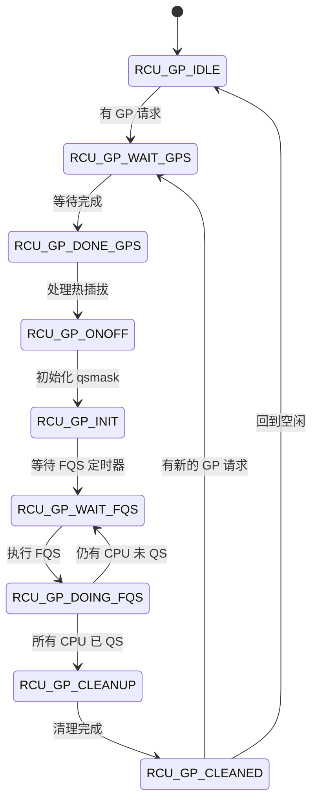

### 8.3.2 树节点 `struct rcu_node`

定义在 [kernel/rcu/tree.h](file:///home/louis/code/linux/kernel/rcu/tree.h) (第 41 行)，代表 RCU 树层次结构中的一个节点：

```c
struct rcu_node {
    raw_spinlock_t    lock;                 // 保护本节点
    unsigned long     gp_seq;               // 当前 GP 序列号
    unsigned long     gp_seq_needed;        // 最远的未来 GP 请求

    // 位图 — 核心 QS 跟踪
    unsigned long     qsmask;               // 需要 QS 的子节点/CPU 位图
    unsigned long     qsmaskinit;           // 当前 GP 初始 qsmask
    unsigned long     qsmaskinitnext;       // 下一 GP 初始 qsmask

    unsigned long     expmask;              // 紧急 GP 需要 QS 的位图
    unsigned long     expmaskinit;
    unsigned long     expmaskinitnext;

    // 层级信息
    int               grplo, grphi;         // 覆盖的 CPU 范围
    u8                grpnum;               // 父节点中的组编号
    u8                level;                // 层级（0 = 根）
    struct rcu_node   *parent;

    // PREEMPT_RCU 阻塞任务跟踪
    bool              wait_blkd_tasks;      // 等待阻塞任务退出
    struct list_head  blkd_tasks;           // 阻塞在 RCU 临界区中的任务
    struct list_head  *gp_tasks;            // 阻塞当前 GP 的第一个任务
    struct list_head  *exp_tasks;           // 阻塞当前紧急 GP 的第一个任务
    struct list_head  *boost_tasks;         // 需要优先级提升的第一个任务
    struct rt_mutex   boost_mtx;            // 优先级提升用 rt_mutex
};
```

### 8.3.3 每 CPU 数据 `struct rcu_data`

定义在 [kernel/rcu/tree.h](file:///home/louis/code/linux/kernel/rcu/tree.h) (第 189 行)：

```c
struct rcu_data {
    unsigned long     gp_seq;               // 跟踪 rsp->gp_seq
    unsigned long     gp_seq_needed;
    union rcu_noqs   cpu_no_qs;             // 本 CPU 未报告 QS 标志
    bool              core_needs_qs;        // 需要报告 QS
    struct rcu_node   *mynode;              // 所属叶子 rcu_node
    unsigned long     grpmask;              // 在叶子节点中的 bit 位置

    // 回调列表
    struct rcu_segcblist cblist;            // 分段回调列表

    // dynticks 跟踪
    int               watching_snap;
    bool              rcu_need_heavy_qs;
    bool              rcu_urgent_qs;
    bool              rcu_forced_tick;

    // 延迟 QS 处理
    struct irq_work   defer_qs_iw;          // 延迟 QS 的 IRQ work
    int               defer_qs_pending;     // 延迟 QS 是否待处理

    // RCU 优先级提升
    struct task_struct *rcu_cpu_kthread_task;
    int               rcu_cpu_kthread_status;
};
```

### 8.3.4 Tree RCU 层次结构

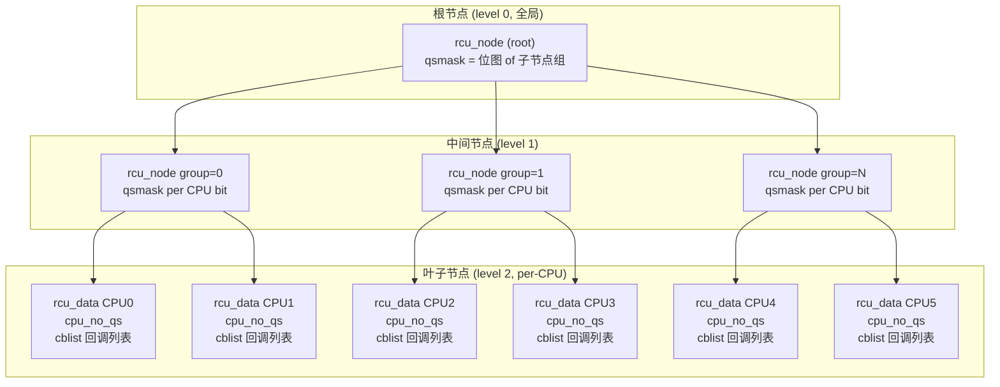

**QS 传播路径：** `CPUx → 叶子 rcu_node → 中间 rcu_node → 根 rcu_node → GP 完成`

## 8.4 PREEMPT_RT 下的 `rcu_read_lock` / `rcu_read_unlock`

### 8.4.1 API 封装层

定义在 [include/linux/rcupdate.h](file:///home/louis/code/linux/include/linux/rcupdate.h) (第 835 行)：

```c
// rcu_read_lock — 上层封装
static __always_inline void rcu_read_lock(void)
{
    __rcu_read_lock();          // 架构相关实现
    __acquire_shared(RCU);
    rcu_lock_acquire(&rcu_lock_map);  // lockdep 跟踪
}

// rcu_read_unlock — 上层封装
static inline void rcu_read_unlock(void)
{
    rcu_lock_release(&rcu_lock_map);
    __release_shared(RCU);
    __rcu_read_unlock();        // 架构相关实现
}
```

### 8.4.2 PREEMPT_RCU 内核实现

定义在 [kernel/rcu/tree_plugin.h](file:///home/louis/code/linux/kernel/rcu/tree_plugin.h) (第 412-446 行)：

```c
// 非 PREEMPT_RCU: 禁止抢占 = 隐式 RCU 保护
static inline void __rcu_read_lock(void)
{
    preempt_disable();
}

// PREEMPT_RCU: 仅递增嵌套计数，不禁用抢占
void __rcu_read_lock(void)
{
    rcu_preempt_read_enter();   // current->rcu_read_lock_nesting++
    // 严格模式: 立即设置 need_qs 标志
    if (IS_ENABLED(CONFIG_RCU_STRICT_GRACE_PERIOD) && rcu_state.gp_kthread)
        WRITE_ONCE(current->rcu_read_unlock_special.b.need_qs, true);
    barrier();  // 临界区开始前的屏障
}

void __rcu_read_unlock(void)
{
    barrier();  // 临界区结束前的屏障
    // 递减嵌套计数，到 0 时检查特殊状态
    if (rcu_preempt_read_exit() == 0) {
        barrier();
        if (unlikely(READ_ONCE(current->rcu_read_unlock_special.s)))
            rcu_read_unlock_special(current);  // 处理延迟 QS/阻塞
    }
}
```

**关键差异：**

| 特性         | 非 PREEMPT_RCU              | PREEMPT_RCU                 |
| ------------ | --------------------------- | --------------------------- |
| 读者可抢占   | 否（`preempt_disable()`） | 是（仅计数）                |
| 宽限期检测   | 上下文切换/用户态/Idle      | 显式跟踪`blkd_tasks`      |
| 读端延迟     | 极低                        | 略高（跟踪开销）            |
| 临界区中调度 | 不允许                      | 允许（自动加入 blkd_tasks） |

### 8.4.3 `rcu_read_unlock_special()` — 延迟 QS 处理的入口

定义在 [kernel/rcu/tree_plugin.h](file:///home/louis/code/linux/kernel/rcu/tree_plugin.h) (第 724 行)：

```mermaid
flowchart TD
    A["__rcu_read_unlock()<br/>    nesting 到 0 且 special.s 非零"] --> B{rcu_read_unlock_special()}
    B --> C{"preempt/BH/IRQ 禁用?"}
    C -->|是| D{"in_hardirq() 或<br/>        需要 expedited 且<br/>        IRQ 已启用?"}
    C -->|否| E["rcu_preempt_deferred_qs_irqrestore()<br/>         立即报告 QS"]
    D -->|是| F["raise_softirq(RCU_SOFTIRQ)<br/>         延迟处理"]
    D -->|否| G["set_need_resched()<br/>         等待下次调度处理"]
    D -->|IRQ 禁用 + 需要 expedited| H["irq_work_queue_on()<br/>         在目标 CPU 上处理"]
```

**处理分支详解：**

```c
static void rcu_read_unlock_special(struct task_struct *t)
{
    // 1. 检查是否处于 NMI 上下文
    if (in_nmi()) return;

    // 2. 检查是否处于中断/BH/抢占禁用上下文中
    bool preempt_bh_were_disabled = !!(preempt_count() & (PREEMPT_MASK | SOFTIRQ_MASK));

    if (preempt_bh_were_disabled || irqs_were_disabled) {
        // 不能立即报告 QS，需要延迟
        if (use_softirq && (in_hardirq() || (needs_exp && !irqs_were_disabled))) {
            raise_softirq_irqoff(RCU_SOFTIRQ);  // 软中断处理
        } else {
            set_need_resched_current();         // 调度时处理
            if (irqs_were_disabled && needs_exp)
                irq_work_queue_on(&rdp->defer_qs_iw, rdp->cpu);  // IRQ work
        }
        return;
    }

    // 3. 抢占和中断都启用，可直接报告
    rcu_preempt_deferred_qs_irqrestore(t, flags);
}
```

### 8.4.4 `rcu_preempt_deferred_qs_irqrestore()` — 真正的 QS 报告

定义在 [kernel/rcu/tree_plugin.h](file:///home/louis/code/linux/kernel/rcu/tree_plugin.h) (第 477 行)：

```c
static notrace void
rcu_preempt_deferred_qs_irqrestore(struct task_struct *t, unsigned long flags)
{
    // 1. 清除 defer_qs_pending 状态
    rdp->defer_qs_pending = DEFER_QS_IDLE;

    // 2. 处理 need_qs 标志 — 报告普通 QS
    if (special.b.need_qs) {
        if (IS_ENABLED(CONFIG_RCU_STRICT_GRACE_PERIOD)) {
            rcu_report_qs_rdp(rdp);    // 严格模式立即报告
        } else {
            rcu_qs();                   // 普通模式标记 QS
        }
    }

    // 3. 处理 expedited QS
    if (rdp->cpu_no_qs.b.exp)
        rcu_report_exp_rdp(rdp);

    // 4. 处理 blocked 状态 — 从 blkd_tasks 链表中移除
    if (special.b.blocked) {
        rnp = t->rcu_blocked_node;
        spin_lock(&rnp->lock);
        // 从 blkd_tasks 链表移除
        list_del_init(&t->rcu_node_entry);
        t->rcu_blocked_node = NULL;

        // 更新 gp_tasks/exp_tasks 指针
        if (&t->rcu_node_entry == rnp->gp_tasks)
            WRITE_ONCE(rnp->gp_tasks, np);
        if (&t->rcu_node_entry == rnp->exp_tasks)
            WRITE_ONCE(rnp->exp_tasks, np);

        // 如果所有阻塞任务已解除，向上报告 QS
        if (!empty_norm && !rcu_preempt_blocked_readers_cgp(rnp))
            rcu_report_unblock_qs_rnp(rnp, flags);
    }
}
```

## 8.5 上下文切换处理 `rcu_note_context_switch()`

这是 PREEMPT_RCU 的核心路径，在每次上下文切换时调用。

定义在 [kernel/rcu/tree_plugin.h](file:///home/louis/code/linux/kernel/rcu/tree_plugin.h) (第 324 行)：

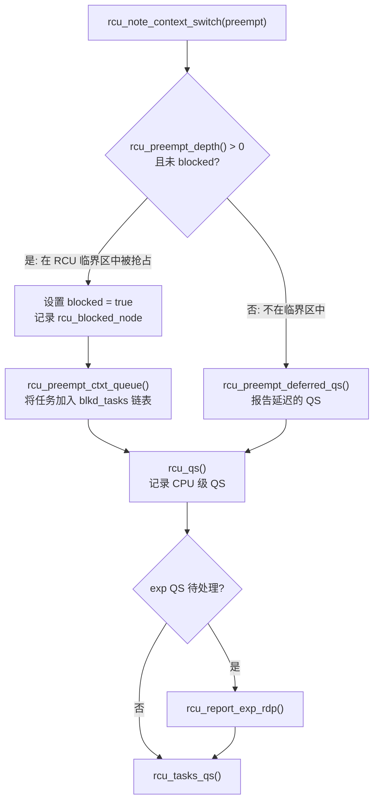

PREEMPT_RCU 版本：

```c
void rcu_note_context_switch(bool preempt)
{
    // 自愿调度在 RCU 临界区内是危险的
    WARN_ONCE(!preempt && rcu_preempt_depth() > 0,
              "Voluntary context switch within RCU read-side critical section!");

    if (rcu_preempt_depth() > 0 && !t->rcu_read_unlock_special.b.blocked) {
        // 在 RCU 临界区中被抢占 → 加入 blkd_tasks
        rnp = rdp->mynode;
        raw_spin_lock_rcu_node(rnp);
        t->rcu_read_unlock_special.b.blocked = true;
        t->rcu_blocked_node = rnp;
        rcu_preempt_ctxt_queue(rnp, rdp);  // 决策表插入
    } else {
        rcu_preempt_deferred_qs(t);  // 不在临界区，报告延迟 QS
    }

    rcu_qs();  // 总是记录 CPU 级 QS
}
```

非 PREEMPT_RCU 版本（第 995 行）极其简单：

```c
void rcu_note_context_switch(bool preempt)
{
    rcu_qs();  // 仅记录 QS
    // 处理 urgent_qs
    if (!smp_load_acquire(this_cpu_ptr(&rcu_data.rcu_urgent_qs)))
        goto out;
    this_cpu_write(rcu_data.rcu_urgent_qs, false);
}
```

### 8.5.1 `rcu_preempt_ctxt_queue()` — 阻塞任务排队决策表

定义在 [kernel/rcu/tree_plugin.h](file:///home/louis/code/linux/kernel/rcu/tree_plugin.h) (第 162 行)：

```c
static void rcu_preempt_ctxt_queue(struct rcu_node *rnp, struct rcu_data *rdp)
{
    // blkd_state 由 4 位标志组成:
    //   RCU_GP_TASKS(1)  — 已有任务阻塞正常 GP
    //   RCU_EXP_TASKS(2) — 已有任务阻塞紧急 GP
    //   RCU_GP_BLKD(4)   — 本 CPU 需要向正常 GP 报告 QS
    //   RCU_EXP_BLKD(8)  — 本 CPU 需要向紧急 GP 报告 QS
    int blkd_state = (rnp->gp_tasks ? RCU_GP_TASKS : 0) +
                     (rnp->exp_tasks ? RCU_EXP_TASKS : 0) +
                     (rnp->qsmask & rdp->grpmask ? RCU_GP_BLKD : 0) +
                     (rnp->expmask & rdp->grpmask ? RCU_EXP_BLKD : 0);

    switch (blkd_state) {
    // 插入链表头部: 不阻塞已等待的 GP
    case 0: case RCU_EXP_TASKS:
    case RCU_EXP_TASKS | RCU_GP_BLKD:
    case RCU_GP_TASKS: case RCU_GP_TASKS | RCU_EXP_TASKS:
        list_add(&t->rcu_node_entry, &rnp->blkd_tasks);
        break;

    // 插入链表尾部: 阻塞任一 GP 的第一个任务
    case RCU_EXP_BLKD: case RCU_GP_BLKD:
    case RCU_GP_BLKD | RCU_EXP_BLKD:
    case RCU_GP_TASKS | RCU_EXP_BLKD:
    case RCU_GP_TASKS | RCU_GP_BLKD | RCU_EXP_BLKD:
    case RCU_GP_TASKS | RCU_EXP_TASKS | RCU_GP_BLKD | RCU_EXP_BLKD:
        list_add_tail(&t->rcu_node_entry, &rnp->blkd_tasks);
        break;

    // 紧跟 exp_tasks 之后
    case RCU_EXP_TASKS | RCU_EXP_BLKD:
    case RCU_EXP_TASKS | RCU_GP_BLKD | RCU_EXP_BLKD:
    case RCU_GP_TASKS | RCU_EXP_TASKS | RCU_EXP_BLKD:
        list_add(&t->rcu_node_entry, rnp->exp_tasks);
        break;

    // 紧跟 gp_tasks 之后
    case RCU_GP_TASKS | RCU_GP_BLKD:
    case RCU_GP_TASKS | RCU_EXP_TASKS | RCU_GP_BLKD:
        list_add(&t->rcu_node_entry, rnp->gp_tasks);
        break;
    }
}
```

## 8.6 宽限期生命周期

### 8.6.1 GP kthread 主循环

定义在 [kernel/rcu/tree.c](file:///home/louis/code/linux/kernel/rcu/tree.c)：

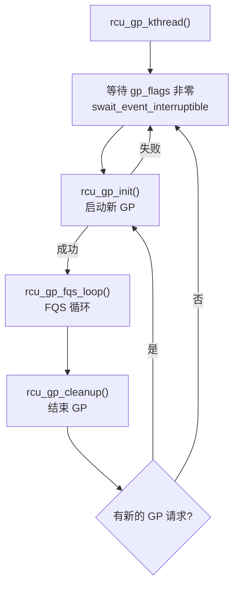

### 8.6.2 `rcu_gp_init()` — GP 初始化

定义在 [kernel/rcu/tree.c](file:///home/louis/code/linux/kernel/rcu/tree.c) (第 1832 行)：

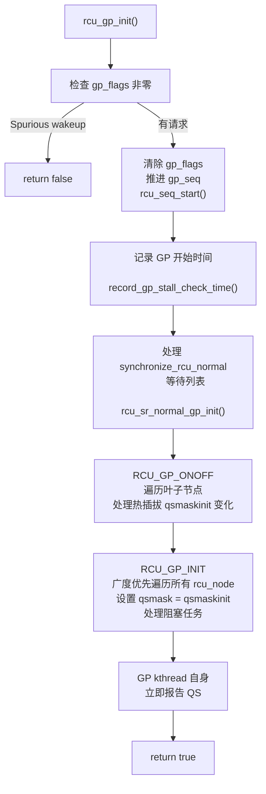

**关键操作：**

1. `rcu_seq_start(&rcu_state.gp_seq)` — 推进 GP 序列号
2. `rcu_sr_normal_gp_init()` — 向 `srs_next` llist 注入 wait-dummy-node 以分隔不同 GP 的等待者
3. 处理 CPU 热插拔：遍历叶子节点，更新 `qsmaskinit = qsmaskinitnext`
4. 广度优先遍历所有 `rcu_node`：设置 `qsmask = qsmaskinit`，记录 `gp_seq`
5. 对 PREEMPT_RCU：调用 `rcu_preempt_check_blocked_tasks(rnp)` 检查阻塞任务

### 8.6.3 `rcu_gp_fqs_loop()` — FQS 循环

定义在 [kernel/rcu/tree.c](file:///home/louis/code/linux/kernel/rcu/tree.c) (第 2092 行)：

```mermaid
flowchart TD
    A["rcu_gp_fqs_loop()"] --> B{"所有 CPU 已报告 QS?<br/>         根节点 qsmask == 0}
    B -->|是| C["退出 FQS 循环"]
    B -->|否| D["swait_event_idle_timeout_exclusive<br/>         等待定时器到期或唤醒"]
    D --> E["RCU_GP_DOING_FQS<br/>         rcu_gp_fqs(first_time)"]
    E --> F{"force_qs_rnp()<br/>         遍历所有 rcu_node"}
    F --> G{"对每个 CPU:"}
    G --> H{"dyntick-idle 或<br/>         已离线?"}
    H -->|是| I["清除 qsmask 位<br/>         视为已 QS"]
    H -->|否| J{"设置了<br/>         rcu_urgent_qs?"}
    J -->|是| K["发送 IPI 或<br/>         设置 rcu_need_heavy_qs"]
    J -->|否| L["继续等待"]
    I --> M{"根节点 qsmask == 0?"}
    K --> M
    L --> M
    M -->|否| B
    M -->|是| C
```

`rcu_gp_fqs()` 实现（第 2056 行）：

```c
static void rcu_gp_fqs(bool first_time)
{
    if (first_time) {
        // 首次: 收集 dyntick-idle 快照
        force_qs_rnp(rcu_watching_snap_save);
    } else {
        // 后续: 重新检查 dyntick-idle 和离线 CPU
        force_qs_rnp(rcu_watching_snap_recheck);
    }
    // 清除 FQS 标志
    if (READ_ONCE(rcu_state.gp_flags) & RCU_GP_FLAG_FQS) {
        raw_spin_lock_irq_rcu_node(rnp);
        WRITE_ONCE(rcu_state.gp_flags, rcu_state.gp_flags & ~RCU_GP_FLAG_FQS);
        raw_spin_unlock_irq_rcu_node(rnp);
    }
}
```

### 8.6.4 `rcu_gp_cleanup()` — GP 清理

定义在 [kernel/rcu/tree.c](file:///home/louis/code/linux/kernel/rcu/tree.c) (第 2178 行)：

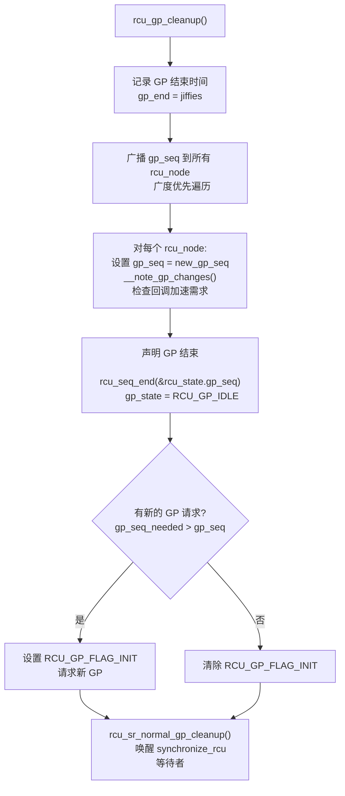

**关键操作：**

1. 将 `gp_seq` 传播到所有 `rcu_node`，使回调能进入处理阶段
2. `rcu_sr_normal_gp_cleanup()` — 完成 `synchronize_rcu_normal()` 等待者的唤醒
3. 检查 `gp_seq_needed > gp_seq`，如有需要则发起新 GP

### 8.6.5 完整 GP 生命周期

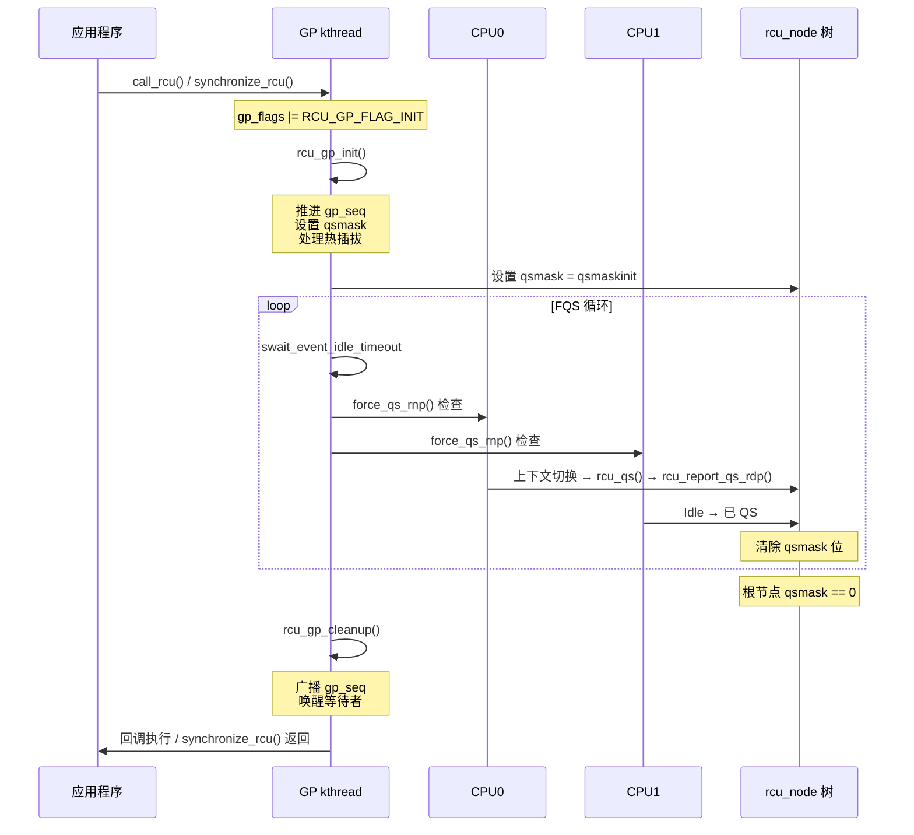

## 8.7 QS 报告机制

### 8.7.1 QS 来源

在 PREEMPT_RCU 下，QS 的来源包括：

| 来源       | 函数                                             | 触发条件              |
| ---------- | ------------------------------------------------ | --------------------- |
| 上下文切换 | `rcu_note_context_switch()` → `rcu_qs()`    | 每次调度              |
| 用户态执行 | `rcu_flavor_sched_clock_irq()` → `rcu_qs()` | tick 中发现 user 模式 |
| Idle       | `rcu_watching_snap_save/recheck()`             | dyntick-idle 状态     |
| 延迟 QS    | `rcu_preempt_deferred_qs_irqrestore()`         | RCU 临界区退出        |
| 严格模式   | `rcu_read_unlock_strict()`                     | 每个 unlock 立即报告  |

### 8.7.2 `rcu_report_qs_rdp()` — 单 CPU QS 上报

定义在 [kernel/rcu/tree.c](file:///home/louis/code/linux/kernel/rcu/tree.c) (第 2471 行)：

```c
rcu_report_qs_rdp(struct rcu_data *rdp)
{
    rnp = rdp->mynode;
    raw_spin_lock_irqsave_rcu_node(rnp, flags);

    // 检查 QS 是否对应当前 GP
    if (rdp->cpu_no_qs.b.norm || rdp->gp_seq != rnp->gp_seq || rdp->gpwrap) {
        // QS 已过期（对应已结束的 GP），需要在新 GP 中重新报告
        rdp->cpu_no_qs.b.norm = true;
        raw_spin_unlock_irqrestore_rcu_node(rnp, flags);
        return;
    }

    mask = rdp->grpmask;
    rdp->core_needs_qs = false;

    if ((rnp->qsmask & mask) == 0) {
        // 已报告过，无需重复
        raw_spin_unlock_irqrestore_rcu_node(rnp, flags);
    } else {
        // 向上传播 QS
        rcu_report_qs_rnp(mask, rnp, rnp->gp_seq, flags);
    }
}
```

### 8.7.3 `rcu_report_qs_rnp()` — 树内向上传播

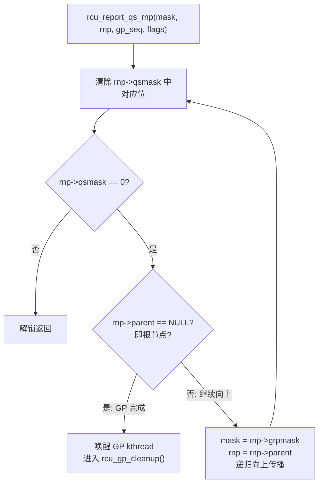

## 8.8 `synchronize_rcu()` 实现

定义在 [kernel/rcu/tree.c](file:///home/louis/code/linux/kernel/rcu/tree.c) (第 3378 行)：

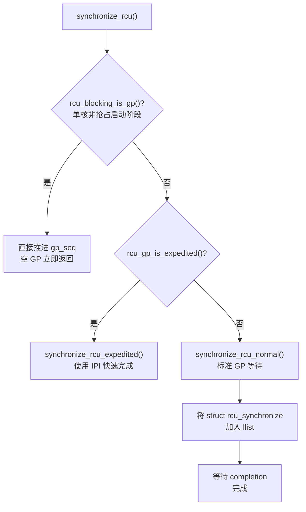

`synchronize_rcu_normal()` 实现（第 3305 行）：

```c
static void synchronize_rcu_normal(void)
{
    struct rcu_synchronize rs;

    init_rcu_head_on_stack(&rs.head);
    init_completion(&rs.completion);

    // 将等待节点加入 llist
    // 通过 call_rcu 注册回调，GP 完成后唤醒
    call_rcu(&rs.head, wakeme_after_rcu);
    wait_for_completion(&rs.completion);

    destroy_rcu_head_on_stack(&rs.head);
}
```

## 8.9 `call_rcu()` 回调注册

定义在 [kernel/rcu/tree.c](file:///home/louis/code/linux/kernel/rcu/tree.c) (第 3277 行)：

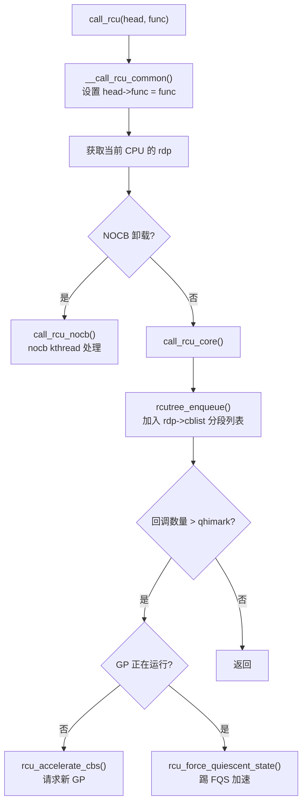

`call_rcu_core()` 实现（第 3037 行）：

```c
static void call_rcu_core(struct rcu_data *rdp, struct rcu_head *head,
                          rcu_callback_t func, unsigned long flags)
{
    rcutree_enqueue(rdp, head, func);  // 加入分段回调列表

    // 回调数量超过阈值
    if (unlikely(rcu_segcblist_n_cbs(&rdp->cblist) >
                 rdp->qlen_last_fqs_check + qhimark)) {
        note_gp_changes(rdp);
        if (!rcu_gp_in_progress()) {
            rcu_accelerate_cbs_unlocked(rdp->mynode, rdp);
        } else {
            rcu_force_quiescent_state();  // 踢 FQS
        }
    }
}
```

### 8.9.1 回调分段列表 `rcu_segcblist`

回调列表按 GP 进度分为多个段：

```
rcu_segcblist 结构:
┌────────────────────────────────────────────────────────────────┐
│ 分段 0: RCU_DONE_TAIL      → 已完成的 GP 的回调，等待执行      │
│ 分段 1: RCU_WAIT_TAIL      → 等当前 GP 完成                   │
│ 分段 2: RCU_NEXT_READY_TAIL → 下一个 GP 的回调，已加速         │
│ 分段 3: RCU_NEXT_TAIL       → 下一个 GP 的回调，未加速         │
└────────────────────────────────────────────────────────────────┘
```

回调执行在 `rcu_do_batch()` 中完成，通过 softirq (`RCU_SOFTIRQ`) 或 `rcuc` kthread 触发。

## 8.10 PREEMPT_RT 调度时钟中断处理

定义在 [kernel/rcu/tree_plugin.h](file:///home/louis/code/linux/kernel/rcu/tree_plugin.h) (第 810 行)：

```c
static void rcu_flavor_sched_clock_irq(int user)
{
    struct task_struct *t = current;

    if (rcu_preempt_depth() > 0 ||
        (preempt_count() & (PREEMPT_MASK | SOFTIRQ_MASK))) {
        // 在 RCU 临界区或中断/BH 中，不能报告 QS
        // 但有延迟 QS 待处理时强制调度
        if (rcu_preempt_need_deferred_qs(t))
            set_need_resched_current();
    } else if (rcu_preempt_need_deferred_qs(t)) {
        rcu_preempt_deferred_qs(t);  // 报告延迟 QS
        return;
    } else if (!WARN_ON_ONCE(rcu_preempt_depth())) {
        rcu_qs();  // 不在临界区，直接报告 QS
        return;
    }

    // 如果 GP 已经运行较久（> 1秒），设置 need_qs 标志
    // 这样在 rcu_read_unlock() 时会触发报告
    if (rcu_preempt_depth() > 0 &&
        __this_cpu_read(rcu_data.core_needs_qs) &&
        __this_cpu_read(rcu_data.cpu_no_qs.b.norm) &&
        !t->rcu_read_unlock_special.b.need_qs &&
        time_after(jiffies, rcu_state.gp_start + HZ))
        t->rcu_read_unlock_special.b.need_qs = true;
}
```

## 8.11 RCU 优先级提升 (RCU_BOOST)

在 PREEMPT_RT 下，低优先级任务在 RCU 临界区中被抢占时，会阻塞高优先级任务等待 GP 完成。RCU 优先级提升通过 `rt_mutex` 机制防止优先级反转。


**boost 触发条件：**

- `rcu_node` 的 `boost_tasks` 非空
- GP 运行超过一定时间（`rcu_node->boost_time = jiffies + 50ms`）
- 每个 `rcu_node` 有一个专用的 boost kthread，周期检查并提升优先级

## 8.12 SRCU (可睡眠 RCU)

### 8.12.1 概述

SRCU (Sleepable RCU) 允许读者在 RCU 读端临界区内睡眠：

```c
// include/linux/srcu.h
struct srcu_struct {
    struct srcu_data __percpu *sda;       // per-CPU 数据
    struct srcu_node *node;                // 树节点
    struct srcu_node *level[SRCU_MAX_LEVEL]; // 层级数组
    struct mutex srcu_gp_mutex;            // 宽限期互斥锁
    atomic_t srcu_gp_in_progress;          // GP 进行中
    unsigned long srcu_gp_seq;             // GP 序列号
};

// API
int init_srcu_struct(struct srcu_struct *ssp);
void cleanup_srcu_struct(struct srcu_struct *ssp);
int srcu_read_lock(struct srcu_struct *ssp) __acquires(ssp);
void srcu_read_unlock(struct srcu_struct *ssp, int idx) __releases(ssp);
void synchronize_srcu(struct srcu_struct *ssp);
void call_srcu(struct srcu_struct *ssp, struct rcu_head *head, rcu_callback_t func);
```

**SRCU 使用场景：**

- 读者需要睡眠（如等待 I/O）
- 读者需要获取 mutex
- 读者需要执行可能导致调度的操作

### 8.12.2 SRCU 与标准 RCU 的差异

| 特性       | 标准 RCU | SRCU       |
| ---------- | -------- | ---------- |
| 读者可睡眠 | 否       | 是         |
| 每实例读者 | 全局     | 独立跟踪   |
| 轻量级     | 极轻量   | 较重       |
| 宽限期     | 共享     | 每实例独立 |

## 8.13 Tasks RCU

### 8.13.1 概述

Tasks RCU 专门用于等待内核线程退出（如 trampoline 卸载）：

```c
// API
void synchronize_rcu_tasks(void);
void synchronize_rcu_tasks_rude(void);
void synchronize_rcu_tasks_trace(void);
```

**三种变体：**

| 变体            | 等待条件                            | 用途                   |
| --------------- | ----------------------------------- | ---------------------- |
| Tasks RCU       | 所有任务至少经过一次 voluntary 调度 | ftrace trampoline 卸载 |
| Tasks Rude RCU  | 所有 CPU 至少经过一次上下文切换     | 内核代码修改           |
| Tasks Trace RCU | 跟踪所有任务（含 idle）             | BPF 程序卸载           |

## 8.14 使用场景

| 场景                   | 使用变体  | 说明                          |
| ---------------------- | --------- | ----------------------------- |
| 指针保护               | 标准 RCU  | 受保护指针的读-复制-更新      |
| 链表遍历               | 标准 RCU  | `list_for_each_entry_rcu()` |
| 文件系统路径           | SRCU      | 路径遍历中可睡眠              |
| BPF trampoline         | Tasks RCU | 等待所有任务退出              |
| 网络路由表             | 标准 RCU  | 路由表读多写少                |
| 模块卸载               | Tasks RCU | 等待所有读者完成              |
| RCU 临界区中获取 mutex | SRCU      | 可睡眠的读端临界区            |

## 8.15 关键文件

| 文件                                                                              | 说明                                                                                                                                 |
| --------------------------------------------------------------------------------- | ------------------------------------------------------------------------------------------------------------------------------------ |
| [include/linux/rcupdate.h](file:///home/louis/code/linux/include/linux/rcupdate.h) | RCU 核心 API（`rcu_read_lock/unlock`、`rcu_dereference`、`rcu_assign_pointer`）                                                |
| [include/linux/rcu_sync.h](file:///home/louis/code/linux/include/linux/rcu_sync.h) | RCU 同步辅助                                                                                                                         |
| [include/linux/srcu.h](file:///home/louis/code/linux/include/linux/srcu.h)         | SRCU API                                                                                                                             |
| [kernel/rcu/tree.c](file:///home/louis/code/linux/kernel/rcu/tree.c)               | Tree RCU 核心实现（GP 生命周期、`synchronize_rcu`、`call_rcu`）                                                                  |
| [kernel/rcu/tree.h](file:///home/louis/code/linux/kernel/rcu/tree.h)               | Tree RCU 数据结构（`rcu_state`、`rcu_node`、`rcu_data`）                                                                       |
| [kernel/rcu/tree_plugin.h](file:///home/louis/code/linux/kernel/rcu/tree_plugin.h) | PREEMPT_RCU 插件（`__rcu_read_lock/unlock`、`rcu_note_context_switch`、`rcu_preempt_ctxt_queue`、`rcu_read_unlock_special`） |
| [kernel/rcu/srcu.c](file:///home/louis/code/linux/kernel/rcu/srcu.c)               | SRCU 实现                                                                                                                            |
| [kernel/rcu/tasks.h](file:///home/louis/code/linux/kernel/rcu/tasks.h)             | Tasks RCU 实现                                                                                                                       |
| [kernel/rcu/rcu.h](file:///home/louis/code/linux/kernel/rcu/rcu.h)                 | RCU 内部辅助函数                                                                                                                     |

## 8.16 与 PREEMPT_RT 的交互总结

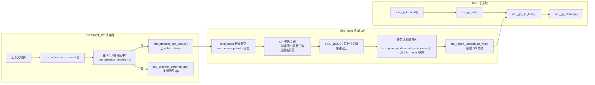

**PREEMPT_RT 下的 RCU 核心设计原则：**

1. **读者可抢占** — `rcu_read_lock()` 不再禁用抢占，仅递增 `rcu_read_lock_nesting` 计数
2. **阻塞跟踪** — 被抢占的任务在 `rcu_preempt_ctxt_queue()` 中按决策表加入 `blkd_tasks`
3. **延迟 QS** — 在中断/BH/抢占禁用上下文中退出临界区时，通过 `RCU_SOFTIRQ` 或 `irq_work` 延迟报告
4. **优先级继承** — `RCU_BOOST` 通过 `rt_mutex` 提升阻塞任务的优先级，防止优先级反转
5. **GP 与调度器交互** — 每次上下文切换检查 RCU 状态，FQS 循环扫描 dyntick-idle CPU
