# epoll / AIO / io_uring 系统调用完整路径分析

## 1 概述

事件通知与异步 I/O 系统调用是 Linux 高性能 I/O 的核心机制。epoll 提供可扩展的事件通知（替代 select/poll），AIO 提供传统异步 I/O，io_uring 是最新一代高性能异步 I/O 框架。

### 关键特点

- **epoll**：通过红黑树 + 就绪链表实现 O(1) 事件通知，支持 ET/LT 触发模式
- **eventfd**：轻量级事件通知文件描述符，与 epoll 配合使用
- **AIO (传统)**：基于 `struct kioctx` + `struct aio_kiocb` 的异步 I/O 框架
- **io_uring**：共享内存环形队列（SQ/CQ）消除系统调用开销，支持固定缓冲区/文件
- **io_uring SQPOLL**：内核轮询线程替代用户态提交系统调用，真正实现零系统调用 I/O

---

## 2 涉及的内核层

| 层 | 说明 |
|--|--|
| **Syscall Entry** | epoll_create1/epoll_ctl/epoll_pwait, eventfd2, io_uring_setup/enter/register |
| **epoll 核心** | do_epoll_create / do_epoll_ctl / ep_poll (fs/eventpoll.c) |
| **epoll 回调** | ep_poll_callback（设备驱动通过 poll 回调触发） |
| **AIO 核心** | ioctx_alloc / io_submit_one / aio_complete (fs/aio.c) |
| **io_uring 核心** | io_uring_create / io_submit_sqes / io_cqring_wait (io_uring/) |
| **VFS / Block** | direct I/O 路径 (fs/direct-io.c) |
| **NVMe 驱动** | polled 队列 + 中断完成 |

---

## 3 epoll 系统调用

### 3.1 epoll_create1 - fs/eventpoll.c:2202

```c
SYSCALL_DEFINE1(epoll_create1, int, flags)
{
    return do_epoll_create(flags);
}
```

```
do_epoll_create(flags)
  ├─ ep_alloc(&ep)                                    // 分配 struct eventpoll
  │    ├─ kzalloc(sizeof(*ep), GFP_KERNEL)
  │    ├─ mutex_init(&ep->mtx)                        // 主互斥锁
  │    ├─ init_waitqueue_head(&ep->wq)                // 等待队列（syscall 阻塞）
  │    ├─ init_waitqueue_head(&ep->poll_wait)          // poll 等待队列
  │    ├─ INIT_LIST_HEAD(&ep->rdllist)                 // 就绪链表
  │    ├─ ep->rbr = RB_ROOT                           // 红黑树根
  │    └─ ep->ovflist = EP_UNACTIVE_PTR               // 溢出链表
  ├─ anon_inode_getfile("[eventpoll]", &eventpoll_fops, ep, ...)  // 匿名文件
  └─ fd_install / fd_publish                          // 分配 fd
```

关键数据结构 `struct eventpoll`:
```
struct eventpoll {
    struct mutex mtx;                  // 主锁
    wait_queue_head_t wq;              // epoll_wait 等待队列
    wait_queue_head_t poll_wait;        // poll 等待
    struct list_head rdllist;           // 就绪事件链表
    struct rb_root_cached rbr;          // 所有监控 fd 的红黑树
    struct epitem *ovflist;             // 溢出链表（中断上下文）
    struct file *file;                  // epoll 文件
};
```

### 3.2 epoll_ctl - fs/eventpoll.c:2387

```c
SYSCALL_DEFINE4(epoll_ctl, int, epfd, int, op, int, fd,
        struct epoll_event __user *, event)
{
    struct epoll_event epds;
    if (ep_op_has_event(op) &&
        copy_from_user(&epds, event, sizeof(struct epoll_event)))
        return -EFAULT;
    return do_epoll_ctl(epfd, op, fd, &epds, false);
}
```

核心操作（EPOLL_CTL_ADD）：

```
do_epoll_ctl(epfd, op, fd, &epds, false)
  ├─ ep = f.file->private_data                         // epoll 实例
  ├─ tf = fd_file(f)                                   // 目标文件
  ├─ ep_insert(ep, event, tf, fd, full_check)          // 添加监控
  │    ├─ kmem_cache_alloc(epi_cache, GFP_KERNEL)      // 分配 epitem
  │    ├─ ep_rbtree_insert(ep, epi)                    // 红黑树插入
  │    ├─ init_waitqueue_func_entry(&epi->wait, ep_poll_callback)  // 注册回调
  │    ├─ epi->next = EP_UNACTIVE_PTR
  │    ├─ wake_up(&ep->wq)                             // 唤醒等待的 epoll_wait
  │    └─ ep_ptable_queue_proc(file, epi->ep->wq, epi) // 调用 f_op->poll
  │         └─ vfs_poll(file, &epi->pt)                // 收集初始事件
  │              └─ file->f_op->poll(file, pt)         // → tcp_poll / sock_poll
  │                   └─ ep_item_poll(epi, pt, flags)  // 添加等待队列
  └─ EPOLL_CTL_DEL / MOD 类似操作
```

EPOLL_CTL_DEL:
```
ep_remove(ep, epi)
  ├─ ep_unregister_pollwait(ep, epi)                   // 移除 poll 回调
  ├─ ep_rbtree_erase(ep, epi)                          // 红黑树删除
  └─ kmem_cache_free(epi_cache, epi)                   // 释放 epitem
```

### 3.3 epoll_pwait - fs/eventpoll.c

```c
SYSCALL_DEFINE6(epoll_pwait, int, epfd, struct epoll_event __user *, events,
        int, maxevents, int, timeout, const sigset_t __user *, sigmask,
        size_t, sigsetsize)
```

核心路径：

```
epoll_pwait(epfd, events, maxevents, timeout, sigmask)
  ├─ do_epoll_wait(epfd, events, maxevents, timeout)    // 基础 epoll_wait
  │    └─ ep_poll(ep, events, maxevents, timeout)        // fs/eventpoll.c:1940
  │         ├─ ep_events_available(ep)                   // 检查就绪事件
  │         ├─ while (1) {
  │         │    ├─ ep_try_send_events(ep, events, maxevents) // 发送事件到用户
  │         │    │    └─ ep_send_events(ep, events, maxevents)
  │         │    │         └─ ep_scan_ready_list(ep, ep_send_events_proc)
  │         │    │              ├─ mutex_lock(&ep->mtx)
  │         │    │              ├─ list_splice_init(&ep->rdllist, &txlist)
  │         │    │              ├─ for each epi in txlist:
  │         │    │              │    ├─ ep_item_poll(epi, &pt, 1)  // 重新检查
  │         │    │              │    ├─ epoll_put_uevent(revents, data, events)
  │         │    │              │    └─ LT模式→插回rdllist
  │         │    │              └─ mutex_unlock(&ep->mtx)
  │         │    ├─ if (timed_out) return 0
  │         │    ├─ ep_busy_loop(ep) // NAPI 忙等
  │         │    ├─ if (signal_pending(current)) return -EINTR
  │         │    ├─ init_wait(&wait)                     // 加入等待队列
  │         │    ├─ __add_wait_queue_exclusive(&ep->wq, &wait)
  │         │    ├─ set_current_state(TASK_INTERRUPTIBLE)
  │         │    ├─ schedule_hrtimeout_range(to, slack, HRTIMER_MODE_ABS) // 调度
  │         │    └─ } // end while
  │         └─ return res
  └─ 恢复 sigmask（epoll_pwait 特有）
```

### 3.4 eventfd2

```c
SYSCALL_DEFINE2(eventfd2, unsigned int, initval, int, flags)
```

eventfd 创建轻量级事件通知 fd，底层使用 `struct eventfd_ctx`：
- `eventfd_ctx->count`：64 位计数器
- `eventfd_signal`：原子递增 + 唤醒 epoll 等待队列（用于 AIO/io_uring 完成通知）
- `eventfd_read/write`：用户态读写计数器

---

## 4 异步 I/O (AIO) 传统框架

### 4.1 io_setup - fs/aio.c:1381

```c
SYSCALL_DEFINE2(io_setup, unsigned, nr_events, aio_context_t __user *, ctxp)
{
    struct kioctx *ioctx = ioctx_alloc(nr_events);        // 分配 kioctx
    ret = put_user(ioctx->user_id, ctxp);                 // 返回 ctx id
}
```

```
ioctx_alloc(nr_events)
  ├─ kzalloc(sizeof(*ctx), GFP_KERNEL)                    // 分配 kioctx
  ├─ aio_setup_ring(ctx, nr_events)                       // 分配环形缓冲区
  │    └─ aio_ring_mmap(ctx, ctx->mmap_base, ...)          // mmap 映射
  ├─ INIT_KFIFO(ctx->completed_events)                    // 完成事件 FIFO
  ├─ spin_lock_init(&ctx->ctx_lock)
  ├─ ctx->max_reqs = nr_events
  └─ percpu_ref_init(&ctx->users, ...)                    // 引用计数
```

### 4.2 io_submit - fs/aio.c:2081

```c
SYSCALL_DEFINE3(io_submit, aio_context_t, ctx_id, long, nr,
        struct iocb __user * __user *, iocbpp)
```

```
io_submit(ctx_id, nr, iocbpp)
  ├─ lookup_ioctx(ctx_id) → kioctx
  ├─ for (i = 0; i < nr; i++) {
  │    ├─ copy_from_user(&iocb, iocbpp[i], sizeof(iocb))  // 拷贝 iocb
  │    └─ io_submit_one(ctx, iocbpp[i], false)
  │         ├─ aio_get_req(ctx) → alloc aio_kiocb
  │         ├─ __io_submit_one(ctx, &iocb, user_iocb, req, false)
  │         │    ├─ fget(iocb->aio_fildes) → ki_filp
  │         │    ├─ IOCB_FLAG_RESFD → eventfd_ctx_fdget
  │         │    ├─ aio_prep_rw(req, iocb)                // 准备读写请求
  │         │    ├─ kiocb_set_cancel_fn(req, aio_cancel)
  │         │    └─ aio_rw_done(req, ...)
  │         │         └─ call_write_iter / call_read_iter  // VFS I/O 调用
  │         │         └─ aio_complete(req, res, res2)     // 同步完成
  │         └─ iocb_put(req)
  └─ }
```

### 4.3 io_getevents - fs/aio.c:2250

```c
SYSCALL_DEFINE5(io_getevents, aio_context_t, ctx_id,
        long, min_nr, long, nr, struct io_event __user *, events,
        struct __kernel_timespec __user *, timeout)
```

```
io_getevents(ctx_id, min_nr, nr, events, timeout)
  └─ read_events(ctx, min_nr, nr, events, timeout)
       ├─ while (1) {
       │    ├─ aio_read_events(ctx, min_nr, nr, events, &ret) // 读完成事件
       │    ├─ if (ret >= min_nr) break
       │    ├─ prepare_to_wait(&ctx->wait, &wait, TASK_INTERRUPTIBLE)
       │    ├─ schedule_timeout(timeout)                       // 阻塞等待
       │    └─ }
       └─ return ret
```

### 4.4 AIO 完成路径

```c
// I/O 完成时调用（由 ext4_end_bio 等驱动回调触发）
void aio_complete(struct aio_kiocb *iocb, long res, long res2)
{
    struct kioctx *ctx = iocb->ki_ctx;
    ctx->ki_res.obj = iocb->ki_res.obj;
    ctx->ki_res.data = iocb->ki_res.data;
    ctx->ki_res.res = res;
    ctx->ki_res.res2 = res2;

    // 写入环形缓冲区 aio_ring_info
    // 唤醒等待 io_getevents 的进程
    wake_up(&ctx->wait);
}
```

---

## 5 io_uring

### 5.1 io_uring_setup - io_uring/io_uring.c:3104

```c
SYSCALL_DEFINE2(io_uring_setup, u32, entries,
        struct io_uring_params __user *, params)
{
    ret = io_uring_allowed();
    if (ret) return ret;
    return io_uring_setup(entries, params);
}
```

```
io_uring_setup(entries, params)
  └─ io_uring_create(&config)
       ├─ io_uring_allowed() → security_uring_allowed()          // LSM 检查
       ├─ io_ring_ctx_alloc(p)                                    // 分配 ring ctx
       │    └─ kzalloc(sizeof(*ctx), GFP_KERNEL)
       │    └─ mutex_init & spin_lock_init 等
       ├─ io_allocate_scq_urings(ctx, config)                     // 分配 SQ/CQ 环形缓冲区
       │    ├─ io_create_region(ctx, &ctx->ring_region, ...)       // 分配 rings 内存
       │    └─ io_create_region(ctx, &ctx->sq_region, ...)         // 分配 SQEs 内存
       ├─ io_mem_alloc / io_create_region 分配共享内存
       ├─ io_uring_get_file(ctx) → anon_inode_getfile             // 创建匿名文件
       ├─ io_uring_install_fd(file) → get_unused_fd_flags + fd_install
       ├─ 若 IORING_SETUP_SQPOLL:
       │    └─ io_sq_offload_create(ctx)                          // 创建轮询内核线程
       │         └─ kthread_create(io_sq_thread, ctx, ...)
       ├─ copy_to_user(params, &p, sizeof(p))                     // 返回布局信息
       └─ 返回 fd
```

### 5.2 io_uring_enter - io_uring/io_uring.c:2542

```c
SYSCALL_DEFINE6(io_uring_enter, unsigned int, fd, u32, to_submit,
        u32, min_complete, u32, flags, const void __user *, argp,
        size_t, argsz)
```

```
io_uring_enter(fd, to_submit, min_complete, flags, argp, argsz)
  ├─ file = fget(fd)                                              // 获取 uring 文件
  ├─ ctx = file->private_data
  │
  ├─ SQPOLL 模式:
  │    ├─ IORING_ENTER_SQ_WAKEUP → wake_up(&ctx->sq_data->wait)   // 唤醒轮询线程
  │    └─ IORING_ENTER_SQ_WAIT → io_sqpoll_wait_sq(ctx)           // 等待轮询线程处理
  │
  ├─ 非 SQPOLL 模式 (to_submit > 0):
  │    ├─ io_uring_add_tctx_node(ctx)                              // 确保 task ctx 绑定
  │    ├─ mutex_lock(&ctx->uring_lock)
  │    ├─ io_submit_sqes(ctx, to_submit)                           // 从 SQ ring 取 SQE 提交
  │    │    └─ for (i = 0; i < to_submit; i++)
  │    │         ├─ io_get_sqe(ctx)                                // 从 SQ ring 读取 SQE
  │    │         ├─ io_init_req(ctx, req, sqe)                     // 初始化 kiocb
  │    │         │    └─ io_req_prep(req, sqe)                     // 按 opcode 准备
  │    │         ├─ io_queue_sqe(req)                              // 排队请求
  │    │         │    ├─ __io_queue_sqe(req)                       // 尝试直接执行
  │    │         │    │    ├─ io_issue_sqe(req, IO_URING_F_NONBLOCK) // 非阻塞执行
  │    │         │    │    │    └─ io_read/io_write 等             // opcode 分发
  │    │         │    │    └─ 若无法立即完成:
  │    │         │    │         └─ io_queue_async_work(req)         // 丢入 workqueue
  │    │         │    └─ io_submit_flush(req)                      // flush 操作
  │    │         └─ io_commit_sqring(ctx)                          // 更新 SQ 头部
  │    └─ mutex_unlock(&ctx->uring_lock)
  │
  ├─ IORING_ENTER_GETEVENTS:
  │    ├─ IOPOLL 模式 → io_iopoll_check(ctx, min_complete)         // 轮询完成
  │    │    └─ while (1)
  │    │         ├─ io_do_iopoll(ctx, &nr_events, min_complete)   // 调用 file->f_op->iopoll
  │    │         └─ 收集完成 CQE
  │    └─ 中断模式 → io_cqring_wait(ctx, min_complete, flags, ext_arg)
  │         ├─ io_cqring_events(ctx)                               // 检查已有 CQE
  │         ├─ if (不足):
  │         │    ├─ prepare_to_wait_exclusive(&ctx->cq_wait, &wait, ...)
  │         │    ├─ io_cqring_wait_schedule(ctx, ...)              // 调度等待
  │         │    └─ schedule()
  │         └─ copy CQE to userspace
  │
  └─ fput(file)
```

### 5.3 io_uring_register - io_uring/io_uring.c

```c
SYSCALL_DEFINE4(io_uring_register, unsigned int, fd, unsigned int, opcode,
        void __user *, arg, unsigned int, nr_args)
```

核心操作：

| 操作码 | 说明 |
|--|--|
| IORING_REGISTER_FILES | 注册文件描述符表（批量，避免每次操作 fget/fput） |
| IORING_REGISTER_BUFFERS | 注册固定缓冲区（消除 DMA 映射开销） |
| IORING_REGISTER_EVENTFD | 注册 eventfd 完成通知 |
| IORING_REGISTER_SQ_RING | 注册 SQ ring 内存（IORING_SETUP_NO_MMAP 模式） |
| IORING_REGISTER_FILES_SKIP | 注册 fd 但跳过某些 fd 的固定 |
| IORING_REGISTER_IOWQ_AFF | 设置 io-wq 的 CPU 亲和性 |

```
io_uring_register(fd, opcode, arg, nr_args)
  ├─ ctx = file->private_data
  ├─ mutex_lock(&ctx->uring_lock)
  ├─ switch (opcode):
  │    ├─ IORING_REGISTER_FILES:
  │    │    └─ io_sqe_files_register(ctx, arg, nr_args)          // 固定 fd 表
  │    │         ├─ io_install_fixed_file(ctx, file, ...)
  │    │         └─ ctx->file_table = fds
  │    ├─ IORING_REGISTER_BUFFERS:
  │    │    └─ io_sqe_buffer_register(ctx, arg, nr_args)         // 固定缓冲区
  │    │         ├─ pin_user_pages_fast → 锁定用户页
  │    │         └─ ctx->user_bufs = imu
  │    ├─ IORING_REGISTER_EVENTFD:
  │    │    └─ ctx->cq_ev_fd = eventfd_ctx_fdget(arg)
  │    └─ ...
  └─ mutex_unlock(&ctx->uring_lock)
```

### 5.4 io_uring 完成路径

```
I/O 完成 (驱动回调)
  └─ blk_mq_end_request / bio_endio
       └─ io_uring 的 kiocb->ki_complete
            └─ io_complete_rw(req, res, res2)
                 ├─ io_req_complete(req, res, res2)
                 │    └─ io_fill_cqe_req(req, res, cflags)        // 写入 CQ ring
                 │         └─ io_cqring_fill_event(ctx, req->cqe)
                 │              └─ memcpy(&cqe, &req->cqe, sizeof(cqe)) // 写 CQE
                 │              └─ smp_store_release(&ring->cq.khead, ...)
                 │    └─ io_cqring_ev_posted(ctx)                // 通知
                 │         ├─ wake_up(&ctx->cq_wait)              // 唤醒等待者
                 │         ├─ eventfd_signal(ctx->cq_ev_fd)       // eventfd 通知
                 │         └─ io_commit_cqring_flush(ctx)         // flush
                 └─ io_free_req(req)                              // 释放请求
```

---

## 6 完整 Mermaid 流程图

```mermaid
graph TB
    subgraph L1[Layer1 - epoll 创建与控制]
        A1[epoll_create1 flags]
        A2[ep_alloc -- eventpoll]
        A3[anon_inode_getfile]
        A4[epoll_ctl epfd op fd event]
        A5[ep_insert -- 红黑树插入]
        A6[vfs_poll -- 注册回调]
        A7[ep_poll_callback -- 事件就绪时]
        A1 --> A2 --> A3
        A4 --> A5 --> A6
        A6 --> A7
    end

    subgraph L2[Layer2 - epoll_wait 事件等待]
        B1[epoll_pwait epfd events timeout]
        B2[ep_poll]
        B3{ep_events_available}
        B4[ep_send_events -- 用户事件拷贝]
        B5[schedule_hrtimeout -- 阻塞等待]
        B6[ep_poll_callback 唤醒]
        B1 --> B2 --> B3
        B3 -- 有事件 --> B4
        B3 -- 无事件 --> B5
        B5 --> B6 --> B3
    end

    subgraph L3[Layer3 - AIO 框架]
        C1[io_setup nr_events ctxp]
        C2[ioctx_alloc -- kioctx]
        C3[io_submit ctx_id nr iocbpp]
        C4[io_submit_one -- 单请求]
        C5[aio_rw_done -- VFS R-W]
        C6[aio_complete -- 完成事件]
        C7[io_getevents ctx_id events]
        C8[read_events -- 读完成队列]
        C1 --> C2
        C3 --> C4 --> C5 --> C6
        C7 --> C8
    end

    subgraph L4[Layer4 - io_uring setup]
        D1[io_uring_setup entries params]
        D2[io_uring_allowed -- LSM]
        D3[io_ring_ctx_alloc]
        D4[io_allocate_scq_urings -- SQ-CQ]
        D5[io_uring_get_file -- 匿名文件]
        D6[io_uring_install_fd]
        D1 --> D2 --> D3 --> D4 --> D5 --> D6
    end

    subgraph L5[Layer5 - io_uring enter]
        E1[io_uring_enter fd to_submit]
        E2{SQPOLL 模式}
        E3[wake_up sq_thread]
        E4[io_submit_sqes -- 提交SQE]
        E5[io_issue_sqe -- opcode分发]
        E6[io_queue_async_work]
        E7{GETEVENTS}
        E8[io_iopoll_check -- 轮询]
        E9[io_cqring_wait -- 中断等待]
        E1 --> E2
        E2 -- 是 --> E3
        E2 -- 否 --> E4 --> E5
        E5 -- 阻塞 --> E6
        E7 -- IOPOLL --> E8
        E7 -- 中断 --> E9
    end

    subgraph L6[Layer6 - io_uring 完成]
        F1[驱动 I/O 完成]
        F2[io_complete_rw]
        F3[io_fill_cqe_req -- CQ 写入]
        F4[io_cqring_ev_posted]
        F5[wake_up cq_wait]
        F6[eventfd_signal]
        F1 --> F2 --> F3 --> F4
        F4 --> F5
        F4 --> F6
    end
```



---

## 7 完整函数调用链

### 7.1 epoll

| 步骤 | 函数 | 文件:行号 | 层 |
|--|--|--|--|
| 1 | `SYSCALL_DEFINE1(epoll_create1)` | fs/eventpoll.c:2202 | Syscall |
| 2 | `do_epoll_create(flags)` | fs/eventpoll.c:2171 | epoll |
| 3 | `ep_alloc(&ep)` | fs/eventpoll.c | epoll |
| 4 | `SYSCALL_DEFINE4(epoll_ctl)` | fs/eventpoll.c:2387 | Syscall |
| 5 | `do_epoll_ctl(epfd, op, fd, &epds, false)` | fs/eventpoll.c | epoll |
| 6 | `ep_insert(ep, event, tf, fd, full_check)` | fs/eventpoll.c | epoll |
| 7 | `vfs_poll(file, &epi->pt)` → `f_op->poll` | fs/poll.c | VFS |
| 8 | `SYSCALL_DEFINE6(epoll_pwait)` | fs/eventpoll.c | Syscall |
| 9 | `ep_poll(ep, events, maxevents, timeout)` | fs/eventpoll.c:1940 | epoll |
| 10 | `ep_send_events(ep, events, maxevents)` | fs/eventpoll.c | epoll |
| 11 | `ep_poll_callback(wait, mode, sync, key)` | fs/eventpoll.c | epoll |
| 12 | `schedule_hrtimeout_range(to, slack, mode)` | kernel/time/hrtimer.c | Timer |

### 7.2 AIO

| 步骤 | 函数 | 文件:行号 | 层 |
|--|--|--|--|
| 1 | `SYSCALL_DEFINE2(io_setup)` | fs/aio.c:1381 | Syscall |
| 2 | `ioctx_alloc(nr_events)` | fs/aio.c | AIO |
| 3 | `aio_setup_ring(ctx, nr_events)` | fs/aio.c | AIO |
| 4 | `SYSCALL_DEFINE3(io_submit)` | fs/aio.c:2081 | Syscall |
| 5 | `io_submit_one(ctx, user_iocb, false)` | fs/aio.c:2022 | AIO |
| 6 | `__io_submit_one(ctx, iocb, user_iocb, req, false)` | fs/aio.c:1968 | AIO |
| 7 | `aio_rw_done(req, ret2)` | fs/aio.c | AIO |
| 8 | `call_write_iter(file, &req->rw.kiocb, &iter)` | fs/aio.c | VFS |
| 9 | `aio_complete(req, res, res2)` | fs/aio.c | AIO |
| 10 | `SYSCALL_DEFINE5(io_getevents)` | fs/aio.c:2250 | Syscall |
| 11 | `read_events(ctx, min_nr, nr, events, timeout)` | fs/aio.c | AIO |

### 7.3 io_uring

| 步骤 | 函数 | 文件:行号 | 层 |
|--|--|--|--|
| 1 | `SYSCALL_DEFINE2(io_uring_setup)` | io_uring/io_uring.c:3104 | Syscall |
| 2 | `io_uring_setup(entries, params)` | io_uring/io_uring.c:3065 | io_uring |
| 3 | `io_uring_create(&config)` | io_uring/io_uring.c:2934 | io_uring |
| 4 | `io_ring_ctx_alloc(p)` | io_uring/io_uring.c | io_uring |
| 5 | `io_allocate_scq_urings(ctx, config)` | io_uring/io_uring.c:2687 | io_uring |
| 6 | `SYSCALL_DEFINE6(io_uring_enter)` | io_uring/io_uring.c:2542 | Syscall |
| 7 | `io_submit_sqes(ctx, to_submit)` | io_uring/io_uring.c | io_uring |
| 8 | `io_issue_sqe(req, IO_URING_F_NONBLOCK)` | io_uring/io_uring.c | io_uring |
| 9 | `io_read/io_write` | io_uring/rw.c | io_uring |
| 10 | `io_cqring_wait(ctx, min_complete, ...)` | io_uring/io_uring.c | io_uring |
| 11 | `io_complete_rw(req, res, res2)` | io_uring/rw.c | io_uring |
| 12 | `io_fill_cqe_req(req, res, cflags)` | io_uring/io_uring.c | io_uring |
| 13 | `io_cqring_ev_posted(ctx)` | io_uring/io_uring.c | io_uring |
| 14 | `SYSCALL_DEFINE4(io_uring_register)` | io_uring/io_uring.c | Syscall |
| 15 | `io_sqe_files_register(ctx, arg, nr_args)` | io_uring/io_uring.c | io_uring |
| 16 | `io_sqe_buffer_register(ctx, arg, nr_args)` | io_uring/io_uring.c | io_uring |

---

## 8 关键数据结构

```
struct eventpoll                      struct epitem
+-----------------------------+      +------------------------+
| wq (waitqueue)              |      | rbn (rb_node, 红黑树)   |
| poll_wait                   |      | rdllink (就绪链表)       |
| rdllist (就绪列表头)          |      | next (溢出链表)          |
| rbr (红黑树根)               |      | ffd: {file, fd}        |
| ovflist (中断溢出链表)        |      | event (用户事件)         |
| mtx (mutex)                 |      | wait (poll回调entry)    |
| file                        |      | fllink (文件关联链表)    |
| pwqlist (poll wait队列)      |      +------------------------+
| +---------------------------+

struct kioctx (AIO)               struct io_ring_ctx (io_uring)
+-----------------------------+   +-------------------------------+
| user_id (用户态 ctx id)       |   | flags / compat / clockid      |
| mmap_base / ring_info        |   | sq_entries / cq_entries       |
| nr_events / max_reqs         |   | rings (SQ/CQ共享内存)          |
| completed_events (FIFO)      |   | sq_sqes (SQE数组)              |
| ctx_lock / wait              |   | file_table (固定fd表)          |
| users (percpu_ref)           |   | user_bufs (固定缓冲区)         |
| +---------------------------+   | cq_wait / cq_ev_fd            |
                                  | uring_lock / uring_task        |
struct io_kiocb (io_uring req)    | io_wq (workqueue)              |
+-----------------------------+   | sqo_thread (SQPOLL内核线程)    |
| cqe (完成队列事件结构)          |   +-------------------------------+
| work (workqueue entry)       |
| file / ctx                   |   struct io_uring_sqe (提交队列项)
| opcode / flags / fd          |   +-------------------------------+
| rw (read/write 上下文)        |   | opcode / flags / fd / off     |
| +---------------------------+   | addr / len / rw_flags          |
                                  | user_data / buf_index / ...    |
                                  | splice_fd_in / ...             |
                                  +-------------------------------+
```

---

## 9 总结

三个事件/I/O 框架的对比：

| 特性 | epoll | AIO | io_uring |
|--|--|--|--|
| 系统调用次数 | 每次操作 1 syscall | 每次 I/O 1 syscall | 批量提交，可合并 |
| 数据拷贝 | 事件数据结构拷贝 | iocb 结构拷贝 | 共享内存，零拷贝 |
| 完成通知 | epoll_wait 阻塞 | io_getevents 阻塞 | 共享 CQ ring + eventfd |
| 固定文件/缓冲区 | 不支持 | 不支持 | 支持（REGISTER） |
| SQPOLL 模式 | 不支持 | 不支持 | 支持（内核线程轮询） |
| IOPOLL 模式 | 不支持 | 不支持 | 支持（轮询完成） |
| 适用场景 | 网络事件通知 | 传统文件 AIO | 通用高性能 I/O |
| 内部数据结构 | 红黑树 + 链表 | kioctx + FIFO | 环形缓冲区 + io_kiocb |
