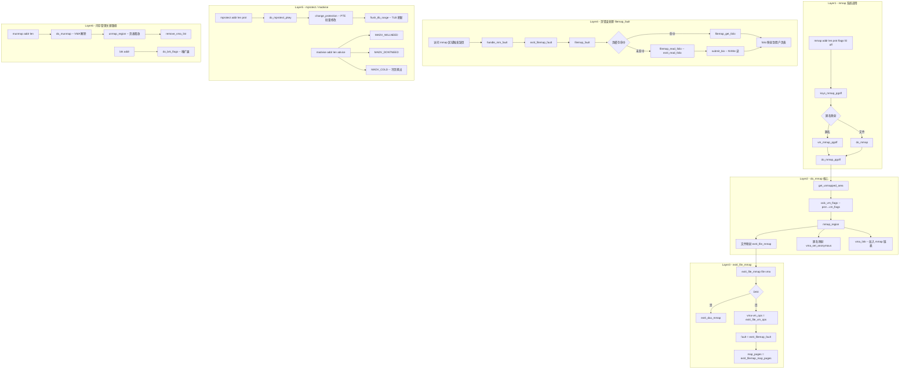

# mmap / munmap / mprotect / madvise / brk 系统调用完整路径分析

## 1 概述

内存管理系统调用来管理进程的虚拟地址空间（VAS），包括映射（mmap）、解除映射（munmap）、重映射（mremap）、堆扩展（brk）、权限变更（mprotect/pkey_mprotect）和内存使用建议（madvise）等。

### 关键特点

- **mmap**：创建文件映射或匿名映射，通过 VMA（Virtual Memory Area）管理
- **文件映射路径**：`mmap → do_mmap → 文件映射 → ext4_file_mmap → 页缓存`
- **匿名映射**：`mmap(MAP_ANONYMOUS)` 仅涉及 page allocator，不触及文件系统
- **页错误人口**：mmap 仅创建 VMA，实际物理页分配在 `page fault` 时发生
- **mprotect**：修改 VMA 的权限位，不涉及物理页操作
- **madvise**：通过 `fadvise` 影响页面缓存策略或匿名页行为
- **mseal**：禁止对内存区域的后续权限修改（x86 和 arm64 安全特性）

---

## 2 涉及的内核层

| 层 | 说明 |
|--|--|
| **Syscall Entry** | mmap/munmap/mremap/brk/mprotect/msync/madvise/mlock 等 (mm/ 目录) |
| **VMA 层** | do_mmap / do_munmap / do_brk_flags (mm/mmap.c) |
| **Page Table** | ARM64 页表操作（set_pte_at / flush_tlb） |
| **Page Allocator** | 匿名页分配（mm/page_alloc.c） |
| **Page Cache** | 文件映射缺页路径（mm/filemap.c） |
| **ext4** | ext4_file_mmap / ext4_read_folio（文件映射缺页回源） |
| **Swap** | 交换分区的读写（mm/swap_state.c） |
| **NUMA** | 内存策略节点分配（mm/mempolicy.c） |

---

## 3 mmap 系统调用

### 3.1 SYSCALL_DEFINE6(mmap) - mm/mmap.c

```c
// ARM64 上 mmap 通过 SYSCALL_DEFINE6 实现：
SYSCALL_DEFINE6(mmap, unsigned long, addr, unsigned long, len,
        unsigned long, prot, unsigned long, flags,
        unsigned long, fd, unsigned long, off)
{
    // ARM64 上页对齐偏移
    if (offset_in_page(off))
        return -EINVAL;
    return ksys_mmap_pgoff(addr, len, prot, flags, fd, off >> PAGE_SHIFT);
}
```

### 3.2 ksys_mmap_pgoff → do_mmap

```c
unsigned long ksys_mmap_pgoff(unsigned long addr, unsigned long len,
                  unsigned long prot, unsigned long flags,
                  unsigned long fd, unsigned long pgoff)
{
    struct file *file = NULL;

    // MAP_ANONYMOUS → 无文件
    if (!(flags & MAP_ANONYMOUS)) {
        file = fget(fd);
        if (!file)
            return -EBADF;
        if (file->f_mode & FMODE_PATH)
            return -EBADF;
    }
    // ...

    ret = vm_mmap_pgoff(file, addr, len, prot, flags, pgoff);
    // ...
}
```

### 3.3 do_mmap 核心路径

```
do_mmap(file, addr, len, prot, flags, pgoff, ...)
  ├─ get_unmapped_area         // 查找未映射的地址区间
  ├─ 检查 MAP_LOCKED / MAP_NORESERVE 等标志
  ├─ security_mmap_file        // LSM 安全检查
  ├─ 若文件映射：
  │    └─ file->f_op->mmap(file, vma)
  │         └─ ext4_file_mmap(vma, file)
  │              └─ vma->vm_ops = &ext4_file_vm_ops
  │                 .fault = ext4_dax_fault          // DAX
  │                 .map_pages = ext4_map_pages       // 非 DAX 缺页
  ├─ 若匿名映射：
  │    └─ vma_set_anonymous(vma)  // shmem_zero_setup 共享零页
  └─ vma_link(vma)              // 将 VMA 加入 mm->mmap 链表
```

### 3.4 ext4_file_mmap - fs/ext4/file.c

```c
static int ext4_file_mmap(struct file *file, struct vm_area_struct *vma)
{
    struct inode *inode = file_inode(file);
    // DAX 检查
    if (IS_DAX(inode))
        return ext4_dax_mmap(file, vma);

    // 文件一致性检查
    file_accessed(file);
    vma->vm_ops = &ext4_file_vm_ops;
    vma->vm_ops->fault = ext4_filemap_fault;       // → filemap_fault
    vma->vm_ops->map_pages = ext4_filemap_map_pages; // → filemap_map_pages
    return 0;
}
```

### 3.5 页错误处理（缺页时触发，非 mmap 时立即执行）

```
# 进程访问 mmap 映射区域 → CPU 触发缺页
do_page_fault(regs, esr, addr)           // arch/arm64/mm/fault.c
  └─ handle_mm_fault(vma, addr, flags, regs)
       └─ __handle_mm_fault(vma, addr, flags)
            └─ handle_pte_fault(&vmf)
                 ├─ vma->vm_ops->fault(&vmf)
                 │    └─ ext4_filemap_fault(&vmf)
                 │         └─ filemap_fault(&vmf)    // mm/filemap.c
                 │              ├─ filemap_get_folio  → 页缓存查找
                 │              ├─ 命中 → 直接标记 UPTODATE
                 │              └─ 未命中 → filemap_read_folio
                 │                   └─ mapping->a_ops->read_folio
                 │                        └─ ext4_read_folio
                 │                             → ext4_mpage_readpages
                 │                             → submit_bio → NVMe
                 └─ mmap 匿名缺页
                      └─ do_anonymous_page(&vmf)
                           └─ alloc_zeroed_user_highpage(vma, vmf->address)
                                └─ 分配零填充物理页
```

---

## 4 munmap / mremap

### 4.1 munmap

```
munmap(addr, length)
  └─ ksys_munmap(addr, len)
       └─ vm_munmap(addr, len)
            └─ do_munmap(mm, addr, len, uf)
                 ├─ arch_unmap(mm, addr, len)        // 架构特定
                 ├─ detach_vmas_to_be_unmapped       // 找到要解除的 VMA
                 ├─ unmap_region(mm, vma, ...)       // 释放页表
                 │    └─ unmap_vmas(&tlb, vma, ...)
                 │         └─ zap_page_range          // 清除 PTE
                 │              └─ tlb_flush_mmu      // TLB 刷新
                 └─ remove_vma_list(vmas)             // 释放 VMA
```

### 4.2 mremap

```
mremap(old_addr, old_size, new_size, flags, ...)
  └─ ksys_mremap(addr, old_len, new_len, flags, new_addr)
       └─ do_mremap(addr, old_len, new_len, flags, new_addr)
            ├─ MREMAP_MAYMOVE → move_vma
            │    ├─ 分配新区域
            │    ├─ move_page_tables（页表拷贝/移动）
            │    └─ 释放旧区域
            ├─ MREMAP_FIXED → mremap_to
            │    ├─ 检查目标地址
            │    └─ move_vma
            └─ 原地扩展 → vma_expand
```

---

## 5 brk / mprotect / madvise

### 5.1 brk

```
brk(addr)                                           // 设置堆边界
  └─ ksys_brk(addr)
       └─ do_brk_flags(addr, len, data_brk_flags)
            ├─ get_unmapped_area                     // 堆区域查找
            ├─ security_vm_enough_memory_mm          // 安全检查
            ├─ vma_merge / vma_expand                // 扩展或合并 VMA
            └─ vma_link                               // 连接 VMA
```

### 5.2 mprotect

```
mprotect(addr, len, prot)                          // 修改 VMA 权限
  └─ ksys_mprotect(addr, len, prot)
       └─ do_mprotect_pkey(addr, len, prot, pkey)
            ├─ security_mprotect_vma(vma, ...)      // LSM 检查
            ├─ 检查 VM_SPECIAL / VM_IO 等特殊标志    // 某些 VMA 不可修改
            ├─ vma_set_page_prot(vma)               // 设置新页属性
            │    └─ protection_map[prot]             // prot→页表权限映射
            └─ change_protection(vma, addr, end, ...) // 批量修改 PTE
                 └─ flush_tlb_range                  // TLB 刷新
```

### 5.3 madvise

```
madvise(addr, len, advice)                        // 内存使用模式建议
  └─ do_madvise(mm, addr, len, behavior)
       └─ madvise_walk_vmas(mm, addr, len, &walk)
            ├─ MADV_NORMAL/MADV_RANDOM/MADV_SEQUENTIAL → vma->vm_flags 修改
            │    → 影响 readahead 策略
            ├─ MADV_WILLNEED → madvise_pageout_page_range  // 预读
            │    → filemap_fault / filemap_map_pages
            ├─ MADV_DONTNEED → zap_page_range              // 释放页面
            ├─ MADV_COLD → madvise_cold_or_pageout_pte_range // 冷页交换
            ├─ MADV_PAGEOUT → madvise_cold_or_pageout_pte_range // 换出
            ├─ MADV_MERGEABLE → ksm_madvise_merge          // KSM 合并
            └─ MADV_HUGEPAGE → 透明大页（THP）建议
```

---

## 6 完整 Mermaid 流程图



---

## 7 完整函数调用链

### 7.1 mmap 文件映射

| 步骤 | 函数 | 文件:行号 | 说明 |
|--|--|--|--|
| 1 | `SYSCALL_DEFINE6(mmap, addr, len, prot, flags, fd, off)` | mm/mmap.c | 系统调用入口 |
| 2 | `ksys_mmap_pgoff(addr, len, prot, flags, fd, pgoff)` | mm/mmap.c | 文件获取 |
| 3 | `vm_mmap_pgoff(file, addr, len, prot, flags, pgoff)` | mm/util.c | mmap_lock 获取 |
| 4 | `do_mmap(file, addr, len, prot, flags, pgoff, ...)` | mm/mmap.c | 核心 mmap |
| 5 | `get_unmapped_area(file, addr, len, pgoff, flags)` | mm/mmap.c | 地址查找 |
| 6 | `calc_vm_flags(prot, flags)` | mm/mmap.c | 权限转换 |
| 7 | `mmap_region(file, addr, len, vm_flags, pgoff, ...)` | mm/mmap.c | 区域创建 |
| 8 | `file->f_op->mmap(file, vma)` | fs/ext4/file.c | ext4 mmap |
| 9 | `ext4_file_mmap(file, vma)` | fs/ext4/file.c | 设置 vm_ops |
| 10 | `vma_link(mm, vma, prev, rg, anon_vma)` | mm/mmap.c | VMA 链接 |

### 7.2 mmap 缺页路径

| 步骤 | 函数 | 文件:行号 | 说明 |
|--|--|--|--|
| 1 | `do_page_fault(regs, esr, addr)` | arch/arm64/mm/fault.c | ARM64 页错误 |
| 2 | `handle_mm_fault(vma, addr, flags, regs)` | mm/memory.c | VMA 查找 |
| 3 | `__handle_mm_fault(vma, addr, flags)` | mm/memory.c | 页表遍历 |
| 4 | `handle_pte_fault(&vmf)` | mm/memory.c | PTE 级别处理 |
| 5 | `do_fault(&vmf)` | mm/memory.c | 文件映射缺页 |
| 6 | `vma->vm_ops->fault(&vmf)` → `ext4_filemap_fault` | fs/ext4/file.c | ext4 缺页 |
| 7 | `filemap_fault(&vmf)` | mm/filemap.c | 通用文件缺页 |
| 8 | `filemap_get_folio` → 命中 → `folio_mark_accessed` | mm/filemap.c | 缓存命中 |
| 9 | 或：`filemap_read_folio` → `ext4_read_folio` → `submit_bio` | ext4 | 缺页读 |

---

## 8 进程虚拟地址空间布局

```
+----------------+ 0xFFFF_FFFF_FFFF_FFFF  (内核空间 TOP)
|   kernel VAS   |
+----------------+ TASK_SIZE (~0x0008_0000_0000 on ARM64 48-bit)
|   stack (↓)    |   ← 用户栈（向低地址增长）
+----------------+
|      ↓         |
|   mmap 区域     |   ← 文件/匿名映射（向高地址增长）
|      ↑         |
+----------------+
|      brk        |   ← 堆顶（do_brk_flags）
|     heap        |
+----------------+
|     data        |   ← 初始化的数据段
+----------------+
|     text        |   ← 代码段
+----------------+ 0x0000_0000_0000_0000
```

---

## 9 关键数据结构

```
struct vm_area_struct (VMA)
+---------------------------+
| vm_start / vm_end         |  ← 地址区间
| vm_flags (VM_READ/WRITE/EXEC)|
| vm_page_prot (pgprot_t)    |  ← 页表权限
| vm_file → struct file*     |  ← 文件（若文件映射）
| vm_ops → vm_operations_struct| ← .fault / .map_pages
| anon_vma → struct anon_vma* |  ← 匿名页反向映射
| vm_next / vm_prev          |  ← 链表连接
+---------------------------+

struct vm_operations_struct (ext4)
+---------------------------+
| .fault = ext4_filemap_fault|
| .map_pages = ext4_map_pages|
+---------------------------+

struct mm_struct              struct page (物理页)
+---------------------------+  +---------------------------+
| mmap (VMA 链表头部)        |  | flags (PG_locked/uptodate)|  
| mm_rb (VMA 红黑树根)       |  | mapping → address_space   |
| pgd (页全局目录 PGD 指针)  |  | index (页缓存索引)        |
| mmap_lock (读写信号量)     |  | ref_count                 |
| total_vm / locked_vm       |  +---------------------------+
+---------------------------+
```

---

## 10 总结

内存管理系统调用是理解 Linux 虚拟内存管理的核心：

1. **mmap 的两阶段架构**：`mmap` 仅创建 VMA（虚拟内存区域），物理页分配推迟到**缺页异常**（page fault）时由 `ext4_filemap_fault` → `filemap_fault` 完成。文件映射缺页会通过 `ext4_read_folio` → `submit_bio` → `NVMe` 从磁盘读取数据。

2. **VMA 操作类**（mprotect/brk/munmap）：仅修改进程地址空间的 VMA 元数据或页表权限，**不涉及**磁盘 I/O。mprotect 批量修改 PTE 后执行 TLB 刷新（`flush_tlb_range`）。

3. **内存使用建议类**（madvise）：MADV_WILLNEED 触发预读（实质触发缺页）；MADV_DONTNEED/COLD/PAGEOUT 释放或换出页面；MADV_MERGEABLE 启用 KSM 页面合并。

4. **文件映射 vs 匿名映射**：文件映射通过 `ext4_file_mmap` 设置 `vm_ops`，缺页时从文件读取；匿名映射通过 `vma_set_anonymous` 标记，缺页时通过 `do_anonymous_page` 分配零填充页。
