# 网络与Socket 系统调用完整路径分析

## 1 概述

网络与Socket 系统调用是 Linux 内核网络子系统的核心用户接口，涵盖从套接字创建（socket）、地址绑定（bind）、监听（listen）、连接（connect/accept）到数据收发（sendto/recvfrom/sendmsg/recvmsg）的完整生命周期。

### 关键特点

- **socket**：创建 socket 抽象，通过 `sock_create` → `net_families[family]->create` 回调实现协议族多态
- **bind/listen/accept/connect**：TCP 连接四元组建立过程，涉及 TCP 状态机迁移
- **sendto/recvfrom**：UDP 无连接数据收发，`sendmsg`/`recvmsg` 提供 scatter-gather 支持
- **sendmmsg/recvmmsg**：批量收发，减少系统调用次数
- **setsockopt/getsockopt**：通过 `level` + `optname` 二级分发表操作 socket 选项
- **多路复用**：内核 Socket 层通过 `struct proto_ops` 和 `struct proto` 双重间接调用实现协议无关设计

---

## 2 涉及的内核层

| 层 | 说明 |
|--|--|
| **Syscall Entry** | socket/bind/connect/sendmsg/recvmsg 等 (net/socket.c) |
| **VFS 层** | socket 通过 sock_alloc_file 伪装成普通文件 |
| **通用 Socket 层** | struct socket + struct sock 管理 (net/socket.c) |
| **INET 层** | inet_create/inet_sendmsg/inet_recvmsg (net/ipv4/af_inet.c) |
| **TCP/UDP 协议层** | tcp_sendmsg/tcp_recvmsg / udp_sendmsg/udp_recvmsg |
| **IP 层** | ip_queue_xmit / ip_local_deliver (net/ipv4/ip_output.c) |
| **邻居子系统** | ARP 解析 (net/core/neighbour.c) |
| **网络设备层** | dev_queue_xmit → netdev_ops->ndo_start_xmit |
| **NIC 驱动** | 实际收发包 (e.g., igb/mlx5) |

---

## 3 socket 系统调用

### 3.1 SYSCALL_DEFINE3(socket) - net/socket.c:1759

```c
SYSCALL_DEFINE3(socket, int, family, int, type, int, protocol)
{
    return __sys_socket(family, type, protocol);
}
```

### 3.2 __sys_socket - net/socket.c:1742

```c
int __sys_socket(int family, int type, int protocol)
{
    struct socket *sock;
    int flags;

    sock = __sys_socket_create(family, type,
                   update_socket_protocol(family, type, protocol));
    if (IS_ERR(sock))
        return PTR_ERR(sock);

    flags = type & ~SOCK_TYPE_MASK;
    if (SOCK_NONBLOCK != O_NONBLOCK && (flags & SOCK_NONBLOCK))
        flags = (flags & ~SOCK_NONBLOCK) | O_NONBLOCK;

    return sock_map_fd(sock, flags & (O_CLOEXEC | O_NONBLOCK));
}
```

### 3.3 __sys_socket_create → sock_create → __sock_create

```
__sys_socket_create(family, type, protocol)
  └─ sock_create(family, type, protocol, &sock)
       └─ __sock_create(current->nsproxy->net_ns, family, type, protocol, res, 0)
            ├─ security_socket_create(family, type, protocol, kern)  // LSM
            ├─ sock_alloc()                                          // 分配 struct socket
            │    └─ new_inode_pseudo(sock_mnt->mnt_sb)
            │         → sock_inode = SOCKET_I(inode)
            │         → sock->wq = sock_inode->i_socket_list (wait queue)
            ├─ pf = net_families[family]                              // 协议族查找
            ├─ module_get(pf->owner)                                  // 协议模块引用
            └─ pf->create(net, sock, protocol, kern)                  // → inet_create
                 └─ inet_create(net, sock, protocol, kern)            // net/ipv4/af_inet.c:260
```

### 3.4 inet_create - net/ipv4/af_inet.c:260

```
inet_create(net, sock, protocol, kern)
  ├─ 检查 protocol < IPPROTO_MAX
  ├─ sock->state = SS_UNCONNECTED
  ├─ inetsw[sock->type] 链表查找 answer (inet_protosw)
  │    ├─ 匹配 protocol (非 IPPROTO_IP)
  │    └─ 匹配 type (SOCK_STREAM/SOCK_DGRAM/RAW)
  ├─ answer->prot 赋值
  ├─ sk = sk_alloc(net, PF_INET, GFP_KERNEL, answer_prot, kern)  // 分配 struct sock
  │    └─ tcp_prot (TCP) or udp_prot (UDP)
  ├─ sock_init_data(sock, sk)                                       // 初始化 sock 数据
  │    └─ sk->sk_wq = sock->wq
  │    └─ sk->sk_state = TCP_CLOSE (for TCP)
  ├─ inet = inet_sk(sk)
  ├─ inet->inet_num = 0                                             // 端口未分配
  ├─ sk->sk_destruct = inet_sock_destruct / tcp_sock_destruct
  ├─ answer_flags & SOCK_USE_WRITE_QUEUE → tcp 写队列
  └─ module_put(answer->owner)
```

---

## 4 bind / listen / accept / connect

### 4.1 bind - net/socket.c:1908

```c
SYSCALL_DEFINE3(bind, int, fd, struct sockaddr __user *, umyaddr, int, addrlen)
{
    return __sys_bind(fd, umyaddr, addrlen);
}
```

```
__sys_bind(fd, umyaddr, addrlen)
  ├─ CLASS(fd, f)(fd)                                              // 获取 fd_file
  ├─ sock = sock_from_file(fd_file(f))
  ├─ err = move_addr_to_kernel(umyaddr, addrlen, &address)         // 用户→内核拷贝
  ├─ err = security_socket_bind(sock, (struct sockaddr *)&address, addrlen)  // LSM
  └─ err = READ_ONCE(sock->ops)->bind(sock, (struct sockaddr *)&address, addrlen)
       └─ inet_bind(sock, uaddr, addrlen)                           // net/ipv4/af_inet.c
            └─ sk->sk_prot->bind(sk, uaddr, addrlen)
                 └─ tcp_v4_bind / udp_v4_bind
                      └─ inet_cidr_range / inet_addr_valid 等检查
                      └─ inet_hash_connect / inet_hash  // 绑定端口
```

### 4.2 listen - net/socket.c:1946

```c
SYSCALL_DEFINE2(listen, int, fd, int, backlog)
{
    return __sys_listen(fd, backlog);
}
```

```
__sys_listen(fd, backlog)
  ├─ sock = sock_from_file(fd_file(f))
  ├─ somaxconn = sock_net(sk)->core.sysctl_somaxconn               // 系统最大 backlog
  ├─ backlog = min(backlog, somaxconn)
  ├─ security_socket_listen(sock, backlog)
  └─ ops->listen(sock, backlog) → inet_listen
       └─ net/ipv4/af_inet.c:238
            └─ __inet_listen_sk(sk, backlog)                        // net/ipv4/inet_connection_sock.c
                 ├─ inet_csk_listen_start(sk, backlog)              // TCP 监听开始
                 │    ├─ reqsk_queue_alloc(&icsk->icsk_accept_queue, nlr) // 请求队列
                 │    │    → 分配 struct request_sock_queue
                 │    └─ sk->sk_state = TCP_LISTEN                  // TCP 状态迁移
                 └─ sk->sk_max_ack_backlog = backlog                // 最大半连接数
```

### 4.3 accept4 - net/socket.c:2037

```c
SYSCALL_DEFINE4(accept4, int, fd, struct sockaddr __user *, upeer_sockaddr,
        int __user *, upeer_addrlen, int, flags)
{
    return __sys_accept4(fd, upeer_sockaddr, upeer_addrlen, flags);
}
```

```
__sys_accept4(fd, upeer_sockaddr, upeer_addrlen, flags)
  └─ __sys_accept4_file(file, upeer_sockaddr, upeer_addrlen, flags)
       ├─ do_accept(file, &arg, upeer_sockaddr, upeer_addrlen, flags)
       │    ├─ sock_alloc() → newsock
       │    ├─ ops->accept(sock, newsock, &arg) → inet_accept
       │    │    └─ net/ipv4/af_inet.c:788
       │    │         ├─ sk1->sk_prot->accept(sk1, &arg)
       │    │         │    └─ inet_csk_accept(sk, arg, ...)         // net/ipv4/inet_connection_sock.c
       │    │         │         ├─ lock_sock(sk)
       │    │         │         ├─ 等待 sk->sk_receive_queue 非空
       │    │         │         │    → defwait (若阻塞)
       │    │         │         └─ skb = skb_dequeue(&sk->sk_receive_queue)
       │    │         │         └─ newsk = skb->sk                  // 新 child sock
       │    │         └─ __inet_accept(sock, newsock, sk2)          // 连接建立
       │    │              ├─ newsock->sk = sk2
       │    │              ├─ sock_graft(sk2, newsock)              // 绑定 sock→socket
       │    │              └─ newsock->state = SS_CONNECTED
       │    ├─ move_addr_to_user(&address, len, upeer_sockaddr, upeer_addrlen) // 地址回传
       │    └─ sock_alloc_file(newsock, flags, NULL)                // 新 fd 分配
       └─ fd_install(newfd, newfile)                                // 注册 fd
```

### 4.4 connect - net/socket.c:2111

```c
SYSCALL_DEFINE3(connect, int, fd, struct sockaddr __user *, uservaddr,
        int, addrlen)
{
    return __sys_connect(fd, uservaddr, addrlen);
}
```

```
__sys_connect(fd, uservaddr, addrlen)
  ├─ move_addr_to_kernel(uservaddr, addrlen, &address)            // 用户→内核拷贝
  └─ __sys_connect_file(file, &address, addrlen, 0)
       ├─ security_socket_connect(sock, &address, addrlen)        // LSM
       └─ ops->connect(sock, (struct sockaddr *)&address, addrlen, file_flags)
            └─ inet_stream_connect → __inet_stream_connect        // net/ipv4/af_inet.c
                 ├─ sock->state = SS_CONNECTING
                 ├─ sk->sk_prot->connect(sk, uaddr, addr_len)
                 │    └─ tcp_v4_connect(sk, uaddr, addr_len)      // net/ipv4/tcp_ipv4.c
                 │         ├─ inet_hash_connect(&tcp_death_row, sk)  // 绑定临时端口
                 │         ├─ ip_route_connect(&fl4, ...)          // 路由查找
                 │         ├─ sk->sk_route_caps = ...              // 路由能力
                 │         ├─ tcp_connect(sk)                      // net/ipv4/tcp_output.c
                 │         │    ├─ tcp_connect_init(sk)            // 初始化 SEQ/Window
                 │         │    ├─ tcp_send_synack(sk)             // 构造 SYN 段
                 │         │    │    └─ __tcp_transmit_skb(sk, buff, ...)  // IP 层发出
                 │         │    └─ inet_csk_reset_xmit_timer(sk, ICSK_TIME_RETRANS, ...)  // 重传定时器
                 │         └─ tcp_set_state(sk, TCP_SYN_SENT)      // TCP 状态迁移
                 ├─ 若非阻塞且未完成 → 返回 -EINPROGRESS
                 └─ sock->state = SS_CONNECTED (或 SS_UNCONNECTED on error)
```

---

## 5 sendto / recvfrom / sendmsg / recvmsg

### 5.1 sendto - net/socket.c:2209

```c
SYSCALL_DEFINE6(sendto, int, fd, void __user *, buff, size_t, len,
        unsigned int, flags, struct sockaddr __user *, addr,
        int, addr_len)
{
    return __sys_sendto(fd, buff, len, flags, addr, addr_len);
}
```

```
__sys_sendto(fd, buff, len, flags, addr, addr_len)
  ├─ import_ubuf(ITER_SOURCE, buff, len, &msg.msg_iter)          // iov_iter 设置
  ├─ sock = sock_from_file(fd_file(f))
  ├─ 若 addr 非空: move_addr_to_kernel(addr, addr_len, &address)  // 目标地址拷贝
  ├─ msg.msg_name = (addr ? &address : NULL)
  ├─ msg.msg_flags = flags (附加 MSG_DONTWAIT 若 O_NONBLOCK)
  └─ __sock_sendmsg(sock, &msg)
       └─ sock_sendmsg_nosec(sock, msg)
            └─ INDIRECT_CALL_INET(ops->sendmsg, inet6_sendmsg, inet_sendmsg, sock, msg, len)
                 └─ inet_sendmsg(sock, msg, size)                 // net/ipv4/af_inet.c:858
                      ├─ inet_send_prepare(sk)                    // 检查/打开 socket
                      │    └─ lock_sock(sk)
                      │    └─ 处理 sk->sk_err / sk->sk_shutdown
                      │    └─ release_sock(sk)
                      └─ sk->sk_prot->sendmsg(sk, msg, size)      // 协议分发
                           ├─ TCP: tcp_sendmsg(sk, msg, size)     // net/ipv4/tcp.c:1460
                           │    └─ lock_sock(sk)
                           │    └─ tcp_sendmsg_locked(sk, msg, size)
                           │         ├─ tcp_send_mss(sk, &size_goal, 0)
                           │         ├─ while (msg_data_left(msg))
                           │         │    ├─ sk_stream_alloc_skb(sk, size_goal, ...) // skb 分配
                           │         │    ├─ skb_copy_to_page_nocache  // 用户数据拷贝
                           │         │    └─ tcp_push(sk, msg_flags, mss_now, ...)  // 推送
                           │         │         ├─ __tcp_push_pending_frames(sk, ...)
                           │         │         │    └─ tcp_write_xmit(sk)            // 发送
                           │         │         │         └─ tcp_transmit_skb(sk, skb, ...)
                           │         │         │              └─ __tcp_transmit_skb(sk, skb, ...)
                           │         │         │                   └─ icsk->icsk_af_ops->queue_xmit(sk, skb, &inet->cork.fl)
                           │         │         │                        └─ ip_queue_xmit(sk, skb, fl)  // IP 层路由
                           │         │         │                             └─ ip_local_out(net, sk, skb)
                           │         │         │                                  └─ __ip_local_out(net, sk, skb)
                           │         │         │                                       └─ dst_output(net, sk, skb)
                           │         │         │                                            └─ ip_output(net, sk, skb)
                           │         │         │                                                 └─ ip_finish_output(net, sk, skb)
                           │         │         │                                                      └─ dev_queue_xmit(skb)  // 设备层
                           │         │         └─ tcp_push_one(sk, mss_now)
                           │         └─ release_sock(sk)
                           └─ UDP: udp_sendmsg(sk, msg, size)     // net/ipv4/udp.c
                                └─ ip_route_output_flow
                                └─ udp_send_skb(sk, skb, fl4)
                                     └─ ip_local_out
```

### 5.2 sendmsg - net/socket.c:2681

```c
SYSCALL_DEFINE3(sendmsg, int, fd, struct user_msghdr __user *, msg,
        unsigned int, flags)
{
    return __sys_sendmsg(fd, msg, flags, true);
}
```

sendmsg 与 sendto 的核心区别在于：
- sendmsg 使用 `struct msghdr` 结构体（可包含 control message、辅助数据）
- 通过 `___sys_sendmsg` → `copy_msghdr_from_user` → `import_iovec` 处理 iovec
- 最终同样调用 `__sock_sendmsg`

### 5.3 recvfrom - net/socket.c:2267

```c
SYSCALL_DEFINE6(recvfrom, int, fd, void __user *, ubuf, size_t, size,
        unsigned int, flags, struct sockaddr __user *, addr,
        int __user *, addr_len)
{
    return __sys_recvfrom(fd, ubuf, size, flags, addr, addr_len);
}
```

```
__sys_recvfrom(fd, ubuf, size, flags, addr, addr_len)
  ├─ import_ubuf(ITER_DEST, ubuf, size, &msg.msg_iter)            // iov_iter 设置
  ├─ sock = sock_from_file(fd_file(f))
  ├─ err = __sock_recvmsg(sock, &msg)                             // LSM 检查
  └─ err = sock_recvmsg_nosec(sock, &msg)
       └─ ops->recvmsg(sock, msg, size, flags)
            └─ inet_recvmsg(sock, msg, size, flags)               // net/ipv4/af_inet.c:887
                 ├─ sk->sk_prot->recvmsg(sk, msg, size, flags, &addr_len)
                 │    ├─ TCP: tcp_recvmsg(sk, msg, len, flags, addr_len)
                 │    │    └─ net/ipv4/tcp.c:2965
                 │    │         ├─ sk_busy_loop (若支持忙等)
                 │    │         ├─ lock_sock(sk)
                 │    │         ├─ tcp_recvmsg_locked(sk, msg, len, flags, ...)
                 │    │         │    ├─ while (1)
                 │    │         │    │    ├─ skb = tcp_recv_skb(sk, &tss, &cmsg_flags) // 读 skb
                 │    │         │    │    ├─ if (!skb) → tcp_wait_data  // 阻塞等待
                 │    │         │    │    ├─ skb_copy_datagram_msg(skb, &tp->copied_seq, msg)  // 数据拷贝
                 │    │         │    │    │    └─ copy_page_to_iter(skb_frag_page, offset, len, &msg->msg_iter)
                 │    │         │    │    └─ tcp_eat_recv_skb / tcp_cleanup_rbuf  // 释放/窗口更新
                 │    │         │    └─ release_sock(sk)
                 │    │         └─ tcp_recv_timestamp / tcp_inq_hint  // 辅助数据
                 │    └─ UDP: udp_recvmsg(sk, msg, len, flags, addr_len)
                 │         └─ __skb_recv_datagram
                 │         └─ skb_copy_datagram_msg
                 └─ msg->msg_namelen = addr_len                    // 源地址长度回传
```

### 5.4 recvmsg - net/socket.c:2890

recvmsg 使用 `struct msghdr` 辅以 control message。通过 `___sys_recvmsg` 从用户空间拷贝 msg 结构，最多支持 `UIO_MAXIOV` 个 iovec 段。

### 5.5 sendmmsg / recvmmsg 批量收发

```c
// sendmmsg - 一次发送多个消息（减少 syscall 次数）
SYSCALL_DEFINE4(sendmmsg, int, fd, struct mmsghdr __user *, mmsg,
        unsigned int, vlen, unsigned int, flags)
{
    return __sys_sendmmsg(fd, mmsg, vlen, flags, true);
}

// recvmmsg - 一次接收多个消息
SYSCALL_DEFINE5(recvmmsg, int, fd, struct mmsghdr __user *, mmsg,
        unsigned int, vlen, unsigned int, flags,
        struct __kernel_timespec __user *, timeout)
{
    return __sys_recvmmsg(fd, mmsg, vlen, flags, timeout);
}
```

核心优化原理：
- `__sys_sendmmsg` 循环调用 `___sys_sendmsg`，但只做一次 `CLASS(fd)` 获取，避免反复查 fd 表
- `vlen` 上限为 `UIO_MAXIOV`，防止内核空间消耗过多
- `recvmmsg` 支持 `timeout` 超时，内部使用 `poll_schedule_timeout`

---

## 6 setsockopt / getsockopt / shutdown

### 6.1 setsockopt - net/socket.c:2350

```c
SYSCALL_DEFINE5(setsockopt, int, fd, int, level, int, optname,
        char __user *, optval, int, optlen)
{
    return __sys_setsockopt(fd, level, optname, optval, optlen);
}
```

```
__sys_setsockopt → do_sock_setsockopt
  ├─ security_socket_setsockopt(sock, level, optname)             // LSM 检查
  ├─ BPF_CGROUP_RUN_PROG_SETSOCKOPT                               // cgroup BPF 干预
  ├─ ops->setsockopt(sock, level, optname, optval, optlen)        // → inet_setsockopt
  │    └─ net/ipv4/af_inet.c
  │         ├─ SOL_SOCKET 级别 → sock_setsockopt(sk, ...)
  │         │    ├─ SO_REUSEADDR / SO_KEEPALIVE / SO_LINGER 等
  │         │    ├─ SO_RCVBUF / SO_SNDBUF → sk->sk_userlocks 设置
  │         │    └─ SO_ATTACH_FILTER → sk_attach_filter (BPF)
  │         └─ IPPROTO_TCP 级别 → tcp_setsockopt(sk, ...)
  │         │    ├─ TCP_NODELAY → tp->nonagle 设置
  │         │    ├─ TCP_CORK → tp->nonagle |= TCP_NAGLE_CORK
  │         │    └─ TCP_KEEPIDLE / TCP_KEEPINTVL / TCP_KEEPCNT
  │         └─ IPPROTO_IP 级别 → ip_setsockopt(sk, ...)
  │              ├─ IP_TTL → inet->uc_ttl
  │              └─ IP_MULTICAST_TTL
  └─ BPF_CGROUP_RUN_PROG_SETSOCKOPT_LOCK (后处理)
```

### 6.2 getsockopt - net/socket.c

类似 setsockopt 的对称操作，通过 `do_sock_getsockopt` → `ops->getsockopt` 读取选项值。

### 6.3 shutdown - net/socket.c:2451

```c
SYSCALL_DEFINE2(shutdown, int, fd, int, how)
{
    return __sys_shutdown(fd, how);
}
```

```
__sys_shutdown(fd, how)
  └─ __sys_shutdown_sock(sock, how)
       └─ ops->shutdown(sock, how) → inet_shutdown
            └─ net/ipv4/af_inet.c:905
                 ├─ how++  // 偏移：0→1(RCV), 1→2(SEND)
                 ├─ sk->sk_prot->shutdown(sk, how) → tcp_shutdown
                 │    ├─ tcp_set_state(sk, TCP_FIN_WAIT1)  // 若双向关闭
                 │    ├─ tcp_send_fin(sk)                   // 发送 FIN 段
                 │    └─ sk->sk_shutdown = how
                 └─ sock->state = SS_DISCONNECTING
```

---

## 7 完整 Mermaid 流程图

### 7.1 socket 创建 + bind/listen/accept/connect

```mermaid
graph TB
    subgraph L1[Layer1 - socket 创建]
        A1[socket family type protocol]
        A2[__sys_socket_create]
        A3[__sock_create]
        A4[sock_alloc -- 分配socket]
        A5[net_families-family-create]
        A6[inet_create -- TCP-UDP 初始化]
        A7[sock_map_fd -- 绑定fd]
        A1 --> A2 --> A3
        A3 --> A4 --> A5 --> A6
        A2 --> A7
    end

    subgraph L2[Layer2 - bind / listen]
        B1[bind fd addr addrlen]
        B2[move_addr_to_kernel]
        B3[inet_bind]
        B4[tcp_v4_bind -- 绑定端口]
        B5[listen fd backlog]
        B6[somaxconn 限制]
        B7[__inet_listen_sk]
        B8[inet_csk_listen_start]
        B9[sk-state = TCP_LISTEN]
        B1 --> B2 --> B3 --> B4
        B5 --> B6 --> B7
        B7 --> B8 --> B9
    end

    subgraph L3[Layer3 - accept / connect]
        C1[accept4 fd flags]
        C2[do_accept -- 新sock]
        C3[inet_accept]
        C4[inet_csk_accept]
        C5[__inet_accept]
        C6[sock_alloc_file -- 新fd]
        C7[connect fd addr]
        C8[move_addr_to_kernel]
        C9[inet_stream_connect]
        C10[tcp_v4_connect]
        C11[ip_route_connect]
        C12[tcp_connect -- SYN发出]
        C13[sk-state = TCP_SYN_SENT]
        C1 --> C2 --> C3 --> C4 --> C5 --> C6
        C7 --> C8 --> C9 --> C10
        C10 --> C11 --> C12 --> C13
    end

    subgraph L4[Layer4 - TCP sendmsg 数据路径]
        D1[sendmsg fd msg flags]
        D2[__sock_sendmsg]
        D3[inet_sendmsg]
        D4[tcp_sendmsg]
        D5[tcp_sendmsg_locked]
        D6[sk_stream_alloc_skb]
        D7[skb_copy_to_page_nocache]
        D8[tcp_push -- 推送]
        D9[__tcp_transmit_skb]
        D10[ip_queue_xmit -- IP路由]
        D11[dev_queue_xmit -- 设备层]
        D1 --> D2 --> D3 --> D4 --> D5
        D5 --> D6 --> D7 --> D8
        D8 --> D9 --> D10 --> D11
    end

    subgraph L5[Layer5 - TCP recvmsg 数据路径]
        E1[recvmsg fd msg flags]
        E2[inet_recvmsg]
        E3[tcp_recvmsg]
        E4[tcp_recvmsg_locked]
        E5{skb 就绪}
        E6[tcp_recv_skb]
        E7[skb_copy_datagram_msg]
        E8[tcp_wait_data -- 阻塞]
        E9[copy_page_to_iter]
        E1 --> E2 --> E3 --> E4
        E4 --> E5
        E5 -- 就绪 --> E6 --> E7 --> E9
        E5 -- 无 --> E8 --> E5
    end

    subgraph L6[Layer6 - setsockopt / shutdown]
        F1[setsockopt fd level optname]
        F2[do_sock_setsockopt]
        F3{level}
        F4[SOL_SOCKET -- sock_setsockopt]
        F5[IPPROTO_TCP -- tcp_setsockopt]
        F6[IPPROTO_IP -- ip_setsockopt]
        F7[shutdown fd how]
        F8[inet_shutdown]
        F9[tcp_shutdown -- FIN发出]
        F1 --> F2 --> F3
        F3 --> F4
        F3 --> F5
        F3 --> F6
        F7 --> F8 --> F9
    end
```



---

## 8 完整函数调用链

### 8.1 socket / bind / listen

| 步骤 | 函数 | 文件:行号 | 层 |
|--|--|--|--|
| 1 | `SYSCALL_DEFINE3(socket)` | net/socket.c:1759 | Syscall |
| 2 | `__sys_socket(family, type, protocol)` | net/socket.c:1742 | Socket |
| 3 | `__sock_create(net, family, type, protocol, res, 0)` | net/socket.c | Socket |
| 4 | `sock_alloc()` | net/socket.c | Socket |
| 5 | `net_families[family]->create(net, sock, protocol, kern)` | net/socket.c | Socket |
| 6 | `inet_create(net, sock, protocol, kern)` | net/ipv4/af_inet.c:260 | INET |
| 7 | `sk_alloc(net, PF_INET, GFP_KERNEL, answer_prot, kern)` | net/core/sock.c | INET |
| 8 | `sock_init_data(sock, sk)` | net/core/sock.c | INET |
| 9 | `sock_map_fd(sock, flags)` | net/socket.c | Socket |
| 10 | `SYSCALL_DEFINE3(bind)` | net/socket.c:1908 | Syscall |
| 11 | `move_addr_to_kernel(umyaddr, addrlen, &address)` | net/socket.c | Socket |
| 12 | `inet_bind(sock, uaddr, addrlen)` | net/ipv4/af_inet.c | INET |
| 13 | `tcp_v4_bind(sk, uaddr, addrlen)` | net/ipv4/tcp_ipv4.c | TCP |
| 14 | `SYSCALL_DEFINE2(listen)` | net/socket.c:1946 | Syscall |
| 15 | `__inet_listen_sk(sk, backlog)` | net/ipv4/af_inet.c | INET |
| 16 | `inet_csk_listen_start(sk, backlog)` | net/ipv4/inet_connection_sock.c | TCP |

### 8.2 accept / connect

| 步骤 | 函数 | 文件:行号 | 层 |
|--|--|--|--|
| 1 | `SYSCALL_DEFINE4(accept4)` | net/socket.c:2048 | Syscall |
| 2 | `__sys_accept4(fd, upeer_sockaddr, upeer_addrlen, flags)` | net/socket.c:2037 | Socket |
| 3 | `do_accept(file, arg, upeer_sockaddr, upeer_addrlen, flags)` | net/socket.c:1951 | Socket |
| 4 | `inet_accept(sock, newsock, arg)` | net/ipv4/af_inet.c:788 | INET |
| 5 | `inet_csk_accept(sk, arg)` | net/ipv4/inet_connection_sock.c | TCP |
| 6 | `__inet_accept(sock, newsock, sk2)` | net/ipv4/af_inet.c | INET |
| 7 | `SYSCALL_DEFINE3(connect)` | net/socket.c:2111 | Syscall |
| 8 | `__inet_stream_connect(sock, uaddr, addr_len, 0)` | net/ipv4/af_inet.c | INET |
| 9 | `tcp_v4_connect(sk, uaddr, addr_len)` | net/ipv4/tcp_ipv4.c | TCP |
| 10 | `ip_route_connect(&fl4, ...)` | net/ipv4/route.c | IP |
| 11 | `tcp_connect(sk)` | net/ipv4/tcp_output.c | TCP |
| 12 | `__tcp_transmit_skb(sk, buff, ...)` | net/ipv4/tcp_output.c | TCP |

### 8.3 sendto / sendmsg (TCP 路径)

| 步骤 | 函数 | 文件:行号 | 层 |
|--|--|--|--|
| 1 | `SYSCALL_DEFINE6(sendto)` | net/socket.c:2209 | Syscall |
| 2 | `__sys_sendto(fd, buff, len, flags, addr, addr_len)` | net/socket.c:2171 | Socket |
| 3 | `__sock_sendmsg(sock, &msg)` | net/socket.c:737 | Socket |
| 4 | `inet_sendmsg(sock, msg, size)` | net/ipv4/af_inet.c:858 | INET |
| 5 | `tcp_sendmsg(sk, msg, size)` | net/ipv4/tcp.c:1460 | TCP |
| 6 | `tcp_sendmsg_locked(sk, msg, size)` | net/ipv4/tcp.c | TCP |
| 7 | `tcp_push(sk, msg_flags, mss_now, ...)` | net/ipv4/tcp.c | TCP |
| 8 | `__tcp_push_pending_frames(sk)` | net/ipv4/tcp_output.c | TCP |
| 9 | `tcp_write_xmit(sk)` | net/ipv4/tcp_output.c | TCP |
| 10 | `__tcp_transmit_skb(sk, skb, ...)` | net/ipv4/tcp_output.c | TCP |
| 11 | `ip_queue_xmit(sk, skb, fl)` | net/ipv4/ip_output.c | IP |
| 12 | `ip_local_out(net, sk, skb)` | net/ipv4/ip_output.c | IP |
| 13 | `dev_queue_xmit(skb)` | net/core/dev.c | Device |

### 8.4 recvfrom / recvmsg (TCP 路径)

| 步骤 | 函数 | 文件:行号 | 层 |
|--|--|--|--|
| 1 | `SYSCALL_DEFINE6(recvfrom)` | net/socket.c:2267 | Syscall |
| 2 | `__sys_recvfrom(fd, ubuf, size, flags, addr, addr_len)` | net/socket.c:2231 | Socket |
| 3 | `inet_recvmsg(sock, msg, size, flags)` | net/ipv4/af_inet.c:887 | INET |
| 4 | `tcp_recvmsg(sk, msg, len, flags, addr_len)` | net/ipv4/tcp.c:2965 | TCP |
| 5 | `tcp_recvmsg_locked(sk, msg, len, flags, ...)` | net/ipv4/tcp.c | TCP |
| 6 | `skb_copy_datagram_msg(skb, offset, msg)` | net/core/datagram.c | Core |
| 7 | `copy_page_to_iter(page, offset, len, &msg->msg_iter)` | lib/iov_iter.c | Core |

---

## 9 关键数据结构

```
struct socket                         struct sock (通用)
+-----------------------------+      +------------------------------+
| state (SS_UNCONNECTED/...)  |      | sk_state (TCP_CLOSE/EST...)  |
| type (SOCK_STREAM/DGRAM)    |      | sk_type                      |
| ops → struct proto_ops      |      | sk_prot → struct proto       |
| sk → struct sock            |      | sk_receive_queue (skb队列)    |
| file → struct file          |      | sk_write_queue               |
| flags                       |      | sk_rcvbuf / sk_sndbuf        |
+-----------------------------+      | sk_rmem_alloc / sk_wmem_alloc|
                                     | sk_refcnt                    |
struct proto_ops (多态方法)           | sk_lock (mutex)              |
+-----------------------------+      +------------------------------+
| .bind     → inet_bind       |
| .connect  → inet_stream_conn|      struct inet_sock
| .listen   → inet_listen     |      +------------------------------+
| .accept   → inet_accept     |      | inet_opt (inet_sock opt)     |
| .sendmsg  → inet_sendmsg    |      | pinet6 (IPv6 only)           |
| .recvmsg  → inet_recvmsg    |      | inet_num (端口号)             |
| .shutdown → inet_shutdown   |      | inet_saddr (源IP)             |
| .setsockopt→ inet_setsockopt|      | inet_daddr (目标IP)           |
| .getsockopt→ inet_getsockopt|      | uc_ttl / pmtudisc            |
+-----------------------------+      +------------------------------+

struct proto (TCP)                struct sk_buff
+-----------------------------+   +--------------------------------+
| .name = "TCP"               |   | sk (指向 struct sock)            |
| .sendmsg  → tcp_sendmsg     |   | data / len / head / end         |
| .recvmsg  → tcp_recvmsg     |   | cb[48] (协议控制块)              |
| .connect  → tcp_v4_connect  |   | skb_queue (链表管理)              |
| .shutdown → tcp_shutdown    |   | tstamp / dev / hash             |
| .close    → tcp_close       |   | destructor / end_func           |
| .backlog_rcv → tcp_v4_do_rcv|   +--------------------------------+
+-----------------------------+

struct tcp_sock (扩展 sock)
+-----------------------------+
| tcp_header_len / pred_flags |
| snd_una / snd_nxt / rcv_nxt  |
| write_seq / pushed_seq       |
| nonagle / keepalive_probes   |
| mss_cache / window_clamp     |
| rcv_wnd / snd_wnd            |
| out_of_order_queue (OoO)     |
+-----------------------------+
```

---

## 10 总结

网络与Socket 系统调用完整路径：

```
用户态 socket/bind/connect/sendmsg/recvmsg
  │
  ├─(1) Socket 层 (net/socket.c)
  │    └─ syscall 入口 → 参数校验 → ops->xxx 多态分发
  │
  ├─(2) INET 层 (net/ipv4/af_inet.c)
  │    └─ inet_create/inet_sendmsg/inet_recvmsg
  │    └─ sk->sk_prot->xxx 二级分发
  │
  ├─(3) TCP/UDP 协议层
  │    ├─ TCP: tcp_sendmsg → tcp_write_xmit → __tcp_transmit_skb
  │    ├─ TCP: tcp_recvmsg → skb_copy_datagram_msg → copy_page_to_iter
  │    └─ UDP: udp_sendmsg → ip_route_output_flow → udp_send_skb
  │
  ├─(4) IP 层 (net/ipv4/ip_output.c)
  │    └─ ip_queue_xmit → ip_local_out → dst_output → ip_output
  │
  ├─(5) 邻居 / 路由 / Netfilter
  │
  └─(6) 设备层
       └─ dev_queue_xmit → ndo_start_xmit → NIC 硬件
```

核心设计模式：
- **双重多态**：`socket->ops->xxx` (proto_ops 层) → `sk->sk_prot->xxx` (proto 层)
- **间接调用**：`INDIRECT_CALL_INET` / `INDIRECT_CALL_2` 优化多态性能
- **零拷贝发送**：skb 的 frag 直接引用用户页（需 MSG_ZEROCOPY 支持）
- **NOSEC 优化**：`sock_sendmsg_nosec` / `sock_recvmsg_nosec` 绕过 LSM（若已检查过）
- **批量优化**：sendmmsg/recvmmsg 减少 syscall 次数
