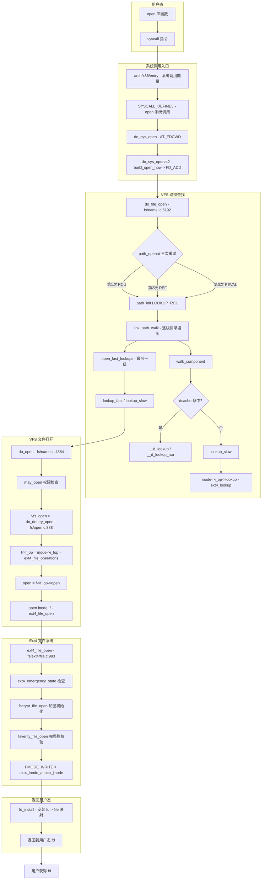

# ***open***

**完整对比表**

| 维度                   | **open** | **openat** | **openat2**       |
| ---------------------- | -------------- | ---------------- | ----------------------- |
| **路径解析起点** | 当前工作目录   | dirfd 或 CWD     | dirfd 或 CWD            |
| **符号链接处理** | O_NOFOLLOW     | O_NOFOLLOW       | RESOLVE_NO_SYMLINKS     |
| **逃逸防护**     | 无             | 有限             | RESOLVE_BENEATH/IN_ROOT |
| **魔法链接**     | 支持           | 支持             | RESOLVE_NO_MAGICLINKS   |
| **跨设备限制**   | 无             | 无               | RESOLVE_NO_XDEV         |
| **参数扩展**     | 无法扩展       | 难以扩展         | 易于扩展                |
| **版本管理**     | 无             | 无               | size 参数版本检查       |
| **安全性**       | 低             | 中               | 高                      |
| **性能**         | 最优           | 中等             | 略低但可接受            |
| **兼容性**       | 最好           | 好               | Linux 5.6+              |
| **推荐场景**     | 遗留代码       | 一般应用         | 安全关键应用            |


在 Linux 6.18 中：

1. **`open`** 主要用于兼容性，新代码应避免使用
2. **`openat`** 是目前的主流选择，平衡了功能和兼容性
3. **`openat2`** 是未来的方向，提供了最强的安全特性和扩展性

对于新项目，特别是安全敏感的应用，强烈推荐使用 `openat2`。它的结构体设计确保了向后兼容，同时提供了防止各种路径遍历攻击的能力。对于需要支持老内核的系统，可以回退到 `openat`，但应避免使用原始的 `open`。

## **do_sys_open代码执行flow**

    path lookup过程是顺着dentry树从上到下查找的，如果遇到符号链接，会沿着符号链接进入下一级目录，如果遇到挂载点，会进入挂载点，如果遇到文件，则打开文件。**执行流程分析**

1. **系统调用入口与参数转换：**do_sys_open 首先调用 build_open_how 初始化 open_how 结构体（支持 openat2 参数），随后进入 do_sys_openat2 调用 build_open_flags 将其转换为内核内部的 open_flags 结构。
2. **文件描述符分配与路径查找：**通过 get_unused_fd_flags 分配 fd，然后调用 do_filp_open 进入 VFS 路径查找核心。path_init 初始化查找起点，link_path_walk 逐级解析路径分量。
3. **目录项查找与 EXT4 inode 读取**：在 walk_component 中，优先调用 lookup_fast 查找 dcache；若未命中，则进入 lookup_slow 调用 ext4_lookup。EXT4 通过 ext4_find_entry 遍历目录项，若目标 inode 不在内存，则调用 __ext4_get_inode_loc 计算磁盘物理块位置，并通过 sb_bread 触发块 I/O 读取。
4. **NVMe 块设备 I/O 提交与完成：**sb_bread 构造 buffer_head 并向通用块层提交 bio。请求到达 NVMe 驱动后，被转化为 NVMe Read 命令（SQE）提交至 SQ 队列，并写 Doorbell 寄存器通知控制器。控制器 DMA 读取完成后产生 CQE 中断，驱动在中断上下文释放 bio 完成回调，将数据写入页缓存并唤醒等待进程。
5. **文件结构初始化与绑定：**回到 VFS 层，open_last_lookups 和 do_open 被调用，进入 vfs_open -> do_dentry_open。在此将 inode->i_fop（即 ext4_file_operations）赋给 file->f_op，并调用 ext4_file_open 完成文件系统特定逻辑。最后 fd_install 将 file 与 fd 绑定。

### 执行flow

```mermaid
flowchart TD
    A([用户态调用 open/openat/openat2]) --> B[do_sys_open]
  
    subgraph VFS系统调用层
        B --> C[build_open_how<br/>初始化open_how, 支持openat2参数]
        C --> D[do_sys_openat2]
        D --> E[build_open_flags<br/>转换open_how为内核open_flags]
        E --> F[get_unused_fd_flags<br/>分配文件描述符fd]
        F --> G[do_filp_open]
    end

    G --> H[path_openat]

    subgraph VFS路径解析层
        H --> I[alloc_empty_file<br/>分配struct file结构体]
        I --> J[path_init<br/>初始化查找起点与nameidata]
        J --> K[link_path_walk<br/>逐级解析路径分量]
    
        K --> L{处理路径分量}
        L --> M[may_lookup<br/>检查目录执行权限]
        M --> N[walk_component]
    
        N --> O{dcache是否命中?}
        O -- 是 --> V[step_into<br/>进入下一级/处理挂载点]
    
        O -- 否 --> P[lookup_slow]
        P --> Q[d_alloc_parallel<br/>分配dentry加入dcache]
        Q --> R[__lookup_slow]
    end

    subgraph EXT4文件系统层
        R --> S[ext4_lookup<br/>EXT4目录项查找]
        S --> T[ext4_lookup_entry]
        T --> U{检查inline data?}
    
        U -- 是 --> U1[ext4_find_inline_entry<br/>从inode内联数据中查找]
    
        U -- 否 --> U2[__ext4_find_entry<br/>从磁盘目录块中查找]
    
        U1 --> U3[ext4_get_inode_loc<br/>获取目标inode磁盘位置]
        U2 --> U3
    
        U3 --> U4[__ext4_get_inode_loc<br/>计算block_group与block偏移]
        U4 --> U5[sb_bread<br/>读取inode所在磁盘块]
    end

    subgraph NVMe块设备驱动层
        U5 --> V1[构造bio与buffer_head<br/>提交块I/O请求]
        V1 --> V2[通用块层处理<br/>合并与调度]
        V2 --> V3[NVMe驱动<br/>bio转化为NVMe Read SQE]
        V3 --> V4[提交至SQ队列<br/>写Doorbell寄存器通知控制器]
        V4 --> V5[NVMe控制器<br/>执行DMA读取磁盘数据]
        V5 --> V6[完成中断CQE<br/>触发NVMe中断处理]
        V6 --> V7[块层完成回调<br/>数据写入页缓存,唤醒等待进程]
    end

    V7 --> V

    V --> W{路径是否解析完毕?}
    W -- 否 --> K
    W -- 是 --> X[open_last_lookups<br/>最后一级组件查找与打开]

    subgraph VFS文件打开层
        X --> Y[do_open]
        Y --> Z[vfs_open]
        Z --> AA[do_dentry_open<br/>file->f_op = inode->i_fop]
        AA --> AB[f->f_op->open<br/>调用ext4_file_open]
    
        subgraph EXT4特定打开逻辑
            AB --> AC[ext4_file_open<br/>更新挂载路径,绑定journal inode]
        end
    
        AC --> AD[fd_install<br/>将file结构与fd绑定到进程]
    end

    AD --> AE([返回fd给用户态])

```



### 函数调用栈

```
do_sys_open(dfd, filename, flags, mode)
 ├─ build_open_how(flags, mode)                 # 初始化open_how flags, openat2的参数
 └─ do_sys_openat2(dfd, filename, &how)
      ├─ build_open_flags(how, &op)             # 将open_how flags转换为open_flags
      ├─ FD_ADD(how->flags, do_file_open(dfd, name, &op))  # 打开文件并添加到fd表
      └─ do_file_open(dfd, name, &op)
           ├─ set_nameidata(&nd, dfd, pathname, NULL)
           │   └─ __set_nameidata()             # 设置nameidata, current->nameidata复用
           └─ path_openat(&nd, op, flags)
                ├─ alloc_empty_file()            # 分配struct file结构体
                ├─ do_tmpfile()                  # __O_TMPFILE: 创建临时文件
                ├─ do_o_path()                   # O_PATH: 只查看不打开
                ├─ path_init()                   # 初始化path结构体, 开始path walk
                ├─ link_path_walk()              # 逐级解析路径分量
                │   └─ walk_component()          # 处理每个路径分量
                │        ├─ handle_dots()        # 处理 . 和 ..
                │        ├─ lookup_fast()        # dcache快速查找
                │        └─ lookup_slow()        # 从inode慢速查找
                │             ├─ d_alloc_parallel()  # 分配dentry, 添加到dcache
                │             └─ __lookup_slow()
                │                  └─ inode->i_op->lookup()  →  ext4_lookup()
                │                       ├─ 检查文件名长度
                │                       ├─ ext4_lookup_entry()     # 查找文件名对应inode
                │                       │   ├─ ext4_fname_prepare_lookup()  # 准备查找
                │                       │   ├─ __ext4_find_entry()         # 查找inode
                │                       │   │   ├─ ext4_has_inline_data()  # 检查inline data
                │                       │   │   └─ ext4_find_inline_entry()# 从inline查找
                │                       │   │        ├─ ext4_get_inode_loc()     # 获取inode位置
                │                       │   │        │   └─ __ext4_get_inode_loc()# inode所在block
                │                       │   │        ├─ ext4_raw_inode()    # inode中inline起始
                │                       │   │        └─ ext4_search_dir()   # 从inline找目录
                │                       │   └─ ext4_fname_free_filename()   # 释放fname
                │                       └─ ...
                │        └─ step_into()          # 进入下一级/处理挂载点
                ├─ open_last_lookups()
                ├─ do_open()
                │   └─ vfs_open()
                │        └─ do_dentry_open()     # inode->i_fop → file->f_op
                │             └─ f->f_op->open() → ext4_file_open()
                │                                  # 更新挂载路径, 绑定journal inode
                ├─ terminate_walk()              # 结束path walk
                └─ ...
           └─ restore_nameidata()               # 恢复nameidata
```

# 深层次分析

# Open 系统调用全路径深度分析

从 `SYSCALL_DEFINE3(open)` 到 NVMe 驱动 Doorbell 的完整代码追踪

---

## 1. 调用链概述

```
用户进程 open("/path/file", O_RDONLY)
    │
    ▼
┌──────────────────────────────────┐
│  架构相关入口 (SYSCALL_DEFINE3)   │  ← arch/x86/entry
│  sys_open() → do_sys_open()      │
├──────────────────────────────────┤
│  VFS (Virtual File System)       │  ← fs/open.c, fs/namei.c
│  do_sys_openat2 → do_file_open   │
│  → path_openat → do_open        │
│  → vfs_open → do_dentry_open    │
├──────────────────────────────────┤
│  Ext4 文件系统                    │  ← fs/ext4/
│  ext4_file_open                  │
│  ext4_file_read_iter (读操作)    │
├──────────────────────────────────┤
│  页高速缓存 (Page Cache)          │  ← mm/filemap.c
│  filemap_read → filemap_get_pages│
│  → mpage_read_folio              │
├──────────────────────────────────┤
│  块层 (Block Layer)              │  ← block/
│  submit_bio → blk_mq_submit_bio  │
│  → blk_mq_get_new_requests      │
├──────────────────────────────────┤
│  NVMe 驱动 (队列提交)            │  ← drivers/nvme/host/pci.c
│  nvme_queue_rq → 写Doorbell     │
└──────────────────────────────────┘
```

---

## 2. 系统调用入口层

### 2.1 do_sys_open

```c
// 文件: fs/open.c

SYSCALL_DEFINE3(open, const char __user *, filename, int, flags, umode_t, mode)
{
    if (force_o_largefile())
        flags |= O_LARGEFILE;
    return do_sys_open(AT_FDCWD, filename, flags, mode);
}

int do_sys_open(int dfd, const char __user *filename, int flags, umode_t mode)
{
    struct open_how how = build_open_how(flags, mode);
    return do_sys_openat2(dfd, filename, &how);
}
```

**关键转换**：
- `flags` 和 `mode` 被封装为 `struct open_how`（统一参数结构体）
- `AT_FDCWD` 表示从当前工作目录开始路径查找

### 2.2 do_sys_openat2

```c
static int do_sys_openat2(int dfd, const char __user *filename,
                          struct open_how *how)
{
    struct open_flags op;
    int err = build_open_how(how, &op);    // 构建打开标志 (权限检查等)
    if (unlikely(err))
        return err;

    CLASS(filename, name)(filename);       // 拷贝用户态路径名到内核
    return FD_ADD(how->flags, do_file_open(dfd, name, &op)); // 获取fd + 打开文件
}
```

**关键点**：
- `build_open_how()`：校验标志合法性，构造 `struct open_flags`（含 `open_flag`、`acc_mode`、`lookup_flags`）
- `CLASS(filename, name)`：从用户空间安全拷贝路径字符串
- `FD_ADD()`：分配空闲 fd + 执行 `do_file_open()` + `fd_install()`，三者原子操作

---

## 3. VFS 路径查找与打开

### 3.1 do_file_open — 路径查找入口

```c
// 文件: fs/namei.c

struct file *do_file_open(int dfd, struct filename *pathname,
                          const struct open_flags *op)
{
    struct nameidata nd;
    int flags = op->lookup_flags;
    struct file *filp;

    if (IS_ERR(pathname))
        return ERR_CAST(pathname);

    set_nameidata(&nd, dfd, pathname, NULL);

    // 路径查找和打开文件（尝试三次，逐次降级）
    filp = path_openat(&nd, op, flags | LOOKUP_RCU);   // 尝试 RCU 快速路径
    if (unlikely(filp == ERR_PTR(-ECHILD)))             // RCU 模式失败 → 重试
        filp = path_openat(&nd, op, flags);
    if (unlikely(filp == ERR_PTR(-ESTALE)))             // 陈旧句柄 → 重新验证
        filp = path_openat(&nd, op, flags | LOOKUP_REVAL);

    restore_nameidata();
    return filp;
}
```

**三次重试策略**：
| 尝试 | flags | 说明 |
|------|-------|------|
| 第1次 | `LOOKUP_RCU` | RCU-walk 快速路径，无锁，可能阻塞在 RCU 宽限期 |
| 第2次 | 无 | REF-walk 常规路径，带睡眠锁 |
| 第3次 | `LOOKUP_REVAL` | 强制重新验证 dentry，处理 NFS 等远程文件系统过时缓存 |

### 3.2 path_openat — 核心路径查找循环

```c
static struct file *path_openat(struct nameidata *nd,
                                const struct open_flags *op, unsigned flags)
{
    struct file *file;
    int error;

    file = alloc_empty_file(op->open_flag, current_cred());   // 分配 file 结构体
    if (IS_ERR(file))
        return file;

    if (unlikely(file->f_flags & __O_TMPFILE)) {
        error = do_tmpfile(nd, flags, op, file);
    } else if (unlikely(file->f_flags & O_PATH)) {
        error = do_o_path(nd, flags, file);
    } else {
        // ★ 标准文件打开路径
        const char *s = path_init(nd, flags);
        while (!(error = link_path_walk(s, nd)) &&      // 逐级遍历目录
               (s = open_last_lookups(nd, file, op)) != NULL)
            ;
        if (!error)
            error = do_open(nd, file, op);              // 最后一级 + 打开
        terminate_walk(nd);
    }

    if (likely(!error)) {
        if (likely(file->f_mode & FMODE_OPENED))
            return file;
        error = -EINVAL;
    }
    fput_close(file);
    return ERR_PTR(error);
}
```

### 3.3 路径查找四步

```
path_init()          ← 初始化 nameidata，确定起始 dentry
    │                      （根 / 或 cwd）
    ▼
link_path_walk()     ← 逐级遍历路径分量
    │                      （如 /home/user/file → home → user → file）
    ▼
open_last_lookups()  ← 处理最后一级路径分量
    │                     （查找/创建 dentry）
    ▼
do_open()            ← 正式打开文件
```

#### (1) path_init —— 初始化

```c
// 简化逻辑
const char *path_init(struct nameidata *nd, unsigned flags)
{
    // 根据 dfd 确定起始点
    if (nd->root.mnt)          // 设置过根目录 (如 AT_EMPTY_PATH)
        return 路径名;
    if (*路径名 == '/')         // 绝对路径
        nd->path = nd->root;   // 从进程根开始
    else                       // 相对路径
        nd->path = nd->path;   // 从当前目录开始

    rcu_read_lock();           // RCU 模式锁定
}
```

#### (2) link_path_walk —— 目录遍历

```c
// 简化逻辑
static int link_path_walk(const char *name, struct nameidata *nd)
{
    while (*name == '/')  name++;    // 跳过开头的 '/'
    if (!*name) return 0;            // 空路径

    while (*name) {
        struct qstr this;            // 当前路径分量
        /* 提取下一个 '/' 前的分量 */
        name = hash_name(nd->path.dentry, name, &this);

        /* 查找此分量对应的 dentry */
        err = walk_component(nd, &this, type, WALK_MORE);
        if (err)
            return err;

        if (symlink) {               // 处理软链接
            nd->flags |= LOOKUP_JUMPED;
            name = 继续解析软链接目标路径;
        }
    }
    return 0;
}
```

`walk_component` → `lookup_slow` / `__d_lookup`（RCU 或 ref 模式）：

```
walk_component()
├─ 先尝试 dcache 缓存查找 (__d_lookup)
│   ├─ RCU 模式: __d_lookup_rcu()    — 无锁 RCU 查找
│   └─ REF 模式: __d_lookup()        — 带自旋锁查找
└─ 缓存 miss → dentry->d_op->d_lookup() / lookup_slow()
    └─ → inode->i_op->lookup()       → ext4_lookup()
        → ext4_find_entry()           → 读取目录项
```

#### (3) open_last_lookups —— 最后一级

```c
// 简化逻辑
static const char *open_last_lookups(struct nameidata *nd, struct file *file,
                                     const struct open_flags *op)
{
    // 处理最后一个路径分量
    if (O_CREAT) {
        // 尝试创建 dentry 或查找已存在的
        error = lookup_open(nd, file, op, &got_write);
    } else {
        // 普通文件：查找 dentry
        error = lookup_fast(nd, &path, &inode, &seq);
        if (unlikely(error)) {
            error = lookup_slow(nd, &path);  // 缓存 miss 时走慢速路径
        }
        error = step_into(nd, WALK_TRAILING, &path, seq, inode);
    }
}
```

### 3.4 do_open —— 最终打开

```c
// fs/namei.c
static int do_open(struct nameidata *nd, struct file *file,
                   const struct open_flags *op)
{
    // 权限检查
    error = may_open(idmap, &nd->path, acc_mode, open_flag);

    // ★ 关键：调用 vfs_open → do_dentry_open
    if (!error && !(file->f_mode & FMODE_OPENED))
        error = vfs_open(&nd->path, file);

    // truncate 处理（O_TRUNC 标志）
    if (!error && do_truncate)
        error = handle_truncate(idmap, file);

    return error;
}
```

### 3.5 do_dentry_open —— 设置文件操作函数并调用驱动

```c
// fs/open.c
static int do_dentry_open(struct file *f,
                          int (*open)(struct inode *, struct file *))
{
    struct inode *inode = f->f_path.dentry->d_inode;

    f->f_inode = inode;
    f->f_mapping = inode->i_mapping;

    // ★ 获取文件操作函数表 (来自 inode)
    f->f_op = fops_get(inode->i_fop);          // ← ext4_file_operations

    // 安全检查
    error = security_file_open(f);
    error = break_lease(file_inode(f), f->f_flags);

    // ★ 设置标准模式位
    f->f_mode |= FMODE_LSEEK | FMODE_PREAD | FMODE_PWRITE;

    // ★ 调用 fs 特定的 open 函数
    if (!open)
        open = f->f_op->open;
    if (open) {
        error = open(inode, f);                // → ext4_file_open()
    }

    f->f_mode |= FMODE_OPENED;
    return 0;
}
```

**核心转换**：
```
inode->i_fop  →  ext4_file_operations  →  .open = ext4_file_open
                                         .read_iter = ext4_file_read_iter
                                         .write_iter = ext4_file_write_iter
```

---

## 4. Ext4 文件系统层

### 4.1 ext4_file_open

```c
// fs/ext4/file.c
static int ext4_file_open(struct inode *inode, struct file *filp)
{
    // 检查紧急状态 / forced shutdown
    ret = ext4_emergency_state(inode->i_sb);
    ret = ext4_forced_shutdown(inode->i_sb) ? -EIO : 0;

    // 记录最后挂载时间
    ret = ext4_sample_last_mounted(inode->i_sb, filp->f_path.mnt);

    // 加密文件系统初始化
    ret = fscrypt_file_open(inode, filp);

    // fsverity (文件完整性校验) 初始化
    ret = fsverity_file_open(inode, filp);

    // ★ 写模式时，附加 jbd2 journal inode
    if (filp->f_mode & FMODE_WRITE) {
        ret = ext4_inode_attach_jinode(inode);  // jbd2 journal 关联
    }
}
```

### 4.2 ext4 的 address_space_operations

```c
// fs/ext4/inode.c
static const struct address_space_operations ext4_aops = {
    .read_folio     = ext4_read_folio,     // ← 实为 mpage_read_folio
    .readahead      = ext4_readahead,      // ← 实为 mpage_readahead
    .writepages     = ext4_writepages,
    .write_begin    = ext4_write_begin,
    .write_end      = ext4_write_end,
    .dirty_folio    = ext4_dirty_folio,
    .bmap           = ext4_bmap,
    .invalidate_folio = ext4_invalidate_folio,
};
```

### 4.3 读操作路径（open 之后的 read）

当用户调用 `read()` 触发实际数据读取时：

```c
// fs/ext4/file.c
static ssize_t ext4_file_read_iter(struct kiocb *iocb, struct iov_iter *to)
{
    if (IS_DAX(inode))
        return ext4_dax_read_iter(iocb, to);     // DAX 直接访问
    if (iocb->ki_flags & IOCB_DIRECT)
        return ext4_dio_read_iter(iocb, to);     // 直接 I/O (绕过页缓存)
    return generic_file_read_iter(iocb, to);      // ← 缓存 I/O (默认路径)
}
```

---

## 5. 页高速缓存层 (Page Cache)

### 5.1 filemap_read 流程

```c
// mm/filemap.c
ssize_t filemap_read(struct kiocb *iocb, struct iov_iter *iter,
                     ssize_t already_read)
{
    do {
        // ★ 获取或创建 folio (页缓存单元)
        error = filemap_get_pages(iocb, iter->count, &fbatch, false);

        // 遍历 batch 中的 folio，拷贝数据到用户空间
        for (i = 0; i < folio_batch_count(&fbatch); i++) {
            struct folio *folio = fbatch.folios[i];
            // ... copy_page_to_iter() ...
        }
    } while (iov_iter_count(iter) && !error);
}
```

### 5.2 filemap_get_pages 和页缓存命中/缺失

```
filemap_get_pages()
│
├─ filemap_get_read_batch()         ← 在页缓存中查找已有 folio
│   └─ xa_load(&mapping->i_pages)   ← XArray 查找
│
├─ 如果缓存未命中：
│   ├─ page_cache_sync_ra()         ← 同步预读 (触发 readahead)
│   │   └─ mapping->a_ops->readahead()  → ext4_readahead → mpage_readahead
│   └─ 再次尝试 filemap_get_read_batch()
│
└─ 如果仍然未命中：
    └─ filemap_create_folio()       ← 创建新 folio
        └─ → filemap_read_folio()
            └─ → mapping->a_ops->read_folio()  → ext4_read_folio
```

### 5.3 从页缓存到块 I/O

ext4 的 `read_folio` 实际通过 `mpage_read_folio` 实现：

```c
// fs/mpage.c
int mpage_read_folio(struct folio *folio, get_block_t get_block)
{
    struct mpage_readpage_args args = {
        .folio = folio,
        .nr_pages = folio_nr_pages(folio),
        .get_block = get_block,      // ← ext4_get_block（ext4 的块映射函数）
    };
    do_mpage_readpage(&args);        // 构造 BIO
    if (args.bio)
        mpage_bio_submit_read(args.bio);  // 提交 BIO
    return 0;
}
```

### 5.4 do_mpage_readpage —— 构造 BIO

```c
static void do_mpage_readpage(struct mpage_readpage_args *args)
{
    // 1. 调用 get_block 映射逻辑块号到物理块号
    args->get_block(inode, block_in_file, map_bh, 0);  // → ext4_get_block()

    // 2. 获取块设备
    bdev = map_bh->b_bdev;

    // 3. 创建/合并 BIO
    if (args->bio == NULL) {
        args->bio = bio_alloc(bdev, bio_max_segs(nr_pages), opf, gfp);
        args->bio->bi_iter.bi_sector = first_block << (blkbits - 9);  // 设置起始扇区
    }

    // 4. 添加 folio 到 BIO
    bio_add_folio(args->bio, folio, length, 0);
}
```

**关键转换**：逻辑块号 → 物理块号（扇区号）→ block_device

---

## 6. 块设备层

### 6.1 submit_bio 入口

```c
// block/blk-core.c
void submit_bio(struct bio *bio)
{
    bio_set_ioprio(bio);
    submit_bio_noacct(bio);
}
```

### 6.2 __submit_bio —— 分发到 blk-mq

```c
static void __submit_bio(struct bio *bio)
{
    struct blk_plug plug;
    blk_start_plug(&plug);

    if (!bdev_test_flag(bio->bi_bdev, BD_HAS_SUBMIT_BIO)) {
        // ★ NVMe 路径：多队列 blk-mq
        blk_mq_submit_bio(bio);
    } else if (likely(bio_queue_enter(bio) == 0)) {
        // 单队列块设备路径：调用驱动 submit_bio 回调
        disk->fops->submit_bio(bio);
        blk_queue_exit(disk->queue);
    }

    blk_finish_plug(&plug);  // ★ 批量提交 plug 中的请求
}
```

### 6.3 blk_mq_submit_bio —— 请求分配与下发

```c
// block/blk-mq.c
void blk_mq_submit_bio(struct bio *bio)
{
    struct request_queue *q = bdev_get_queue(bio->bi_bdev);
    struct blk_plug *plug = current->plug;

    // 1. 对齐检查 / 拆分 / 完整性校验
    bio = __bio_split_to_limits(bio, &q->limits, &nr_segs);
    blk_mq_attempt_bio_merge(q, bio, nr_segs);  // 尝试与已有请求合并

    // 2. 分配 request
    rq = blk_mq_get_new_requests(q, plug, bio);
    if (unlikely(!rq))
        goto queue_exit;

    trace_block_getrq(bio);
    rq_qos_track(q, rq, bio);
    blk_mq_bio_to_request(rq, bio, nr_segs);    // bio → request 绑定

    // 3. 添加到 plug 或直接下发
    if (plug) {
        blk_add_rq_to_plug(plug, rq);            // ★ 合并到 plug，稍后批量提交
        return;
    }

    // 4. 直接下发到硬件
    hctx = rq->mq_hctx;
    if ((rq->rq_flags & RQF_USE_SCHED) ||
        (hctx->dispatch_busy && ...)) {
        blk_mq_insert_request(rq, 0);            // 插入调度队列
        blk_mq_run_hw_queue(hctx, true);         // 异步运行
    } else {
        blk_mq_run_dispatch_ops(q,
            blk_mq_try_issue_directly(hctx, rq)); // ★ 直接下发
    }
}
```

### 6.4 Plug 机制——批处理优化

```
blk_finish_plug()       ← 当进程即将睡眠或显式结束时
│
└─ blk_mq_flush_plug_list()
    │
    └─ blk_mq_dispatch_plug_list()
        │
        ├─ 对 plug 中的请求排队
        ├─ 到达硬件队列的 dispatch 列表
        │
        └─ queue_rq() → nvme_queue_rq()   ← ★ 批量下发到 NVMe
```

---

## 7. NVMe 驱动层

### 7.1 nvme_queue_rq —— 请求处理入口

```c
// drivers/nvme/host/pci.c
static blk_status_t nvme_queue_rq(struct blk_mq_hw_ctx *hctx,
                                  const struct blk_mq_queue_data *bd)
{
    struct nvme_queue *nvmeq = hctx->driver_data;   // ← NVMe 队列
    struct nvme_dev *dev = nvmeq->dev;
    struct request *req = bd->rq;
    struct nvme_iod *iod = blk_mq_rq_to_pdu(req);   // ← 请求私有数据

    // 1. 检查队列是否可用
    if (unlikely(!test_bit(NVMEQ_ENABLED, &nvmeq->flags)))
        return BLK_STS_IOERR;

    // 2. 检查控制器状态
    if (unlikely(!nvme_check_ready(&dev->ctrl, req, true)))
        return nvme_fail_nonready_command(&dev->ctrl, req);

    // 3. 准备请求: 构造命令 + DMA 映射
    ret = nvme_prep_rq(req);
    if (unlikely(ret))
        return ret;

    // 4. ★ 将命令复制到 SQ (Submission Queue)
    spin_lock(&nvmeq->sq_lock);
    nvme_sq_copy_cmd(nvmeq, &iod->cmd);
    // 5. ★ 写 Doorbell 通知控制器
    nvme_write_sq_db(nvmeq, bd->last);
    spin_unlock(&nvmeq->sq_lock);

    return BLK_STS_OK;
}
```

### 7.2 nvme_prep_rq —— 构造 NVMe 命令和 DMA 映射

```c
static blk_status_t nvme_prep_rq(struct request *req)
{
    struct nvme_iod *iod = blk_mq_rq_to_pdu(req);

    // 1. ★ 调用核心层构造 NVMe 命令 (在 iod->cmd 中)
    ret = nvme_setup_cmd(req->q->queuedata, req);

    // 2. ★ DMA 映射数据缓冲区
    if (blk_rq_nr_phys_segments(req)) {
        ret = nvme_map_data(req);
        // → nvme_pci_setup_data_simple() — 单段快速路径
        // → nvme_pci_setup_data_prp()    — PRP 列表
        // → nvme_pci_setup_data_sgl()    — SGL 描述符
    }

    // 3. DMA 映射元数据 (保护信息 PI)
    if (blk_integrity_rq(req)) {
        ret = nvme_map_metadata(req);
    }

    nvme_start_request(req);
    return BLK_STS_OK;
}
```

**DMA 映射的三种方式**：

| 方式 | 条件 | 说明 |
|------|------|------|
| simple | 单段 | 直接 dma_map_bvec，不分配描述符 |
| PRP | 默认 | 物理区域页列表，页面大小对齐 |
| SGL | 有间隙/用户命令/大请求 | 分散聚合列表，支持非对齐 |

### 7.3 核心提交路径

```c
// 复制命令到 SQ 环形缓冲区
static inline void nvme_sq_copy_cmd(struct nvme_queue *nvmeq,
                                     struct nvme_command *cmd)
{
    memcpy(nvmeq->sq_cmds + (nvmeq->sq_tail << nvmeq->sqes),
           absolute_pointer(cmd), sizeof(*cmd));
    if (++nvmeq->sq_tail == nvmeq->q_depth)
        nvmeq->sq_tail = 0;              // 环形缓冲
}

// 写 Doorbell（通知控制器有新的命令）
static inline void nvme_write_sq_db(struct nvme_queue *nvmeq, bool write_sq)
{
    // ★ Shadow Doorbell 优化: 如果不需要 MMIO，跳过
    if (nvme_dbbuf_update_and_check_event(nvmeq->sq_tail,
            nvmeq->dbbuf_sq_db, nvmeq->dbbuf_sq_ei))
        writel(nvmeq->sq_tail, nvmeq->q_db);  // ★ 最终硬件门铃写操作
    nvmeq->last_sq_tail = nvmeq->sq_tail;
}
```

---

## 8. 完整流程图

### 8.1 Open 系统调用全流程图



### 8.2 读数据路径流程图（open 之后的 read）

```mermaid
graph TB
    subgraph "用户读请求"
        R1[read 系统调用]
    end

    subgraph "VFS 读"
        R2[generic_file_read_iter]
        R2 --> R3[filemap_read - mm/filemap.c:2774]
    end

    subgraph "页缓存"
        R3 --> R4{页缓存命中?}
        R4 -->|是| R5[直接拷贝到用户空间]
        R4 -->|否| R6[filemap_create_folio]
        R6 --> R7[filemap_read_folio]
        R7 --> R8[mapping->a_ops->read_folio]
    end

    subgraph "Ext4 块映射"
        R8 --> R9[mpage_read_folio - fs/mpage.c:387]
        R9 --> R10[do_mpage_readpage]
        R10 --> R11[ext4_get_block - 逻辑块 > 物理块]
        R11 --> R12{块连续?}
        R12 -->|连续| R13[合并到现有 BIO]
        R12 -->|不连续| R14[提交当前BIO，分配新BIO]
        R13 --> R15[bio_alloc + bio_add_folio]
        R14 --> R15
    end

    subgraph "块设备层 (blk-mq)"
        R15 --> R16[mpage_bio_submit_read]
        R16 --> R17[submit_bio - block/blk-core.c:992]
        R17 --> R18[submit_bio_noacct]
        R18 --> R19[__submit_bio - block/blk-core.c:636]
        R19 --> R20{BD_HAS_SUBMIT_BIO?}
        R20 -->|NVMe: 否| R21[blk_mq_submit_bio]
        R20 -->|传统: 是| R22[disk->fops->submit_bio]
    end

    subgraph "请求分配"
        R21 --> R23[bio_split_to_limits 拆分]
        R23 --> R24[blk_mq_attempt_bio_merge 合并]
        R24 --> R25[blk_mq_get_new_requests - 分配 request]
        R25 --> R26[blk_mq_bio_to_request - bio 绑定 request]
    end

    subgraph "请求下发"
        R26 --> R27{plug 缓存?}
        R27 -->|有| R28[blk_add_rq_to_plug - 加入 plug 列表]
        R28 --> R29[blk_finish_plug - blk_mq_flush_plug_list]
        R27 -->|无| R30[blk_mq_try_issue_directly]
        R29 --> R31[blk_mq_run_dispatch_ops]
        R30 --> R31
        R31 --> R32[hctx->ops->queue_rq - nvme_queue_rq]
    end

    subgraph "NVMe 驱动提交"
        R32 --> R33[nvme_queue_rq - drivers/nvme/host/pci.c:1405]
        R33 --> R34{nvme_check_ready}
        R34 -->|LIVE| R35[nvme_prep_rq]
        R35 --> R36[nvme_setup_cmd - 构造 NVMe 命令]
        R36 --> R37[nvme_map_data - DMA 映射]
        R37 --> R38{数据大小}
        R38 -->|单段| P1[nvme_pci_setup_data_simple]
        R38 -->|多段| P2{使用 SGL?}
        P2 -->|PRP| P3[nvme_pci_setup_data_prp]
        P2 -->|SGL| P4[nvme_pci_setup_data_sgl]
        P1 --> R39
        P3 --> R39
        P4 --> R39
        R39 --> R40[nvme_sq_copy_cmd - memcpy 到 SQ]
        R40 --> R41{nvme_dbbuf_update_and_check_event}
        R41 -->|需要 MMIO| R42[writel - 写 Doorbell 寄存器]
        R41 -->|不需要| R43[跳过 MMIO]
    end

    subgraph "NVMe 控制器处理"
        R42 --> R44[NVMe 控制器收到门铃]
        R44 --> R45[从 SQ 取命令]
        R45 --> R46[DMA 读取主机内存数据]
        R46 --> R47[执行 NAND 访问]
        R47 --> R48[DMA 写入 CQE 到主机]
        R48 --> R49[触发 MSI/MSI-X 中断]
    end

    subgraph "中断完成"
        R49 --> R50[nvme_irq - 中断处理]
        R50 --> R51[nvme_poll_cq]
        R51 --> R52{nvme_cqe_pending}
        R52 -->|有 CQE| R53[nvme_handle_cqe]
        R53 --> R54[nvme_find_rq - 找到 request]
        R54 --> R55[nvme_try_complete_req - blk_mq_complete_request]
        R55 --> R56[BIO 完成回调 - 页解锁]
        R56 --> R5
    end

    R5 --> R57[数据拷贝到用户空间]
    R57 --> R58[read 返回]
```



---

## 9. 关键数据结构关系

### 9.1 从 inode 到 NVMe 命令的链条

```
inode
├── i_sb        → super_block → s_bdev → block_device
├── i_mapping   → address_space
│   └── a_ops   → ext4_aops (.read_folio, .writepages)
├── i_fop       → ext4_file_operations (.open, .read_iter, .write_iter)
└── i_ino       → inode 号

block_device
├── bd_disk     → gendisk
│   ├── queue   → request_queue
│   │   └── mq_ops → blk_mq_ops (.queue_rq)
│   └── fops    → block_device_operations
└── bd_queue    → request_queue

request_queue
├── queue_hw_ctx → blk_mq_hw_ctx[]
│   └── driver_data → nvme_queue
│       ├── sq_cmds  → [SQ 命令环形缓冲区] DMA
│       ├── cqes     → [CQ 完成队列]       DMA
│       └── q_db     → [Doorbell 寄存器]   MMIO
└── tag_set → blk_mq_tag_set
    └── ops  → blk_mq_ops
        ├── queue_rq    → nvme_queue_rq
        ├── commit_rqs  → nvme_commit_rqs
        ├── complete    → nvme_pci_complete_rq
        ├── poll        → nvme_poll
        └── timeout     → nvme_timeout
```

### 9.2 BIO → Request → NVMe 命令的转换

```
struct bio
├── bi_bdev       → block_device (目标设备)
├── bi_iter       → 起始扇区 + 剩余大小
├── bi_opf        → 操作标志 (READ/WRITE)
└── bio_vec[]     → 数据页向量
        │
        ▼ blk_mq_bio_to_request()
        │
struct request
├── q             → request_queue
├── mq_hctx       → blk_mq_hw_ctx (→ nvme_queue)
├── tag           → 请求标签
├── bio           → 原始 bio
└── pdu[]         → nvme_iod (请求私有数据)
        │
        ▼ nvme_prep_rq()
        │
struct nvme_iod
├── req           → nvme_request
│   └── cmd       → &iod->cmd (命令指针)
├── cmd           → nvme_command (完整的 NVMe 命令)
│   ├── common.opcode   → nvme_cmd_read / nvme_cmd_write
│   ├── rw.slba         → 起始逻辑块地址
│   ├── rw.length       → 传输长度
│   └── common.dptr     → PRP1/PRP2 或 SGL 数据指针
├── dma_state     → DMA IOVA 映射状态
└── descriptors[] → PRP/SGL 描述符链表
```

---

## 10. 关键函数调用链速查

| 层次 | 函数 | 文件 | 作用 |
|------|------|------|------|
| 系统调用 | `SYSCALL_DEFINE3(open)` | fs/open.c:1380 | open 系统调用入口 |
| 系统调用 | `do_sys_open` | fs/open.c:1373 | 构建 open_how 参数 |
| 系统调用 | `do_sys_openat2` | fs/open.c:1361 | FD_ADD + do_file_open |
| VFS | `do_file_open` | fs/namei.c:5192 | 三次尝试 path_openat |
| VFS | `path_openat` | fs/namei.c:5114 | 分配 file，路径查找 + do_open |
| VFS | `path_init` | fs/namei.c | 初始化 nameidata，确定起始点 |
| VFS | `link_path_walk` | fs/namei.c | 逐级目录遍历 |
| VFS | `walk_component` | fs/namei.c | 单个路径分量查找 |
| VFS | `open_last_lookups` | fs/namei.c | 最后一级路径处理 |
| VFS | `do_open` | fs/namei.c:4884 | 权限检查 + vfs_open |
| VFS | `vfs_open` | fs/open.c:1079 | → do_dentry_open |
| VFS | `do_dentry_open` | fs/open.c:888 | 设置 f_op，调用驱动 open |
| Ext4 | `ext4_file_open` | fs/ext4/file.c:993 | 紧急状态检查 + fscrypt + jbd2 |
| VFS(读) | `generic_file_read_iter` | mm/filemap.c | 通用文件读入口 |
| PageCache | `filemap_read` | mm/filemap.c:2774 | 页缓存读循环 |
| PageCache | `filemap_get_pages` | mm/filemap.c:2673 | 获取/创建数据页 |
| PageCache | `filemap_read_folio` | mm/filemap.c:2497 | → a_ops->read_folio |
| Ext4 | `mpage_read_folio` | fs/mpage.c:387 | → do_mpage_readpage + submit |
| Ext4 | `do_mpage_readpage` | fs/mpage.c:151 | get_block + 构造 BIO |
| Block | `mpage_bio_submit_read` | fs/mpage.c:71 | → submit_bio |
| Block | `submit_bio` | block/blk-core.c:992 | 统计 + → submit_bio_noacct |
| Block | `__submit_bio` | block/blk-core.c:636 | blk-mq 分发 |
| Block | `blk_mq_submit_bio` | block/blk-mq.c:3151 | bio→request + 下发 |
| Block | `blk_mq_get_new_requests` | block/blk-mq.c | 从 tagset 分配 request |
| Block | `blk_mq_bio_to_request` | block/blk-mq.c | bio 绑定到 request |
| Block | `blk_mq_try_issue_directly` | block/blk-mq.c | 直接下发到硬件 |
| NVMe | `nvme_queue_rq` | drivers/nvme/host/pci.c:1405 | NVMe 请求处理入口 |
| NVMe | `nvme_prep_rq` | drivers/nvme/host/pci.c:1368 | 构造命令 + DMA 映射 |
| NVMe | `nvme_map_data` | drivers/nvme/host/pci.c:1216 | PRP/SGL 方式映射 |
| NVMe | `nvme_sq_copy_cmd` | drivers/nvme/host/pci.c:730 | memcpy 到 SQ |
| NVMe | `nvme_write_sq_db` | drivers/nvme/host/pci.c:713 | 写 Doorbell (Shadow优化) |

---

## 11. 关键优化点

### 11.1 RCU 路径查找

- 第1次使用 `LOOKUP_RCU` 模式（无锁）
- 如果发生需要睡眠的操作（如文件系统 I/O），返回 `-ECHILD` 自动降级
- 降低多核竞争，提高路径查找吞吐量

### 11.2 Plug 批处理

- 每个进程维护 `struct blk_plug`，缓存多个 I/O 请求
- `blk_finish_plug()` 时机：进程调度前、显式 `blk_flush_plug()` 时
- 将多个请求批量下发到 NVMe，减少每次 Doorbell 写的代价

### 11.3 Shadow Doorbell Buffer

- 主机内存中维护门铃缓冲，控制器通过事件索引判断是否需要实际 MMIO
- 避免频繁的 PCIe 事务，显著降低小 I/O 延迟

### 11.4 PRP/SGL 选择策略

- 单段 I/O 走快速路径：不分配描述符，直接设置 PRP1
- 多段 I/O：连续页面用 PRP 列表；有间隙或用户命令强制用 SGL
- SGL 阈值由 `sgl_threshold` 模块参数控制（默认 32KB）

### 11.5 页缓存预读 (readahead)

- `page_cache_sync_ra()` 在缺页时触发同步预读
- `mpage_readahead()` 批量预读多个页面，合并为一个大 BIO
- 减少小 I/O 次数，提高吞吐量

---

## 12. 汇总：一个 sector 的旅程

```
用户空间 read()
  → 系统调用 (syscall 指令)
  → VFS (generic_file_read_iter)
  → 页缓存 (filemap_get_pages)
    → 缺页中断 (filemap_create_folio)
      → address_space_operations.read_folio (mpage_read_folio)
        → ext4_get_block (逻辑块 → 物理扇区)
        → bio_alloc + bio_add_folio (构造 BIO)
        → submit_bio (进入块层)
          → blk_mq_submit_bio (分配 request + 绑定)
            → nvme_queue_rq
              → nvme_setup_cmd (填充 NVMe 命令)
              → dma_map_page (DMA 映射)
              → nvme_sq_copy_cmd (复制命令到 SQ 环形缓冲)
              → writel (写 Doorbell → PCIe TLP)
                → NVMe 控制器收到命令
                  → DMA 读取数据到主机内存
                  → 写 CQE (完成队列条目)
                  → 触发 MSI-X 中断
                    → nvme_irq → nvme_handle_cqe
                      → BIO 完成 → 页解锁
                        → 数据拷贝到用户空间
                          → read() 返回
```
