# pread64 系统调用完整路径分析

## 1 概述

`pread64` 是 Linux 的**定位读（positioned read）** 系统调用。与 `read` 的核心区别在于：`pread64` 由调用者**指定读取位置**，且**不改变文件指针** `file->f_pos`，因此特别适合多线程并发读取同一文件的不同位置。

### pread64 vs read 核心差异

| 对比项 | read | pread64 |
|--|--|--|
| 位置来源 | `file->f_pos`（文件指针） | 系统调用参数 `pos` |
| 位置更新 | 读取后更新 `file->f_pos` | **不更新** |
| 文件模式要求 | 无特殊要求 | 需 `FMODE_PREAD`（常规文件默认支持） |
| 多线程安全 | 不安全（共享位置） | **安全**（位置在栈上） |
| 参数签名 | `read(fd, buf, count)` | `pread64(fd, buf, count, pos)` |

### 涉及的内核层

| 层 | 说明 |
|--|--|
| **Syscall Entry** | pread64 系统调用分发 (fs/read_write.c) |
| **VFS** | vfs_read → new_sync_read (fs/read_write.c) |
| **ext4** | ext4_file_read_iter → 预读 (fs/ext4/file.c) |
| **Page Cache** | filemap_read → 缓存查询/填充 (mm/filemap.c) |
| **Block Layer** | BIO 提交 (block/blk-core.c, blk-mq.c) |
| **NVMe 驱动** | 命令提交 + 中断完成 (drivers/nvme/host/pci.c) |

---

## 2 系统调用入口

### 2.1 SYSCALL_DEFINE4(pread64)

```c
// fs/read_write.c:944
SYSCALL_DEFINE4(pread64, unsigned int, fd, char __user *, buf,
                size_t, count, loff_t, pos)
{
    return ksys_pread64(fd, buf, count, pos);
}
```

| 参数 | 类型 | 说明 |
|--|--|--|
| `fd` | `unsigned int` | 文件描述符 |
| `buf` | `char __user *` | 用户空间缓冲区 |
| `count` | `size_t` | 读取字节数 |
| `pos` | `loff_t` | **读取起始位置**（与 `read` 的核心区别） |

### 2.2 ksys_pread64 - 内核实现

```c
// fs/read_write.c:928
ssize_t ksys_pread64(unsigned int fd, char __user *buf, size_t count,
                     loff_t pos)
{
    if (pos < 0)
        return -EINVAL;

    CLASS(fd, f)(fd);                    // 通过 fd 获取 struct fd（含自动引用释放）
    if (fd_empty(f))
        return -EBADF;

    if (fd_file(f)->f_mode & FMODE_PREAD)   // 检查文件是否支持定位读
        return vfs_read(fd_file(f), buf, count, &pos);
    //                     注意：&pos 指向栈上局部变量，非 file->f_pos

    return -ESPIPE;                      // 不支持定位操作的设备（如管道）
}
```

**核心设计**：`pos` 是栈上局部变量的地址，`vfs_read` 读取时使用此位置，但不会回写 `file->f_pos`。这正是 `pread64` "不改变文件指针" 语义的实现方式。

---

## 3 VFS 层：vfs_read

```c
// fs/read_write.c:624
ssize_t vfs_read(struct file *file, char __user *buf, size_t count, loff_t *pos)
{
    ssize_t ret;

    if (!(file->f_mode & FMODE_READ))
        return -EBADF;
    if (!(file->f_mode & FMODE_CAN_READ))
        return -EINVAL;
    if (unlikely(!access_ok(buf, count)))
        return -EFAULT;

    ret = rw_verify_area(READ, file, pos, count);   // 区域验证（锁、边界）
    if (ret) return ret;
    if (count > MAX_RW_COUNT)
        count = MAX_RW_COUNT;

    if (file->f_op->read)
        ret = file->f_op->read(file, buf, count, pos);  // 传统 read 方法
    else if (file->f_op->read_iter)
        ret = new_sync_read(file, buf, count, pos);     // 适配到 read_iter
    else
        ret = -EINVAL;

    if (ret > 0) {
        fsnotify_access(file);            // inotify 事件通知
        add_rchar(current, ret);          // 统计读取字节数
    }
    inc_syscr(current);                   // 统计系统调用次数
    return ret;
}
```

### 文件操作方法选择

对于 ext4 文件系统：
- `file->f_op->read` → **未设置**（NULL）
- `file->f_op->read_iter` → `ext4_file_read_iter`

因此 ext4 走 **`new_sync_read`** 路径（与 `read` 系统调用完全一致）。

---

## 4 new_sync_read - kiocb 与 iov_iter 初始化

```c
// fs/read_write.c:527
static ssize_t new_sync_read(struct file *filp, char __user *buf, size_t len,
                             loff_t *ppos)
{
    struct kiocb kiocb;
    struct iov_iter iter;
    ssize_t ret;

    init_sync_kiocb(&kiocb, filp);           // 初始化同步 kiocb
    kiocb.ki_pos = (ppos ? *ppos : 0);       // 使用传入的 pos（来自 pread64 参数）

    iov_iter_ubuf(&iter, ITER_DEST, buf, len);  // 单缓冲区 iov_iter

    ret = filp->f_op->read_iter(&kiocb, &iter);  // → ext4_file_read_iter
    BUG_ON(ret == -EIOCBQUEUED);

    if (ppos)
        *ppos = kiocb.ki_pos;                // 更新栈上 pos，但不影响 file->f_pos

    return ret;
}
```

**关键区别**：`*ppos = kiocb.ki_pos` 回写的是栈上变量（`ksys_pread64` 的局部 `pos`），而非 `file->f_pos`。因此 `pread64` 不修改文件指针。

---

## 5 ext4 文件系统层

### 5.1 ext4_file_read_iter → generic_file_read_iter

```
ext4_file_read_iter(iocb, to)                    // fs/ext4/file.c:186
  ├─ ext4_forced_shutdown 检查
  ├─ iov_iter_count 零长度检查
  ├─ IS_DAX → ext4_dax_read_iter                 // DAX 绕过页缓存
  ├─ IOCB_DIRECT → ext4_dio_read_iter             // Direct I/O
  └─ 缓冲 I/O → generic_file_read_iter(iocb, to) // 默认路径（含预读）
```

```c
// mm/filemap.c:3014
generic_file_read_iter(struct kiocb *iocb, struct iov_iter *iter)
{
    // ...
    if (iocb->ki_flags & IOCB_DIRECT)
        // 直接 I/O
    else
        ret = filemap_read(iocb, iter, ret);     // 缓冲读
}
```

---

## 6 Page Cache 层

### 6.1 filemap_read - 核心读路径

```
filemap_read(iocb, iter, ret)                    // mm/filemap.c:2794
  │
  ├─ 循环 (每次处理一组 folio):
  │    │
  │    ├─ filemap_get_pages(iocb, iter, &fbat)   // 批量获取 folio
  │    │    ├─ filemap_get_read_batch(mapping, ...)  // 缓存中批量查找
  │    │    ├─ [未命中] page_cache_sync_ra(...)      // 同步预读
  │    │    └─ [未命中] filemap_create_folio(...)    // 创建新 folio
  │    │         └─ a_ops->read_folio(file, folio)
  │    │              └─ ext4_read_folio             // → BIO 提交
  │    │
  │    ├─ 将 folio 标记为最近访问 (folio_activate)
  │    │
  │    └─ copy_page_to_iter(folio, offset, bytes, iter)
  │         → 将页缓存数据拷贝到用户缓冲区 buf
  │
  └─ 更新 iocb->ki_pos += bytes 读取
```

### 6.2 缺页路径：ext4_read_folio

```
filemap_create_folio → a_ops->read_folio
  └─ ext4_read_folio(filp, folio)                // fs/ext4/readpage.c:395
       └─ ext4_mpage_readpages(inode, folio, NULL, folio)
            ├─ ext4_map_blocks(...)              // 块映射（extent 查找）
            ├─ bio_alloc(bdev, BIO_MAX_VECS, ...) // 分配 BIO
            ├─ bio_add_folio(bio, folio, ...)    // 添加数据页
            ├─ bio->bi_end_io = mpage_end_io     // 设置完成回调
            └─ blk_crypto_submit_bio(bio)        // 提交 BIO
```

---

## 7 块设备层

```
blk_crypto_submit_bio(bio)
  └─ submit_bio(bio)                             // block/blk-core.c:992
       └─ __submit_bio(bio)                      // block/blk-core.c:636
            └─ blk_mq_submit_bio(bio)            // block/blk-mq.c:3151
                 ├─ blk_mq_get_request()
                 ├─ blk_mq_bio_to_request()
                 ├─ blk_add_rq_to_plug()         // Plug 聚合
                 └─ __blk_mq_issue_directly()
                      └─ hctx->ops->queue_rq
                           └─ nvme_queue_rq
```

---

## 8 NVMe 驱动层

### 8.1 命令提交

```
nvme_queue_rq(hctx, bd)                          // pci.c:1405
  └─ nvme_prep_rq(req)                           // pci.c:1368
       ├─ nvme_setup_cmd(ns, req, cmd)           // nvme_cmd_read
       │    └─ nvme_setup_rw(ns, req, cmd, nvme_cmd_read)
       └─ nvme_map_data(req, cmd)                // PRP/SGL DMA 映射
  └─ nvme_sq_copy_cmd(nvmeq, req)                // memcpy 到 SQ ring
  └─ nvme_write_sq_db(nvmeq)                     // writel MMIO doorbell
```

### 8.2 中断完成

```
nvme_irq(irq, nvmeq)                             // pci.c:1599
  └─ nvme_poll_cq(nvmeq, ...)                    // pci.c:1578
       ├─ nvme_handle_cqe(nvmeq, cqe)            // pci.c:1531
       └─ nvme_ring_cq_doorbell(nvmeq)
  └─ nvme_pci_complete_batch(breq)
       └─ blk_mq_end_request_batch()
            └─ bio_endio(bio)
                 └─ mpage_end_io(bio)            // fs/ext4/readpage.c:167
                      └─ __read_end_io(folio)
                           └─ folio_end_read(folio)  // 标记 uptodate + 解锁
```

---

## 9 pread64 vs read 调用链对比

| 步骤 | read | pread64 |
|--|--|--|
| Syscall | `SYSCALL_DEFINE3(read)` | `SYSCALL_DEFINE4(pread64)` |
| 中间层 | `ksys_read` → `vfs_read(&f->f_pos)` | `ksys_pread64` → `vfs_read(&pos)` |
| 位置变量 | `file->f_pos` 的地址 | 栈上局部 `pos` 的地址 |
| vfs_read | 完全一致 | 完全一致 |
| new_sync_read | 完全一致 | 完全一致 |
| kiocb.ki_pos 来源 | `*ppos = f_pos` | `*ppos = 栈上 pos` |
| file->f_pos 更新 | **是**（`file_pos_write`） | **否** |
| 下游 ext4/Block/NVMe | 完全一致 | 完全一致 |

---

## 10 完整 Mermaid 流程图

```mermaid
graph TB
    subgraph A[Layer1 - 用户态与 Syscall]
        A1[pread64 fd buf count pos]
        A2[SYSCALL_DEFINE4 - pread64 fd buf count pos]
        A3[ksys_pread64]
        A4[检查 pos 有效性]
        A5[CLASS fd 获取 struct fd]
        A6{FMODE_PREAD}
        A7[vfs_read file buf count 传入栈上 pos]
        A8[return -ESPIPE]
        A1 --> A2 --> A3
        A3 --> A4 --> A5 --> A6
        A6 -- 支持 --> A7
        A6 -- 不支持 --> A8
    end

    subgraph B[Layer2 - VFS 通用读]
        B1[vfs_read file buf count pos_ptr]
        B2{FMODE_READ / FMODE_CAN_READ}
        B3[access_ok 检查用户缓冲]
        B4[rw_verify_area 区域验证]
        B5{file-f_op-read 是否实现}
        B6[file-f_op-read 传统方法]
        B7[new_sync_read 适配 read_iter]
        B8[fsnotify_access + add_rchar + inc_syscr]
        B1 --> B2 --> B3 --> B4 --> B5
        B5 -- 有 read --> B6
        B5 -- 无 read 有 read_iter --> B7
        B6 --> B8
        B7 --> B8
    end

    subgraph C[Layer3 - new_sync_read kiocb 初始化]
        C1[new_sync_read file buf len ppos]
        C2[init_sync_kiocb kiocb file]
        C3[kiocb.ki_pos = ppos 来自 pread64 参数]
        C4[iov_iter_ubuf iter ITER_DEST buf len]
        C5[filp-f_op-read_iter kiocb iter]
        C6[ext4_file_read_iter]
        C7[*ppos = kiocb.ki_pos 回写栈上变量]
        C1 --> C2 --> C3 --> C4 --> C5
        C5 --> C6 --> C7
    end

    subgraph D[Layer4 - ext4 文件系统]
        D1[ext4_file_read_iter iocb iter]
        D2{IS_DAX}
        D3[ext4_dax_read_iter]
        D4{IOCB_DIRECT}
        D5[ext4_dio_read_iter]
        D6[generic_file_read_iter 缓冲IO]
        D7[filemap_read]
        D1 --> D2
        D2 -- 是 --> D3
        D2 -- 否 --> D4
        D4 -- 是 --> D5
        D4 -- 否 --> D6
        D6 --> D7
    end

    subgraph E[Layer5 - Page Cache]
        E1[filemap_read iocb iter]
        E2[filemap_get_pages 批量获取 folio]
        E3{页缓存命中}
        E4[page_cache_sync_ra 同步预读]
        E5[a_ops-read_folio  ext4_read_folio]
        E6[ext4_mpage_readpages 构建BIO]
        E7[copy_page_to_iter 从缓存拷贝到用户缓冲]
        E1 --> E2 --> E3
        E3 -- 命中 --> E7
        E3 -- 未命中 --> E4 --> E5 --> E6
        E6 --> E2
    end

    subgraph F[Layer6 - BIO 提交与 Block]
        F1[blk_crypto_submit_bio]
        F2[submit_bio]
        F3[__submit_bio]
        F4[blk_mq_submit_bio]
        F5[blk_mq_get_request]
        F6[blk_add_rq_to_plug]
        F7[__blk_mq_issue_directly]
        F1 --> F2 --> F3 --> F4
        F4 --> F5 --> F6 --> F7
    end

    subgraph G[Layer7 - NVMe 提交]
        G1[nvme_queue_rq]
        G2[nvme_prep_rq]
        G3[nvme_setup_cmd nvme_cmd_read]
        G4[nvme_map_data PRP-SGL DMA 映射]
        G5[nvme_sq_copy_cmd memcpy to SQ]
        G6[nvme_write_sq_db writel MMIO doorbell]
        G1 --> G2
        G2 --> G3
        G2 --> G4
        G2 --> G5 --> G6
    end

    subgraph H[Layer8 - NVMe 中断完成]
        H1[NVMe 读完成中断 MSI-X]
        H2[nvme_irq]
        H3[nvme_poll_cq]
        H4[nvme_handle_cqe]
        H5[nvme_pci_complete_batch]
        H6[blk_mq_end_request_batch]
        H7[mpage_end_io]
        H8[folio_end_read 标记 uptodate 解锁]
        H1 --> H2 --> H3 --> H4
        H4 --> H5 --> H6 --> H7 --> H8
        H8 -.-> E7
    end

    A7 --> B1
    B7 --> C1
    C6 --> D1
    D7 --> E1
    E6 --> F1
    F7 --> G1
```



---

## 11 完整函数调用链

| 步骤 | 函数 | 文件:行号 | 层 |
|--|--|--|--|
| 1 | `SYSCALL_DEFINE4(pread64, fd, buf, count, pos)` | fs/read_write.c:944 | Syscall |
| 2 | `ksys_pread64(fd, buf, count, pos)` | fs/read_write.c:928 | Syscall |
| 3 | `CLASS(fd, f)(fd)` - 获取 struct fd | fs/file.c | Syscall |
| 4 | `vfs_read(fd_file(f), buf, count, &pos)` | fs/read_write.c:624 | VFS |
| 5 | `rw_verify_area(READ, file, pos, count)` | fs/read_write.c:638 | VFS |
| 6 | `new_sync_read(file, buf, count, pos)` | fs/read_write.c:527 | VFS |
| 7 | `init_sync_kiocb(&kiocb, filp)` | include/linux/fs.h | VFS |
| 8 | `iov_iter_ubuf(&iter, ITER_DEST, buf, len)` | lib/iov_iter.c | VFS |
| 9 | `filp->f_op->read_iter(&kiocb, &iter)` | fs/read_write.c:544 | VFS |
| 10 | `ext4_file_read_iter(iocb, to)` | fs/ext4/file.c:186 | ext4 |
| 11 | `generic_file_read_iter(iocb, iter)` | mm/filemap.c:3014 | VFS/MM |
| 12 | `filemap_read(iocb, iter, ret)` | mm/filemap.c:2794 | Page Cache |
| 13 | `filemap_get_pages(iocb, iter, &fbat)` | mm/filemap.c:2693 | Page Cache |
| 14 | `filemap_get_read_batch(mapping, ...)` | mm/filemap.c | Page Cache |
| 15 | `page_cache_sync_ra(&ractl, ...)` | mm/readahead.c | Page Cache |
| 16 | `filemap_create_folio(mapping, ...)` | mm/filemap.c:2626 | Page Cache |
| 17 | `a_ops->read_folio(file, folio)` | mm/filemap.c:2517 | Page Cache |
| 18 | `ext4_read_folio(filp, folio)` | fs/ext4/readpage.c:395 | ext4 |
| 19 | `ext4_mpage_readpages(inode, ...)` | fs/ext4/readpage.c:211 | ext4 |
| 20 | `ext4_map_blocks(...)` | fs/ext4/inode.c | ext4 |
| 21 | `bio_alloc(bdev, BIO_MAX_VECS, ...)` | block/bio.c | Block |
| 22 | `bio_add_folio(bio, folio, ...)` | block/bio.c | Block |
| 23 | `blk_crypto_submit_bio(bio)` | block/blk-crypto.c | Block |
| 24 | `submit_bio(bio)` | block/blk-core.c:992 | Block |
| 25 | `blk_mq_submit_bio(bio)` | block/blk-mq.c:3151 | Block |
| 26 | `nvme_queue_rq(hctx, bd)` | drivers/nvme/host/pci.c:1405 | NVMe |
| 27 | `nvme_prep_rq(req)` | drivers/nvme/host/pci.c:1368 | NVMe |
| 28 | `nvme_setup_cmd(ns, req, cmd)` | drivers/nvme/host/core.c:1081 | NVMe |
| 29 | `nvme_sq_copy_cmd(nvmeq, req)` | drivers/nvme/host/pci.c:730 | NVMe |
| 30 | `nvme_write_sq_db(nvmeq)` | drivers/nvme/host/pci.c:713 | NVMe |
| 31 | `nvme_irq(irq, nvmeq)` | drivers/nvme/host/pci.c:1599 | NVMe |
| 32 | `nvme_poll_cq(nvmeq, ...)` | drivers/nvme/host/pci.c:1578 | NVMe |
| 33 | `nvme_handle_cqe(nvmeq, cqe)` | drivers/nvme/host/pci.c:1531 | NVMe |
| 34 | `blk_mq_end_request_batch(...)` | block/blk-mq.c | Block |
| 35 | `mpage_end_io(bio)` | fs/ext4/readpage.c:167 | ext4 |
| 36 | `folio_end_read(folio)` | mm/filemap.c | Page Cache |
| 37 | `copy_page_to_iter(folio, ...)` | mm/filemap.c | Page Cache |

---

## 12 与 read/readv/preadv 体系的对比

### 12.1 四类读系统调用的对比

| 特性 | read | readv | pread64 | preadv |
|--|--|--|--|--|
| 参数 | `(fd, buf, count)` | `(fd, iovec, iovcnt)` | `(fd, buf, count, pos)` | `(fd, iovec, iovcnt, pos)` |
| 位置语义 | 使用 `file->f_pos`，**更新** | 使用 `file->f_pos`，**更新** | **参数传入**，不更新 | **参数传入**，不更新 |
| 位置参数 | 无 | 无 | `loff_t pos` | `loff_t pos` |
| FMODE 要求 | `FMODE_READ` | `FMODE_READ` | `FMODE_READ + FMODE_PREAD` | `FMODE_READ + FMODE_PREAD` |
| 缓冲区 | 单缓冲 | 多段 scatter-gather | 单缓冲 | 多段 scatter-gather |
| VFS 入口 | `vfs_read` | `vfs_readv` | `vfs_read` | `do_preadv → vfs_readv` |
| 多线程安全 | 否 | 否 | **是** | **是** |

### 12.2 位置变量的生命周期差异

```
read(fd, buf, count):
  file->f_pos = 0x100
  ksys_read → vfs_read(f, buf, count, &f->f_pos)
  → ext4 读取 0x100 处数据
  → file_pos_write(f, f->f_pos + ret)     ← 更新 f_pos
  file->f_pos = 0x200

pread64(fd, buf, count, 0x100):
  栈上局部变量: pos = 0x100 (来自参数)
  ksys_pread64 → vfs_read(f, buf, count, &pos)
  → ext4 读取 0x100 处数据
  → *ppos = kiocb.ki_pos                  ← 回写栈上变量
  → 局部变量 pos 被丢弃
  file->f_pos 不变                           ← 不影响 f_pos
```

---

## 13 关键数据结构

```
struct kiocb (I/O 控制块)
+-----------------------------------+
| ki_filp    (struct file*)         | 目标文件
| ki_pos     (loff_t)               | 读取/写入偏移
| ki_flags   (IOCB_*)               | I/O 标志（同步/Direct/etc）
| ki_ioprio  (unsigned short)       | I/O 优先级
+-----------------------------------+

struct iov_iter (I/O 向量迭代器)
+-----------------------------------+
| iter_type  (ITR_UBUF)             | 类型：单用户缓冲区
| data_source (ITER_DEST)           | 方向：写入目标（读取到用户）
| ubuf       (user_base)            | 用户缓冲区基地址
| count      (size_t)               | 剩余字节数
+-----------------------------------+

struct file (文件对象)
+-----------------------------------+
| f_pos      (loff_t)               | 文件位置（pread64 不修改此项）
| f_mode     (fmode_t)              | 位掩码含 FMODE_PREAD/FMODE_READ
| f_op       (file_operations*)     | ext4_file_operations (.read_iter)
| f_mapping  (address_space*)       | → page cache 映射
+-----------------------------------+
```

---

## 14 关键优化机制

### 14.1 预读 (readahead)

`pread64` 的缺页路径会触发同步预读：

```
filemap_get_pages → 缓存未命中
  → page_cache_sync_ra(&ractl, folio->index, req_count)
       → 预测后续读取范围，批量发起异步 BIO
```

### 14.2 批量缓存查找

```
filemap_get_read_batch(mapping, index, ...)
  → 一次查找 xarray 中多个连续的 folio
  → 减少 RCU 锁竞争
```

### 14.3 NVMe 批量完成

```
nvme_poll_cq → nvme_handle_cqe → blk_mq_add_to_batch
  → 累积多个完成后调用 nvme_pci_complete_batch
  → blk_mq_end_request_batch 批量完成，减少锁开销
```

---

## 15 总结

```
                    pread64 系统调用完整数据流

用户态 pread64(fd, buf, 4K, offset=0x1000)
  │
  │  pos=0x1000 栈上局部变量（不影响 file->f_pos）
  │
  ├─ 1. SYSCALL_DEFINE4(pread64)
  │    └─ ksys_pread64
  │         └─ FMODE_PREAD 检查 → vfs_read(&pos)
  │
  ├─ 2. VFS
  │    └─ new_sync_read → init kiocb + iov_iter(ubuf)
  │         └─ kiocb.ki_pos = 0x1000
  │
  ├─ 3. ext4
  │    └─ ext4_file_read_iter → generic_file_read_iter
  │
  ├─ 4. Page Cache
  │    ├─ filemap_get_pages: 批量读取
  │    ├─ [缺页] ext4_read_folio → ext4_mpage_readpages
  │    └─ copy_page_to_iter: 数据拷贝到用户 buf
  │
  ├─ 5. Block / NVMe
  │    └─ submit_bio → nvme_queue_rq → Doorbell
  │
  ├─ 6. 中断完成
  │    └─ nvme_irq → mpage_end_io → folio_end_read
  │
  └─ 7. 返回
       ├─ file->f_pos = 0x1000 (保持不变)
       └─ 用户得到 4K 数据
```

**核心要点**：
- `pread64` 是 **定位读** 系统调用，位置由参数传入，文件指针**不更新**
- 其 VFS/文件系统/块设备/驱动路径与 `read` 完全一致
- 多线程并发 `pread64` 无需加锁——每个线程的 `pos` 在各自栈上
- ext4 无 `.read` 方法，通过 `new_sync_read` 适配到 `.read_iter` 路径
- 从 `new_sync_read` 往下的所有层（ext4/page cache/block/NVMe）与 `read`/`readv` 共享代码
