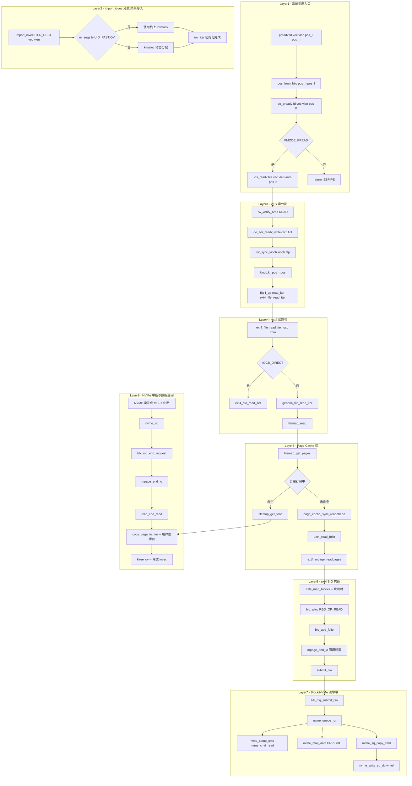

# preadv / pwritev 系统调用完整路径分析

## 1 概述

preadv 和 pwritev 系统调用将 **定位读/写（positioned I/O）** 和 **分散/聚集 I/O（scatter-gather I/O）** 结合为一体。它们在指定文件偏移量处，使用多个 `iovec` 缓冲区执行 I/O 操作，且**不改变**文件当前的 `f_pos`。

### 关键特点

- **定位语义**：使用调用者提供的 `pos` 参数（栈局部变量），不更新 `file->f_pos`
- **分散/聚集**：通过 `import_iovec` 从用户空间导入多个 `iovec` 段，支持 `UIO_FASTIOV` 栈优化
- **权限检查**：preadv 需要 `FMODE_PREAD`，pwritev 需要 `FMODE_PWRITE`
- **ARM64 参数编码**：`loff_t pos` 由 `pos_h`(高32位) 和 `pos_l`(低32位) 拼装而成
- **preadv2/pwritev2**：扩展版本支持 `RWF_*` 标志（如 `RWF_NOWAIT`, `RWF_DSYNC`, `RWF_APPEND`）
- **下游路径**：preadv 与 read 共享完全相同的 ext4→block→NVMe 路径；pwritev 与 write 相同

---

## 2 涉及的内核层

### preadv（读路径）

| 层 | 说明 |
|--|--|
| **Syscall Entry** | preadv/preadv2 系统调用入口 (fs/read_write.c) |
| **VFS** | vfs_readv → do_iter_readv_writev (fs/read_write.c) |
| **ext4** | ext4_file_read_iter → generic_file_read_iter (fs/ext4/file.c) |
| **Page Cache** | filemap_read → filemap_get_pages (mm/filemap.c) |
| **ext4 读 BIO** | ext4_mpage_readpages (fs/ext4/readpage.c) |
| **Block Layer** | blk-mq 提交 (block/blk-core.c, blk-mq.c) |
| **NVMe 驱动** | 读命令提交 + 中断完成 (drivers/nvme/host/pci.c) |

### pwritev（写路径）

| 层 | 说明 |
|--|--|
| **Syscall Entry** | pwritev/pwritev2 系统调用入口 (fs/read_write.c) |
| **VFS** | vfs_writev → do_iter_readv_writev (fs/read_write.c) |
| **ext4** | ext4_file_write_iter → ext4_buffered_write_iter (fs/ext4/file.c) |
| **Page Cache** | generic_perform_write (mm/filemap.c) |
| **ext4 延迟分配** | ext4_da_write_begin/end (fs/ext4/inode.c) |
| **Writeback** | ext4_writepages → ext4_bio_write_folio (fs/ext4/page-io.c) |
| **Block Layer** | blk-mq 提交 (block/blk-core.c, blk-mq.c) |
| **NVMe 驱动** | 写命令提交 + 中断完成 (drivers/nvme/host/pci.c) |

---

## 3 系统调用入口

### 3.1 SYSCALL_DEFINE5(preadv) - fs/read_write.c:1455

```c
SYSCALL_DEFINE5(preadv, unsigned long, fd, const struct iovec __user *, vec,
        unsigned long, vlen, unsigned long, pos_l, unsigned long, pos_h)
{
    loff_t pos = pos_from_hilo(pos_h, pos_l);
    return do_preadv(fd, vec, vlen, pos, 0);
}

SYSCALL_DEFINE6(preadv2, unsigned long, fd, const struct iovec __user *, vec,
        unsigned long, vlen, unsigned long, pos_l, unsigned long, pos_h,
        rwf_t, flags)
{
    loff_t pos = pos_from_hilo(pos_h, pos_l);
    if (pos == -1)
        return do_readv(fd, vec, vlen, flags);   // pos=-1 → 用 f_pos

    return do_preadv(fd, vec, vlen, pos, flags);
}
```

### 3.2 SYSCALL_DEFINE5(pwritev) - fs/read_write.c:1475

```c
SYSCALL_DEFINE5(pwritev, unsigned long, fd, const struct iovec __user *, vec,
        unsigned long, vlen, unsigned long, pos_l, unsigned long, pos_h)
{
    loff_t pos = pos_from_hilo(pos_h, pos_l);
    return do_pwritev(fd, vec, vlen, pos, 0);
}

SYSCALL_DEFINE6(pwritev2, unsigned long, fd, const struct iovec __user *, vec,
        unsigned long, vlen, unsigned long, pos_l, unsigned long, pos_h,
        rwf_t, flags)
{
    loff_t pos = pos_from_hilo(pos_h, pos_l);
    if (pos == -1)
        return do_writev(fd, vec, vlen, flags);   // pos=-1 → 用 f_pos

    return do_pwritev(fd, vec, vlen, pos, flags);
}
```

### 3.3 ARM64 特殊的参数编码

ARM64 系统调用号码使用 `x8` 寄存器传递，参数使用 `x0-x5` 寄存器。由于 ARM64 寄存器宽度为 64 位，一个 `loff_t`（64位）可以用一个寄存器，而 `preadv` 的签名在用户态是：

```c
ssize_t preadv(int fd, const struct iovec *iov, int iovcnt, off_t offset);
```

但在内核中 ARM64 的 `SYSCALL_DEFINE5` 无法直接传递 64 位参数，因此拆分为 `pos_l`（低32位）和 `pos_h`（高32位）：

```c
// arch/arm64/include/asm/syscall_wrapper.h
#define pos_from_hilo(h, l) (((loff_t)(h) << 32) | (loff_t)(l))
```

同理，在 syscall_64.tbl 中定义为：
```
69  common  preadv      sys_preadv
70  common  pwritev     sys_pwritev
```

### 3.4 do_preadv - fs/read_write.c:1401

```c
static ssize_t do_preadv(unsigned long fd, const struct iovec __user *vec,
             unsigned long vlen, loff_t pos, rwf_t flags)
{
    ssize_t ret = -EBADF;

    if (pos < 0)
        return -EINVAL;

    CLASS(fd, f)(fd);
    if (!fd_empty(f)) {
        ret = -ESPIPE;
        if (fd_file(f)->f_mode & FMODE_PREAD)
            ret = vfs_readv(fd_file(f), vec, vlen, &pos, flags);
    }

    if (ret > 0)
        add_rchar(current, ret);
    inc_syscr(current);
    return ret;
}
```

### 3.5 do_pwritev - fs/read_write.c:1422

```c
static ssize_t do_pwritev(unsigned long fd, const struct iovec __user *vec,
              unsigned long vlen, loff_t pos, rwf_t flags)
{
    ssize_t ret = -EBADF;

    if (pos < 0)
        return -EINVAL;

    CLASS(fd, f)(fd);
    if (!fd_empty(f)) {
        ret = -ESPIPE;
        if (fd_file(f)->f_mode & FMODE_PWRITE)
            ret = vfs_writev(fd_file(f), vec, vlen, &pos, flags);
    }

    if (ret > 0)
        add_wchar(current, ret);
    inc_syscw(current);
    return ret;
}
```

---

## 4 VFS 分散/聚集 I/O 层

### 4.1 import_iovec - iov_iter 导入机制

preadv/pwritev 与 readv/writev 共享同一个关键机制：从用户空间导入多个 iovec 段。

```c
// lib/iov_iter.c
ssize_t import_iovec(int type, const struct iovec __user *uvec,
             unsigned nr_segs, unsigned fast_segs,
             struct iovec **iovp, struct iov_iter *iter)
{
    // 1. 如果 nr_segs <= UIO_FASTIOV（通常为8），使用栈上数组 iovstack
    //    避免 kmalloc 分配
    struct iovec *iov = *iovp;
    ssize_t ret;

    ret = __import_iovec(type, uvec, nr_segs, fast_segs, iovp, iter);
    // 2. 拷贝用户空间 iovec 数组到内核
    // 3. 初始化 iov_iter 结构体
    // 4. 若动态分配了内存，调用者通过 kfree(iov) 释放
    return ret;
}
```

### 4.2 vfs_readv - fs/read_write.c:1202

```c
static ssize_t vfs_readv(struct file *file, const struct iovec __user *vec,
             unsigned long vlen, loff_t *pos, rwf_t flags)
{
    struct iovec iovstack[UIO_FASTIOV];
    struct iovec *iov = iovstack;
    struct iov_iter iter;
    size_t tot_len;
    ssize_t ret = 0;

    if (!(file->f_mode & FMODE_READ))
        return -EBADF;
    if (!(file->f_mode & FMODE_CAN_READ))
        return -EINVAL;

    ret = import_iovec(ITER_DEST, vec, vlen, ARRAY_SIZE(iovstack), &iov, &iter);
    if (ret < 0)
        return ret;

    tot_len = iov_iter_count(&iter);
    if (!tot_len)
        goto out;

    ret = rw_verify_area(READ, file, pos, tot_len);
    if (ret < 0)
        goto out;

    if (file->f_op->read_iter)
        ret = do_iter_readv_writev(file, &iter, pos, READ, flags);
    else
        ret = do_loop_readv_writev(file, &iter, pos, READ, flags);
out:
    if (ret >= 0)
        fsnotify_access(file);
    kfree(iov);
    return ret;
}
```

### 4.3 vfs_writev - fs/read_write.c:1266

```c
static ssize_t vfs_writev(struct file *file, const struct iovec __user *vec,
              unsigned long vlen, loff_t *pos, rwf_t flags)
{
    struct iovec iovstack[UIO_FASTIOV];
    struct iovec *iov = iovstack;
    struct iov_iter iter;
    size_t tot_len;
    ssize_t ret = 0;

    if (!(file->f_mode & FMODE_WRITE))
        return -EBADF;
    if (!(file->f_mode & FMODE_CAN_WRITE))
        return -EINVAL;

    ret = import_iovec(ITER_SOURCE, vec, vlen, ARRAY_SIZE(iovstack), &iov, &iter);
    if (ret < 0)
        return ret;

    tot_len = iov_iter_count(&iter);
    if (!tot_len)
        goto out;

    ret = rw_verify_area(WRITE, file, pos, tot_len);
    if (ret < 0)
        goto out;

    file_start_write(file);
    if (file->f_op->write_iter)
        ret = do_iter_readv_writev(file, &iter, pos, WRITE, flags);
    else
        ret = do_loop_readv_writev(file, &iter, pos, WRITE, flags);
    if (ret > 0)
        fsnotify_modify(file);
    file_end_write(file);
out:
    kfree(iov);
    return ret;
}
```

### 4.4 do_iter_readv_writev - 核心分发函数

```c
static ssize_t do_iter_readv_writev(struct file *filp, struct iov_iter *iter,
                    loff_t *ppos, int type, rwf_t flags)
{
    struct kiocb kiocb;
    ssize_t ret;

    init_sync_kiocb(&kiocb, filp);
    ret = kiocb_set_rw_flags(&kiocb, flags, type);
    if (ret)
        return ret;
    kiocb.ki_pos = (ppos ? *ppos : 0);

    if (type == READ)
        ret = filp->f_op->read_iter(&kiocb, iter);   // → ext4_file_read_iter
    else
        ret = filp->f_op->write_iter(&kiocb, iter);  // → ext4_file_write_iter

    BUG_ON(ret == -EIOCBQUEUED);   // 同步操作不应异步排队
    if (ppos)
        *ppos = kiocb.ki_pos;
    return ret;
}
```

关键点：
- preadv 使 `type=READ` → `f_op->read_iter` → `ext4_file_read_iter`
- pwritev 使 `type=WRITE` → `f_op->write_iter` → `ext4_file_write_iter`
- 从 `do_iter_readv_writev` 开始，preadv 与 read 共享完全相同的下游路径
- pwritev 与 write 共享完全相同的下游路径
- 区别仅在于：iov_iter 初始化的方式（多段 vs 单段）

---

## 5 下游路径（preadv = read, pwritev = write）

### 5.1 preadv 读路径

```
do_iter_readv_writev(filp, iter, &pos, READ, flags)
  └─ filp->f_op->read_iter(&kiocb, iter)
       └─ ext4_file_read_iter(iocb, iter)        // fs/ext4/file.c:186
            ├─ IS_DAX → ext4_dax_read_iter
            ├─ IOCB_DIRECT → ext4_dio_read_iter
            └─ generic_file_read_iter(iocb, iter)  // mm/filemap.c:3014
                 └─ filemap_read(iocb, iter, ...)   // mm/filemap.c:2620
                      └─ filemap_get_pages(iocb, iter, ...) // mm/filemap.c
                           ├─ filemap_get_folio → 查找页缓存命中 → 直接返回数据
                           └─ page_cache_sync_readahead → 预读未命中
                                └─ mapping->a_ops->read_folio
                                     └─ ext4_read_folio          // fs/ext4/readpage.c:395
                                          └─ ext4_mpage_readpages // fs/ext4/readpage.c:211
                                               ├─ ext4_map_blocks → 块映射
                                               ├─ bio_alloc(bdev, BIO_MAX_VECS, REQ_OP_READ, GFP_NOIO)
                                               ├─ bio_add_folio → 构建 BIO
                                               ├─ bio->bi_end_io = mpage_end_io
                                               └─ submit_bio → blk_mq_submit_bio
                      └─ copy_page_to_iter(folio, offset, bytes, iter)
                           └─ copy_to_user / iov_iter_copy_from_user_atomic*
```

> preadv 与 read 的差异仅在于 `vfs_read` vs `vfs_readv`：
> - `vfs_read`：`iov_iter_init(&iter, ITER_DEST, &iov, 1, count)` — 单段
> - `vfs_readv`：`import_iovec(ITER_DEST, vec, vlen, ...)` — 多段
> - `do_iter_readv_writev` 之后的路径完全一致

### 5.2 pwritev 写路径

```
do_iter_readv_writev(filp, iter, &pos, WRITE, flags)
  └─ filp->f_op->write_iter(&kiocb, iter)
       └─ ext4_file_write_iter(iocb, iter)        // fs/ext4/file.c:844
            └─ ext4_buffered_write_iter(iocb, from) // fs/ext4/file.c:348
                 └─ inode_lock(inode)
                 └─ ext4_write_checks(iocb, from)
                 └─ generic_perform_write(iocb, from)  // mm/filemap.c:4374
                      └─ [for each chunk]:
                           ├─ a_ops->write_begin → ext4_da_write_begin
                           │    ├─ write_begin_get_folio → filemap_grab_folio
                           │    └─ ext4_block_write_begin / ext4_da_get_block_prep
                           ├─ copy_folio_from_iter_atomic(folio, ...) ← 用户→内核拷贝
                           └─ a_ops->write_end → ext4_da_write_end
                                ├─ block_write_end → mark_buffer_dirty
                                └─ __folio_mark_dirty(folio)
[异步 writeback]:
  └─ ext4_writepages → ext4_bio_write_folio → ext4_io_submit
       → blk_crypto_submit_bio → blk_mq_submit_bio → nvme_queue_rq
       → nvme_setup_cmd(nvme_cmd_write) → nvme_sq_copy_cmd → nvme_write_sq_db
       → [NVMe 中断完成] → ext4_end_bio → folio_end_writeback
```

---

## 6 UIO_FASTIOV 优化

preadv/pwritev 使用 `import_iovec` 导入用户空间 iovec 数组，当 iovec 数量较少（≤ 8）时使用栈上数组避免 kmalloc：

```c
struct iovec iovstack[UIO_FASTIOV];   // UIO_FASTIOV 通常 = 8
struct iovec *iov = iovstack;
// ...
ret = import_iovec(ITER_DEST, vec, vlen, ARRAY_SIZE(iovstack), &iov, &iter);
// ...
kfree(iov);   // 如果 iov != iovstack，释放 kmalloc 的内存
```

| iovec 数量 | 分配方式 | 性能特征 |
|--|--|--|
| ≤ 8 | 栈上 `iovstack[8]` | 零分配，最快 |
| > 8 | `kmalloc` 动态分配 | 有分配开销 |

---

## 7 preadv2/pwritev2 RWF 标志

preadv2/pwritev2 通过 `flags` 参数支持额外的 `RWF_*` 标志：

| 标志 | 值 | 说明 |
|--|--|--|
| `RWF_DSYNC` | 0x01 | 类似 O_DSYNC，写完成前等待数据完整性 |
| `RWF_HIPRI` | 0x02 | 高优先级，polling 模式（需块设备支持） |
| `RWF_SYNC` | 0x04 | 类似 O_SYNC，写完成前等待数据+元数据完整性 |
| `RWF_NOWAIT` | 0x08 | 非阻塞，若 I/O 可能阻塞立即返回 -EAGAIN |
| `RWF_APPEND` | 0x10 | append 模式，忽略 pos，在文件末尾写入（仅 pwritev2） |

`kiocb_set_rw_flags` 负责解析这些标志并设置 `kiocb.ki_flags`：

```c
static inline int kiocb_set_rw_flags(struct kiocb *ki, rwf_t flags, int type)
{
    if (flags & ~RWF_SUPPORTED)
        return -EOPNOTSUPP;

    if (flags & RWF_NOWAIT)
        ki->ki_flags |= IOCB_NOWAIT;
    if (flags & RWF_HIPRI)
        ki->ki_flags |= IOCB_HIPRI;
    if (flags & RWF_DSYNC)
        ki->ki_flags |= IOCB_DSYNC;
    if (flags & RWF_SYNC)
        ki->ki_flags |= IOCB_SYNC;
    // RWF_APPEND 在 vfs_writev 的 file_start_write 后单独处理
    return 0;
}
```

---

## 8 preadv 完整调用链表

| 步骤 | 函数 | 文件:行号 | 层 |
|--|--|--|--|
| 1 | `SYSCALL_DEFINE5(preadv, fd, vec, vlen, pos_l, pos_h)` | fs/read_write.c:1455 | Syscall |
| 2 | `pos_from_hilo(pos_h, pos_l)` | arch/arm64/include/asm | Syscall |
| 3 | `do_preadv(fd, vec, vlen, pos, 0)` | fs/read_write.c:1401 | VFS |
| 4 | `CLASS(fd, f)(fd)` | fs/file.c | fd Table |
| 5 | `FMODE_PREAD` 检查 | fs/read_write.c:1412 | VFS |
| 6 | `vfs_readv(file, vec, vlen, &pos, flags)` | fs/read_write.c:1413 | VFS |
| 7 | `import_iovec(ITER_DEST, vec, vlen, ...)` | lib/iov_iter.c | VFS |
| 8 | `rw_verify_area(READ, file, pos, tot_len)` | fs/read_write.c | VFS |
| 9 | `do_iter_readv_writev(file, &iter, pos, READ, flags)` | fs/read_write.c:1003 | VFS |
| 10 | `init_sync_kiocb(&kiocb, filp)` | include/linux/fs.h | VFS |
| 11 | `ext4_file_read_iter(iocb, iter)` | fs/ext4/file.c:186 | ext4 |
| 12 | `generic_file_read_iter(iocb, iter)` | mm/filemap.c:3014 | Page Cache |
| 13 | `filemap_read(iocb, iter, ret)` | mm/filemap.c:2620 | Page Cache |
| 14 | `filemap_get_pages(iocb, iter, ...)` | mm/filemap.c | Page Cache |
| 15 | `filemap_get_folio(mapping, index)` | mm/filemap.c | Page Cache |
| 16 | `page_cache_sync_readahead(mapping, ...)` | mm/readahead.c | Page Cache |
| 17 | `ext4_read_folio(file, folio)` | fs/ext4/readpage.c:395 | ext4 |
| 18 | `ext4_mpage_readpages(iocb, folio, ...)` | fs/ext4/readpage.c:211 | ext4 |
| 19 | `ext4_map_blocks(NULL, inode, map, 0)` | fs/ext4/inode.c | ext4 |
| 20 | `bio_alloc(bdev, BIO_MAX_VECS, REQ_OP_READ, GFP_NOIO)` | block/bio.c | Block |
| 21 | `bio_add_folio(bio, folio, len, offset)` | block/bio.c | Block |
| 22 | `submit_bio(bio)` | block/blk-core.c | Block |
| 23 | `blk_mq_submit_bio(bio)` | block/blk-mq.c | Block |
| 24 | `nvme_queue_rq(hctx, bd)` | drivers/nvme/host/pci.c | NVMe |
| 25 | `nvme_setup_cmd(ns, req, cmd)` → `nvme_cmd_read` | drivers/nvme/host/core.c | NVMe |
| 26 | `nvme_sq_copy_cmd(nvmeq, req)` → memcpy | drivers/nvme/host/pci.c | NVMe |
| 27 | `nvme_write_sq_db(nvmeq)` → writel MMIO | drivers/nvme/host/pci.c | NVMe |
| 28 | `nvme_irq` → `nvme_handle_cqe` → `mpage_end_io` | NVMe→Block |
| 29 | `folio_end_read(folio, uptodate)` → 唤醒等待进程 | mm/filemap.c | Page Cache |
| 30 | `copy_page_to_iter(folio, offset, bytes, iter)` | lib/iov_iter.c | VFS |
| 31 | 数据通过 iov_iter 拷贝到每个 iovec 段 | lib/iov_iter.c | VFS |

> 若页缓存命中，跳过步骤 16-29，直接从 `filemap_get_folio` 到 `copy_page_to_iter`。

---

## 9 完整路径 Mermaid 流程图



---

## 10 与相近系统调用的对比

| 维度 | readv | preadv | read | pread64 |
|--|--|--|--|--|
| **偏移来源** | `file->f_pos` | 栈变量 `pos` | `file->f_pos` | 栈变量 `pos` |
| **偏移更新** | 是 | 否 | 是 | 否 |
| **分散/聚集** | 是（多 iovec） | 是（多 iovec） | 否（单 buf） | 否（单 buf） |
| **FMODE_PREAD** | 不需要 | 需要 | 不需要 | 需要 |
| **iov 导入** | `import_iovec` | `import_iovec` | `iov_iter_init` | `iov_iter_init` |
| **下游路径** | ext4→...→NVMe | ext4→...→NVMe | ext4→...→NVMe | ext4→...→NVMe |

| 维度 | writev | pwritev | write | pwrite64 |
|--|--|--|--|--|
| **偏移来源** | `file->f_pos` | 栈变量 `pos` | `file->f_pos` | 栈变量 `pos` |
| **偏移更新** | 是 | 否 | 是 | 否 |
| **分散/聚集** | 是（多 iovec） | 是（多 iovec） | 否（单 buf） | 否（单 buf） |
| **FMODE_PWRITE** | 不需要 | 需要 | 不需要 | 需要 |
| **写保护** | `file_start_write` | `file_start_write` | `file_start_write` | `file_start_write` |
| **下游路径** | ext4→...→NVMe | ext4→...→NVMe | ext4→...→NVMe | ext4→...→NVMe |

---

## 11 关键数据结构

```
struct iovec                      struct iov_iter (preadv = ITER_DEST)
+------------------------+       +---------------------------+
| iov_base (void __user*) |       | iter_type = ITER_IOVEC     |
| iov_len (size_t)        |       | data_source = ITER_DEST    |
+------------------------+       | nr_segs                    |
                                  | iov → struct iovec[]       |
struct kiocb                      | count (剩余总字节数)       |
+------------------------+       +---------------------------+
| ki_filp → struct file  |
| ki_pos (loff_t)         |       struct pipe_inode_info
| ki_flags (IOCB_*)       |       (vmsplice 场景)
| ki_complete (NULL)      |       +---------------------------+
+------------------------+       | head / tail / ring[]       |
                                  | wait / readers / writers   |
struct iov_iter (pwritev = SOURCE)| buf → struct pipe_buffer[]  |
+---------------------------+    +---------------------------+
| iter_type = ITER_IOVEC     |
| data_source = ITER_SOURCE   |
| iov → struct iovec[]       |
| nr_segs / count            |
+---------------------------+
```

---

## 12 总结

preadv/pwritev 将**定位 I/O**和**分散/聚集 I/O**两个特性结合：

1. **定位语义**（来自 pread64/pwrite64）：栈局部变量 `pos`，不更新 `f_pos`，消除偏移竞争
2. **分散/聚集**（来自 readv/writev）：`import_iovec` 导入多段 iovec，`UIO_FASTIOV` 栈优化
3. **preadv2/pwritev2 扩展**：`RWF_*` 标志支持 NOWAIT、DSYNC、HIPRI、APPEND 等特性
4. **下游路径完全共享**：
   - preadv 在 `do_iter_readv_writev` 之后与 read 完全相同
   - pwritev 在 `do_iter_readv_writev` 之后与 write 完全相同
5. **ARM64 参数编码**：64 位 `loff_t pos` 从两个 32 位参数 `pos_h`/`pos_l` 拼装

关键函数调用等价关系：
```
preadv(fd, vec, vlen, pos)  =  readv 的分散/聚集 + pread64 的定位语义
pwritev(fd, vec, vlen, pos) =  writev 的分散/聚集 + pwrite64 的定位语义
preadv2(fd, vec, vlen, pos, RWF_NOWAIT) = preadv + 非阻塞语义
pwritev2(fd, vec, vlen, pos, RWF_APPEND) = pwritev + 追加语义
```
