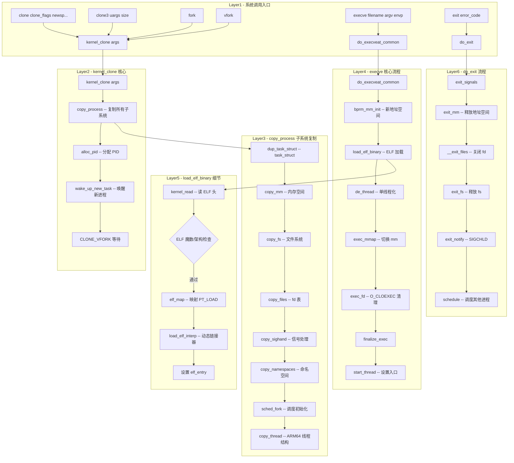

# clone / clone3 / execve / exit 系统调用完整路径分析

## 1 概述

进程控制系统调用是 Linux 进程生命周期的核心管理接口，涵盖进程创建（clone/clone3/fork）、程序执行（execve/execveat）和进程终止（exit/exit_group）。

### 关键特点

- **clone**：创建新进程/线程，通过 flags 参数精确控制资源共享（CLONE_VM, CLONE_FILES 等）
- **clone3**：扩展版 clone，使用 `struct clone_args` 结构体（更安全，易于扩展）
- **fork/vfork**：基于 clone 实现（fork = clone(SIGCHLD, 0)；vfork = clone(CLONE_VFORK|SIGCHLD)）
- **execve**：加载新程序，`load_elf_binary` 解析 ELF 并设置新地址空间
- **exit**：终止当前线程；**exit_group**：终止整个线程组
- **kernel_clone**：所有创建路径的统一核心函数

---

## 2 进程创建（clone / clone3 / fork）

### 2.1 系统调用入口

```c
// clone - ARM64 入口
SYSCALL_DEFINE5(clone, unsigned long, clone_flags, unsigned long, newsp,
        int __user *, parent_tidptr,
        unsigned long, tls,
        int __user *, child_tidptr)
{
    struct kernel_clone_args args = {
        .flags     = (lower_32_bits(clone_flags) & ~CSIGNAL),
        .pidfd     = parent_tidptr,
        .child_tid = child_tidptr,
        .parent_tid = parent_tidptr,
        .exit_signal = (lower_32_bits(clone_flags) & CSIGNAL),
        .stack     = newsp,
        .tls       = tls,
    };
    return kernel_clone(&args);
}

// clone3 - 扩展版（struct clone_args 从用户空间拷贝）
SYSCALL_DEFINE2(clone3, struct clone_args __user *, uargs, size_t, size)
{
    struct kernel_clone_args kargs;
    // 从用户空间拷贝 struct clone_args
    err = copy_clone_args_from_user(&kargs, uargs, size);
    // 参数校验
    if (!clone3_args_valid(&kargs))
        return -EINVAL;
    return kernel_clone(&kargs);
}
```

### 2.2 kernel_clone 核心路径 - kernel/fork.c:2612

```
kernel_clone(args)
  │
  ├─ ╔═══════════════════════════════════════════╗
  │  ║ copy_process - 复制进程/线程结构            ║
  │  ╚═══════════════════════════════════════════╝
  │  │
  │  ├─ dup_task_struct(current)            // 分配 task_struct + thread_info
  │  │    ├─ alloc_task_struct_node          // task_struct 分配
  │  │    └─ setup_thread_stack              // 内核栈设置
  │  │
  │  ├─ copy_flags(clone_flags, p)          // 复制/修改 PF_* 标志
  │  │
  │  ├─ copy_process_errno(p, args)         // clone3 错误码复制
  │  │
  │  ├─ __anon_vma_prepare                  // VMA 准备
  │  ├─ copy_mm(clone_flags, p)             // 内存空间 (mm_struct)
  │  │    ├─ CLONE_VM → 共享 mm（线程语义）
  │  │    └─ 非 CLONE_VM → dup_mm (COW)
  │  │         └─ dup_mmap → 复制 VMA 链表
  │  │
  │  ├─ copy_fs(clone_flags, p)             // 文件系统信息 (fs_struct)
  │  │    └─ CLONE_FS → 共享 (chroot/cwd)
  │  │
  │  ├─ copy_files(clone_flags, p)          // 文件描述符表 (files_struct)
  │  │    └─ CLONE_FILES → 共享 fdtable
  │  │
  │  ├─ copy_sighand(clone_flags, p)        // 信号处理函数表
  │  │
  │  ├─ copy_signal(clone_flags, p)         // 信号计数/统计
  │  │
  │  ├─ copy_io(clone_flags, p)             // IO 统计
  │  │
  │  ├─ copy_namespaces(clone_flags, p)     // 命名空间
  │  │
  │  ├─ copy_thread(clone_flags, args, p)   // 架构特定线程初始化
  │  │    └─ arch/arm64/kernel/process.c
  │  │         └─ p->thread.cpu_context =   // 设置 callee-saved regs
  │  │         └─ childregs = pt_regs       // 复制 pt_regs
  │  │         └─ childregs->regs[0] = 0   // 子进程返回值 = 0
  │  │         └─ p->thread.tpidr_el0 = tls // TLS 寄存器
  │  │
  │  ├─ copy_mm / copy_fs / ...            // 其余子系统
  │  │
  │  ├─ sched_fork(clone_flags, p)          // 调度初始化
  │  │    └─ __sched_fork(p)
  │  │         └─ p->state = TASK_NEW
  │  │    └─ 设置优先级/调度策略
  │  │
  │  └─ ════════════════════════════════════
  │
  ├─ 确定 PID（alloc_pid）
  │
  ├─ ╔═══════════════════════════════════════╗
  │  ║ wake_up_new_task - 唤醒新进程            ║
  │  ╚═══════════════════════════════════════╝
  │  └─ activate_task(rq, p, 0)             // 加入就绪队列
  │  └─ wakeup_preempt(rq, p, ...)          // 检查是否可抢占当前进程
  │
  └─ 设置 CLONE_VFORK 等待（若需要）
       └─ init_completion(&vfork)
       └─ 等待子进程 exec 或 exit 时 complete
```

### 2.3 fork/vfork 的实现

```c
// arch/arm64/kernel/sys.c 或其他架构文件
#ifdef __ARCH_WANT_SYS_FORK
SYSCALL_DEFINE0(fork)
{
    return kernel_clone(&(struct kernel_clone_args){
        .flags = SIGCHLD, .exit_signal = SIGCHLD
    });
}
#endif

#ifdef __ARCH_WANT_SYS_VFORK
SYSCALL_DEFINE0(vfork)
{
    return kernel_clone(&(struct kernel_clone_args){
        .flags = CLONE_VFORK | CLONE_VM | SIGCHLD,
        .exit_signal = SIGCHLD
    });
}
#endif
```

---

## 3 程序执行（execve / execveat）

### 3.1 系统调用入口

```c
SYSCALL_DEFINE3(execve, const char __user *, filename,
        const char __user *const __user *, argv,
        const char __user *const __user *, envp)
{
    return do_execveat_common(AT_FDCWD, filename, native_arg(argv),
                  native_arg(envp), 0);
}

SYSCALL_DEFINE5(execveat, int, fd, const char __user *, filename,
        const char __user *const __user *, argv,
        const char __user *const __user *, envp, int, flags)
{
    return do_execveat_common(fd, filename, native_arg(argv),
                  native_arg(envp), flags);
}
```

### 3.2 do_execveat_common 核心路径

```
do_execveat_common(fd, filename, argv, envp, flags)
  │
  ├─ ╔═══════════════════════════════════════════╗
  │  ║ exec_binprm - 二进制程序执行核心            ║
  │  ╚═══════════════════════════════════════════╝
  │
  ├─ 1. 路径名解析 → struct file
  │    └─ do_open_execat(fd, filename, flags)
  │         └─ path_openat → dentry_open
  │         └─ 检查执行权限 (may_open)
  │
  ├─ 2. bprm_mm_init → 初始化新 mm_struct
  │    └─ __bprm_mm_init
  │    └─ 设置初始栈 VMA ([stack])
  │
  ├─ 3. prepare_arg_pages → 计算 argv/envp 总大小
  │
  ├─ 4. copy_strings_kernel → 拷贝 filename 到栈
  │
  ├─ 5. 加载 ELF 二进制
  │    └─ ╔═══════════════════════════════════════════╗
  │       ║ load_elf_binary - ELF 加载器               ║
  │       ╚═══════════════════════════════════════════╝
  │       │
  │       ├─ 读取 ELF 头部 (elf_read)
  │       │    └─ kernel_read(file, 0, &loc->elf_ex, sizeof(elf_ex))
  │       │
  │       ├─ 检查 ELF 魔数 (ELFMAG)
  │       ├─ 检查架构/位数 (e_machine / e_ident[EI_CLASS])
  │       │
  │       ├─ 读取程序头表 (elf_phdata)
  │       │    └─ kernel_read → elf_map → do_mmap
  │       │
  │       ├─ 遍历 PT_LOAD 段 → elf_map
  │       │    └─ do_mmap(file, addr, size, prot, flags, offset)
  │       │    └─ 映射代码段、数据段到新地址空间
  │       │
  │       ├─ 处理 PT_INTERP（动态链接器）
  │       │    └─ load_elf_interp
  │       │    └─ 映射动态链接器 (ld-linux-*.so)
  │       │
  │       ├─ 处理 PT_GNU_STACK → 栈可执行性
  │       │
  │       ├─ elf_entry → 入口点
  │       │    └─ 可执行 entry 或动态链接器 entry
  │       │
  │       └─ ═══════════════════════════════════════════
  │
  ├─ 6. exec_binprm 最终步骤
  │    ├─ de_thread(me) → 单线程化
  │    │    └─ 杀死/等待同一线程组的其他线程
  │    │
  │    ├─ exec_mmap → 切换 mm
  │    │    └─ 激活旧 mm → 释放旧 mm（如果没有其他引用）
  │    │
  │    ├─ exec_fs → 切换 fs
  │    ├─ exec_fd → 处理 O_CLOEXEC fd
  │    ├─ exec_id → 更新进程凭证/安全上下文
  │    │
  │    ├─ finalize_exec → 架构后处理
  │    │
  │    └─ 设置新进程名 (comm)
  │
  └─ 7. 返回用户态 → 新程序入口
       └─ start_thread(regs, elf_entry, sp)
```

### 3.3 do_exit 核心流程

```c
SYSCALL_DEFINE1(exit, int, error_code)
{
    do_exit((error_code & 0xff) << 8);    // 0-255 退出码
}

SYSCALL_DEFINE1(exit_group, int, error_code)
{
    do_group_exit((error_code & 0xff) << 8);
}
```

`do_exit` 核心路径：
```
do_exit(code)
  ├─ exit_signals(tsk)              // 清理信号状态
  ├─ exit_mm()                      // 释放 mm_struct
  ├─ exit_sem()                     // 释放 IPC 信号量
  ├─ __exit_files(tsk)              // 关闭文件描述符
  │    └─ close_files(files)
  ├─ exit_fs(tsk)                   // 释放 fs_struct
  ├─ exit_namespace(tsk)            // 释放命名空间
  ├─ exit_thread(tsk)               // 架构特定清理
  ├─ perf_event_exit_task(tsk)      // perf 事件清理
  ├─ exit_notify(tsk, group_dead)   // 通知父进程（SIGCHLD）
  │    └─ forget_original_parent
  │         └─ find_new_reaper       // 找新的父进程（通常是 init）
  │         └─ reparent_leader       // 孤儿进程移交
  ├─ schedule()                     // 调度其他进程
  └─ 不再返回（BUG if reached）
```

---

## 4 完整 Mermaid 流程图



---

## 5 完整函数调用链

### 5.1 clone

| 步骤 | 函数 | 文件:行号 |
|--|--|--|
| 1 | `SYSCALL_DEFINE5(clone)` | kernel/fork.c:2762 |
| 2 | `kernel_clone(&args)` | kernel/fork.c:2612 |
| 3 | `copy_process(current, args)` | kernel/fork.c |
| 4 | `dup_task_struct(current, node)` | kernel/fork.c |
| 5 | `alloc_task_struct_node(node)` | kernel/fork.c |
| 6 | `copy_mm(clone_flags, p)` | kernel/fork.c |
| 7 | `dup_mm(tsk, current->mm)` | kernel/fork.c |
| 8 | `copy_fs(clone_flags, p)` | kernel/fork.c |
| 9 | `copy_files(clone_flags, p)` | kernel/fork.c |
| 10 | `copy_sighand(clone_flags, p)` | kernel/fork.c |
| 11 | `copy_namespaces(clone_flags, p)` | kernel/nsproxy.c |
| 12 | `copy_thread(clone_flags, args, p)` | arch/arm64/kernel/process.c |
| 13 | `sched_fork(clone_flags, p)` | kernel/sched/core.c |
| 14 | `alloc_pid(p->nsproxy->pid_ns)` | kernel/pid.c |
| 15 | `wake_up_new_task(p)` | kernel/sched/core.c |
| 16 | `activate_task(rq, p, 0)` | kernel/sched/core.c |

### 5.2 execve

| 步骤 | 函数 | 文件:行号 |
|--|--|--|
| 1 | `SYSCALL_DEFINE3(execve)` | fs/exec.c |
| 2 | `do_execveat_common(AT_FDCWD, filename, argv, envp, 0)` | fs/exec.c:1778 |
| 3 | `do_open_execat(fd, filename, flags)` | fs/exec.c |
| 4 | `bprm_mm_init(bprm)` | fs/exec.c |
| 5 | `load_elf_binary(bprm)` | fs/binfmt_elf.c |
| 6 | `kernel_read(file, 0, &loc->elf_ex, sizeof(elf_ex))` | fs/exec.c |
| 7 | `elf_map(bprm->file, ...)` → `do_mmap` | fs/binfmt_elf.c |
| 8 | `load_elf_interp(loc->interp_elf_ex, ...)` | fs/binfmt_elf.c |
| 9 | `de_thread(me)` | fs/exec.c |
| 10 | `exec_mmap(bprm->mm)` | fs/exec.c |
| 11 | `exec_fd` → `close_on_exec` 清理 | fs/exec.c |
| 12 | `finalize_exec(regs)` | arch/arm64/kernel/process.c |
| 13 | `start_thread(regs, elf_entry, bprm->p)` | arch/arm64/include/asm/processor.h |

### 5.3 exit

| 步骤 | 函数 | 文件:行号 |
|--|--|--|
| 1 | `SYSCALL_DEFINE1(exit, error_code)` | kernel/exit.c |
| 2 | `do_exit(code)` | kernel/exit.c |
| 3 | `exit_signals(tsk)` | kernel/signal.c |
| 4 | `exit_mm()` | kernel/exit.c |
| 5 | `__exit_files(tsk)` | kernel/exit.c |
| 6 | `exit_fs(tsk)` | kernel/exit.c |
| 7 | `exit_namespace(tsk)` | kernel/nsproxy.c |
| 8 | `exit_notify(tsk, group_dead)` | kernel/exit.c |
| 9 | `find_new_reaper(tsk, &dead_reaper)` | kernel/exit.c |
| 10 | `schedule()` | kernel/sched/core.c |

---

## 6 关键数据结构

```
struct task_struct (PCB)
+----------------------------+
| thread_info → cpu_context  |
| state (TASK_RUNNING/...)   |
| pid / tgid                 |
| mm → struct mm_struct      |  ← 地址空间
| files → struct files_struct|  ← fd 表
| fs → struct fs_struct      |  ← cwd/root
| signal → struct signal_struct|
| sighand → sighand_struct    |
| nsproxy → namespaces        |
| thread (arch-specific)      |
| stack (内核栈)              |
+----------------------------+

struct kernel_clone_args
+----------------------------+
| flags (CLONE_*)            |
| pidfd / child_tid          |
| parent_tid / exit_signal   |
| stack / stack_size         |
| tls                        |
| set_tid / cgroup           |
+----------------------------+

struct pt_regs (ARM64)
+----------------------------+
| regs[31] (通用寄存器)       |
| sp / pc / pstate           |
| orig_x0 (系统调用号)        |
+----------------------------+

struct thread_struct (ARM64)
+----------------------------+
| cpu_context (callee regs):   |
|   x19-x28 / x29(fp) / lr   |
|   sp                        |
| tpidr_el0 (TLS)            |
| fpsimd_state               |
+----------------------------+
```

---

## 7 总结

1. **clone/clone3/fork**：通过统一的 `kernel_clone` → `copy_process` 路径创建新进程/线程。`copy_process` 逐一复制 task_struct 的各个子系统（mm、files、fs、signal 等），通过 `CLONE_*` 标志控制共享或拷贝。最后通过 `wake_up_new_task` 将新进程加入调度队列。clone3 使用结构体参数替代寄存器参数，更加安全和可扩展。

2. **execve/execveat**：通过 `do_execveat_common` → `exec_binprm` → `load_elf_binary` 路径加载新程序。核心是 ELF 加载器，它读取 ELF 头部和程序头表，通过 `elf_map`（基于 `do_mmap`）将 PT_LOAD 段映射到新地址空间，并处理 PT_INTERP 动态链接器。`de_thread` 确保单线程化后切换整个地址空间。

3. **exit/exit_group**：通过 `do_exit` 释放进程所有资源（mm、files、fs、namespace），通过 `exit_notify` 向父进程发送 SIGCHLD 信号并移交孤儿进程给 init。最后调用 `schedule()` 切换到其他进程，不再返回。
