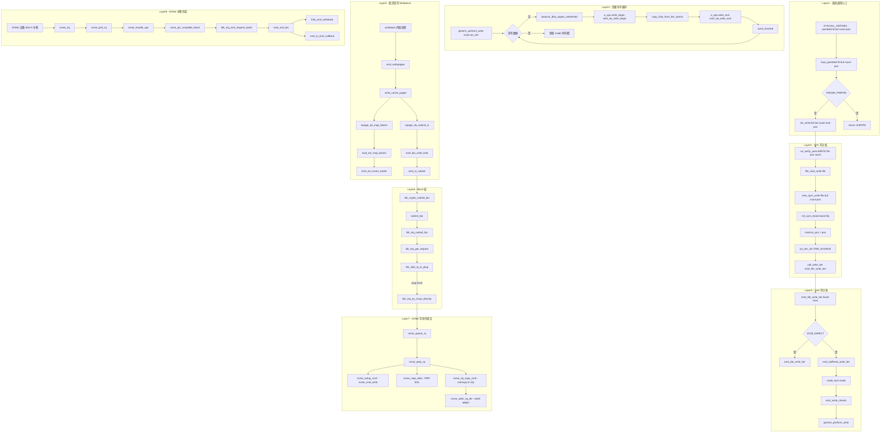

# pwrite64 系统调用完整路径分析

## 1 概述

pwrite64 系统调用在指定文件偏移量处写入数据，**不改变**文件当前的 `f_pos` 值。与 write 的核心差异在于：pwrite64 使用调用者提供的 `pos` 参数（栈局部变量）而非 `file->f_pos`。

### 关键特点

- **定位语义**：与 pread64 对称，使用栈局部变量 `pos`，不更新 `file->f_pos`
- **权限检查**：需要 `FMODE_PWRITE` 标志（管道等不可定位文件返回 `-ESPIPE`）
- **写保护**：与 write 相同，调用 `file_start_write` 防止文件系统冻结
- **下游路径**：从 `vfs_write` 开始与 write 完全一致（Buffered/DIO 分叉）
- **页缓存**：Buffered 写路径通过 `generic_perform_write` 循环写入选定 folio
- **脏页回写**：异步 writeback 线程触发物理块分配和 NVMe 提交

---

## 2 涉及的内核层

| 层 | 说明 |
|--|--|
| **Syscall Entry** | pwrite64 系统调用入口 (fs/read_write.c) |
| **VFS** | vfs_write / rw_verify_area / file_start_write (fs/read_write.c) |
| **ext4** | ext4_file_write_iter / ext4_buffered_write_iter (fs/ext4/file.c) |
| **Page Cache** | generic_perform_write / write_begin/write_end (mm/filemap.c) |
| **ext4 延迟分配** | ext4_da_write_begin / ext4_da_write_end (fs/ext4/inode.c) |
| **Writeback** | ext4_writepages → ext4_bio_write_folio (fs/ext4/inode.c, page-io.c) |
| **Block Layer** | blk-mq 提交 (block/blk-core.c, blk-mq.c) |
| **NVMe 驱动** | 写命令提交 + 中断完成 (drivers/nvme/host/pci.c) |

---

## 3 系统调用入口

### 3.1 SYSCALL_DEFINE4(pwrite64) - fs/read_write.c:974

```c
SYSCALL_DEFINE4(pwrite64, unsigned int, fd, const char __user *, buf,
                 size_t, count, loff_t, pos)
{
    return ksys_pwrite64(fd, buf, count, pos);
}
```

### 3.2 ksys_pwrite64 - fs/read_write.c:958

```c
ssize_t ksys_pwrite64(unsigned int fd, const char __user *buf,
                      size_t count, loff_t pos)
{
    if (pos < 0)
        return -EINVAL;

    CLASS(fd, f)(fd);
    if (fd_empty(f))
        return -EBADF;

    if (fd_file(f)->f_mode & FMODE_PWRITE)
        return vfs_write(fd_file(f), buf, count, &pos);

    return -ESPIPE;
}
```

关键点：
1. `pos` 是调用者传入的**栈局部变量**，非 `file->f_pos`
2. `CLASS(fd, f)` 使用 Linux 6.8+ 的 **auto cleanup** 机制自动管理 fd 引用
3. `FMODE_PWRITE` 检查：管道、socket 等不可定位文件返回 `-ESPIPE`
4. 调用 `vfs_write(fd_file(f), buf, count, &pos)`——与 write 完全相同的 VFS 写入路径

### 3.3 与 ksys_write 对比

| 维度 | ksys_write | ksys_pwrite64 |
|--|--|--|
| 偏移来源 | `file->f_pos` | 调用者传入的 `pos` |
| 偏移更新 | 写入成功后更新 `f_pos` | 不更新 `f_pos`（栈局部变量） |
| 权限检查 | `FMODE_WRITE` | `FMODE_WRITE` + `FMODE_PWRITE` |
| 传给 vfs_write | `&file->f_pos` | `&pos`（栈地址） |
| VFS 下游路径 | 完全相同 | 完全相同 |

---

## 4 VFS 写分发层

### 4.1 vfs_write - fs/read_write.c:686

```c
ssize_t vfs_write(struct file *file, const char __user *buf,
                  size_t count, loff_t *pos)
{
    ssize_t ret;

    if (!(file->f_mode & FMODE_WRITE))
        return -EBADF;
    if (!(file->f_mode & FMODE_CAN_WRITE))
        return -EINVAL;

    ret = rw_verify_area(WRITE, file, pos, count);
    if (ret)
        return ret;
    if (count > MAX_RW_COUNT)
        count = MAX_RW_COUNT;

    file_start_write(file);     // → sb_start_write：防止 freeze 并发
    ret = __vfs_write(file, buf, count, pos);
    file_end_write(file);       // → sb_end_write

    if (ret > 0) {
        fsnotify_modify(file);
        add_wchar(current, ret);
    }
    inc_syscw(current);
    return ret;
}
```

### 4.2 __vfs_write - fs/read_write.c:630

```c
ssize_t __vfs_write(struct file *file, const char __user *buf,
                    size_t count, loff_t *pos)
{
    if (file->f_op->write)
        return file->f_op->write(file, buf, count, pos);
    else if (file->f_op->write_iter)
        return new_sync_write(file, buf, count, pos);
    else
        return -EINVAL;
}
```

ext4 没有实现 `f_op->write`，因此走 `new_sync_write` → `f_op->write_iter` → `ext4_file_write_iter`。

### 4.3 new_sync_write - fs/read_write.c:516

```c
static ssize_t new_sync_write(struct file *filp, const char __user *buf,
                              size_t len, loff_t *ppos)
{
    struct iovec iov = { .iov_base = (void __user *)buf, .iov_len = len };
    struct kiocb kiocb;
    struct iov_iter iter;
    ssize_t ret;

    init_sync_kiocb(&kiocb, filp);        // 初始化同步 kiocb
    kiocb.ki_pos = *ppos;                 // 将 ppos（栈 pos）写入 kiocb
    kiocb.ki_flags = 0;
    iov_iter_init(&iter, ITER_SOURCE, &iov, 1, len);  // ITER_SOURCE = 写方向

    ret = call_write_iter(filp, &kiocb, &iter);  // → ext4_file_write_iter
    if (ret > 0)
        *ppos = kiocb.ki_pos;      // 更新 pos（对 pwrite64 无影响，栈变量）
    return ret;
}
```

---

## 5 ext4 文件系统层

### 5.1 ext4_file_write_iter - fs/ext4/file.c:844

```c
static ssize_t ext4_file_write_iter(struct kiocb *iocb, struct iov_iter *from)
{
    struct inode *inode = file_inode(iocb->ki_filp);

    if (!iocb->ki_filp->f_mode & FMODE_WRITE)
        return -EBADF;

    if (unlikely(ext4_forced_shutdown(inode->i_sb)))
        return -EIO;

    // DAX 路径
    if (IS_DAX(inode))
        return ext4_dax_write_iter(iocb, from);

    // 支持原子写（atomic write）
    if (iocb->ki_flags & IOCB_ATOMIC)
        return ext4_atomic_write_iter(iocb, from);

    // DirectIO 路径
    if (iocb->ki_flags & IOCB_DIRECT)
        return ext4_dio_write_iter(iocb, from);

    // Buffered 写路径（最常用）
    return ext4_buffered_write_iter(iocb, from);
}
```

### 5.2 ext4_buffered_write_iter - fs/ext4/file.c:348

```c
static ssize_t ext4_buffered_write_iter(struct kiocb *iocb,
                                        struct iov_iter *from)
{
    ssize_t ret;
    struct inode *inode = file_inode(iocb->ki_filp);

    inode_lock(inode);        // i_rwsem 互斥锁
    ret = ext4_write_checks(iocb, from);  // 权限/大小检查
    if (ret <= 0)
        goto out;

    ret = generic_perform_write(iocb, from);  // 核心写循环
out:
    inode_unlock(inode);
    if (unlikely(ret <= 0))
        return ret;
    return ret;
}
```

### 5.3 generic_perform_write - mm/filemap.c:4374

```c
ssize_t generic_perform_write(struct kiocb *iocb, struct iov_iter *i)
{
    struct address_space *mapping = file->f_mapping;
    const struct address_space_operations *a_ops = mapping->a_ops;
    // ...
    do {
        // 1. balance_dirty_pages_ratelimited：限速脏页
        // 2. a_ops->write_begin → ext4_da_write_begin：获取/创建 folio
        // 3. copy_folio_from_iter_atomic：从用户态拷贝数据
        // 4. a_ops->write_end → ext4_da_write_end：标记脏页
        // 5. cond_resched：主动调度
    } while (iov_iter_count(i));
    // ...
}
```

核心写数据循环（改写自原文代码段）：
```
for each chunk of data:
  ┌─────────────────────────────────────────────────┐
  │ balance_dirty_pages_ratelimited(mapping)         │← 脏页限速
  ├─────────────────────────────────────────────────┤
  │ a_ops->write_begin → ext4_da_write_begin        │← 获取/创建 folio
  │   ├─ write_begin_get_folio → filemap_grab_folio  │
  │   ├─ ext4_block_write_begin                      │
  │   └─ ext4_da_get_block_prep → ext4_map_blocks   │← 延迟分配/块映射
  ├─────────────────────────────────────────────────┤
  │ copy_folio_from_iter_atomic(folio, offset, i)    │← 用户→内核拷贝
  ├─────────────────────────────────────────────────┤
  │ a_ops->write_end → ext4_da_write_end             │← 标记脏页
  │   ├─ ext4_da_do_write_end                        │
  │   │   └─ block_write_end → mark_buffer_dirty     │
  │   └─ __folio_mark_dirty(folio)                   │
  ├─────────────────────────────────────────────────┤
  │ cond_resched()                                   │← 调度点
  └─────────────────────────────────────────────────┘
```

### 5.4 ext4_da_write_begin - fs/ext4/inode.c:1360

```c
static int ext4_da_write_begin(struct file *file, struct address_space *mapping,
                               loff_t pos, unsigned len,
                               struct folio **foliop, void **fsdata)
{
    // 1. write_begin_get_folio → folio 分配（若不存在）
    // 2. ext4_block_write_begin → 检查 buffer_head 映射状态
    // 3. 若 block 未映射 → ext4_da_get_block_prep
    //    → ext4_map_blocks(create=0) 检查 extent 树
    //    → 未分配时在 Extent Status Tree 插入 DELAYED 标记
    // 4. 返回 folio（稍后拷贝用户数据）
}
```

### 5.5 ext4_da_write_end - fs/ext4/inode.c:1514

```c
static int ext4_da_write_end(struct file *file, struct address_space *mapping,
                             loff_t pos, unsigned len, unsigned copied,
                             struct folio *folio, void *fsdata)
{
    // 1. ext4_da_do_write_end → block_write_end
    //    → mark_buffer_dirty(bh) 标记 buffer_head 脏
    // 2. __folio_mark_dirty(folio) 标记 folio 脏
    // 3. 更新 inode 大小 (i_disksize)
    // 4. ext4_da_write_credits → 预留 journal 空间
}
```

---

## 6 脏页回写路径（异步 Writeback）

### 6.1 writeback 触发时机

generic_perform_write 仅将数据写入页缓存并标记脏页，**不等待**物理 I/O 完成。脏页的物理回写在以下时机触发：

| 时机 | 触发者 | 函数路径 |
|--|--|--|
| 脏页比例超限 | 当前进程 | `balance_dirty_pages` → `wb_start_background_writeback` |
| writeback 内核线程 | kworker/uXXX:wb_writeback | `wb_workfn` → `writeback_sb_inodes` |
| 周期性回写 | kworker 定时器 | `wakeup_worker` → `wb_workfn` |
| sync/fsync 系统调用 | 调用进程 | `do_writepages` → `ext4_writepages` |

### 6.2 ext4_writepages - fs/ext4/inode.c:3089

```
write_cache_pages(mapping, wbc, __mpage_da_writepage)
  └─ __mpage_da_writepage
       └─ mpage_da_map_blocks        // 物理块分配（延迟分配转换）
            └─ ext4_map_blocks(create=1)  // → ext4_ext_map_blocks
                 └─ ext4_ext_insert_extent // extent 树插入
       └─ mpage_da_submit_io         // 提交 I/O
            └─ ext4_bio_write_folio  // fs/ext4/page-io.c:458
```

### 6.3 ext4_bio_write_folio - fs/ext4/page-io.c:458

```c
static void ext4_bio_write_folio(struct ext4_io_submit *io, struct folio *folio,
                                 size_t len)
{
    // 1. io_submit_init_bio → bio_alloc(bdev, BIO_MAX_VECS, REQ_OP_WRITE, GFP_NOIO)
    // 2. bio->bi_end_io = ext4_end_bio（写完成回调）
    // 3. io_submit_add_bh → bio_add_folio 将 folio 追加到 bio
    // 4. 若 bio 满 → ext4_io_submit 提交当前 bio，创建新 bio
}
```

### 6.4 ext4_io_submit - fs/ext4/page-io.c:398

```c
static void ext4_io_submit(struct ext4_io_submit *io)
{
    if (!io->io_bio)
        return;
    // 附加 ext4_io_end 完成处理结构
    // 设置 bio->bi_iter.bi_sector = first_block << (blocksize_bits - 9)
    blk_crypto_submit_bio(io->io_bio);  // 进入 Block 层
    io->io_bio = NULL;
}
```

---

## 7 块设备层

### 7.1 submit_bio 路径

```
blk_crypto_submit_bio(bio)         // block/blk-crypto.c 或 inline
  └─ submit_bio(bio)               // block/blk-core.c:992
       └─ submit_bio_noacct(bio)
            └─ __submit_bio(bio)
                 └─ blk_mq_submit_bio(bio)  // block/blk-mq.c:3151
```

### 7.2 blk_mq_submit_bio

```
blk_mq_submit_bio(bio)
  ├─ blk_ia_range_merge_bio(bio)       // I/O 范围合并
  ├─ bio->bi_end_io 保持不变           // ext4_end_bio
  ├─ blk_mq_get_bio_set_tag_set(bio)   // 获取 tag
  ├─ blk_mq_get_request(q, bio)        // 分配 request
  ├─ blk_mq_rq_ctx_init(rq, ...)       // 初始化 request
  ├─ blk_mq_bio_to_request(rq, bio)    // 绑定 bio → request
  ├─ blk_add_rq_to_plug(plug, rq)      // 尝试 plug 聚合
  └─ 或直接提交:
       └─ blk_mq_try_issue_directly(hctx, rq)
            └─ __blk_mq_issue_directly
                 └─ hctx->ops->queue_rq → nvme_queue_rq
```

---

## 8 NVMe 驱动层

### 8.1 写命令提交

```
nvme_queue_rq(hctx, bd)                 // drivers/nvme/host/pci.c
  └─ nvme_prep_rq(req)
       ├─ nvme_setup_cmd(ns, req, cmd)  // nvme/core.c
       │    └─ nvme_setup_rw(ns, req, cmd, nvme_cmd_write)  // 写命令
       └─ nvme_map_data(req, cmd)       // DMA 映射 (PRP/SGL)
  └─ nvme_sq_copy_cmd(nvmeq, req)       // memcpy 到 SQ 环
  └─ nvme_write_sq_db(nvmeq)            // 写门铃寄存器
       └─ writel(nvmeq->sq_tail_doorbell_addr, db_value)  // MMIO
```

### 8.2 写命令 vs 读命令

| 操作 | nvme_cmd_opcode | bio 方向 |
|--|--|--|
| 读 | `nvme_cmd_read` (0x02) | REQ_OP_READ |
| 写 | `nvme_cmd_write` (0x01) | REQ_OP_WRITE |

### 8.3 中断完成

写命令完成路径（ext4_end_bio 回调）：

```
nvme_irq(irq, nvmeq)
  └─ nvme_poll_cq(nvmeq, ...)
       ├─ nvme_handle_cqe(nvmeq, cqe)
       │    ├─ nvme_find_rq(hctx, cqe)      // 找到完成的 request
       │    └─ blk_mq_add_to_batch(req)      // 批量完成
       └─ nvme_ring_cq_doorbell(nvmeq)       // 写 CQ 门铃
  └─ nvme_pci_complete_batch(breq)
       └─ blk_mq_end_request_batch()
            └─ bio_endio(bio)
                 └─ bio->bi_end_io()
                      └─ ext4_end_bio         // fs/ext4/page-io.c
                           ├─ folio_end_writeback(folio)  // 清理脏页标志
                           └─ ext4_io_end_callback()
                                └─ ext4_finish_bio()
                                     └─ bio_for_each_folio_all
                                          → folio_end_writeback
```

---

## 9 完整路径 Mermaid 流程图



---

## 10 完整函数调用链

| 步骤 | 函数 | 文件:行号 | 层 |
|--|--|--|--|
| 1 | `SYSCALL_DEFINE4(pwrite64, fd, buf, count, pos)` | fs/read_write.c:974 | Syscall |
| 2 | `ksys_pwrite64(fd, buf, count, pos)` | fs/read_write.c:958 | Syscall |
| 3 | `CLASS(fd, f)(fd)` / `fdget(fd)` | fs/file.c | fd Table |
| 4 | `FMODE_PWRITE` 检查 | fs/read_write.c:968 | VFS |
| 5 | `vfs_write(fd_file(f), buf, count, &pos)` | fs/read_write.c:969 | VFS |
| 6 | `rw_verify_area(WRITE, file, &pos, count)` | fs/read_write.c:700 | VFS |
| 7 | `file_start_write(file)` | fs/file_table.c | VFS |
| 8 | `__vfs_write(file, buf, count, pos)` | fs/read_write.c:695 | VFS |
| 9 | `new_sync_write(file, buf, count, pos)` | fs/read_write.c:516 | VFS |
| 10 | `init_sync_kiocb(&kiocb, filp)` | include/linux/fs.h | VFS |
| 11 | `iov_iter_init(&iter, ITER_SOURCE, ...)` | lib/iov_iter.c | VFS |
| 12 | `ext4_file_write_iter(iocb, from)` | fs/ext4/file.c:844 | ext4 |
| 13 | `ext4_buffered_write_iter(iocb, from)` | fs/ext4/file.c:348 | ext4 |
| 14 | `inode_lock(inode)` | fs/inode.c | VFS |
| 15 | `ext4_write_checks(iocb, from)` | fs/ext4/file.c | ext4 |
| 16 | `generic_perform_write(iocb, from)` | mm/filemap.c:4374 | Page Cache |
| 17 | `balance_dirty_pages_ratelimited(mapping)` | mm/page-writeback.c | Page Cache |
| 18 | `ext4_da_write_begin(file, mapping, pos, ...)` | fs/ext4/inode.c:1360 | ext4 |
| 19 | `write_begin_get_folio` → `filemap_grab_folio` | mm/filemap.c | Page Cache |
| 20 | `ext4_block_write_begin` / `ext4_da_get_block_prep` | fs/ext4/inode.c | ext4 |
| 21 | `copy_folio_from_iter_atomic(folio, offset, from)` | lib/iov_iter.c | Page Cache |
| 22 | `ext4_da_write_end(file, mapping, pos, ...)` | fs/ext4/inode.c:1514 | ext4 |
| 23 | `block_write_end` → `mark_buffer_dirty` | fs/buffer.c | ext4 |
| 24 | `__folio_mark_dirty(folio)` | mm/page-writeback.c | Page Cache |
| 25 | `ext4_writepages(mapping, wbc)` | fs/ext4/inode.c:3089 | ext4 |
| 26 | `write_cache_pages(mapping, wbc, __mpage_da_writepage)` | mm/page-writeback.c | Page Cache |
| 27 | `mpage_da_map_blocks` → `ext4_map_blocks(create=1)` | fs/ext4/inode.c | ext4 |
| 28 | `ext4_ext_map_blocks` → `ext4_ext_insert_extent` | fs/ext4/extents.c | ext4 |
| 29 | `mpage_da_submit_io` → `ext4_bio_write_folio` | fs/ext4/inode.c | ext4 |
| 30 | `ext4_io_submit(io)` | fs/ext4/page-io.c:398 | ext4 |
| 31 | `blk_crypto_submit_bio(bio)` | block/blk-crypto.c | Block |
| 32 | `submit_bio(bio)` → `blk_mq_submit_bio(bio)` | block/blk-core.c, blk-mq.c | Block |
| 33 | `nvme_queue_rq(hctx, bd)` | drivers/nvme/host/pci.c | NVMe |
| 34 | `nvme_prep_rq(req)` → `nvme_setup_cmd(nvme_cmd_write)` | drivers/nvme/host/pci.c | NVMe |
| 35 | `nvme_map_data(req, cmd)` → DMA 映射 PRP/SGL | drivers/nvme/host/pci.c | NVMe |
| 36 | `nvme_sq_copy_cmd(nvmeq, req)` → memcpy to SQ | drivers/nvme/host/pci.c | NVMe |
| 37 | `nvme_write_sq_db(nvmeq)` → writel MMIO | drivers/nvme/host/pci.c | NVMe |
| 38 | `nvme_irq` → `nvme_handle_cqe` → `nvme_pci_complete_batch` | drivers/nvme/host/pci.c | NVMe |
| 39 | `blk_mq_end_request_batch` → `bio_endio` → `ext4_end_bio` | block/blk-mq.c | Block |
| 40 | `folio_end_writeback(folio)` / `ext4_finish_bio` | fs/ext4/page-io.c | ext4 |

> 步骤 25-40 为异步 writeback 路径，在 generic_perform_write 返回后由 writeback 内核线程执行。

---

## 11 与 write 系统调用的完整对比

| 维度 | write | pwrite64 |
|--|--|--|
| **偏移来源** | `file->f_pos` | 栈局部变量 `pos` |
| **偏移更新** | 更新 `file->f_pos` | 不更新（栈变量） |
| **额外检查** | `FMODE_WRITE` | `FMODE_WRITE` + `FMODE_PWRITE` |
| **原子性** | 多 write 并发相互影响偏移 | 无偏移竞争问题 |
| **线程安全** | 需外部锁保护偏移 | 天然线程安全（偏移参数化） |
| **管道的支持** | 支持 | 不支持（返回 -ESPIPE） |
| **VFS 写路径** | `vfs_write(file, buf, count, &f_pos)` | `vfs_write(file, buf, count, &pos)` |
| **下游路径** | 完全相同 | 完全相同 |

---

## 12 关键数据结构

```
struct kiocb                     struct iov_iter (ITER_SOURCE)
+------------------------+       +--------------------------+
| ki_filp → struct file  |       | iter_type = ITER_IOVEC    |
| ki_pos (loff_t)        |       | data_source = ITER_SOURCE  |
| ki_flags (IOCB_*)     |       | iov → struct iovec[]      |
| ki_complete (callback) |       | count (剩余字节数)        |
+------------------------+       +--------------------------+

struct ext4_io_submit            struct bio (写请求)
+------------------------+       +--------------------------+
| io_bio → struct bio*   |       | bi_opf = REQ_OP_WRITE     |
| io_end → ext4_io_end*  |       | bi_end_io = ext4_end_bio  |
| io_next_block (sector) |       | bi_iter.bi_sector         |
+------------------------+       | bi_vcnt → bio_vec[]      |
                                  +--------------------------+

struct ext4_io_end                struct request (blk-mq)
+------------------------+       +--------------------------+
| size / offset          |       | q (request_queue)         |
| inode                  |       | bio → struct bio*        |
| flag (DIO/fallback)    |       | end_io_data               |
+------------------------+       +--------------------------+
```

---

## 13 总结

pwrite64 系统调用完整路径总结：

```
用户态 pwrite64(fd, buf, count, pos)
  │
  ├─(1) 参数获取与验证
  │   └─ ksys_pwrite64 → pos < 0 检查 → FMODE_PWRITE 检查
  │
  ├─(2) VFS 写分发
  │   └─ vfs_write → rw_verify_area → file_start_write
  │       → new_sync_write → init_sync_kiocb → iov_iter_init(ITER_SOURCE)
  │       → call_write_iter → ext4_file_write_iter
  │
  ├─(3) ext4 写路径选择
  │   └─ DIO? → ext4_dio_write_iter
  │   └─ Buffered → ext4_buffered_write_iter
  │
  ├─(4) 页缓存写循环 (generic_perform_write)
  │   └─ write_begin → copy_from_iter → write_end 循环
  │   └─ 数据写入 folio + 标记脏页 + 延迟分配
  │
  └─[异步 Writeback 路径]
       └─ ext4_writepages → mpage_da_map_blocks (物理块分配)
            → ext4_bio_write_folio → ext4_io_submit
            → blk_crypto_submit_bio → blk_mq_submit_bio
            → nvme_queue_rq → nvme_setup_cmd(nvme_cmd_write)
            → nvme_sq_copy_cmd → nvme_write_sq_db (writel MMIO)
            → [NVMe 完成中断]
            → nvme_irq → nvme_poll_cq → nvme_handle_cqe
            → blk_mq_end_request_batch → ext4_end_bio
            → folio_end_writeback / ext4_finish_bio
```

pwrite64 与 write 的唯一语义差异在**偏移量的来源**：pwrite64 使用栈局部变量 `pos`（不更新 `f_pos`），消除了多线程竞争文件偏移的问题。从 VFS 层开始，所有下游路径完全一致。
