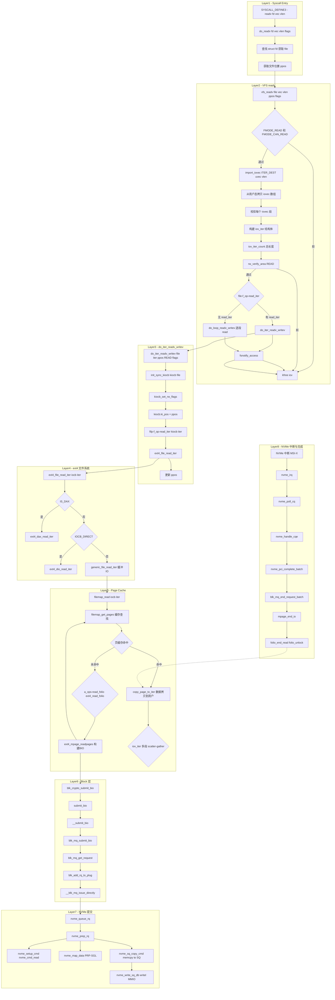

# readv 系统调用完整路径分析

## 1 概述

`readv` 是 Linux 的**分散输入/聚集输出（scatter-gather）** 读系统调用。与 `read` 的核心区别在于：`readv` 使用 `struct iovec` 数组描述**多个不连续的用户缓冲区**，内核将数据分散填入这些缓冲区，且全程在内核态完成缓冲区列表的拷贝与迭代。

### readv 与 read 的架构关系

```
read(fd, buf, count)                          readv(fd, iovec, iovcnt)
  │                                              │
  └─ new_sync_read()                            └─ do_iter_readv_writev()
       │                                             │
       └─ init_sync_kiocb + iov_iter_ubuf()          └─ init_sync_kiocb + import_iovec()
            │                                             │
            └─── 两者在此汇聚 ───┐
                                │
                filp->f_op->read_iter(&kiocb, &iter)
                                │
                          ext4_file_read_iter
```

**关键区别**：
- `new_sync_read` 通过 `iov_iter_ubuf()` 将**单缓冲区**包装为 `iov_iter`
- `do_iter_readv_writev` 通过 `import_iovec()` 从用户态拷贝**多段 iovec** 构建 `iov_iter`
- 汇聚后，下游路径（ext4、page cache、block、NVMe）完全一致

### 涉及的内核层

| 层 | 说明 |
|--|--|
| **Syscall Entry** | readv 系统调用分发 (fs/read_write.c) |
| **VFS** | iovec 导入 + kiocb 初始化 (fs/read_write.c) |
| **ext4** | ext4_file_read_iter → 读/预读 (fs/ext4/file.c) |
| **Page Cache** | filemap_read → 缓存查询/填充 (mm/filemap.c) |
| **Block Layer** | BIO 提交 (block/blk-core.c, blk-mq.c) |
| **NVMe 驱动** | 命令提交 + 中断完成 (drivers/nvme/host/pci.c) |

---

## 2 系统调用入口

### 2.1 SYSCALL_DEFINE3(readv)

```c
// fs/read_write.c:1338
SYSCALL_DEFINE3(readv, unsigned long, fd,
                 const struct iovec __user *, vec,
                 unsigned long, vlen)
{
    return do_readv(fd, vec, vlen, 0);
}
```

| 参数 | 类型 | 说明 |
|--|--|--|
| `fd` | `unsigned long` | 文件描述符 |
| `vec` | `const struct iovec __user *` | 用户态 iovec 数组指针 |
| `vlen` | `unsigned long` | iovec 数组元素个数 |

### 2.2 do_readv - fd 查找与位置获取

```c
// fs/read_write.c:1244
static ssize_t do_readv(unsigned long fd, const struct iovec __user *vec,
                        unsigned long vlen, rwf_t flags)
{
    CLASS(fd_pos, f)(fd);        // 通过 fd 查找 struct fd，持有引用
    ssize_t ret = -EBADF;

    if (!fd_empty(f)) {
        loff_t pos, *ppos = file_ppos(fd_file(f));  // 获取文件位置指针
        if (ppos) {
            pos = *ppos;
            ppos = &pos;
        }
        ret = vfs_readv(fd_file(f), vec, vlen, ppos, flags);
        if (ret >= 0 && ppos)
            fd_file(f)->f_pos = pos;  // 更新文件位置
    }

    if (ret > 0)
        add_rchar(current, ret);   // 统计读取字节数
    inc_syscr(current);            // 统计系统调用次数
    return ret;
}
```

---

## 3 VFS 层：vfs_readv

### 3.1 vfs_readv 完整流程

```c
// fs/read_write.c:1166
static ssize_t vfs_readv(struct file *file, const struct iovec __user *vec,
                         unsigned long vlen, loff_t *pos, rwf_t flags)
{
    struct iovec iovstack[UIO_FASTIOV];     // 栈上快速缓冲区 (8个 iovec)
    struct iovec *iov = iovstack;
    struct iov_iter iter;
    size_t tot_len;
    ssize_t ret = 0;

    // 权限检查
    if (!(file->f_mode & FMODE_READ))
        return -EBADF;
    if (!(file->f_mode & FMODE_CAN_READ))
        return -EINVAL;

    // 从用户态拷贝 iovec 数组 → 构建 iov_iter
    ret = import_iovec(ITER_DEST, vec, vlen,
                       ARRAY_SIZE(iovstack), &iov, &iter);
    if (ret < 0) return ret;

    tot_len = iov_iter_count(&iter);    // 所有段的总长度
    if (!tot_len) goto out;

    ret = rw_verify_area(READ, file, pos, tot_len);  // 读写区域验证
    if (ret < 0) goto out;

    // 核心：通过 read_iter 方法读取
    if (file->f_op->read_iter)
        ret = do_iter_readv_writev(file, &iter, pos, READ, flags);
    else
        ret = do_loop_readv_writev(file, &iter, pos, READ, flags);
    // ext4 使用 read_iter → do_iter_readv_writev 路径
out:
    if (ret >= 0)
        fsnotify_access(file);
    kfree(iov);        // 如果 iovec 超过 UIO_FASTIOV，之前已用 kmalloc 分配
    return ret;
}
```

### 3.2 import_iovec - 用户态 iovec 导入

```c
// lib/iov_iter.c:1436
ssize_t import_iovec(int type, const struct iovec __user *uvec,
                     unsigned nr_segs, unsigned fast_segs,
                     struct iovec **iovp, struct iov_iter *i)
```

核心流程：

```
import_iovec()
  │
  ├─ nr_segs > UIO_FASTIOV(8) ?  // 小量用栈，大量用堆
  │    ├─ 是 → kmalloc(+UIOEVENT) 分配堆内存
  │    └─ 否 → 使用栈上 iovstack
  │
  ├─ copy_from_user(iov, uvec, ...)  // 从用户态拷贝 iovec 数组
  │
  ├─ iov 合法性校验:
  │    ├─ 每个 iov.iov_len 检测
  │    ├─ 总长度不能超过 MAX_RW_COUNT
  │    └─ 每个缓冲区的 access_ok 检查
  │
  └─ iov_iter_init(i, type, iov, nr_segs, total_len)
       → 初始化 iov_iter 结构体
```

### 3.3 do_iter_readv_writev - kiocb 初始化

```c
// fs/read_write.c:988
static ssize_t do_iter_readv_writev(struct file *filp, struct iov_iter *iter,
                                    loff_t *ppos, int type, rwf_t flags)
{
    struct kiocb kiocb;
    ssize_t ret;

    init_sync_kiocb(&kiocb, filp);      // 初始化同步 kiocb
    ret = kiocb_set_rw_flags(&kiocb, flags, type);  // 设置 RWF_* 标志
    if (ret) return ret;
    kiocb.ki_pos = (ppos ? *ppos : 0);  // 设置 I/O 偏移

    // 对于 ext4 文件系统，read_iter 指向 ext4_file_read_iter
    ret = filp->f_op->read_iter(&kiocb, iter);
    BUG_ON(ret == -EIOCBQUEUED);        // 同步路径不应返回异步标记

    if (ppos)
        *ppos = kiocb.ki_pos;           // 更新文件位置
    return ret;
}
```

### 3.4 do_loop_readv_writev - 回退路径（无 read_iter）

```c
// fs/read_write.c:1011
static ssize_t do_loop_readv_writev(struct file *filp, struct iov_iter *iter,
                                    loff_t *ppos, int type, rwf_t flags)
{
    ssize_t ret = 0;
    while (iov_iter_count(iter)) {
        // 逐段调用 f_op->read（传统接口）
        nr = filp->f_op->read(filp, iter_iov_addr(iter),
                              iter_iov_len(iter), ppos);
        if (nr < 0) break;
        ret += nr;
        if (nr != iter_iov_len(iter)) break;
        iov_iter_advance(iter, nr);     // 推进迭代器到下一个 iovec 段
    }
    return ret;
}
```

---

## 4 readv 与 read 的汇聚点

以下路径与 `SYSCALL_DEFINE3(read)` 的 `new_sync_read` 路径完全一致。

| 维度 | read | readv |
|--|--|--|
| 入口 | `new_sync_read` | `do_iter_readv_writev` |
| kiocb 初始化 | `init_sync_kiocb` | `init_sync_kiocb` |
| iter 初始化 | `iov_iter_ubuf`（单 buf） | `import_iovec`（多段 iovec） |
| read_iter 调用 | `filp->f_op->read_iter` | `filp->f_op->read_iter` |
| 实际跳转 | `ext4_file_read_iter` | `ext4_file_read_iter` |

**结论**：readv 经过 VFS 层后，**完全复用** read 的 ext4/page cache/block/NVMe 路径。

---

## 5 ext4 文件系统层

### 5.1 ext4_file_read_iter

```c
// fs/ext4/file.c:186
static ssize_t ext4_file_read_iter(struct kiocb *iocb, struct iov_iter *to)
{
    if (unlikely(ext4_forced_shutdown(inode->i_sb)))
        return -EIO;

    if (!iov_iter_count(to))
        return 0;        // 零长度请求

    // DAX 路径
    if (IS_DAX(inode))
        return ext4_dax_read_iter(iocb, to);

    // Direct I/O 路径
    if (iocb->ki_flags & IOCB_DIRECT)
        return ext4_dio_read_iter(iocb, to);

    // 缓冲 I/O 路径 + 预读
    return generic_file_read_iter(iocb, to);
}
```

### 5.2 generic_file_read_iter → filemap_read

```
generic_file_read_iter(iocb, iter)          // mm/filemap.c:3014
  ├─ 检查 IOCB_DIRECT → 无
  │
  └─ filemap_read(iocb, iter, ret)          // mm/filemap.c:2794
       ├─ filemap_get_pages(iocb, iter, &fbat)  // 获取 folio 页
       │    ├─ filemap_get_read_batch(mapping, ...)  // 批量查找缓存
       │    ├─ page_cache_sync_ra(&ractl, ...)      // 同步预读
       │    └─ filemap_create_folio(mapping, ...)   // mm/filemap.c:2626
       │         └─ a_ops->read_folio(file, folio)
       │              └─ ext4_read_folio(filp, folio)  // → BIO 提交
       │
       └─ copy_page_to_iter(folio, offset, bytes, iter)
            → 将页缓存数据拷贝到用户缓冲区
            → iov_iter 原生支持多段 scatter-gather
```

### 5.3 ext4_read_folio → ext4_mpage_readpages

```
ext4_read_folio(file, folio)                  // fs/ext4/readpage.c:395
  └─ ext4_mpage_readpages(inode, folio, NULL, folio)
       ├─ ext4_map_blocks(...)                // 块映射 (extent 查找)
       ├─ bio_alloc(bdev, BIO_MAX_VECS, ...) // 分配 BIO
       ├─ bio_add_folio(bio, folio, ...)     // 添加数据页
       ├─ bio->bi_end_io = mpage_end_io      // 设置完成回调
       └─ blk_crypto_submit_bio(bio)         // 提交 BIO
```

---

## 6 块设备层

```
blk_crypto_submit_bio(bio)                    // 加密/直接提交
  └─ submit_bio(bio)                          // block/blk-core.c:992
       └─ __submit_bio(bio)                   // block/blk-core.c:636
            └─ blk_mq_submit_bio(bio)         // block/blk-mq.c:3151
                 ├─ bio split / merge 检查
                 ├─ blk_mq_get_request()      // 分配 request
                 ├─ blk_mq_bio_to_request()   // 绑 bio 到 request
                 ├─ blk_add_rq_to_plug()      // 尝试 plug 聚合
                 └─ __blk_mq_issue_directly() // 或直接提交
                      └─ hctx->ops->queue_rq()
                           └─ nvme_queue_rq
```

---

## 7 NVMe 驱动层

### 7.1 命令提交

```
nvme_queue_rq(hctx, bd)                        // pci.c:1405
  └─ nvme_prep_rq(req)                         // pci.c:1368
       ├─ nvme_setup_cmd(ns, req, cmd)         // nvme_cmd_read
       └─ nvme_map_data(req, cmd)              // PRP/SGL DMA 映射
  └─ nvme_sq_copy_cmd(nvmeq, req)              // pci.c:730 memcpy 到 SQ ring
  └─ nvme_write_sq_db(nvmeq)                   // pci.c:713 writel MMIO doorbell
```

### 7.2 中断完成

```
nvme_irq(irq, nvmeq)                           // pci.c:1599
  └─ nvme_poll_cq(nvmeq, ...)                  // pci.c:1578
       ├─ nvme_handle_cqe(nvmeq, cqe)          // pci.c:1531
       └─ nvme_ring_cq_doorbell(nvmeq)
  └─ nvme_pci_complete_batch(breq)             // pci.c:1563
       └─ blk_mq_end_request_batch()
            └─ bio_endio(bio)
                 └─ bio->bi_end_io()
                      └─ mpage_end_io(bio)     // fs/ext4/readpage.c:167
                           └─ __read_end_io(folio)
                                └─ folio_end_read(folio)  // 标记 uptodate + 解锁
```

---

## 8 数据回传：copy_page_to_iter

IO 完成后，在 `filemap_read` 中调用 `copy_page_to_iter` 将数据从页缓存拷贝到用户缓冲区：

```
filemap_read()
  │
  └─ copy_page_to_iter(folio, offset, bytes, iter)
       │
       └─ iov_iter 迭代：
            ├─ 段1: sg_copy_to_buffer(iov[0].base, iov[0].len)
            ├─ 段2: sg_copy_to_buffer(iov[1].base, iov[1].len)
            ├─ ...
            └─ 直到所有数据拷贝完毕
```

`copy_page_to_iter` 能**自动跨越 iov_iter 中的多个 iovec 段**，将一页数据连续拷贝到多个不连续的用户缓冲区中——这是 readv 相对于 read 的核心优势。

---

## 9 readv vs read 对比

| 对比项 | read | readv |
|--|--|--|
| 用户参数 | `buf, count` | `vec, vlen` (iovec 数组) |
| 缓冲区数量 | 1 | 任意 (最多 UIO_FASTIOV 或更多) |
| 用户态到内核态拷贝 | 无额外拷贝 | `import_iovec` 拷贝 iovec 数组 |
| I/O 路径 | `new_sync_read` | `vfs_readv → do_iter_readv_writev` |
| page cache → 用户拷贝 | `copy_page_to_iter` | 同上（自动 scatter-gather） |
| 下游 ext4/block/NVMe | 完全一致 | 完全一致 |

---

## 10 完整 Mermaid 流程图



---

## 11 完整函数调用链

| 步骤 | 函数 | 文件:行号 | 层 |
|--|--|--|--|
| 1 | `SYSCALL_DEFINE3(readv, fd, vec, vlen)` | fs/read_write.c:1338 | Syscall |
| 2 | `do_readv(fd, vec, vlen, 0)` | fs/read_write.c:1244 | Syscall |
| 3 | `vfs_readv(file, vec, vlen, ppos, flags)` | fs/read_write.c:1166 | VFS |
| 4 | `import_iovec(ITER_DEST, vec, vlen, ...)` | lib/iov_iter.c:1436 | VFS |
| 5 | `rw_verify_area(READ, file, pos, tot_len)` | fs/read_write.c | VFS |
| 6 | `do_iter_readv_writev(file, &iter, pos, READ, flags)` | fs/read_write.c:988 | VFS |
| 7 | `init_sync_kiocb(&kiocb, filp)` | fs/read_write.c:994 | VFS |
| 8 | `filp->f_op->read_iter(&kiocb, &iter)` | fs/read_write.c:1001 | VFS |
| 9 | `ext4_file_read_iter(iocb, iter)` | fs/ext4/file.c:186 | ext4 |
| 10 | `generic_file_read_iter(iocb, iter)` | mm/filemap.c:3014 | VFS/MM |
| 11 | `filemap_read(iocb, iter, ret)` | mm/filemap.c:2794 | Page Cache |
| 12 | `filemap_get_pages(iocb, iter, &fbat)` | mm/filemap.c:2693 | Page Cache |
| 13 | `filemap_get_read_batch(mapping, ...)` | mm/filemap.c | Page Cache |
| 14 | `page_cache_sync_ra(&ractl, ...)` | mm/readahead.c | Page Cache |
| 15 | `filemap_create_folio(mapping, ...)` | mm/filemap.c:2626 | Page Cache |
| 16 | `a_ops->read_folio(file, folio)` | mm/filemap.c:2517 | Page Cache |
| 17 | `ext4_read_folio(filp, folio)` | fs/ext4/readpage.c:395 | ext4 |
| 18 | `ext4_mpage_readpages(inode, ...)` | fs/ext4/readpage.c:211 | ext4 |
| 19 | `ext4_map_blocks(...)` | fs/ext4/inode.c | ext4 |
| 20 | `bio_alloc(bdev, BIO_MAX_VECS, ...)` | block/bio.c | Block |
| 21 | `bio_add_folio(bio, folio, ...)` | block/bio.c | Block |
| 22 | `blk_crypto_submit_bio(bio)` | block/blk-crypto.c | Block |
| 23 | `submit_bio(bio)` | block/blk-core.c:992 | Block |
| 24 | `blk_mq_submit_bio(bio)` | block/blk-mq.c:3151 | Block |
| 25 | `nvme_queue_rq(hctx, bd)` | drivers/nvme/host/pci.c:1405 | NVMe |
| 26 | `nvme_prep_rq(req)` | drivers/nvme/host/pci.c:1368 | NVMe |
| 27 | `nvme_setup_cmd(ns, req, cmd)` | drivers/nvme/host/core.c:1081 | NVMe |
| 28 | `nvme_sq_copy_cmd(nvmeq, req)` | drivers/nvme/host/pci.c:730 | NVMe |
| 29 | `nvme_write_sq_db(nvmeq)` | drivers/nvme/host/pci.c:713 | NVMe |
| 30 | `nvme_irq(irq, nvmeq)` | drivers/nvme/host/pci.c:1599 | NVMe |
| 31 | `nvme_poll_cq(nvmeq, ...)` | drivers/nvme/host/pci.c:1578 | NVMe |
| 32 | `nvme_handle_cqe(nvmeq, cqe)` | drivers/nvme/host/pci.c:1531 | NVMe |
| 33 | `blk_mq_end_request_batch(...)` | block/blk-mq.c | Block |
| 34 | `mpage_end_io(bio)` | fs/ext4/readpage.c:167 | ext4 |
| 35 | `folio_end_read(folio)` | mm/filemap.c | Page Cache |
| 36 | `copy_page_to_iter(folio, ...)` | mm/filemap.c | Page Cache |

---

## 12 关键数据结构

```
struct iovec (用户态)                 struct iov_iter (内核态)
+------------------------+           +----------------------------+
| iov_base (void*)       |           | iter_type (ITER_IOVEC)     |
| iov_len (size_t)       |           | data_source (READ=ITER_DEST)|
+------------------------+           | iov (struct iovec*)         |
struct iovec []                      | nr_segs (unsigned long)    |
[0] iov_base=0x7f...                 | iov_offset (偏移)           |
    iov_len=4096                     | count (剩余总长度)          |
[1] iov_base=0x7f...                 +----------------------------+
    iov_len=8192
[2] ...                              struct kiocb
                                     +----------------------------+
struct file                          | ki_filp (struct file*)      |
+------------------------+           | ki_pos (loff_t)             |
| f_op (file_operations) |           | ki_flags (IOCB_*)          |
| f_inode                |           +----------------------------+
| f_pos                  |
+------------------------+
```

---

## 13 关键优化机制

### 13.1 快速 iovec 路径 (UIO_FASTIOV)

```c
struct iovec iovstack[UIO_FASTIOV];  // 8 个 iovec 的栈上数组
struct iovec *iov = iovstack;
```

当 `vlen <= UIO_FASTIOV(8)` 时，iovec 数组直接在栈上分配，无需堆分配。超过 8 个段时才通过 `kmalloc` 分配。这是 readv 的微优化。

### 13.2 iov_iter scatter-gather

`filemap_read` 中的 `copy_page_to_iter()` 使用 `iov_iter` 的原生 scatter-gather 能力，自动处理多段用户缓冲区。具体流程：

```
copy_page_to_iter(folio, offset, bytes, iter)
  │
  └─ iterate_and_advance(iter, bytes, ...)
       │
       └─ 对 iov_iter 中的每一段:
            ├─ memcpy(page_addr + off, iov[i].base, seg_len)
            └─ iov_iter_advance(iter, seg_len)
```

### 13.3 下游路径优化（与 read 共享）

所有读路径优化均继承自 read 系统调用：
- **Page cache 批量查找**：`filemap_get_read_batch` 一次取多个 folio
- **同步预读**：`page_cache_sync_ra` 预测后续读请求
- **NVMe 批量完成**：`nvme_pci_complete_batch` 批量处理 CQ 条目
- **Block plug**：`blk_add_rq_to_plug` 合并相邻小请求

---

## 14 总结

```
                    readv 系统调用完整数据流

用户态 readv(fd, [{buf1,4K}, {buf2,8K}, {buf3,4K}], 3)
  │
  │   [用户态 → 内核态]
  │
  ├─ 1. 系统调用入口 (SYSCALL_DEFINE3)
  │
  ├─ 2. VFS 层
  │    ├─ import_iovec: 拷贝 iovec[3] 到内核 (验证每个段)
  │    ├─ rw_verify_area: 权限检查
  │    └─ do_iter_readv_writev: init_sync_kiocb → read_iter
  │
  ├─ 3. ext4 文件系统
  │    └─ ext4_file_read_iter → generic_file_read_iter
  │
  ├─ 4. Page Cache
  │    ├─ filemap_get_pages: 缓存查找/填充
  │    └─ ext4_read_folio (未命中时) → ext4_mpage_readpages
  │
  ├─ 5. Block 层
  │    └─ submit_bio → blk_mq_submit_bio → nvme_queue_rq
  │
  ├─ 6. NVMe 驱动
  │    ├─ nvme_prep_rq → nvme_sq_copy_cmd → writel(Doorbell)
  │    └─ [硬件 DMA 读取数据到 DRAM]
  │
  ├─ 7. 中断完成
  │    └─ nvme_irq → mpage_end_io → folio_end_read
  │
  └─ 8. 数据回传
       └─ copy_page_to_iter(folio, iter)
            └─ scatter-gather: buf1[4K] ← 部分, buf2[6K] ← 剩余, buf3[2K] ← 继续
```

**核心要点**：
- readv 与 read 共享 **ext4 → Block → NVMe** 完整下游路径
- 唯一区别在 VFS 入口层：`import_iovec`  vs `iov_iter_ubuf`
- `copy_page_to_iter` 负责 scatter-gather 数据分发，对下游完全透明
- 当 `iovec` 段数 ≤ 8 时，使用栈上数组，零堆分配开销
