# 进程调度 / 凭证 / 信号系统调用完整路径分析

## 1 概述

进程调度、凭证与信号是 Linux 进程运行控制的三类核心系统调用。调度类决定 CPU 时间分配，凭证类控制安全上下文，信号类处理异步事件通知。

### 关键特点

- **调度 syscalls**：通过 `struct sched_class` 多态调度（CFS/RT/DL），`__sched_setscheduler` 是核心入口
- **凭证 syscalls**：基于 COW (Copy-On-Write) 的 `struct cred`，通过 `commit_creds` 原子切换
- **信号 syscalls**：通过 `siglock` 保护信号队列，`do_signal` 在返回用户态前递送
- **signalfd4**：将信号转换为文件描述符事件，可被 epoll/poll/select 复用

---

## 2 涉及的内核层

| 层 | 说明 |
|--|--|
| **Syscall Entry** | sched_setparam / setuid / kill / rt_sigaction 等 |
| **调度核心** | __sched_setscheduler / sched_setaffinity / sched_yield (kernel/sched/) |
| **凭证核心** | cred_jar / commit_creds / __sys_setuid (kernel/cred.c, kernel/sys.c) |
| **信号核心** | send_signal / do_sigaction / do_signal (kernel/signal.c) |
| **进程管理** | task_struct 中的信号/凭证字段管理 |

---

## 3 进程调度系统调用

### 3.1 系统调用入口

```c
// sched_setparam - 设置调度参数
SYSCALL_DEFINE2(sched_setparam, pid_t, pid, struct sched_param __user *, param)
{
    return do_sched_setscheduler(pid, SETPARAM_POLICY, param);
}

// sched_setscheduler - 设置调度策略和参数
SYSCALL_DEFINE3(sched_setscheduler, pid_t, pid, int, policy,
        struct sched_param __user *, param)
{
    return do_sched_setscheduler(pid, policy, param);
}

// sched_setaffinity - 设置 CPU 亲和性
SYSCALL_DEFINE3(sched_setaffinity, pid_t, pid, unsigned int, len,
        unsigned long __user *, user_mask_ptr)
{
    cpumask_var_t new_mask;
    alloc_cpumask_var(&new_mask, GFP_KERNEL);
    get_user_cpu_mask(user_mask_ptr, len, new_mask);
    return sched_setaffinity(pid, new_mask);
}

// sched_yield - 主动让出 CPU
SYSCALL_DEFINE0(sched_yield)
{
    do_sched_yield();
    return 0;
}

// nice - 修改友好值
SYSCALL_DEFINE1(nice, int, increment)
{
    nice = task_nice(current) + clamp(increment, -NICE_WIDTH, NICE_WIDTH);
    nice = clamp_val(nice, MIN_NICE, MAX_NICE);
    set_user_nice(current, nice);
    return 0;
}
```

### 3.2 核心执行路径

```
do_sched_setscheduler(pid, policy, param)          // setparam/setscheduler 统一入口
  ├─ find_process_by_pid(pid)                       // 查找目标进程
  ├─ sched_copy_attr / sched_param_to_attr           // 拷贝调度属性
  └─ __sched_setscheduler(p, &attr, ...)
       ├─ security_task_setscheduler(p)              // LSM 检查
       ├─ cgroup_can_attach / cgroup_attach            // cgroup 检查
       ├─ 检查目标 policy 权限（CAP_SYS_NICE）
       ├─ p->sched_class = &fair_sched_class          // 或 rt/dl
       │    ├─ fair_sched_class (CFS)
       │    ├─ rt_sched_class (实时 FIFO/RR)
       │    └─ dl_sched_class (Deadline)
       ├─ p->policy = policy                         // 更新调度策略
       ├─ p->prio = effective_prio(p)                // 更新优先级
       ├─ p->se.slice = attr->sched_runtime           // CFS 时间片
       ├─ set_load_weight(p, true)                   // 更新调度权重
       ├─ activate_task / check_class_changed         // 重新入队
       └─ task_rq(p)->rd->overloaded = true          // 标记过载
```

`sched_setaffinity` 路径：

```
sched_setaffinity(pid, new_mask)
  ├─ find_process_by_pid(pid)
  ├─ security_task_setscheduler(p)                     // LSM
  ├─ cpuset_cpus_allowed(p, cpus_allowed)              // cpuset 限制
  ├─ cpumask_and(new_mask, new_mask, cpus_allowed)      // 取交集
  ├─ __set_cpus_allowed_ptr(p, new_mask, ...)           // 设置亲和性
  │    ├─ p->cpus_ptr = new_mask
  │    ├─ 若当前 CPU 不在新 mask 中：
  │    │    └─ stop_one_cpu(cpu, migration_cpu_stop, p) // 迁移到新 CPU
  │    └─ wake_up_if_idle(cpu)                          // 唤醒空闲 CPU
  └─ affinity_jobctl / check_affinity 等
```

`sched_yield` 路径：

```
do_sched_yield()
  └─ yield_task_fair(rq)                              // CFS yield
       └─ clear_buddies(rq, se)                        // 清除 buddy
       └─ se->vruntime = rq->cfs.min_vruntime + ...    // 增加 vruntime
       └─ resched_curr(rq)                             // 触发重调度
```

---

## 4 进程凭证与权限

### 4.1 核心机制：struct cred

```c
struct cred {
    kuid_t    uid;           // 实际用户 ID
    kuid_t    gid;           // 实际组 ID
    kuid_t    euid;          // 有效用户 ID
    kgid_t    egid;          // 有效组 ID
    kuid_t    suid;          // 保留用户 ID
    kgid_t    sgid;          // 保留组 ID
    kuid_t    fsuid;         // 文件系统用户 ID
    kgid_t    fsgid;         // 文件系统组 ID
    kernel_cap_t   cap_effective;    // 有效能力集
    kernel_cap_t   cap_permitted;    // 许可能力集
    kernel_cap_t   cap_bset;         // 能力边界集
    kernel_cap_t   cap_ambient;      // 环境能力集
    // ... securebits, keys, LSM blob ...
};
```

cred 管理使用 **Copy-On-Write**：所有凭据修改操作首先 `prepare_creds`（拷贝当前 cred），在新副本上修改，然后 `commit_creds` 原子切换。

### 4.2 系统调用实现

```
getuid()                    // 读取 current_uid()
  └─ from_kuid_munged(current_user_ns(), current_uid())
geteuid()
  └─ from_kuid_munged(current_user_ns(), current_euid())
getgid() / getegid()       // 类似

setuid(uid)
  └─ __sys_setuid(uid)
       ├─ make_kuid(ns, uid)                          // 用户空间→内核 uid
       ├─ prepare_creds() → new                       // COW 拷贝
       ├─ uid_eq(uid, old->uid) || capable(CAP_SETUID) // 权限检查
       ├─ new->uid = new->euid = new->suid = uid       // 全部更新
       ├─ new->fsuid = new->euid                       // 文件系统 uid 同步
       └─ commit_creds(new)                            // 原子切换

setresuid(ruid, euid, suid)
  └─ __sys_setresuid(ruid, euid, suid)
       ├─ make_kuid 转换三个 uid
       ├── 权限规则：CAP_SETUID / 交换条件
       ├── prepare_creds + 修改
       └── commit_creds

setreuid(ruid, euid)                                  // 兼容 BSD
  └─ __sys_setreuid(ruid, euid)

setfsuid(fsuid)
  └─ __sys_setfsuid(fsuid)
       └─ new->fsuid = fsuid

setpgid(pid, pgid)                                    // 进程组管理
  └─ __sys_setpgid(pid, pgid)
       ├─ find_task_by_vpid(pid)
       ├─ 检查会话关系
       └─ p->group_leader->pgrp = pgid

setsid()                                              // 创建新会话
  └─ __sys_setsid()
       ├─ 禁止进程组组长调用
       └─ session = task_session(current)
       └─ group_leader->session = session

capget(header, data)                                  // 获取能力
  └─ do_capget(header, data)
       ├─ find_task_by_vpid(pid)
       └─ target->cred->cap_* 拷贝到用户

capset(header, data)                                  // 设置能力
  └─ do_capset(header, data)
       ├─ prepare_creds()
       ├─ capable_wrt_inaccessible_helpers
       └─ commit_creds()

personality(persona)                                  // 执行域
  └─ current->personality = persona
       └─ 影响系统调用行为（如 mmap 地址随机化）
```

---

## 5 信号处理

### 5.1 系统调用入口

```c
// kill - 向进程/进程组发送信号
SYSCALL_DEFINE2(kill, pid_t, pid, int, sig)
{
    struct kernel_siginfo info;
    prepare_kill_siginfo(sig, &info, PIDTYPE_TGID);
    return kill_something_info(sig, &info, pid);
}

// tkill - 向单个线程发信号
SYSCALL_DEFINE2(tkill, pid_t, pid, int, sig)
{
    return do_tkill(0, pid, sig);
}

// tgkill - 向指定线程组中的线程发信号
SYSCALL_DEFINE3(tgkill, pid_t, tgid, pid_t, pid, int, sig)
{
    return do_tkill(tgid, pid, sig);
}

// rt_sigaction - 设置信号处理函数
SYSCALL_DEFINE4(rt_sigaction, int, sig, const struct sigaction __user *, act,
        struct sigaction __user *, oact, size_t, sigsetsize)
{
    return do_sigaction(sig, act ? &new_sa : NULL, oact ? &old_sa : NULL);
}

// rt_sigprocmask - 修改/查询信号掩码
SYSCALL_DEFINE4(rt_sigprocmask, int, how, sigset_t __user *, set,
        sigset_t __user *, oset, size_t, sigsetsize)
{
    return do_sigprocmask(how, &set, oset);
}

// sigaltstack - 设置替代信号栈
SYSCALL_DEFINE2(sigaltstack, const stack_t __user *, ss, stack_t __user *, oss)
{
    return do_sigaltstack(ss, oss, current->sas_ss_sp, current->sas_ss_size);
}
```

### 5.2 kill/tkill/tgkill 信号发送路径

```
kill(pid, sig) → kill_something_info(sig, info, pid)
  ├─ pid > 0 → kill_proc_info(sig, info, pid)
  │    └─ group_send_sig_info(sig, info, p, PIDTYPE_PID)
  │         └─ __send_signal(sig, info, p, PIDTYPE_PID, false)
  │              ├─ pending = &p->signal->shared_pending       // 共享信号
  │              ├─ legacy_queue(pending, sig)                  // 不可靠信号
  │              ├─ sig_addset(&pending->signal, sig)           // 置位
  │              ├─ 若 SIGQUEUE 类型 → alloc_sigqueue 入队     // 携带信息的信号入队
  │              └─ complete_signal(sig, p, PIDTYPE_PID)        // 递送决策
  │                   ├─ signal_wake_up(t, resume)              // 唤醒目标线程
  │                   │    └─ t->state = TASK_RUNNING
  │                   │    └─ kick_process / ttwu_queue
  │                   └─ 若信号被阻塞 → 标记 pending（延迟递送）
  ├─ pid == 0 → __kill_pgrp_info(sig, info, task_pgrp(current)) // 进程组
  └─ pid == -1 → for_each_process(p) group_send_sig_info(...)   // 全局（除 init）

tkill(tid, sig) → do_tkill(0, pid, sig)
  └─ do_send_specific(0, pid, sig, &info)
       └─ __send_signal(sig, info, p, PIDTYPE_PID, false)
            └─ pending = &p->pending                          // 线程私有信号
            └─ complete_signal(sig, p, PIDTYPE_PID)
                 └─ signal_wake_up(t, 0)                       // 唤醒特定线程

tgkill(tgid, tid, sig) → do_tkill(tgid, pid, sig)
  └─ do_send_specific(tgid, pid, sig, &info)
       └─ 检查 tgid == task_tgid_vnr(p)                        // 验证线程组
       └─ __send_signal + complete_signal
```

### 5.3 信号接收与处理

```
信号处理流程（返回用户态前）：
do_signal(regs)                                      // arch/arm64/kernel/signal.c
  └─ get_signal(&ksig)                                // kernel/signal.c
       ├─ signalfd_notify(current, sig)                // signalfd 通知
       ├─ 处理 SIGKILL / SIGSTOP (不可阻塞/忽略)
       ├─ 查找信号处理:
       │    ├─ action->sa_handler == SIG_IGN → 丢弃
       │    ├─ action->sa_handler == SIG_DFL → 默认行为
       │    │    ├─ 终止进程 (do_exit)
       │    │    ├─ 生成 core dump
       │    │    └─ 停止/继续进程
       │    └─ action->sa_handler 用户函数 → setup_rt_frame
       │         └─ arm64 特定的信号帧设置:
       │              ├─ struct rt_sigframe 在用户栈上
       │              ├─ sigframe->uc.uc_mcontext 保存上下文
       │              └─ regs->pc = handler 地址
       └─ regs->regs[0] = sig (信号号传给 handler)
```

`signalfd4` 路径：
```
signalfd4(fd, mask, flags)
  └─ signalfd4(fd, &mask, flags)                     // fs/signalfd.c
       ├─ signalfd_file_create(current->sighand, &mask, flags)  // 创建
       │    └─ anon_inode_getfile("[signalfd]", &signalfd_fops, ctx, ...)
       └─ signalfd_file_overwrite(fd, &mask)            // 用新 mask 替换 fd
```

signalfd 的核心是将信号转换为可读的文件描述符事件：
- `signalfd_dequeue` 在 `signalfd_read` 中被调用，从 `pending` 队列提取信号
- `signalfd_poll` 返回 `POLLIN` 当有待处理信号
- 可与 `epoll` 配合使用

### 5.4 rt_sigaction / rt_sigprocmask 路径

```
do_sigaction(sig, act, oact)                          // kernel/signal.c:4300
  ├─ valid_signal(sig) → sig >= 1 && sig < _NSIG
  ├─ k = &current->sighand->action[sig-1]              // 信号处理函数表
  ├─ spin_lock_irq(&p->sighand->siglock)
  ├─ 若 SA_IMMUTABLE → -EINVAL
  ├─ if (oact) *oact = *k                              // 保存旧 action
  ├─ if (act) *k = *act                                // 设置新 action
  │    ├─ 设置 SA_SIGINFO → 三参数 handler
  │    ├─ 设置 SA_RESTORER → sa_restorer 函数
  │    ├─ 设置 SA_ONSTACK → 使用 sigaltstack
  │    └─ 处理 SA_RESETHAND / SA_NODEFER 等
  └─ spin_unlock_irq(&p->sighand->siglock)

do_sigprocmask(how, set, oset)                        // 修改当前信号掩码
  ├─ sigdelsetmask(set, sigmask(SIGKILL)|sigmask(SIGSTOP))  // 强制不可屏蔽
  ├─ spin_lock_irq(&current->sighand->siglock)
  ├─ if (oset) *oset = current->blocked                // 保存旧掩码
  ├─ switch (how):
  │    ├─ SIG_BLOCK   → current->blocked |= *set       // 添加阻塞
  │    ├─ SIG_UNBLOCK → current->blocked &= ~*set      // 移除阻塞
  │    └─ SIG_SETMASK → current->blocked = *set        // 替换
  ├─ recalc_sigpending(current)                         // 重新计算待处理信号
  └─ spin_unlock_irq(&current->sighand->siglock)
```

---

## 6 完整 Mermaid 流程图

```mermaid
graph TB
    subgraph L1[Layer1 - 调度系统调用]
        A1[sched_setparam pid param]
        A2[sched_setscheduler pid policy]
        A3[sched_setaffinity pid mask]
        A4[__sched_setscheduler]
        A5[p-sched_class = fair-rt-dl]
        A6[sched_setaffinity -- 迁移]
        A7[do_sched_yield]
        A1 --> A4
        A2 --> A4
        A4 --> A5
        A3 --> A6
        A7 --> A8[yield_task_fair]
    end

    subgraph L2[Layer2 - 凭证系统调用]
        B1[setuid uid]
        B2[prepare_creds -- COW]
        B3[commit_creds -- 切换]
        B4[capget capset]
        B5[CAP 能力检查]
        B6[personality]
        B1 --> B2 --> B3
        B4 --> B5
        B6 --> B7[current-personality = persona]
    end

    subgraph L3[Layer3 - 信号发送]
        C1[kill pid sig]
        C2[tgkill tgid tid sig]
        C3[__send_signal]
        C4{pending 队列}
        C5[complete_signal]
        C6[signal_wake_up -- 唤醒]
        C1 --> C3
        C2 --> C3
        C3 --> C4
        C4 --> C5 --> C6
    end

    subgraph L4[Layer4 - 信号接收与处理]
        D1[rt_sigaction sig act]
        D2[do_sigaction]
        D3[sighand-action-sig 表]
        D4[do_signal -- 返回用户态]
        D5{handler 类型}
        D6[SIG_IGN -- 丢弃]
        D7[SIG_DFL -- 默认]
        D8[用户 handler]
        D9[setup_rt_frame]
        D1 --> D2 --> D3
        D4 --> D5
        D5 --> D6
        D5 --> D7
        D5 --> D8 --> D9
    end

    subgraph L5[Layer5 - signalfd / sigaltstack]
        E1[signalfd4 fd mask]
        E2[signalfd_file_create]
        E3[signalfd_read -- 信号出队]
        E4[sigaltstack ss oss]
        E5[do_sigaltstack]
        E1 --> E2 --> E3
        E4 --> E5
    end
```



---

## 7 完整函数调用链

### 7.1 调度系统调用

| 步骤 | 函数 | 文件:行号 | 层 |
|--|--|--|--|
| 1 | `SYSCALL_DEFINE2(sched_setparam)` | kernel/sched/syscalls.c:949 | Syscall |
| 2 | `do_sched_setscheduler(pid, policy, param)` | kernel/sched/syscalls.c | Sched |
| 3 | `__sched_setscheduler(p, &attr, ...)` | kernel/sched/core.c | Sched |
| 4 | `SYSCALL_DEFINE3(sched_setaffinity)` | kernel/sched/syscalls.c:1256 | Syscall |
| 5 | `sched_setaffinity(pid, new_mask)` | kernel/sched/syscalls.c | Sched |
| 6 | `__set_cpus_allowed_ptr(p, new_mask)` | kernel/sched/core.c | Sched |
| 7 | `SYSCALL_DEFINE0(sched_yield)` | kernel/sched/syscalls.c:1354 | Syscall |
| 8 | `do_sched_yield()` | kernel/sched/core.c | Sched |
| 9 | `set_user_nice(current, nice)` | kernel/sched/core.c | Sched |

### 7.2 凭证系统调用

| 步骤 | 函数 | 文件:行号 | 层 |
|--|--|--|--|
| 1 | `SYSCALL_DEFINE1(setuid)` | kernel/sys.c:698 | Syscall |
| 2 | `__sys_setuid(uid)` | kernel/sys.c | Cred |
| 3 | `prepare_creds()` | kernel/cred.c | Cred |
| 4 | `commit_creds(new)` | kernel/cred.c | Cred |
| 5 | `SYSCALL_DEFINE2(capget)` | kernel/cred.c | Syscall |
| 6 | `do_capget(header, data)` | kernel/cred.c | Cred |
| 7 | `SYSCALL_DEFINE1(personality)` | kernel/sys.c | Syscall |
| 8 | `SYSCALL_DEFINE2(setpgid)` | kernel/sys.c | Syscall |
| 9 | `SYSCALL_DEFINE0(setsid)` | kernel/sys.c | Syscall |

### 7.3 信号系统调用

| 步骤 | 函数 | 文件:行号 | 层 |
|--|--|--|--|
| 1 | `SYSCALL_DEFINE2(kill)` | kernel/signal.c:3947 | Syscall |
| 2 | `kill_something_info(sig, info, pid)` | kernel/signal.c:1572 | Signal |
| 3 | `group_send_sig_info(sig, info, p, ...)` | kernel/signal.c | Signal |
| 4 | `__send_signal(sig, info, p, PIDTYPE_TGID, false)` | kernel/signal.c | Signal |
| 5 | `complete_signal(sig, p, PIDTYPE_TGID)` | kernel/signal.c | Signal |
| 6 | `signal_wake_up(t, resume)` | kernel/signal.c | Signal |
| 7 | `SYSCALL_DEFINE2(tkill)` | kernel/signal.c:4181 | Syscall |
| 8 | `do_tkill(0, pid, sig)` | kernel/signal.c:4146 | Signal |
| 9 | `do_send_specific(tgid, pid, sig, info)` | kernel/signal.c | Signal |
| 10 | `SYSCALL_DEFINE3(tgkill)` | kernel/signal.c:4165 | Syscall |
| 11 | `SYSCALL_DEFINE4(rt_sigaction)` | kernel/signal.c:4627 | Syscall |
| 12 | `do_sigaction(sig, act, oact)` | kernel/signal.c:4300 | Signal |
| 13 | `SYSCALL_DEFINE4(rt_sigprocmask)` | kernel/signal.c | Syscall |
| 14 | `do_sigprocmask(how, set, oset)` | kernel/signal.c | Signal |
| 15 | `SYSCALL_DEFINE2(sigaltstack)` | kernel/signal.c | Syscall |
| 16 | `do_sigaltstack(ss, oss, ...)` | kernel/signal.c | Signal |
| 17 | `SYSCALL_DEFINE4(signalfd4)` | fs/signalfd.c | Syscall |
| 18 | `signalfd4(fd, &mask, flags)` | fs/signalfd.c | Signalfd |

---

## 8 关键数据结构

```
struct task_struct (调度相关)         struct sched_attr
+-------------------------------+   +-----------------------+
| prio / static_prio / normal_prio|  | sched_policy           |
| policy (SCHED_FIFO/RR/OTHER/DL)|  | sched_nice              |
| sched_class → fair/rt/dl       |   | sched_priority (RT)     |
| se (struct sched_entity, CFS)   |   | sched_runtime (DL)      |
| rt (struct sched_rt_entity)     |   | sched_deadline (DL)     |
| dl (struct sched_dl_entity)     |   | sched_period (DL)       |
| cpus_ptr (CPU 亲和性)           |   +-----------------------+
| nr_cpus_allowed                 |
+-------------------------------+   struct cred
                                    +-----------------------+
struct sighand_struct               | uid / gid / euid / egid|
+-------------------------------+   | suid / sgid / fsuid    |
| action[_NSIG] (处理函数表)     |   | cap_effective          |
| siglock (spinlock)             |   | cap_permitted          |
| count (引用计数)                |   | cap_bset / cap_ambient|
+-------------------------------+   | user / group / keys     |
                                    +-----------------------+
struct signal_struct
+-------------------------------+
| shared_pending (共享信号队列)    |
| shared_pending.signal (位图)   |
| leader (线程组 leader)          |
| cur_samples / sum_sched_runtime|
| oom_score_adj / ...            |
+-------------------------------+
```

---

## 9 总结

三类系统调用的核心机制：

| 类别 | 核心函数 | 数据路径 | 同步机制 |
|--|--|--|--|
| **调度** | `__sched_setscheduler` | `sched_class->enqueue_task` | `rq->lock` (raw_spinlock) |
| **凭证** | `commit_creds` | `cred->uid/gid/cap_*` 原子替换 | rcu + refcount |
| **信号** | `__send_signal` | `sigqueue` 链表入队 | `siglock` (spinlock_irq) |
| **信号处理** | `do_signal` → `setup_rt_frame` | 用户栈信号帧 | 返回用户态前同步处理 |
