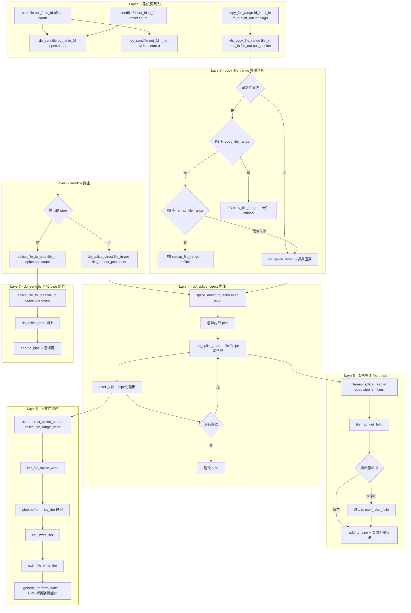

# sendfile / copy_file_range 系统调用完整路径分析

## 1 概述

sendfile 和 copy_file_range 是两个**零拷贝文件传输**系统调用，用于在内核中直接完成文件间或文件到 socket 的数据传输，避免用户空间的中间缓冲。

### 关键特点

- **sendfile**：零拷贝从文件到 socket（或到 pipe）的传输，避免用户态中间缓冲区
- **sendfile64**：支持 64 位偏移量的 sendfile 变体
- **copy_file_range**：内核内的文件区间拷贝，优先尝试重映射（reflink），回退到 splice
- **都基于 splice 机制**：sendfile 内部调用 `do_splice_direct`，copy_file_range 回退路径也使用 `do_splice_direct`
- **零拷贝条件**：sendfile 文件→socket 路径通过 pipe buffer 页面引用传递；copy_file_range 同文件系统可硬件 offload（reflink）

---

## 2 涉及的内核层

| 层 | 说明 |
|--|--|
| **Syscall Entry** | sendfile/sendfile64/copy_file_range (fs/read_write.c) |
| **VFS** | do_sendfile / vfs_copy_file_range (fs/read_write.c) |
| **splice 核心** | do_splice_direct → splice_direct_to_actor (fs/splice.c) |
| **pipe 层** | 管道缓冲区（作为中转） |
| **ext4（源）** | filemap_splice_read / ext4_file_splice_read |
| **ext4（目标）** | iter_file_splice_write / ext4_file_write_iter |
| **ext4 reflink** | ext4_remap_file_range（copy_file_range 同 FS 优先路径） |
| **Page Cache** | 页面引用传递 |
| **Block Layer / NVMe** | 仅在页缓存未命中时触及 |

---

## 3 sendfile 系统调用

### 3.1 SYSCALL_DEFINE4(sendfile) - fs/read_write.c:1679

```c
SYSCALL_DEFINE4(sendfile, int, out_fd, int, in_fd, off_t __user *, offset,
        size_t, count)
{
    loff_t pos;
    off_t off;
    ssize_t ret;

    if (offset) {
        if (unlikely(get_user(off, offset)))
            return -EFAULT;
        pos = off;
        ret = do_sendfile(out_fd, in_fd, &pos, count, MAX_NON_LFS);
        if (unlikely(put_user(pos, offset)))
            return -EFAULT;
        return ret;
    }

    return do_sendfile(out_fd, in_fd, NULL, count, 0);
}

SYSCALL_DEFINE4(sendfile64, int, out_fd, int, in_fd, loff_t __user *, offset,
        size_t, count)
{
    loff_t pos;
    ssize_t ret;

    if (offset) {
        if (unlikely(copy_from_user(&pos, offset, sizeof(loff_t))))
            return -EFAULT;
        ret = do_sendfile(out_fd, in_fd, &pos, count, 0);
        if (unlikely(put_user(pos, offset)))
            return -EFAULT;
        return ret;
    }

    return do_sendfile(out_fd, in_fd, NULL, count, 0);
}
```

关键差异：
- **sendfile**：`offset` 使用 `off_t`（32位），`MAX_NON_LFS` 限制（2GB）
- **sendfile64**：`offset` 使用 `loff_t`（64位），无 LFS 限制
- `offset != NULL`：使用指定偏移，**不更新** `file->f_pos`
- `offset == NULL`：使用 `file->f_pos`，并**更新** `f_pos`

### 3.2 do_sendfile - fs/read_write.c:1583

```c
static ssize_t do_sendfile(int out_fd, int in_fd, loff_t *ppos,
               size_t count, loff_t max)
{
    struct pipe_inode_info *opipe;
    loff_t pos;
    loff_t out_pos;
    ssize_t retval;
    int fl;

    // --- 输入文件检查 ---
    CLASS(fd, in)(in_fd);
    // ... FMODE_READ 校验 ...
    if (!ppos) {
        pos = fd_file(in)->f_pos;           // 使用 f_pos
    } else {
        pos = *ppos;
        if (!(fd_file(in)->f_mode & FMODE_PREAD))
            return -ESPIPE;                 // 需要 FMODE_PREAD
    }
    retval = rw_verify_area(READ, fd_file(in), &pos, count);

    // --- 输出文件检查 ---
    CLASS(fd, out)(out_fd);
    // ... FMODE_WRITE 校验 ...
    out_pos = fd_file(out)->f_pos;

    // 检查传输大小限制
    if (!max)
        max = min(in_inode->i_sb->s_maxbytes, out_inode->i_sb->s_maxbytes);

    // --- 路由选择（基于输出类型）---
    opipe = get_pipe_info(fd_file(out), true);
    if (!opipe) {
        // 输出不是 pipe → 通过内部 pipe 中转
        retval = do_splice_direct(fd_file(in), &pos, fd_file(out), &out_pos,
                      count, fl);
    } else {
        // 输出是 pipe → 直接 file→pipe 拼接
        retval = splice_file_to_pipe(fd_file(in), opipe, &pos, count, fl);
    }

    // --- 统计更新 ---
    if (retval > 0) {
        add_rchar(current, retval);
        add_wchar(current, retval);
        fsnotify_access(fd_file(in));
        fsnotify_modify(fd_file(out));
        fd_file(out)->f_pos = out_pos;
        if (ppos)
            *ppos = pos;
        else
            fd_file(in)->f_pos = pos;
    }
    inc_syscr(current);
    inc_syscw(current);
    return retval;
}
```

### 3.3 sendfile 两条路径

#### 路径 A：文件→socket（通过内部 pipe 中转，零拷贝）

```
sendfile(socket_fd, file_fd, offset, count)
  └─ do_sendfile(out_fd=file_out_not_pipe, in_fd=file_in, ...)
       └─ do_splice_direct(file_in, &pos, file_out, &out_pos, count, 0)
            └─ splice_direct_to_actor(in, &sd, direct_splice_actor)
                 ├─ 创建内部匿名 pipe
                 ├─ do_splice_read(in, &pos, pipe, len, flags)
                 │    → file_in->f_op->splice_read
                 │    → ext4_file_splice_read
                 │    → filemap_splice_read
                 │    → add_to_pipe（零拷贝：页面引用传递到 pipe）
                 ├─ sd.u.file = file_out (socket)
                 └─ sd.actor → direct_splice_actor
                      └─ pipe_to_sendpage(pipe, buf, sd)
                           └─ out->f_op->splice_write(pipe, out, opos, len, flags)
                           或 pipe buf → sendpage
```

对于 socket 输出，`direct_splice_actor` 会调用 `pipe_to_sendpage`，直接将 pipe buffer 中的页面描述符传递给网络协议栈（如 tcp_sendpage），**真正的零拷贝**。

#### 路径 B：文件→pipe（直接拼接）

```
sendfile(pipe_fd, file_fd, offset, count)
  └─ do_sendfile(out_fd=pipe, in_fd=file, ...)
       └─ splice_file_to_pipe(file_in, opipe, &pos, count, fl)
            └─ do_splice_read(in, offset, opipe, len, flags)
                 → filemap_splice_read → add_to_pipe（零拷贝）
```

---

## 4 copy_file_range 系统调用

### 4.1 SYSCALL_DEFINE6(copy_file_range) - fs/read_write.c:1929

```c
SYSCALL_DEFINE6(copy_file_range, int, fd_in, loff_t __user *, off_in,
        int, fd_out, loff_t __user *, off_out,
        size_t, len, unsigned int, flags)
{
    loff_t pos_in;
    loff_t pos_out;
    ssize_t ret = -EBADF;

    // 输入/输出文件获取
    CLASS(fd, f_in)(fd_in);
    CLASS(fd, f_out)(fd_out);

    // 偏移量处理
    if (off_in) {
        if (copy_from_user(&pos_in, off_in, sizeof(loff_t)))
            return -EFAULT;
    } else {
        pos_in = fd_file(f_in)->f_pos;      // 使用 f_pos
    }
    if (off_out) {
        if (copy_from_user(&pos_out, off_out, sizeof(loff_t)))
            return -EFAULT;
    } else {
        pos_out = fd_file(f_out)->f_pos;
    }

    if (flags != 0)
        return -EINVAL;

    ret = vfs_copy_file_range(fd_file(f_in), pos_in, fd_file(f_out),
                  pos_out, len, flags);
    // 更新偏移量
    if (ret > 0) {
        pos_in += ret;
        pos_out += ret;
        if (off_in) {
            if (copy_to_user(off_in, &pos_in, sizeof(loff_t)))
                ret = -EFAULT;
        } else {
            fd_file(f_in)->f_pos = pos_in;
        }
        if (off_out) {
            if (copy_to_user(off_out, &pos_out, sizeof(loff_t)))
                ret = -EFAULT;
        } else {
            fd_file(f_out)->f_pos = pos_out;
        }
    }
    return ret;
}
```

### 4.2 vfs_copy_file_range - fs/read_write.c:1833

```c
ssize_t vfs_copy_file_range(struct file *file_in, loff_t pos_in,
                struct file *file_out, loff_t pos_out,
                size_t len, unsigned int flags)
{
    ssize_t ret;
    bool splice = flags & COPY_FILE_SPLICE;
    bool samesb = file_inode(file_in)->i_sb == file_inode(file_out)->i_sb;

    // 通用检查
    ret = generic_copy_file_checks(file_in, pos_in, file_out, pos_out, &len, flags);
    if (ret) return ret;

    // 权限验证
    ret = rw_verify_area(READ, file_in, &pos_in, len);
    ret = rw_verify_area(WRITE, file_out, &pos_out, len);
    if (len == 0) return 0;

    file_start_write(file_out);

    // --- 策略 1: copy_file_range op（FS 特定实现）---
    if (!splice && file_out->f_op->copy_file_range) {
        ret = file_out->f_op->copy_file_range(file_in, pos_in,
                              file_out, pos_out, len, flags);
    }
    // --- 策略 2: remap_file_range（同 FS reflink）---
    else if (!splice && file_in->f_op->remap_file_range && samesb) {
        ret = file_in->f_op->remap_file_range(file_in, pos_in,
                file_out, pos_out, len, REMAP_FILE_CAN_SHORTEN);
        if (ret <= 0)
            splice = true;    // reflink 失败，回退到 splice
    }
    // --- 策略 3: 无 reflink，回退 splice---
    else if (samesb) {
        splice = true;
    }

    file_end_write(file_out);

    // --- 回退路径：do_splice_direct ---
    if (!splice)
        goto done;

    ret = do_splice_direct(file_in, &pos_in, file_out, &pos_out, len, 0);
done:
    // 统计更新
    if (ret > 0) {
        fsnotify_access(file_in);
        add_rchar(current, ret);
        fsnotify_modify(file_out);
        add_wchar(current, ret);
    }
    inc_syscr(current);
    inc_syscw(current);
    return ret;
}
```

### 4.3 copy_file_range 三种策略对比

| 策略 | 条件 | 函数路径 | 数据拷贝 | 性能 |
|--|--|--|--|--|
| **1 FS copy_file_range** | FS 实现 `f_op->copy_file_range` | ext4_copy_file_range | 可硬件 offload | 最快 |
| **2 remap_file_range (reflink)** | 同 FS + `f_op->remap_file_range` | ext4_remap_file_range | **元数据操作，无数据拷贝** | 极快 |
| **3 do_splice_direct (回退)** | 不同 FS 或 reflink 不支持 | do_splice_direct | **页面引用传递（零拷贝）+ 可能 CPU 拷贝** | 中 |

### 4.4 ext4 的 copy_file_range 实现

```
ext4_copy_file_range(file_in, pos_in, file_out, pos_out, len, flags)
  └─ ext4_remap_file_range(file_in, pos_in, file_out, pos_out, len, ...)
       └─ ext4_clone_range(file_in, pos_in, file_out, pos_out, len)
            └─ 基于 extent 共享的 reflink
  └─ 若 reflink 失败 → 回退到 splice_file_range
       └─ splice_file_range(file_in, &pos_in, file_out, &pos_out, len)
            └─ do_splice_direct_actor(..., splice_file_range_actor)
```

---

## 5 do_splice_direct 内部路径

```c
ssize_t do_splice_direct(struct file *in, loff_t *ppos, struct file *out,
             loff_t *opos, size_t len, unsigned int flags)
{
    return do_splice_direct_actor(in, ppos, out, opos, len, flags,
                      direct_splice_actor);
}

// 内部实现：
static ssize_t do_splice_direct_actor(struct file *in, loff_t *ppos,
                      struct file *out, loff_t *opos,
                      size_t len, unsigned int flags,
                      splice_direct_actor *actor)
{
    struct splice_desc sd = {
        .len     = len,
        .total_len = len,
        .flags   = flags,
        .pos     = *ppos,
        .u.file  = out,
        .opos    = opos,
    };
    ssize_t ret;

    // 检查输出是否可写
    if (unlikely(!(out->f_mode & FMODE_WRITE)))
        return -EBADF;
    if (unlikely(out->f_flags & O_APPEND))
        return -EINVAL;

    // 核心函数
    ret = splice_direct_to_actor(in, &sd, actor);
    if (ret > 0)
        *ppos = sd.pos;
    return ret;
}
```

### splice_direct_to_actor 内部逻辑

```
splice_direct_to_actor(in, &sd, actor)
  ├─ 分配内部 pipe（通过 pipe_create 创建匿名 pipe）
  ├─ while (sd->total_len > 0):
  │    ├─ bytes = do_splice_read(in, &sd->pos, pipe, ...)
  │    │    → file->f_op->splice_read → filemap_splice_read
  │    │    → add_to_pipe（页面引用传递到 pipe buffer）
  │    │
  │    ├─ sd->total_len -= bytes
  │    │
  │    └─ while (bytes > 0):
  │         └─ written = actor(pipe, &sd)
  │              ├─ for sendfile/file_out: direct_splice_actor
  │              │    └─ out->f_op->splice_write → iter_file_splice_write
  │              │         → pipe buffer 映射到 iov_iter
  │              │         → call_write_iter → ext4_file_write_iter
  │              │
  │              └─ for copy_file_range: splice_file_range_actor
  │                   └─ out->f_op->splice_write
  │
  └─ 销毁内部 pipe
```

---

## 6 完整 Mermaid 流程图



---

## 7 完整函数调用链

### 7.1 sendfile 文件→socket 路径

| 步骤 | 函数 | 文件:行号 | 说明 |
|--|--|--|--|
| 1 | `SYSCALL_DEFINE4(sendfile)` | fs/read_write.c:1679 | 系统调用入口 |
| 2 | `do_sendfile(out_fd, in_fd, &pos, count, max)` | fs/read_write.c:1583 | 核心实现 |
| 3 | `rw_verify_area(READ, file_in, &pos, count)` | fs/read_write.c | 权限验证 |
| 4 | `get_pipe_info(file_out)` → 非 pipe | fs/splice.c | 路由选择 |
| 5 | `do_splice_direct(file_in, &pos, file_out, &out_pos, count, fl)` | fs/splice.c:1225 | 内部 splice |
| 6 | `splice_direct_to_actor(in, &sd, direct_splice_actor)` | fs/splice.c:1202 | 核心循环 |
| 7 | 创建内部匿名 pipe（`struct pipe_inode_info *pipe`） | fs/pipe.c | 中转管道 |
| 8 | `do_splice_read(in, &sd->pos, pipe, ...)` | fs/splice.c | 读取源文件 |
| 9 | `in->f_op->splice_read` → `ext4_file_splice_read` | fs/ext4/file.c | ext4 splice 读 |
| 10 | `filemap_splice_read(in, ppos, pipe, len, flags)` | mm/filemap.c | 逐 folio 处理 |
| 11 | `filemap_get_folio(mapping, index)` | mm/filemap.c | 查找页缓存 |
| 12 | `page_cache_sync_readahead`（缺页时） | mm/readahead.c | 预读 |
| 13 | `add_to_pipe(pipe, &buf)` | fs/splice.c | **零拷贝**：页面引用到 pipe |
| 14 | `direct_splice_actor(pipe, &sd)` | fs/splice.c | 写输出 |
| 15 | `out->f_op->splice_write` → socket sendpage | net/socket.c | socket 写（零拷贝） |
| 16 | 销毁内部 pipe | fs/pipe.c | 清理 |
| 17 | 更新偏移/统计 | fs/read_write.c | 返回结果 |

### 7.2 copy_file_range 同 FS reflink 路径

| 步骤 | 函数 | 文件:行号 |
|--|--|--|
| 1 | `SYSCALL_DEFINE6(copy_file_range)` | fs/read_write.c:1929 |
| 2 | `vfs_copy_file_range(file_in, pos_in, file_out, pos_out, len, 0)` | fs/read_write.c:1833 |
| 3 | `file_out->f_op->copy_file_range(...)` → `ext4_copy_file_range` | fs/ext4/file.c |
| 4 | `ext4_remap_file_range(file_in, pos_in, file_out, pos_out, len, ...)` | fs/ext4/extents.c |
| 5 | `ext4_clone_range(file_in, pos_in, file_out, pos_out, len)` | fs/ext4/extents.c |
| 6 | 基于 extent 共享/COW 的元数据操作 | **零数据拷贝** |

### 7.3 copy_file_range 跨 FS splice 回退路径

| 步骤 | 函数 | 文件:行号 |
|--|--|--|
| 1-2 | 同上 | |
| 3 | `do_splice_direct(file_in, &pos_in, file_out, &pos_out, len, 0)` | fs/splice.c:1225 |
| 4 | `do_splice_direct_actor(..., splice_file_range_actor)` | fs/splice.c:1180 |
| 5 | `splice_direct_to_actor(in, &sd, splice_file_range_actor)` | fs/splice.c |
| 6 | 创建内部 pipe | fs/pipe.c |
| 7 | `do_splice_read` → `ext4_file_splice_read` → `add_to_pipe` | 零拷贝读 |
| 8 | `splice_file_range_actor` → `out->f_op->splice_write` | 写输出 |
| 9 | `iter_file_splice_write` → `call_write_iter` | CPU 拷贝到页缓存 |
| 10 | 销毁 pipe | |

---

## 8 零拷贝路径的数据流对比

```
sendfile 文件→socket:
  [ext4 页缓存 folio]  ──页面引用──→ [pipe buffer]  ──sendpage──→ [socket sk_buff]
                                     零拷贝            零拷贝
                                    ↑ add_to_pipe      ↑ pipe_to_sendpage

sendfile 文件→pipe:
  [ext4 页缓存 folio]  ──页面引用──→ [pipe buffer]
                                     零拷贝

copy_file_range 同 FS reflink:
  [extent in file_in]  ──共享 extent──→ [file_out]
                            零数据拷贝（元数据操作）

copy_file_range 跨 FS:
  [ext4 页缓存 folio]  ──页面引用──→ [pipe buffer]  ──iov_iter映射──→ [file_out 页缓存]
                                     零拷贝                  CPU 拷贝（write_iter）

sendfile 文件→文件:
  [ext4 页缓存 folio]  ──页面引用──→ [pipe buffer]  ──iov_iter映射──→ [file_out 页缓存]
                                     零拷贝                  CPU 拷贝
```

---

## 9 性能分析

| 操作 | 数据拷贝次数 | 主要开销 | 适用场景 |
|--|--|--|--|
| `sendfile(file→socket)` | 0 次 | pipe 锁定 + 上下文切换 | 静态文件服务器 |
| `sendfile(file→file)` | 1 次 | CPU 拷贝到目标页缓存 | NFS gateways |
| `copy_file_range(same FS)` | 0 次 | extent 元数据操作 | 文件克隆 |
| `copy_file_range(cross FS)` | 1 次 | splice 中转 + CPU 拷贝 | 跨文件系统拷贝 |
| read + write（用户态） | 2 次 | 用户态缓冲 | 通用（最差性能） |
| mmap + write | 1 次 | page fault + CPU 拷贝 | 中等场景 |

---

## 10 关键数据结构

```
struct splice_desc              struct pipe_inode_info（内部匿名 pipe）
+----------------------+       +----------------------------+
| len / total_len     |       | head / tail / ring_size    |
| flags                |       | bufs[16] → pipe_buffer[]  |
| pos (源文件偏移)     |       | readers = 1 / writers = 1  |
| u.file (目标文件)    |       +----------------------------+
| opos (目标偏移指针)  |
| splice_eof           |       struct pipe_buffer
+----------------------+       +----------------------+
                                | page (struct page*)  |
sendfile 关键参数：              | offset / len         |
+----------------------+       | ops (pipe_buf_ops*)  |
| in_fd / out_fd       |       +----------------------+
| offset (用户偏移)    |
| count (传输大小)     |       struct kiocb
| max (LFS 限制)       |       +----------------------+
+----------------------+       | ki_filp               |
                                | ki_pos                |
copy_file_range 参数：           +----------------------+
+----------------------+
| fd_in / fd_out       |
| off_in / off_out     |
| len / flags          |
+----------------------+
```

---

## 11 总结

sendfile 和 copy_file_range 代表 Linux 内核中**最高效的文件传输路径**：

1. **sendfile**：文件→socket 的**真正零拷贝**路径。通过创建内部匿名 pipe，从文件读取时将页缓存 folio 的页面引用传递到 pipe buffer（`add_to_pipe`），再通过 `sendpage` 将 pipe buffer 的页面描述符传递给网络协议栈。整个过程**没有一次 CPU 数据拷贝**。

2. **copy_file_range**：内核态文件区间拷贝。采用**三级策略**：
   - 一级：`f_op->copy_file_range` — 文件系统特定优化（如 NFS server-side-copy）
   - 二级：`f_op->remap_file_range`（reflink）— 同文件系统时**零数据拷贝**，仅元数据操作
   - 三级：`do_splice_direct`（splice 回退）— 跨文件系统时的通用路径，通过 pipe buffer 传递页面引用

3. **两者的 splice 回退路径**都通过 `do_splice_direct_actor` 实现，内部使用匿名 pipe 作为中转，结合 `filemap_splice_read`（零拷贝读）和 `iter_file_splice_write`（可能需要 CPU 拷贝写）。
