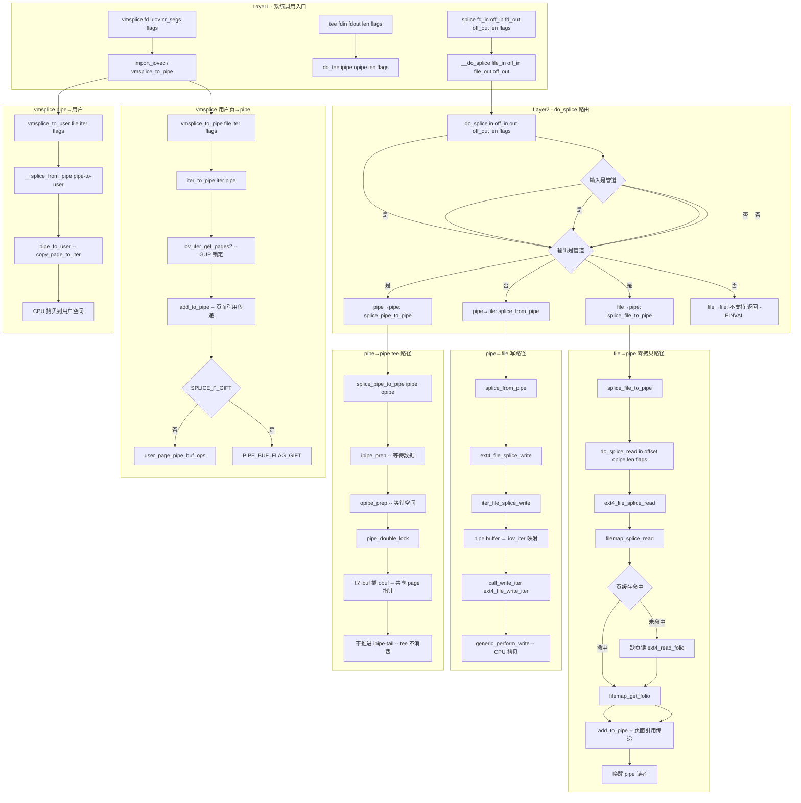

# splice / tee / vmsplice 系统调用完整路径分析

## 1 概述

splice、tee 和 vmsplice 是 Linux 特有的**零拷贝**系统调用族，通过管道缓冲区（pipe buffer）在文件描述符之间传递数据，避免用户空间的 CPU 数据拷贝。

### 关键特点

- **零拷贝（Zero-Copy）**：数据在内核内直接传递，不经过用户空间缓冲区
- **管道中介**：至少一端必须是管道（pipe），pipe buffer 传递的是页面引用而非数据
- **splice(fd_in, fd_out)**：文件↔管道或管道↔文件（和管道↔管道），消费输入
- **tee(fd_in, fd_out)**：管道→管道，拷贝页面引用但不消费输入（输入保留）
- **vmsplice(fd, iov)**：用户页面↔管道（写：`GUP` 锁定用户页；读：`copy_page_to_iter`）
- **SPLICE_F_MOVE**：预期移交页面所有权（当前内核忽略，等同于 SPLICE_F_MOVE 优化合并）
- **SPLICE_F_GIFT**：vmsplice 专用，用户放弃页面所有权（无需拷贝）

---

## 2 涉及的内核层

| 层 | 说明 |
|--|--|
| **Syscall Entry** | splice/tee/vmsplice 系统调用入口 (fs/splice.c) |
| **pipe 层** | pipe buffer 操作 (fs/pipe.c, include/linux/pipe_fs_i.h) |
| **VFS** | do_splice / do_splice_read / splice_file_to_pipe / do_splice_direct |
| **ext4** | file 读/写路径（当 splice 从/向常规文件时） |
| **Page Cache** | page 引用传递 / GUP 锁定 |
| **Block Layer** | 当常规文件缺页时（读路径进入块设备） |
| **NVMe 驱动** | 仅当常规文件读缺页时触及 |

---

## 3 系统调用入口

### 3.1 SYSCALL_DEFINE6(splice) - fs/splice.c:1616

```c
SYSCALL_DEFINE6(splice, int, fd_in, loff_t __user *, off_in,
        int, fd_out, loff_t __user *, off_out,
        size_t, len, unsigned int, flags)
{
    if (unlikely(!len))
        return 0;
    if (unlikely(flags & ~SPLICE_F_ALL))
        return -EINVAL;

    CLASS(fd, in)(fd_in);
    if (fd_empty(in))
        return -EBADF;

    CLASS(fd, out)(fd_out);
    if (fd_empty(out))
        return -EBADF;

    return __do_splice(fd_file(in), off_in, fd_file(out), off_out, len, flags);
}
```

### 3.2 SYSCALL_DEFINE4(tee) - fs/splice.c:1977

```c
SYSCALL_DEFINE4(tee, int, fdin, int, fdout, size_t, len, unsigned int, flags)
{
    if (unlikely(flags & ~SPLICE_F_ALL))
        return -EINVAL;
    if (unlikely(!len))
        return 0;

    CLASS(fd, in)(fdin);
    if (fd_empty(in))
        return -EBADF;

    CLASS(fd, out)(fdout);
    if (fd_empty(out))
        return -EBADF;

    return do_tee(fd_file(in), fd_file(out), len, flags);
}
```

### 3.3 SYSCALL_DEFINE4(vmsplice) - fs/splice.c:1578

```c
SYSCALL_DEFINE4(vmsplice, int, fd, const struct iovec __user *, uiov,
        unsigned long, nr_segs, unsigned int, flags)
{
    struct iovec iovstack[UIO_FASTIOV];
    struct iovec *iov = iovstack;
    struct iov_iter iter;
    ssize_t error;
    int type;

    if (unlikely(flags & ~SPLICE_F_ALL))
        return -EINVAL;

    CLASS(fd, f)(fd);
    if (fd_empty(f))
        return -EBADF;
    if (fd_file(f)->f_mode & FMODE_WRITE)
        type = ITER_SOURCE;     // 写入 pipe → 用户页面锁定到 pipe
    else if (fd_file(f)->f_mode & FMODE_READ)
        type = ITER_DEST;       // 从 pipe 读取 → 拷贝到用户
    else
        return -EBADF;

    error = import_iovec(type, uiov, nr_segs,
                 ARRAY_SIZE(iovstack), &iov, &iter);
    if (error < 0)
        return error;

    if (!iov_iter_count(&iter))
        error = 0;
    else if (type == ITER_SOURCE)
        error = vmsplice_to_pipe(fd_file(f), &iter, flags);   // 用户→pipe
    else
        error = vmsplice_to_user(fd_file(f), &iter, flags);   // pipe→用户

    kfree(iov);
    return error;
}
```

---

## 4 __do_splice → do_splice 路由逻辑

### 4.1 __do_splice - fs/splice.c:1397

```c
static ssize_t __do_splice(struct file *in, loff_t __user *off_in,
               struct file *out, loff_t __user *off_out,
               size_t len, unsigned int flags)
{
    struct pipe_inode_info *ipipe, *opipe;
    loff_t offset, *__off_in = NULL, *__off_out = NULL;
    ssize_t ret;

    ipipe = get_pipe_info(in, true);   // 输入是管道？
    opipe = get_pipe_info(out, true);  // 输出是管道？

    if (ipipe) { if (off_in) return -ESPIPE; pipe_clear_nowait(in); }
    if (opipe) { if (off_out) return -ESPIPE; pipe_clear_nowait(out); }

    // 从用户空间拷贝偏移量
    if (off_out) { copy_from_user(&offset, off_out, ...); __off_out = &offset; }
    if (off_in) { copy_from_user(&offset, off_in, ...); __off_in = &offset; }

    ret = do_splice(in, __off_in, out, __off_out, len, flags);

    // 拷贝偏移量回用户空间
    if (__off_out) copy_to_user(off_out, __off_out, ...);
    if (__off_in) copy_to_user(off_in, __off_in, ...);
    return ret;
}
```

### 4.2 do_splice 路由选择 - fs/splice.c:1300

```c
ssize_t do_splice(struct file *in, loff_t *off_in, struct file *out,
          loff_t *off_out, size_t len, unsigned int flags)
{
    struct pipe_inode_info *ipipe, *opipe;

    ipipe = get_pipe_info(in, true);
    opipe = get_pipe_info(out, true);

    if (ipipe && opipe) {
        // pipe → pipe (tee 风格)
        ret = splice_pipe_to_pipe(ipipe, opipe, len, flags);
    } else if (ipipe) {
        // pipe → file (splice 读 pipe 写入文件)
        // → splice_from_pipe → do_splice_from → file->write_iter
        //   → ext4_file_write_iter (当目标为 ext4 文件时)
    } else if (opipe) {
        // file → pipe (splice 读文件写入 pipe)
        // → splice_file_to_pipe → do_splice_read
        //   → file->read_iter → ext4_file_read_iter (当源为 ext4 文件时)
    }
}
```

### 4.3 四种 splice 传输模式

| 输入 | 输出 | 函数路径 | 数据传递方式 |
|--|--|--|--|
| 管道 | 管道 | `splice_pipe_to_pipe` | pipe buffer 引用传递（零拷贝） |
| 管道 | 文件 | `splice_from_pipe` → `f_op->write_iter` | pipe buffer → 页缓存（可能拷贝） |
| 文件 | 管道 | `splice_file_to_pipe` → `f_op->read_iter` | 页缓存 → pipe buffer（零拷贝） |
| 用户页 | 管道 | `vmsplice_to_pipe` → `iter_to_pipe` | GUP 锁定 → pipe buffer（零拷贝） |
| 管道 | 用户 | `vmsplice_to_user` → `pipe_to_user` | pipe → copy_page_to_iter（需要拷贝） |

---

## 5 file→pipe 路径（零拷贝读）

```
do_splice(file_in, &pos, opipe, NULL, len, flags)
  └─ splice_file_to_pipe(file_in, opipe, &pos, len, flags)  // fs/splice.c:1280
       ├─ pipe_lock(opipe)
       ├─ wait_for_space(opipe, flags)           // 等待 pipe 有空间
       ├─ do_splice_read(in, offset, opipe, len, flags)
       │    └─ in->f_op->splice_read(file_in, &sd)
       │         └─ ext4_file_splice_read(in, ppos, pipe, len, flags)
       │              └─ filemap_splice_read(in, ppos, pipe, len, flags)
       │                   // mm/filemap.c
       │                   └─ [for each folio]:
       │                        ├─ filemap_get_folio → 查找页缓存
       │                        │    └─ 若未命中 → read_folio → 缺页读
       │                        ├─ folio->index 计算页面偏移
       │                        └─ add_to_pipe(pipe, &buf)
       │                             └─ pipe 追加页面引用（不拷贝数据！）
       └─ pipe_unlock(opipe)
       └─ wakeup_pipe_readers(opipe)
```

**零拷贝的关键**：`add_to_pipe` 将 `folio` 的**页面引用**直接添加到 pipe buffer 中，不拷贝数据。pipe buffer 结构包含 `page` 指针、`offset` 和 `len`。

---

## 6 pipe→file 路径

```
do_splice(ipipe, NULL, file_out, &pos, len, flags)
  └─ file_out->f_op->splice_write(pipe, out, ppos, len, flags)
       └─ ext4_file_splice_write(pipe, out, ppos, len, flags)
            └─ iter_file_splice_write(pipe, out, ppos, len, flags)
                 // fs/splice.c
                 └─ [for each pipe buffer]:
                      ├─ init_sync_kiocb(&kiocb, out)
                      ├─ iov_iter_init(&iter, ITER_SOURCE, &iov, 1, buf->len)
                      ├─ iov.iov_base = page_address(buf->page) + buf->offset
                      ├─ kiocb.ki_pos = *ppos
                      └─ call_write_iter(out, &kiocb, &iter)
                           └─ ext4_file_write_iter → generic_perform_write
```

该路径将 pipe buffer 中的页面**重新映射到 iov_iter**，通过常规的 `write_iter` 路径写入目标文件。数据从 pipe buffer 的 page 经由 `copy_folio_from_iter_atomic` 拷贝到文件页缓存（**涉及一次 CPU 拷贝**）。

---

## 7 pipe→pipe（tee 路径）

```
do_tee(ipipe, opipe, len, flags)
  └─ splice_pipe_to_pipe(ipipe, opipe, len, flags)  // fs/splice.c:1716
       ├─ ipipe_prep(ipipe, flags)          // 等待输入有数据
       ├─ opipe_prep(opipe, flags)          // 等待输出有空间
       ├─ pipe_double_lock(ipipe, opipe)    // 避免 ABBA 死锁
       └─ do {
            // 从 ipipe->tail 取 ibuf
            // 在 opipe->head 插入 obuf
            // obuf->page = ibuf->page    // 共享页面指针
            // obuf->ops = ibuf->ops      // 共享操作函数
            // obuf->offset = ibuf->offset
            // obuf->len = min(ibuf->len, 剩余空间)
            // ipipe->tail++ 或 ibuf->len 减少
            // opipe->head++
            // ret += obuf->len
          } while (还有数据);
       └─ pipe_unlock/双锁释放
```

**tee 与 splice 的差异**：
- **splice（pipe→pipe）**：消耗输入 pipe 的数据（tail 推进），输入数据减少
- **tee（pipe→pipe）**：不消耗输入 pipe（tail 不动），输入数据保留，仅增加 `page` 的引用计数
- tee 通过 `obuf->ops = ibuf->ops` 共享操作函数，释放时调用 `ibuf->ops->release` 减少页面引用

---

## 8 vmsplice 用户页→pipe（零拷贝写）

```
vmsplice_to_pipe(file, iter, flags)   // fs/splice.c:1534
  ├─ get_pipe_info(file)  → pipe
  ├─ pipe_lock(pipe)
  ├─ wait_for_space(pipe, flags)
  ├─ iter_to_pipe(iter, pipe, buf_flag)   // fs/splice.c:1443
  │    └─ [while iov_iter_count(from)]:
  │         ├─ iov_iter_get_pages2(from, pages, ~0UL, 16, &start)
  │         │    ├─ ITER_SOURCE → get_user_pages_fast(addr, ...)
  │         │    │   → 锁定用户页面（page pin）
  │         │    └─ 返回 pinned 页面数组
  │         └─ for each page:
  │              └─ buf.page = pages[i]
  │                 buf.offset = start
  │                 buf.len = size
  │                 add_to_pipe(pipe, &buf)  // 追加到 pipe ring
  └─ pipe_unlock(pipe)
  └─ wakeup_pipe_readers(pipe)
```

### 8.1 SPLICE_F_GIFT 标志

```c
if (flags & SPLICE_F_GIFT)
    buf_flag = PIPE_BUF_FLAG_GIFT;
```

- **无 SPLICE_F_GIFT**：pipe buffer 的 `ops` 设为 `user_page_pipe_buf_ops`
  - 接收方读取后，`page` 引用计数递减，页面返回给用户
- **有 SPLICE_F_GIFT**：用户放弃页面所有权（"gift"）
  - pipe buffer 释放时直接释放页面
  - 避免额外的引用计数操作
  - 需要用户保证不再使用该页面

### 8.2 vmsplice pipe→用户（非零拷贝）

```
vmsplice_to_user(file, iter, flags)      // fs/splice.c:1501
  ├─ get_pipe_info(file)  → pipe
  ├─ pipe_lock(pipe)
  ├─ __splice_from_pipe(pipe, &sd, pipe_to_user)
  │    └─ for each pipe buffer:
  │         └─ pipe_to_user(pipe, buf, sd)
  │              └─ copy_page_to_iter(buf->page, buf->offset, sd->len, sd->u.data)
  │                   → copy_to_user (涉及 CPU 拷贝)
  └─ pipe_unlock(pipe)
```

> 从 pipe 读取数据到用户空间**不是**零拷贝的。由于用户空间页面和内核页面不可直接交换（vm tricks 太复杂且受限），当前实现通过 `copy_page_to_iter` 进行数据拷贝。

---

## 9 完整 Mermaid 流程图



---

## 10 完整函数调用链

### 10.1 splice - file→pipe 路径

| 步骤 | 函数 | 文件:行号 | 说明 |
|--|--|--|--|
| 1 | `SYSCALL_DEFINE6(splice)` | fs/splice.c:1616 | 系统调用入口 |
| 2 | `__do_splice(in, off_in, out, off_out, len, flags)` | fs/splice.c:1397 | 参数校验与偏移拷贝 |
| 3 | `do_splice(in, __off_in, out, __off_out, len, flags)` | fs/splice.c:1300 | 路由选择 |
| 4 | `splice_file_to_pipe(in, opipe, &offset, len, flags)` | fs/splice.c:1280 | file→pipe 入口 |
| 5 | `do_splice_read(in, offset, opipe, len, flags)` | fs/splice.c:1290 | 读调度 |
| 6 | `in->f_op->splice_read(file, ppos, pipe, len, flags)` | VFS | ext4_file_splice_read |
| 7 | `filemap_splice_read(in, ppos, pipe, len, flags)` | mm/filemap.c | 逐 folio 处理 |
| 8 | `filemap_get_folio(mapping, index)` | mm/filemap.c | 查找页缓存 |
| 9 | `page_cache_sync_readahead` / `read_folio` | mm/readahead.c | 缺页处理（可选） |
| 10 | `add_to_pipe(pipe, &buf)` | fs/splice.c | **零拷贝**：页面引用传递 |

### 10.2 splice - pipe→file 路径

| 步骤 | 函数 | 说明 |
|--|--|--|
| 1-3 | 同上 | 路由选择 |
| 4 | `do_splice_from(ipipe, out, ppos, len, flags)` | pipe→file |
| 5 | `out->f_op->splice_write(pipe, out, ppos, len, flags)` | ext4_file_splice_write |
| 6 | `iter_file_splice_write(pipe, out, ppos, len, flags)` | fs/splice.c |
| 7 | `call_write_iter` → `ext4_file_write_iter` | 常规写路径 |
| 8 | `generic_perform_write` → CPU 拷贝到页缓存 | mm/filemap.c |

### 10.3 tee - pipe→pipe 路径

| 步骤 | 函数 | 说明 |
|--|--|--|
| 1 | `SYSCALL_DEFINE4(tee)` | fs/splice.c:1977 |
| 2 | `do_tee(in, out, len, flags)` | fs/splice.c |
| 3 | `splice_pipe_to_pipe(ipipe, opipe, len, flags)` | fs/splice.c:1716 |
| 4 | `ipipe_prep` + `opipe_prep` | 准备读写 |
| 5 | 页面指针共享，不推进 tail | **零拷贝** |

### 10.4 vmsplice - 用户→pipe 路径

| 步骤 | 函数 | 说明 |
|--|--|--|
| 1 | `SYSCALL_DEFINE4(vmsplice)` | fs/splice.c:1578 |
| 2 | `import_iovec(ITER_SOURCE, ...)` | lib/iov_iter.c |
| 3 | `vmsplice_to_pipe(file, &iter, flags)` | fs/splice.c:1534 |
| 4 | `iter_to_pipe(iter, pipe, buf_flag)` | fs/splice.c:1443 |
| 5 | `iov_iter_get_pages2(from, pages, ...)` | lib/iov_iter.c |
| 6 | `get_user_pages_fast(addr, ...)` | mm/gup.c | **GUP 锁定用户页** |
| 7 | `add_to_pipe(pipe, &buf)` | fs/splice.c | pipe buffer 引用 |

---

## 11 四种系统调用的零拷贝特征对比

| 操作 | 场景 | CPU 数据拷贝 | 页面操作 | 备注 |
|--|--|--|--|--|
| `splice(file, pipe)` | 文件→管道 | **0 次** | 页缓存页面引用传递 | 纯零拷贝 |
| `splice(pipe, file)` | 管道→文件 | **1 次** | pipe→iov_iter→文件页缓存 | 需 CPU 拷贝到文件页 |
| `splice(pipe, pipe)` | 管道→管道 | **0 次** | pipe buffer 引用共享 | 零拷贝 |
| `tee(pipe, pipe)` | 管道→管道 | **0 次** | pipe buffer 引用共享（不消费） | 零拷贝 + 保留输入 |
| `vmsplice(pipe, iov)` | 用户页→管道 | **0 次** | GUP 锁定用户页→pipe buffer | 零拷贝（GIFT 无开销） |
| `vmsplice(iov, pipe)` | 管道→用户 | **1 次** | copy_page_to_iter 到用户 | 需 CPU 拷贝 |
| `sendfile(file, socket)` | 文件→socket | **0 次** | 通过 pipe buffer 传递 | 内部使用 splice |
| `copy_file_range(file,file)` | 文件→文件 | **0 次**（同 FS reflink）或 **1 次**（跨 FS splice） | 优先 reflink，回退 splice | 同 FS 可零拷贝 |

---

## 12 关键数据结构

```
struct pipe_inode_info           struct pipe_buffer
+------------------------+       +----------------------+
| head (unsigned int)    |       | page (struct page*)   | ← 页面指针
| tail (unsigned int)    |       | offset (unsigned int) | ← 页内偏移
| max_usage (unsigned)   |       | len (unsigned int)    | ← 数据长度
| ring_size (unsigned)   |       | ops (pipe_buf_ops*)   | ← 操作函数
| readers (unsigned int) |       | flags (unsigned int)  | ← PIPE_BUF_FLAG_*
| writers (unsigned int) |       +----------------------+
| bufs[ring_size]        |
| → struct pipe_buffer   |       struct pipe_buf_ops
| wait (wait_queue_head) |       +----------------------+
+------------------------+       | ->confirm             |
                                  | ->release             |
struct splice_desc                | ->try_steal           |
+------------------------+       +----------------------+
| len / total_len        |
| flags (SPLICE_F_*)    |        struct iov_iter (vmsplice)
| pos (loff_t)           |       +---------------------------+
| u (file / data ptr)    |       | iter_type = ITER_IOVEC     |
| splice_eof             |       | data_source = ITER_SOURCE  |
+------------------------+       | iov → struct iovec[]      |
                                  | nr_segs / count            |
                                  +---------------------------+
```

---

## 13 总结

splice/tee/vmsplice 是 Linux **零拷贝 I/O 的核心机制**：

1. **splice**：任意文件↔管道间传输，至少一端是管道。`file→pipe` 路径通过页面引用传递实现**真正的零拷贝**；`pipe→file` 路径需要将 pipe buffer 页面拷贝到文件页缓存。

2. **tee**：pipe→pipe 传输，**不消费**输入 pipe 的数据。通过共享 pipe buffer 的 `page` 指针和增加引用计数实现零拷贝，数据在输入 pipe 中保留可再次读取。

3. **vmsplice**：用户内存↔管道。`用户→pipe` 路径通过 `get_user_pages_fast` 锁定用户页面并将页面引用传递给 pipe buffer，实现零拷贝；`pipe→用户` 路径因为技术限制只能进行 CPU 拷贝。

4. **性能关键点**：
   - 所有零拷贝路径都通过 `add_to_pipe` 在 pipe ring buffer 中传递页面引用
   - `SPLICE_F_GIFT` 消除引用计数开销
   - pipe buffer 的大小（`PIPE_DEF_BUFFERS` = 16）影响批量传输效率
