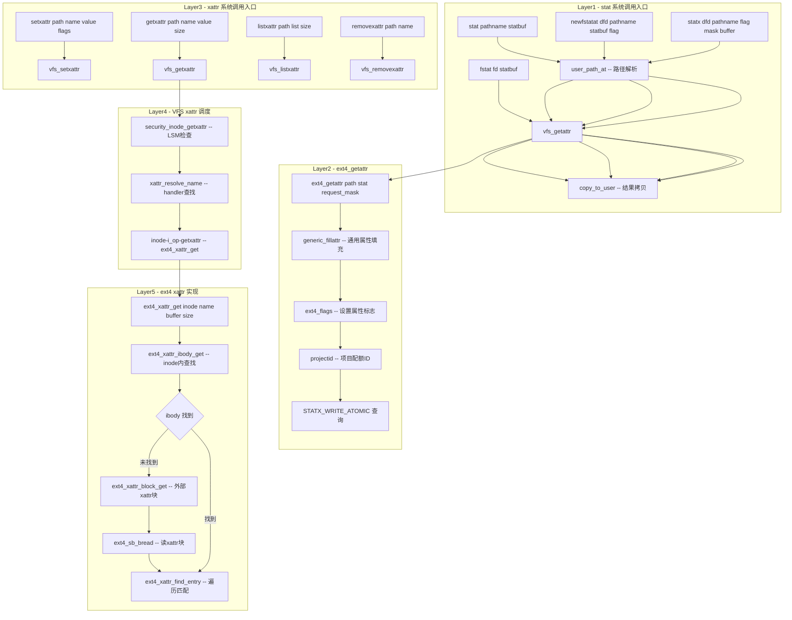

# stat / fstat / statx / xattr 系统调用完整路径分析

## 1 概述

stat 系列系统调用获取文件的元数据信息（inode 属性），xattr 系列系统调用操作文件的扩展属性（如 ACL、安全标签等）。两者都通过 VFS 的 inode 操作接口，最终由具体文件系统（如 ext4）读取磁盘上的元数据。

### 关键特点

- **stat 族**：fstat/fstatat/statx 共享 `vfs_getattr` 路径，statx 支持更丰富的掩码选择
- **xattr 族**：setxattr/getxattr/removexattr/listxattr 及其 `l`（不跟踪链接）和 `f`（通过 fd）变体
- **at 系列变体**：使用目录 fd 作为路径解析起点，避免 TOCTOU 竞争
- **ext4 实现**：通过 ext4_getattr/inode 读取 inode 元数据，通过 ext4_xattr_* 操作扩展属性块
- **元数据缓存**：大量使用 inode 缓存，未命中时才读取磁盘

---

## 2 涉及的内核层

| 层 | 说明 |
|--|--|
| **Syscall Entry** | stat/fstat/newfstatat/statx (fs/stat.c) |
| | setxattr/getxattr/listxattr/removexattr (fs/xattr.c) |
| **VFS** | vfs_getattr / vfs_getattr_nosec / vfs_{get,set,remove,list}xattr |
| **路径解析** | user_path_at / user_path_at_empty / getname (at 变体) |
| **ext4** | ext4_getattr / ext4_xattr_{get,set,list} |
| **Page Cache** | ext4 通过 inode 缓存读取元数据，扩展属性块通过 sb_bread |
| **Block Layer** | 仅 inode/元数据块未缓存时触及 |
| **NVMe 驱动** | 仅缺块时触及 |

---

## 3 stat / fstat / newfstatat / statx 系统调用

### 3.1 系统调用入口 - fs/stat.c

```c
// stat: 通过路径名获取文件状态
SYSCALL_DEFINE2(stat, const char __user *, pathname,
        struct __old_kernel_stat __user *, statbuf)
{
    struct kstat stat;
    int error = vfs_stat(pathname, &stat);
    if (error) return error;
    return cp_old_stat(&stat, statbuf);
}

// fstat: 通过 fd 获取文件状态
SYSCALL_DEFINE2(fstat, unsigned int, fd, struct stat __user *, statbuf)
{
    struct kstat stat;
    int error = vfs_fstat(fd, &stat);
    if (error) return error;
    return cp_new_stat(&stat, statbuf);
}

// newfstatat: at 系列 stat（替代 fstatat）
SYSCALL_DEFINE4(newfstatat, int, dfd, const char __user *, pathname,
        struct stat __user *, statbuf, int, flag)
{
    struct kstat stat;
    int error = vfs_fstatat(dfd, pathname, &stat, flag);
    if (error) return error;
    return cp_new_stat(&stat, statbuf);
}

// statx: 增强版 stat，支持掩码选择属性
SYSCALL_DEFINE5(statx, int, dfd, const char __user *, pathname,
        unsigned, flag, unsigned, mask,
        struct statx __user *, buffer)
{
    struct kstat stat;
    int error = vfs_statx(dfd, pathname, flag, &stat, mask);
    if (error) return error;
    return copy_statx_to_user(buffer, &stat);
}
```

### 3.2 VFS 路径

```
vfs_stat(pathname, &stat)
  └─ user_path_at(AT_FDCWD, filename, LOOKUP_FOLLOW | LOOKUP_AUTOMOUNT)
       └─ pathname lookup → struct path
  └─ vfs_getattr(&path, stat, ...)
       └─ vfs_getattr_nosec(&path, stat, ...)
            └─ path->mnt->mnt_flags 检查
            └─ path.dentry->d_inode->i_op->getattr(&path, stat, ...)
                 └─ ext4_getattr(&path, stat, ...)  // fs/ext4/inode.c

vfs_fstat(fd, &stat)
  └─ fdget_raw(fd) → struct fd
  └─ vfs_getattr(&f.file->f_path, stat, ...)  // 同上

vfs_fstatat(dfd, pathname, &stat, flag)
  └─ user_path_at(dfd, filename, lookup_flags)
  └─ vfs_getattr(...)  // 同上

vfs_statx(dfd, pathname, flag, &stat, mask)
  └─ user_path_at(dfd, filename, lookup_flags)
  └─ vfs_getattr(&path, stat, ...)
  └─ stat->result_mask = mask & STATX_ALL  // 掩码控制
```

### 3.3 ext4_getattr - fs/ext4/inode.c

```c
int ext4_getattr(struct mnt_idmap *idmap, const struct path *path,
         struct kstat *stat, u32 request_mask, unsigned int query_flags)
{
    struct inode *inode = d_backing_inode(path->dentry);
    struct ext4_inode_info *ei = EXT4_I(inode);
    unsigned int flags;

    // 1. 通用 VFS getattr（从 inode 填充 kstat）
    generic_fillattr(idmap, request_mask, inode, stat);

    // 2. ext4 额外信息
    stat->flags |= (ei->i_flags & EXT4_FL_USER_VISIBLE) >> ...;
    stat->blksize = inode->i_sb->s_blocksize;

    // 3. 项目 ID（quota）
    stat->projectid = ei->i_projid;

    // 4. 文件系统错误状态
    if (ext4_forced_shutdown(inode->i_sb))
        stat->attributes |= STATX_ATTR_VERITY;

    // 5. 查询 physical cluster 数量（若请求）
    if (request_mask & STATX_WRITE_ATOMIC) {
        ext4_get_write_atomic_info(ei, stat);
    }

    return 0;
}
```

### 3.4 statx 的 masks 机制

```c
SYSCALL_DEFINE5(statx, dfd, pathname, flag, mask, buffer)
  // mask 是用户请求的属性掩码，如：
  // STATX_TYPE     (0x001) - 文件类型
  // STATX_SIZE     (0x200) - 文件大小
  // STATX_ATIME    (0x400) - 访问时间
  // STATX_BTIME    (0x800) - 创建时间
  // STATX_ALL      (0xfff) - 所有属性

// statx 返回的 struct statx 包含：
// stx_mask  - 实际返回的属性掩码
// stx_blksize, stx_nlink, stx_uid, stx_gid, stx_mode...
// stx_atime, stx_btime, stx_ctime, stx_mtime (纳秒精度)
// stx_dev_major, stx_dev_minor
// stx_ino, stx_size, stx_blocks
// stx_mnt_id  (mount ID)
```

### 3.5 stat 系列 4 个变体对比

| 维度 | stat | fstat | newfstatat | statx |
|--|--|--|--|--|
| **入口点** | 路径名 | fd | dfd + 路径名 | dfd + 路径名 |
| **路径解析** | `user_path_at(AT_FDCWD)` | 无（直接 PATH） | `user_path_at(dfd)` | `user_path_at(dfd)` |
| **跟随链接** | 是 | 不适用 | 受 AT_SYMLINK_NOFOLLOW 控制 | 受 AT_SYMLINK_NOFOLLOW 控制 |
| **返回结构** | `struct stat` | `struct stat` | `struct stat` | `struct statx`（扩展信息） |
| **属性选择** | 全部 | 全部 | 全部 | **mask 掩码选择** |
| **创建时间** | 无 | 无 | 无 | STATX_BTIME |
| **mnt_id** | 无 | 无 | 无 | stx_mnt_id |
| **subvol** | 无 | 无 | 无 | stx_subvol |

---

## 4 xattr（扩展属性）系统调用

### 4.1 系统调用表（16 个变体）

| 序号 | 名称 | 作用 |
|--|--|--|
| 5 | setxattr | 设置文件扩展属性（跟踪符号链接） |
| 6 | lsetxattr | 设置扩展属性（不跟踪符号链接） |
| 7 | fsetxattr | 通过 fd 设置扩展属性 |
| 8 | getxattr | 获取扩展属性（跟踪符号链接） |
| 9 | lgetxattr | 获取扩展属性（不跟踪符号链接） |
| 10 | fgetxattr | 通过 fd 获取扩展属性 |
| 11 | listxattr | 列出扩展属性名（跟踪符号链接） |
| 12 | llistxattr | 列出扩展属性名（不跟踪符号链接） |
| 13 | flistxattr | 通过 fd 列出扩展属性名 |
| 14 | removexattr | 删除扩展属性（跟踪符号链接） |
| 15 | lremovexattr | 删除扩展属性（不跟踪符号链接） |
| 16 | fremovexattr | 通过 fd 删除扩展属性 |
| 463 | setxattrat | at 系列设置扩展属性 |
| 464 | getxattrat | at 系列获取扩展属性 |
| 465 | listxattrat | at 系列列出扩展属性名 |
| 466 | removexattrat | at 系列删除扩展属性 |

### 4.2 VFS xattr 路径（以 getxattr 为例）

```c
SYSCALL_DEFINE3(getxattr, const char __user *, pathname,
        const char __user *, name, void __user *, value, size_t, size)
{
    // 1. 路径名解析 → path
    // 2. vfs_getxattr(&path, name, value, size)
}
```

`vfs_getxattr` 核心路径：

```c
int vfs_getxattr(struct path *path, const char *name, void *value, size_t size)
{
    struct inode *inode = path->dentry->d_inode;
    int error;

    // 1. 安全模块检查（LSM）
    error = security_inode_getxattr(path->dentry, name);
    if (error) return error;

    // 2. xattr 处理程序查找
    //    name 格式：system.posix_acl_access, security.selinux, trusted.*, user.*
    //    通过 xattr_resolve_name 按命名空间查找 handler

    // 3. inode->i_op->getxattr → ext4_xattr_get
    error = inode->i_op->getxattr(idmap, path->dentry, name, value, size);

    // 4. 审计
    return error;
}
```

### 4.3 ext4 xattr 实现

```
ext4_xattr_get(inode, name, buffer, size)
  └─ ext4_xattr_ibody_get(inode, name, buffer, size)    // 内联 xattr（inode 内）
       └─ ext4_xattr_check_entries / ext4_xattr_find_entry
  └─ 若未找到：ext4_xattr_block_get(inode, name, buffer, size)  // 外部 xattr 块
       └─ ext4_sb_bread(inode->i_sb, EA_BLOCK)          // 读 xattr 块
       └─ ext4_xattr_find_entry(entries, ...)
            └─ 遍历 xattr entry，按 name 匹配

ext4_xattr_set_handle(handle, inode, name, value, value_len, flags)
  └─ ext4_xattr_ibody_find(inode, name, ...)            // 查找 inode 内
  └─ ext4_xattr_block_find(inode, name, ...)              // 查找 xattr 块
  └─ ext4_xattr_ibody_set(handle, inode, ...)            // 设置 inode 内
  └─ ext4_xattr_block_set(handle, inode, ...)            // 设置 xattr 块
       └─ 分配/修改 xattr block
       └─ ext4_mark_iloc_dirty(handle, inode, iloc)      // 标记脏
```

### 4.4 xattr 的物理存储位置

ext4 中 xattr 可以存储在两类位置：

| 位置 | 特点 | 限制 |
|--|--|--|
| **inode 内部（ibody）** | 无需额外 I/O，与 inode 一起读取 | inode 空间有限（~60-120 bytes 可用的 extra_isize） |
| **外部 xattr 块** | 单独的磁盘块，可扩展 | 需要额外 I/O（sb_bread 读 xattr block） |

xattr 命名空间：

```
system.*      → 系统扩展属性（ACL, POSIX 等）
security.*    → 安全模块扩展属性（SELinux, Smack 等）
trusted.*     → 特权扩展属性（需要 CAP_SYS_ADMIN）
user.*        → 用户扩展属性（需要普通文件 + user_xattr 挂载选项）
```

---

## 5 完整 Mermaid 流程图



---

## 6 完整函数调用链

### 6.1 fstat 路径

| 步骤 | 函数 | 文件:行号 | 说明 |
|--|--|--|--|
| 1 | `SYSCALL_DEFINE2(fstat, fd, statbuf)` | fs/stat.c | 系统调用入口 |
| 2 | `vfs_fstat(fd, &stat)` | fs/stat.c | 通用 fd→stat |
| 3 | `fdget_raw(fd)` → `struct fd` | fs/file.c | fd 获取 |
| 4 | `vfs_getattr(&f.file->f_path, stat, ...)` | fs/stat.c | VFS getattr |
| 5 | `vfs_getattr_nosec(&path, stat, ...)` | fs/stat.c | 安全检查 |
| 6 | `ext4_getattr(&path, stat, request_mask, ...)` | fs/ext4/inode.c | ext4 实现 |
| 7 | `generic_fillattr(idmap, request_mask, inode, stat)` | fs/stat.c | 通用填充 |
| 8 | 填充 ext4 特定字段 | fs/ext4/inode.c | flags/projid 等 |
| 9 | `cp_new_stat(&stat, statbuf)` | fs/stat.c | 内核→用户空间拷贝 |

### 6.2 statx 路径

| 步骤 | 函数 | 文件:行号 | 说明 |
|--|--|--|--|
| 1 | `SYSCALL_DEFINE5(statx)` | fs/stat.c | 系统调用入口 |
| 2 | `vfs_statx(dfd, pathname, flag, &stat, mask)` | fs/stat.c | VFS 入口 |
| 3 | `user_path_at(dfd, pathname, lookup_flags)` | fs/namei.c | 路径解析 |
| 4 | `vfs_getattr(&path, stat, ...)` | fs/stat.c | VFS getattr |
| 5 | `ext4_getattr(...)` | fs/ext4/inode.c | ext4 实现 |
| 6 | `stat->result_mask = mask & STATX_ALL` | fs/stat.c | 掩码过滤 |
| 7 | `copy_statx_to_user(buffer, &stat)` | fs/stat.c | 结构化拷贝 |

### 6.3 getxattr 路径

| 步骤 | 函数 | 文件:行号 | 说明 |
|--|--|--|--|
| 1 | `SYSCALL_DEFINE3(getxattr)` | fs/xattr.c | 系统调用入口 |
| 2 | `user_path_at(AT_FDCWD, pathname, LOOKUP_FOLLOW)` | fs/namei.c | 路径解析 |
| 3 | `vfs_getxattr(&path, name, value, size)` | fs/xattr.c | VFS xattr |
| 4 | `security_inode_getxattr(dentry, name)` | security/ | LSM 检查 |
| 5 | `xattr_resolve_name(inode, &name)` | fs/xattr.c | 命名空间解析 |
| 6 | `inode->i_op->getxattr` → `ext4_xattr_get` | fs/ext4/xattr.c | ext4 实现 |
| 7 | `ext4_xattr_ibody_get` / `ext4_xattr_block_get` | fs/ext4/xattr.c | ibody/block |
| 8 | `ext4_xattr_find_entry` | fs/ext4/xattr.c | 条目匹配 |
| 9 | 数据 `copy_to_user` | fs/xattr.c | 返回用户空间 |

---

## 7 关键数据结构

```
struct kstat (VFS 通用)
+------------------------+
| result_mask (u32)      | ← 哪些字段有效
| mode / nlink           |
| uid / gid / projectid  |
| blksize / size / blocks|
| atime / mtime / ctime  |
| btime (创建时间)        |
| dev_major / dev_minor  |
| ino / mnt_id / subvol  |
+------------------------+

struct ext4_inode (磁盘上 inode)
+------------------------+
| i_mode / i_uid / i_gid |
| i_size / i_blocks      |
| i_atime / i_mtime      |
| i_ctime                |
| i_extra_isize          | ← 扩展空间用于 xattr
| i_inline (inline data) |
+------------------------+

struct ext4_xattr_entry     struct ext4_xattr_block_header
+------------------+       +--------------------------+
| e_name_len (1B)   |       | h_magic (__le32)          |
| e_name_index (1B) |       | h_refcount (__le32)       |
| e_value_offs (2B) |       | h_blocks (__le32)         |
| e_value_inum (4B) |       | h_hash (__le32)           |
| e_value_size (4B) |       +--------------------------+
| e_hash (4B)        |
| e_name[...]        |       struct ext4_xattr_ibody_header
+------------------+       +--------------------------+
                             | h_magic (__le32)          |
                             +--------------------------+
```

---

## 8 stat 系列函数调用汇总

```
stat(pathname)        fstat(fd)              newfstatat(dfd,path)   statx(dfd,path,mask)
   │                     │                       │                    │
   ├─user_path_at        ├─fdget_raw             ├─user_path_at(dfd)   ├─user_path_at(dfd)
   │  └─path lookup      │                       │  └─path lookup      │  └─path lookup
   │                     │                       │                     │
   └─vfs_getattr         └─vfs_getattr           └─vfs_getattr         └─vfs_getattr(,mask)
        │                     │                       │                     │
        └─ext4_getattr────────┴───────────────────────┴─────────────────────┘
             │
             └─generic_fillattr(inode, stat)
                  ├─stat->dev = inode->i_sb->s_dev
                  ├─stat->ino = inode->i_ino
                  ├─stat->mode = inode->i_mode
                  ├─stat->nlink = inode->i_nlink
                  ├─stat->uid = inode->i_uid
                  ├─stat->gid = inode->i_gid
                  ├─stat->rdev = inode->i_rdev
                  ├─stat->size = i_size_read(inode)
                  ├─stat->atime = inode->i_atime
                  ├─stat->mtime = inode->i_mtime
                  └─stat->ctime = inode->i_ctime
```

---

## 9 总结

stat 和 xattr 系列系统调用是文件元数据访问的核心接口：

1. **stat 族**（stat/fstat/newfstatat/statx）：通过 `vfs_getattr` → `ext4_getattr` → `generic_fillattr` 路径从 inode 缓存读取文件属性。statx 是增强版本，支持按 mask 选择性获取属性（包括创建时间 statx_btime）。所有变体的核心都是 `generic_fillattr` + ext4 特定扩展。

2. **xattr 族**（16 个变体）：通过 `vfs_{get,set,remove,list}xattr` → `ext4_xattr_*` 路径操作扩展属性。xattr 可存储在 inode 内部（ibody，无额外 I/O）或外部 xattr 块（需要 sb_bread 读取磁盘）。命名空间分为 system/security/trusted/user 四类。

3. **元数据路径 vs 数据路径**：stat 和 xattr 操作仅涉及 inode 元数据（和 xattr 块），**不经过** page cache 的数据读写路径，也不触发生物（BIO）的构造和 NVMe 命令提交。仅在 inode 或 xattr 块未缓存时通过 `sb_bread` 读取底层块设备。
