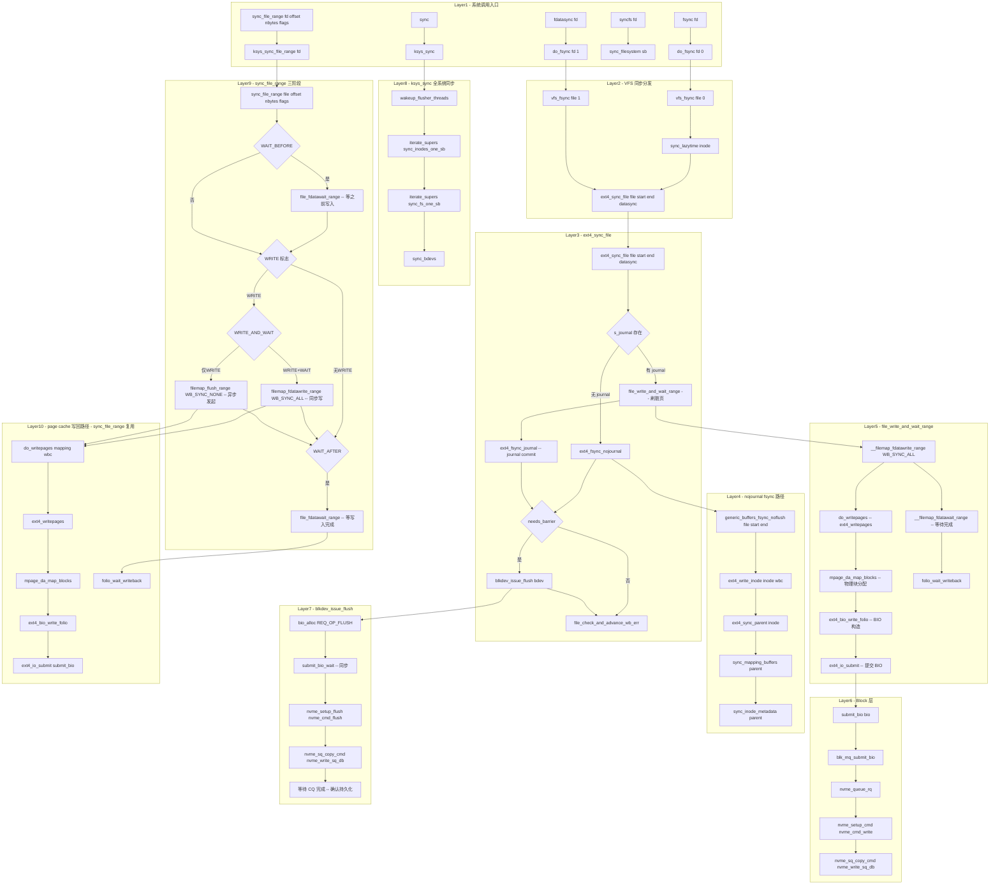

# fsync / fdatasync / sync / syncfs / sync_file_range 系统调用完整路径分析

## 1 概述

fsync、fdatasync、sync、syncfs 和 sync_file_range 是 Linux 的**数据完整性**系统调用族，用于将文件数据和元数据从页缓存（Page Cache）刷写到持久存储设备。

### 关键特点

- **fsync(fd)**：将 fd 对应的文件**数据和元数据**同步到磁盘（包括 inode、目录项等）
- **fdatasync(fd)**：仅同步文件**数据**（必要时同步元数据），比 fsync 少一次 journal commit
- **sync()**：刷新所有文件系统的缓冲区（全局同步）
- **syncfs(fd)**：刷新 fd 所在文件系统的缓冲区（单文件系统同步）
- **sync_file_range(fd, offset, nbytes, flags)**：文件区间精细化同步，通过 flags 组合控制等待/写入/再等待的三阶段行为，**不涉及元数据同步**
- **ext4 的实现差异**：有 journal 时通过 `ext4_fsync_journal` 走 journal commit 路径；无 journal 时通过 `ext4_fsync_nojournal` 走通用 buffer 同步路径
- **Barrier**：在屏障（BARRIER）模式下，同步完成后发出 `blkdev_issue_flush` 确保写入持久化

---

## 2 涉及的内核层

| 层 | 说明 |
|--|--|
| **Syscall Entry** | fsync/fdatasync/sync/syncfs/sync_file_range 入口 (fs/sync.c) |
| **VFS** | vfs_fsync / do_fsync / ksys_sync / sync_file_range (fs/sync.c) |
| **Page Cache** | filemap_fdatawrite_range / filemap_flush_range / file_fdatawait_range / __filemap_fdatawait_range (mm/filemap.c) |
| **ext4** | ext4_sync_file (fs/ext4/fsync.c) |
| **JBD2 (Journal)** | ext4_fsync_journal / ext4_fc_commit（fast commit） |
| **Block Layer** | __sync_blockdev / blkdev_issue_flush |
| **NVMe 驱动** | FLUSH 命令 + 数据回写命令提交 |

---

## 3 系统调用入口

### 3.1 SYSCALL_DEFINE1(fsync) - fs/sync.c:214

```c
SYSCALL_DEFINE1(fsync, unsigned int, fd)
{
    return do_fsync(fd, 0);     // datasync = 0
}

SYSCALL_DEFINE1(fdatasync, unsigned int, fd)
{
    return do_fsync(fd, 1);     // datasync = 1
}

static int do_fsync(unsigned int fd, int datasync)
{
    CLASS(fd, f)(fd);
    if (fd_empty(f))
        return -EBADF;
    return vfs_fsync(fd_file(f), datasync);
}
```

### 3.2 vfs_fsync / vfs_fsync_range - fs/sync.c:178

```c
int vfs_fsync_range(struct file *file, loff_t start, loff_t end, int datasync)
{
    struct inode *inode = file->f_mapping->host;

    if (!file->f_op->fsync)
        return -EINVAL;
    if (!datasync)
        sync_lazytime(inode);     // fsync 时先同步 lazytime
    return file->f_op->fsync(file, start, end, datasync);
    // → ext4_sync_file
}

int vfs_fsync(struct file *file, int datasync)
{
    return vfs_fsync_range(file, 0, LLONG_MAX, datasync);
}
```

### 3.3 SYSCALL_DEFINE0(sync) - fs/sync.c:109

```c
SYSCALL_DEFINE0(sync)
{
    ksys_sync();
    return 0;
}

void ksys_sync(void)
{
    int nowait = 0, wait = 1;

    wakeup_flusher_threads(WB_REASON_SYNC);   // 唤醒所有 flusher 线程
    iterate_supers(sync_inodes_one_sb, NULL); // 遍历所有超级块同步 inode
    iterate_supers(sync_fs_one_sb, &nowait);  // 调 sync_fs（nowait）
    iterate_supers(sync_fs_one_sb, &wait);    // 调 sync_fs（wait）
    sync_bdevs(false);                         // 同步块设备（不等待）
    sync_bdevs(true);                          // 同步块设备（等待）
}
```

### 3.4 SYSCALL_DEFINE1(syncfs)

```c
SYSCALL_DEFINE1(syncfs, int, fd)
{
    struct fd f = fdget(fd);
    struct super_block *sb;
    int ret;

    if (!f.file)
        return -EBADF;
    sb = f.file->f_path.dentry->d_sb;
    ret = sync_filesystem(sb);     // 单个超级块同步
    fdput(f);
    return ret;
}
```

`synchronize_filesystem` 内部调用 `sync_filesystem(sb)`：
```
sync_filesystem(sb)
  ├─ sync_blockdev_nowait(sb->s_bdev)    // 块设备同步（非阻塞）
  ├─ sync_inodes_sb(sb)                   // 同步该 sb 所有 inode
  ├─ sb->s_op->sync_fs(sb, 1)             // → ext4_sync_fs
  └─ sync_blockdev(sb->s_bdev)            // 块设备同步（阻塞）
```

---

## 3.5 sync_file_range — 文件区间精细化同步

### 3.5.1 SYSCALL_DEFINE4(sync_file_range) - fs/sync.c:360

```c
SYSCALL_DEFINE4(sync_file_range, int, fd, loff_t, offset, loff_t, nbytes,
                unsigned int, flags)
{
    return ksys_sync_file_range(fd, offset, nbytes, flags);
}
```

### 3.5.2 ksys_sync_file_range - fs/sync.c:349

```c
int ksys_sync_file_range(int fd, loff_t offset, loff_t nbytes,
                         unsigned int flags)
{
    CLASS(fd, f)(fd);
    if (fd_empty(f))
        return -EBADF;
    return sync_file_range(fd_file(f), offset, nbytes, flags);
}
```

### 3.5.3 sync_file_range — 核心实现 - fs/sync.c:224

```c
int sync_file_range(struct file *file, loff_t offset, loff_t nbytes,
                    unsigned int flags)
{
    // 1. 标志合法性检查
    if (flags & ~VALID_FLAGS)             // VALID_FLAGS = WAIT_BEFORE|WRITE|WAIT_AFTER
        return -EINVAL;

    // 2. 偏移量合法性检查
    endbyte = offset + nbytes;
    if ((s64)offset < 0 || (s64)endbyte < 0 || endbyte < offset)
        return -EINVAL;

    // 3. nbytes==0 表示到文件末尾
    if (nbytes == 0)
        endbyte = LLONG_MAX;              // 同步整个文件
    else
        endbyte--;                        // 转为 inclusive

    // 4. 仅支持常规文件/块设备/目录/符号链接
    if (!S_ISREG(i_mode) && !S_ISBLK(i_mode) && !S_ISDIR(i_mode) && !S_ISLNK(i_mode))
        return -ESPIPE;

    mapping = file->f_mapping;

    // 5. 三阶段 flags 处理
    // 阶段 A: 等待之前的写入完成
    if (flags & SYNC_FILE_RANGE_WAIT_BEFORE) {
        ret = file_fdatawait_range(file, offset, endbyte);  // 等待脏页回写完成
        if (ret < 0) goto out;
    }

    // 阶段 B: 发起写入
    if (flags & SYNC_FILE_RANGE_WRITE) {
        if ((flags & SYNC_FILE_RANGE_WRITE_AND_WAIT) == SYNC_FILE_RANGE_WRITE_AND_WAIT)
            ret = filemap_fdatawrite_range(mapping, offset, endbyte);  // WB_SYNC_ALL
        else
            ret = filemap_flush_range(mapping, offset, endbyte);       // WB_SYNC_NONE
        if (ret < 0) goto out;
    }

    // 阶段 C: 等待写入完成
    if (flags & SYNC_FILE_RANGE_WAIT_AFTER)
        ret = file_fdatawait_range(file, offset, endbyte);

out:
    return ret;
}
```

### 3.5.4 flags 组合模式

| flags 组合 | 行为 | 同步语义 |
|--|--|--|
| `SYNC_FILE_RANGE_WAIT_BEFORE` | 仅等待之前的写入完成 | 等待型 |
| `SYNC_FILE_RANGE_WRITE` | 发起脏页异步回写（WB_SYNC_NONE） | 异步发起型 |
| `SYNC_FILE_RANGE_WAIT_AFTER` | 等待回写完成 | 等待型 |
| `WAIT_BEFORE \| WRITE` | 等待→发起新写入（数据完整性起点） | 同步发起型 |
| `WAIT_BEFORE \| WRITE \| WAIT_AFTER` (WRITE_AND_WAIT) | 等待→写入同步模式（WB_SYNC_ALL）→等待完成 | 传统 sync 语义 |

> **关键区别**：`SYNC_FILE_RANGE_WRITE` 单独使用时调用 `filemap_flush_range`（WB_SYNC_NONE，非阻塞异步），而 `WRITE_AND_WAIT` 组合时调用 `filemap_fdatawrite_range`（WB_SYNC_ALL，阻塞等待）。

### 3.5.5 核心执行路径

```
sync_file_range(file, offset, nbytes, flags)
  │
  ├─ [WAIT_BEFORE] file_fdatawait_range(file, offset, endbyte)
  │    └─ __filemap_fdatawait_range(mapping, start_byte, end_byte)
  │         └─ folio_wait_writeback(folio)     // 逐页等待回写完成
  │
  ├─ [WRITE] 判断 WRITE_AND_WAIT 或 普通 WRITE
  │    ├─ WRITE_AND_WAIT → filemap_fdatawrite_range(mapping, ...)
  │    │    └─ filemap_writeback(mapping, start, end, WB_SYNC_ALL, NULL)
  │    │         └─ do_writepages(mapping, &wbc)
  │    │              └─ mapping->a_ops->writepages → ext4_writepages
  │    └─ WRITE 单独 → filemap_flush_range(mapping, offset, endbyte)
  │         └─ filemap_writeback(mapping, start, end, WB_SYNC_NONE, NULL)
  │              └─ do_writepages(mapping, &wbc)
  │                   └─ mapping->a_ops->writepages → ext4_writepages
  │
  └─ [WAIT_AFTER] file_fdatawait_range(file, offset, endbyte)
       └─ __filemap_fdatawait_range(mapping, start_byte, end_byte)
            └─ folio_wait_writeback(folio)
```

### 3.5.6 sync_file_range 与 fsync 的关键差异

| 维度 | sync_file_range | fsync |
|--|--|--|
| **同步粒度** | 文件区间 [offset, offset+nbytes) | 整个文件 |
| **元数据同步** | 不涉及（仅数据页） | 数据 + 元数据（inode/dentry） |
| **Journal commit** | 不触发 | 通过 fsync_journal 提交 |
| **FLUSH 命令** | 不发送 | 需要时发送 blkdev_issue_flush |
| **三阶段控制** | WAIT_BEFORE / WRITE / WAIT_AFTER 自由组合 | 固定：刷脏页 + 等完成 |
| **同步模式** | 可控：异步发起或同步等待 | 同步等待 |
| **适用场景** | 数据库预写日志（WAL）、大文件分批同步 | 通用文件同步 |

---

## 4 ext4 的 fsync 实现 - ext4_sync_file

### 4.1 ext4_sync_file - fs/ext4/fsync.c:141

```c
int ext4_sync_file(struct file *file, loff_t start, loff_t end, int datasync)
{
    int ret = 0, err;
    bool needs_barrier = false;
    struct inode *inode = file->f_mapping->host;

    ret = ext4_emergency_state(inode->i_sb);
    if (unlikely(ret))
        return ret;

    if (sb_rdonly(inode->i_sb))
        goto out;

    if (!EXT4_SB(inode->i_sb)->s_journal) {
        // 无 journal 路径（no journal 模式）
        ret = ext4_fsync_nojournal(file, start, end, datasync, &needs_barrier);
        if (needs_barrier)
            goto issue_flush;
        goto out;
    }

    // 有 journal 路径：先刷脏页
    ret = file_write_and_wait_range(file, start, end);
    if (ret)
        goto out;

    // journal commit
    ret = ext4_fsync_journal(inode, datasync, &needs_barrier);

issue_flush:
    if (needs_barrier) {
        err = blkdev_issue_flush(inode->i_sb->s_bdev);
        if (!ret) ret = err;
    }
out:
    err = file_check_and_advance_wb_err(file);
    if (ret == 0) ret = err;
    return ret;
}
```

### 4.2 无 journal 路径 - ext4_fsync_nojournal

```c
static int ext4_fsync_nojournal(struct file *file, loff_t start, loff_t end,
                int datasync, bool *needs_barrier)
{
    struct inode *inode = file->f_inode;
    int ret;

    // 1. 通用 buffer fsync：回写 [start, end] 脏页
    ret = generic_buffers_fsync_noflush(file, start, end, datasync);
    if (ret) return ret;

    // 2. 强制写 inode 表到磁盘
    ret = ext4_write_inode(inode, &wbc);

    // 3. 同步父目录（新建文件场景：确保目录项落盘）
    ret = ext4_sync_parent(inode);

    // 4. BARRIER 选项
    if (test_opt(inode->i_sb, BARRIER))
        *needs_barrier = true;

    return ret;
}
```

### 4.3 有 journal 路径 - ext4_fsync_journal

```c
static int ext4_fsync_journal(struct inode *inode, bool datasync,
                  bool *needs_barrier)
{
    struct ext4_inode_info *ei = EXT4_I(inode);
    journal_t *journal = EXT4_SB(inode->i_sb)->s_journal;
    tid_t commit_tid;

    // fsync 用 i_sync_tid，fdatasync 用 i_datasync_tid
    commit_tid = datasync ? ei->i_datasync_tid : ei->i_sync_tid;

    // 非普通文件 → 强制完全提交
    if (!S_ISREG(inode->i_mode))
        return ext4_force_commit(inode->i_sb);

    // 屏障检查
    if (journal->j_flags & JBD2_BARRIER &&
        !jbd2_trans_will_send_data_barrier(journal, commit_tid))
        *needs_barrier = true;

    // Fast Commit：仅提交增量更改而非完整 journal
    return ext4_fc_commit(journal, commit_tid);
}
```

### 4.4 fsync vs fdatasync 在 ext4 中的差异

| 维度 | fsync | fdatasync |
|--|--|--|
| `datasync` 参数 | 0 | 1 |
| `sync_lazytime` | 调用（先刷时间） | 不调用 |
| commit tid | `i_sync_tid` | `i_datasync_tid` |
| journal commit 范围 | metadata + data | 仅 data |
| 父目录同步 | 有时（新建文件） | 有时（新建文件） |
| 性能 | 较慢（metadata + data） | 较快（仅 data） |

---

## 5 脏页回写路径（sync 通用路径）

```
file_write_and_wait_range(file, start, end)   // mm/filemap.c
  └─ __filemap_fdatawrite_range(mapping, start, end, WB_SYNC_ALL)
       └─ filemap_fdatawrite_wbc(mapping, &wbc)
            └─ do_writepages(mapping, &wbc)
                 └─ mapping->a_ops->writepages
                      └─ ext4_writepages(mapping, &wbc)
                           └─ write_cache_pages
                                └─ __mpage_da_writepage
                                     ├─ mpage_da_map_blocks（物理块分配）
                                     └─ mpage_da_submit_io
                                          └─ ext4_bio_write_folio
                                               └─ ext4_io_submit
                                                    └─ submit_bio → blk-mq → NVMe
  └─ __filemap_fdatawait_range(mapping, start, end)  // 等待 I/O 完成
       └─ filemap_fdatawait_range
            └─ wait_on_page_writeback_range
                 └─ folio_wait_writeback(folio)
```

---

## 6 blkdev_issue_flush 路径

```
blkdev_issue_flush(bdev)                     // block/blk-flush.c
  └─ blkdev_issue_flush(bdev)
       └─ blk_alloc_flush_bio(bdev, GFP_KERNEL)
            └─ bio_alloc(bdev, 0, REQ_OP_FLUSH | REQ_PREFLUSH, GFP_KERNEL)
       └─ submit_bio_wait(flush_bio)         // 同步提交
            └─ submit_bio(bio)
                 └─ blk_mq_submit_bio(bio)
                      └─ 作为 FLUSH 请求发送到块设备
  └─ bio_put(flush_bio)
```

在 NVMe 驱动中，REQ_OP_FLUSH 映射到 NVMe 的 FLUSH 命令：

```
nvme_setup_flush(ns, cmd)
  └─ cmd->common.opcode = nvme_cmd_flush   // 0x00
  └─ cmd->cdw10 = ns->ns_id                // namespace ID
```

---

## 7 完整 Mermaid 流程图



---

## 8 完整函数调用链

### 8.1 fsync (有 journal)

| 步骤 | 函数 | 文件:行号 | 说明 |
|--|--|--|--|
| 1 | `SYSCALL_DEFINE1(fsync, fd)` | fs/sync.c:214 | 系统调用入口 |
| 2 | `do_fsync(fd, 0)` | fs/sync.c:204 | fd 获取 |
| 3 | `vfs_fsync(file, 0)` | fs/sync.c:198 | VFS 层 |
| 4 | `vfs_fsync_range(file, 0, LLONG_MAX, 0)` | fs/sync.c:178 | 全范围同步 |
| 5 | `sync_lazytime(inode)` | fs/sync.c:185 | 刷 lazytime |
| 6 | `ext4_sync_file(file, 0, LLONG_MAX, 0)` | fs/ext4/fsync.c:141 | ext4 实现 |
| 7 | `file_write_and_wait_range(file, 0, LLONG_MAX)` | mm/filemap.c | 刷脏页 |
| 8 | `__filemap_fdatawrite_range(mapping, 0, EOF, WB_SYNC_ALL)` | mm/filemap.c | 写回全部 |
| 9 | `do_writepages(mapping, &wbc)` | mm/page-writeback.c | 进入 ext4 |
| 10 | `ext4_writepages(mapping, wbc)` | fs/ext4/inode.c:3089 | ext4 写回 |
| 11 | `write_cache_pages` → `__mpage_da_writepage` | mm/page-writeback.c | 逐页写回 |
| 12 | `mpage_da_map_blocks` → `ext4_map_blocks(create=1)` | fs/ext4/inode.c | 物理块分配 |
| 13 | `ext4_bio_write_folio` → `ext4_io_submit` | fs/ext4/page-io.c | BIO 构造+提交 |
| 14 | `submit_bio` → `blk_mq_submit_bio` | block/ | Block 层 |
| 15 | `nvme_queue_rq` → `nvme_setup_cmd(nvme_cmd_write)` | NVMe | NVMe 写命令 |
| 16 | `__filemap_fdatawait_range` → 等待完成 | mm/filemap.c | 等 I/O |
| 17 | `folio_wait_writeback(folio)` | mm/filemap.c | 等回写完成 |
| 18 | `ext4_fsync_journal(inode, 0, &needs_barrier)` | fs/ext4/fsync.c:109 | journal commit |
| 19 | `ext4_fc_commit(journal, commit_tid)` | fs/ext4/fast_commit.c | fast commit |
| 20 | `blkdev_issue_flush(bdev)`（若 needs_barrier） | block/blk-flush.c | FLUSH 命令 |
| 21 | `nvme_setup_flush` → `nvme_cmd_flush` | NVMe | NVMe FLUSH |
| 22 | `file_check_and_advance_wb_err(file)` | fs/sync.c:184 | 错误检查 |

### 8.2 fdatasync 差异

| 步骤 | fsync | fdatasync |
|--|--|--|
| datasync 参数 | 0 | 1 |
| sync_lazytime | 执行 | 跳过 |
| commit_tid | `i_sync_tid`（数据+元数据 tid） | `i_datasync_tid`（仅数据 tid） |
| journal 提交范围 | metadata + data | 仅 data |

### 8.3 sync 全系统同步

| 步骤 | 函数 | 说明 |
|--|--|--|
| 1 | `SYSCALL_DEFINE0(sync)` | fs/sync.c:109 |
| 2 | `ksys_sync()` | fs/sync.c:97 |
| 3 | `wakeup_flusher_threads(WB_REASON_SYNC)` | 唤醒所有 writeback 线程 |
| 4 | `iterate_supers(sync_inodes_one_sb, NULL)` | 遍历超级块→`sync_inodes_sb` |
| 5 | `sync_inodes_sb(sb)` → `sync_inodes_sb` | 同步所有脏 inode |
| 6 | `iterate_supers(sync_fs_one_sb, &nowait)` | `sb->sync_fs(sb, 0)` |
| 7 | `iterate_supers(sync_fs_one_sb, &wait)` | `sb->sync_fs(sb, 1)` → `ext4_sync_fs` |
| 8 | `sync_bdevs(false)` | 同步块设备（不等待） |
| 9 | `sync_bdevs(true)` | 同步块设备（等待） |

### 8.4 sync_file_range — 三种 flags 模式

| 步骤 | 函数 | 文件 | 说明 |
|--|--|--|--|
| 1 | `SYSCALL_DEFINE4(sync_file_range, fd, offset, nbytes, flags)` | fs/sync.c:360 | 系统调用入口 |
| 2 | `ksys_sync_file_range(fd, offset, nbytes, flags)` | fs/sync.c:349 | fd 获取 |
| 3 | `sync_file_range(file, offset, nbytes, flags)` | fs/sync.c:224 | 核心实现 |
| 4 | 标志检查 `VALID_FLAGS` / 偏移检查 | fs/sync.c:233 | 参数校验 |
| 5 | `nbytes==0 → endbyte=LLONG_MAX` | fs/sync.c:262 | 全区间同步 |

**模式 A：WAIT_BEFORE 路径**

| 步骤 | 函数 | 文件 | 说明 |
|--|--|--|--|
| 6A | `file_fdatawait_range(file, offset, endbyte)` | mm/filemap.c:622 | 等待旧回写完成 |
| 7A | `__filemap_fdatawait_range(mapping, start, end)` | mm/filemap.c | 遍历脏页等待 |
| 8A | `folio_wait_writeback(folio)` → 睡眠调度 | mm/filemap.c | 逐页等待 |

**模式 B：WRITE 路径**

| 步骤 | 函数 | 文件 | 说明 |
|--|--|--|--|
| 6B | `filemap_fdatawrite_range` (WRITE_AND_WAIT) / `filemap_flush_range` (仅 WRITE) | mm/filemap.c:410/434 | 写回选择 |
| 7B | `filemap_writeback(mapping, start, end, sync_mode, NULL)` | mm/filemap.c:371 | 构造 wbc |
| 8B | `do_writepages(mapping, &wbc)` | mm/page-writeback.c | 进入地址空间写回 |
| 9B | `ext4_writepages(mapping, wbc)` | fs/ext4/inode.c:3089 | ext4 写回实现 |
| 10B | `write_cache_pages` → `__mpage_da_writepage` | mm/page-writeback.c | 逐页写回 |
| 11B | `mpage_da_map_blocks` → `ext4_map_blocks(create=1)` | fs/ext4/inode.c | 物理块分配 |
| 12B | `ext4_bio_write_folio` → `ext4_io_submit` | fs/ext4/page-io.c | BIO 构造+提交 |
| 13B | `submit_bio` → `blk_mq_submit_bio` | block/ | Block 层 |
| 14B | `nvme_queue_rq` → `nvme_setup_cmd(nvme_cmd_write)` | drivers/nvme/ | NVMe 写命令 |
| 15B | `nvme_sq_copy_cmd` → `nvme_write_sq_db(writel MMIO)` | drivers/nvme/ | 提交 SQ + 门铃 |

**模式 C：WAIT_AFTER 路径**

| 步骤 | 函数 | 文件 | 说明 |
|--|--|--|--|
| 6C | `file_fdatawait_range(file, offset, endbyte)` | mm/filemap.c:622 | 等待新写入完成 |
| 7C | `__filemap_fdatawait_range(mapping, start, end)` | mm/filemap.c | 遍历检查 |
| 8C | `folio_wait_writeback(folio)` | mm/filemap.c | 逐页等待 |

---

## 9 五种同步系统调用对比

| 维度 | fsync | fdatasync | sync | syncfs | sync_file_range |
|--|--|--|--|--|--|
| **范围** | 单个文件 | 单个文件（数据） | 全局 | 单文件系统 | 文件区间 [offset, offset+nbytes) |
| **数据落盘** | 是 | 是 | 是 | 是 | 是（仅数据页） |
| **元数据落盘** | 是 | 必要元数据 | 是 | 是 | **否** |
| **journal commit** | 是（全量） | 是（仅数据 tid） | 是（通过 sync_fs） | 是 | **否** |
| **FLUSH 命令** | 需要时 | 需要时 | 需要时 | 需要时 | **否** |
| **同步模式** | 同步等待 | 同步等待 | 同步等待 | 同步等待 | 可控（异步/同步） |
| **粒度控制** | 全文件 | 全文件 | 全系统 | 全 FS | 精细化区间 |
| **应用场景** | 通用文件同步 | 性能敏感同步 | 关机/fsck | 容器/单 FS | 数据库 WAL、分批同步 |

---

## 10 关键数据结构

```
struct writeback_control (WB_SYNC_ALL)
+----------------------------+
| sync_mode = WB_SYNC_ALL    |  ← 同步模式（等 I/O 完成）
| nr_to_write = 0            |  ← 0 表示全部
| range_start / range_end    |  ← [start, end] 范围
| for_sync = 1               |
+----------------------------+

struct ext4_inode_info         journal_t (JBD2)
+----------------------------+  +----------------------------+
| i_sync_tid (tid_t)          |  | j_flags (JBD2_BARRIER)      |
| i_datasync_tid (tid_t)      |  | j_fc_cleanup / fc_inode     |
+----------------------------+  +----------------------------+

struct bio (FLUSH 命令)
+----------------------------+
| bi_opf = REQ_OP_FLUSH      |
|         | REQ_PREFLUSH     |
| bi_end_io                  |
+----------------------------+

struct bio (数据写回)
+----------------------------+
| bi_opf = REQ_OP_WRITE      |
| bi_iter.bi_sector          |
| bi_end_io = ext4_end_bio   |
+----------------------------+
```

---

## 11 总结

fsync/fdatasync/sync/syncfs/sync_file_range 提供了不同粒度的数据完整性保证：

1. **fsync**：单文件级别的完全同步（数据 + 元数据 + journal commit + FLUSH）
2. **fdatasync**：单文件级别的数据同步（减少不必要的元数据 journal 提交，性能更优）
3. **sync**：全局同步（所有文件系统），通过 `ksys_sync` 执行四阶段同步
4. **syncfs**：单文件系统同步，通过 `sync_filesystem` 实现
5. **sync_file_range**：文件区间级精细化同步，通过 flags 三阶段（WAIT_BEFORE → WRITE → WAIT_AFTER）灵活控制回写行为。**不涉及元数据同步、journal commit 和 FLUSH 命令**，适合数据库 WAL 等由应用自身保证一致性的场景

ext4 的 fsync 核心路径：
```
ext4_sync_file
  ├─ [无 journal] generic_buffers_fsync_noflush + ext4_write_inode
  │                → do_writepages → ext4_writepages → submit_bio → NVMe
  │                + ext4_sync_parent (新建文件递归同步父目录)
  │
  └─ [有 journal] file_write_and_wait_range (刷脏页)
                   → ext4_fc_commit (fast commit journal 提交)
                   + blkdev_issue_flush (FLUSH 命令确保持久化)
```

FLUSH 命令在 NVMe 驱动中映射为 `nvme_cmd_flush`，通过 `writel` 写门铃提交 SQE，等待 CQ 完成确认数据已持久化到非易失性存储介质。
