# 定时器与时间系统调用完整路径分析

## 1 概述

定时器与时间系统调用涵盖 POSIX 定时器（timer_create/timer_settime）、文件描述符定时器（timerfd）、高精度时钟读取（clock_gettime）和睡眠（nanosleep/clock_nanosleep）。

### 关键特点

- **POSIX 定时器**：通过 `struct k_itimer` + `struct k_clock` 多态支持多种时钟类型
- **高精度定时器 (hrtimer)**：红黑树组织，支持 ns 级精度，基于 CLOCK_MONOTONIC/REALTIME
- **timerfd**：将定时器事件转换为文件描述符，可被 epoll/poll/select 复用
- **时间读取**：vDSO 加速 `clock_gettime` / `gettimeofday`（无需陷入内核）
- **睡眠**：`hrtimer_nanosleep` 利用高精度定时器实现纳秒级睡眠

---

## 2 涉及的内核层

| 层 | 说明 |
|--|--|
| **Syscall Entry** | timer_create/timer_settime/clock_gettime/nanosleep/timerfd_create 等 |
| **POSIX 定时器核心** | do_timer_create / do_timer_settime (kernel/time/posix-timers.c) |
| **高精度定时器** | hrtimer 子系统 (kernel/time/hrtimer.c) |
| **时间基础** | ktime_get / timekeeping (kernel/time/timekeeping.c) |
| **timerfd** | timerfd 文件操作 (fs/timerfd.c) |
| **vDSO** | 用户态时间读取加速 (lib/vdso/) |

---

## 3 POSIX 定时器

### 3.1 timer_create - kernel/time/posix-timers.c:566

```c
SYSCALL_DEFINE3(timer_create, const clockid_t, which_clock,
        struct sigevent __user *, timer_event_spec,
        timer_t __user *, created_timer_id)
{
    return do_timer_create(which_clock, event, created_timer_id);
}
```

```
do_timer_create(which_clock, event, created_timer_id)
  ├─ clockid_to_kclock(which_clock)                      // 查找 k_clock
  │    ├─ CLOCK_REALTIME → &clock_realtime
  │    ├─ CLOCK_MONOTONIC → &clock_monotonic
  │    ├─ CLOCK_PROCESS_CPUTIME_ID → &process_cpu
  │    └─ CLOCK_THREAD_CPUTIME_ID → &thread_cpu
  ├─ alloc_posix_timer() → new_timer                      // 分配 k_itimer
  │    └─ kmem_cache_alloc(posix_timers_cache, GFP_KERNEL)
  ├─ 为 new_timer 分配 ID（idr 分配）
  ├─ kc->timer_create(new_timer, event)                   // 时钟特定创建
  │    ├─ 普通时钟: posix_timer_create → hrtimer_init
  │    └─ CPU 时钟: posix_cpu_timer_create
  ├─ 若 event 非空: 复制信号通知配置
  │    ├─ SIGEV_SIGNAL: timer->sigq = alloc_sigqueue
  │    └─ SIGEV_THREAD_ID: timer->it_pid = find_task_by_vpid
  └─ copy_to_user(created_timer_id, &new_timer_id)
```

### 3.2 timer_settime - kernel/time/posix-timers.c:947

```c
SYSCALL_DEFINE4(timer_settime, timer_t, timer_id, int, flags,
        const struct __kernel_itimerspec __user *, new_setting,
        struct __kernel_itimerspec __user *, old_setting)
{
    return do_timer_settime(timer_id, flags, &new_spec, rtn);
}
```

```
do_timer_settime(timer_id, flags, &new_spec, rtn)
  ├─ lock_timer(timer_id) → timr                           // 加锁 + 查找
  ├─ if (o) *o = timr->it                               // 保存旧值
  ├─ timr->it = new_spec                                // 设置新定时器值
  │    ├─ it_value: 初始到期时间
  │    └─ it_interval: 周期重载时间
  ├─ timr->it_requeue_pending = 0
  ├─ timr->it_active = 0
  ├─ arm_timer(timr)                                      // 激活定时器
  │    └─ hrtimer_start(&timr->it.real.timer, ...)         // 启动 hrtimer
  │         └─ __hrtimer_start_range_ns(timer, tim, delta_ns, mode, ...)
  │              ├─ hrtimer_remove(timer)                  // 先从红黑树移除
  │              ├─ timer->state &= ~HRTIMER_STATE_ENQUEUED
  │              ├─ timer->node.expires = tim              // 设置到期时间
  │              ├─ timer->state |= HRTIMER_STATE_ENQUEUED
  │              └─ enqueue_hrtimer(timer, ...)             // 插入红黑树
  │                   └─ timerqueue_add(head, &timer->node)
  │                        └─ rb_insert_augmented           // 红黑树插入
  └─ unlock_timer(timr)
```

### 3.3 定时器到期处理

```
hrtimer 到期
  └─ __hrtimer_run_queues(cpu_base, now, flags)           // kernel/time/hrtimer.c
       └─ for (each base)
            └─ hrtimer_run_queues
                 ├─ get_next_timer(base, now)              // 红黑树取最小节点
                 ├─ __run_hrtimer(timer, &base_clock->was_clock_changed)
                 │    └─ timer->function(timer)            // 执行回调
                 │         ├─ posix_timer_fn(timer)         // POSIX 定时器回调
                 │         │    ├─ timr = container_of
                 │         │    ├─ it_real_arm(timr)        // 若周期性→重新 hrtimer_start
                 │         │    └─ 发送信号:
                 │         │         ├─ SIGEV_SIGNAL → send_signal(timr->sigq)
                 │         │         └─ SIGEV_THREAD_ID → 发送到指定线程
                 │         └─ timerfd_tmrproc(timer)        // timerfd 回调
                 │              └─ timerfd_triggered(ctx)
                 │                   ├─ ctx->ticks++        // 增加 tick 计数
                 │                   └─ wake_up(&ctx->wqh)  // 唤醒 reader
                 └─ hrtimer_forward / enqueue 等
```

### 3.4 timer_delete - kernel/time/posix-timers.c:1052

```
timer_delete(timer_id)
  ├─ scoped_timer_get_or_fail(timer_id)                   // 加锁查找
  ├─ posix_timer_delete(timer)
  │    ├─ hrtimer_cancel(&timr->it.real.timer)            // 取消 hrtimer
  │    └─ 释放 sigqueue
  └─ posix_timer_unhash_and_free(timer)                   // 释放 k_itimer
```

---

## 4 timerfd 定时器文件描述符

### 4.1 timerfd_create - fs/timerfd.c:394

```c
SYSCALL_DEFINE2(timerfd_create, int, clockid, int, flags)
{
    ctx = kzalloc_obj(*ctx);
    init_waitqueue_head(&ctx->wqh);
    ctx->clockid = clockid;
    // alarm 模式或普通模式
    if (isalarm(ctx))
        ctx->tmr = &ctx->t.alarm.timer;
    else
        ctx->tmr = &ctx->t.tmr;
    // hrtimer_init(ctx->tmr, clockid, HRTIMER_MODE_ABS);
    // ctx->tmr->function = timerfd_tmrproc;
    return anon_inode_getfd("[timerfd]", &timerfd_fops, ctx, ...);
}
```

### 4.2 timerfd_settime - fs/timerfd.c:548

```
do_timerfd_settime(ufd, flags, &new, &old)
  ├─ f.file->private_data → ctx                          // 获取 timerfd_ctx
  ├─ spin_lock_irq(&ctx->wqh.lock)
  ├─ if (o) *o = ctx->timers                             // 保存旧值
  ├─ ctx->timers = new                                   // 设置新值
  ├─ timerfd_setup(ctx, flags, &new)
  │    └─ hrtimer_start(ctx->tmr, ...)                   // 启动 hrtimer
  │         └─ ctx->tmr->function = timerfd_tmrproc      // 到期回调
  └─ spin_unlock_irq(&ctx->wqh.lock)
```

### 4.3 timerfd 读操作

```
timerfd_read(file, buf, count, ppos)
  └─ ctx = file->private_data
  └─ spin_lock_irq(&ctx->wqh.lock)
  └─ ticks = ctx->ticks                                  // 读 tick 计数
  └─ ctx->ticks = 0                                       // 清零
  └─ if (ticks) put_user(ticks, buf)                      // 返回给用户
  └─ else → wait_event_interruptible(ctx->wqh, ctx->ticks) // 阻塞
```

---

## 5 时间读取类系统调用

### 5.1 clock_gettime - kernel/time/posix-timers.c:1127

```c
SYSCALL_DEFINE2(clock_gettime, const clockid_t, which_clock,
        struct __kernel_timespec __user *, tp)
{
    const struct k_clock *kc = clockid_to_kclock(which_clock);
    struct timespec64 kernel_tp;
    error = kc->clock_get_timespec(which_clock, &kernel_tp);
    return put_timespec64(&kernel_tp, tp);
}
```

vDSO 加速路径（用户态无需系统调用）：
```
// lib/vdso/gettimeofday.c
__vdso_clock_gettime(clock, ts)
  ├─ __arch_get_hw_counter(cs_monotonic_mask, &ts)       // ARM64 CNTVCT_EL0 读
  │    └─ isb; cntvct_el0 = read_sysreg(CNTVCT_EL0)      // 虚拟计数器寄存器
  ├─ clocksource 时间计算
  └─ 若 vDSO 无法处理 → 系统调用回退
```

### 5.2 gettimeofday - kernel/time/time.c:140

```c
SYSCALL_DEFINE2(gettimeofday, struct __kernel_old_timeval __user *, tv,
        struct timezone __user *, tz)
{
    if (tv) {
        struct timespec64 ts;
        ktime_get_real_ts64(&ts);                         // CLOCK_REALTIME
        put_user(ts.tv_sec, &tv->tv_sec);
        put_user(ts.tv_nsec / 1000, &tv->tv_usec);        // 微秒转换
    }
    if (tz)
        copy_to_user(tz, &sys_tz, sizeof(sys_tz));        // 时区信息
    return 0;
}
```

### 5.3 nanosleep - kernel/time/hrtimer.c:2193

```c
SYSCALL_DEFINE2(nanosleep, struct __kernel_timespec __user *, rqtp,
        struct __kernel_timespec __user *, rmtp)
{
    return hrtimer_nanosleep(timespec64_to_ktime(tu), HRTIMER_MODE_REL,
                 CLOCK_MONOTONIC);
}
```

```
hrtimer_nanosleep(rqtp, mode, clockid)
  └─ hrtimer_init_sleeper_on_stack(&t, clockid, mode)    // 栈上初始化睡眠定时器
  │    └─ hrtimer_init(&t->timer, clock_id, mode)
  │    └─ t->task = current
  │    └─ t->timer.function = hrtimer_wakeup              // 到期唤醒回调
  ├─ hrtimer_start_expires(&t->timer, mode)               // 启动定时器
  └─ schedule()                                            // 调度/睡眠
       ├─ 定时器到期 → hrtimer_wakeup → try_to_wake_up    // 唤醒
       └─ 若被信号中断 → 恢复剩余时间到 rmtp              // restart_block
```

### 5.4 clock_nanosleep

与 nanosleep 核心同路径，但支持更多时钟和绝对时间模式：

```
clock_nanosleep(which_clock, flags, rqtp, rmtp)
  └─ kc->nsleep(which_clock, flags, &t, rmtp)
       └─ hrtimer_nanosleep(t, flags & TIMER_ABSTIME ?
                HRTIMER_MODE_ABS : HRTIMER_MODE_REL, which_clock)
```

---

## 6 完整 Mermaid 流程图

```mermaid
graph TB
    subgraph L1[Layer1 - POSIX 定时器]
        A1[timer_create clockid sevp]
        A2[do_timer_create]
        A3[clockid_to_kclock]
        A4[alloc_posix_timer]
        A5[idr 分配 timer ID]
        A6[hrtimer_init]
        A7[timer_settime timerid flags]
        A8[do_timer_settime]
        A9[hrtimer_start -- 红黑树插入]
        A1 --> A2 --> A3 --> A4 --> A5 --> A6
        A7 --> A8 --> A9
    end

    subgraph L2[Layer2 - 定时器到期]
        B1[hrtimer_interrupt -- 时钟中断]
        B2[__hrtimer_run_queues]
        B3[__run_hrtimer]
        B4{timer-function}
        B5[posix_timer_fn -- POSIX]
        B6[timerfd_tmrproc -- timerfd]
        B7[send_signal 通知]
        B8[wake_up ctx-wqh]
        B1 --> B2 --> B3 --> B4
        B4 --> B5 --> B7
        B4 --> B6 --> B8
    end

    subgraph L3[Layer3 - timerfd]
        C1[timerfd_create clockid flags]
        C2[hrtimer_init]
        C3[anon_inode_getfd]
        C4[timerfd_settime ufd]
        C5[hrtimer_start]
        C6[timerfd_read -- ticks 读取]
        C1 --> C2 --> C3
        C4 --> C5
        C6 --> C7[wait_event_interruptible]
    end

    subgraph L4[Layer4 - 时间读取]
        D1[clock_gettime clockid tp]
        D2{vDSO 加速}
        D3[CNTVCT_EL0 直接读]
        D4[系统调用回退]
        D5[put_timespec64 到用户]
        D6[gettimeofday tv tz]
        D7[ktime_get_real_ts64]
        D1 --> D2
        D2 -- 支持 --> D3 --> D5
        D2 -- 不支持 --> D4 --> D5
        D6 --> D7 --> D5
    end

    subgraph L5[Layer5 - 睡眠]
        E1[clock_nanosleep clockid flags]
        E2[hrtimer_nanosleep]
        E3[hrtimer_init_sleeper]
        E4[hrtimer_start]
        E5[schedule -- 进程睡眠]
        E6[hrtimer_wakeup -- 到期唤醒]
        E7{被信号中断}
        E8[restart_block -- 剩余时间]
        E1 --> E2 --> E3 --> E4 --> E5
        E5 --> E6
        E6 --> E7
        E7 -- 是 --> E8
        E7 -- 否 --> E9[返回 0]
    end
```



---

## 7 完整函数调用链

### 7.1 POSIX 定时器

| 步骤 | 函数 | 文件:行号 | 层 |
|--|--|--|--|
| 1 | `SYSCALL_DEFINE3(timer_create)` | kernel/time/posix-timers.c:566 | Syscall |
| 2 | `do_timer_create(which_clock, event, created_timer_id)` | kernel/time/posix-timers.c:458 | Timer |
| 3 | `clockid_to_kclock(which_clock)` | kernel/time/posix-timers.c | Timer |
| 4 | `alloc_posix_timer()` | kernel/time/posix-timers.c | Timer |
| 5 | `idr_alloc(&posix_timers_id, timer, ...)` | kernel/time/posix-timers.c | Timer |
| 6 | `hrtimer_init(&timer->it.real.timer, clock_id, ...)` | kernel/time/hrtimer.c | hrtimer |
| 7 | `SYSCALL_DEFINE4(timer_settime)` | kernel/time/posix-timers.c:947 | Syscall |
| 8 | `lock_timer(timer_id)` | kernel/time/posix-timers.c | Timer |
| 9 | `arm_timer(timr)` | kernel/time/posix-timers.c | Timer |
| 10 | `hrtimer_start(&timr->it.real.timer, ...)` | kernel/time/hrtimer.c | hrtimer |
| 11 | `__hrtimer_start_range_ns(timer, tim, delta_ns, mode)` | kernel/time/hrtimer.c | hrtimer |
| 12 | `enqueue_hrtimer(timer, ...)` | kernel/time/hrtimer.c | hrtimer |
| 13 | `SYSCALL_DEFINE1(timer_delete)` | kernel/time/posix-timers.c:1052 | Syscall |
| 14 | `hrtimer_cancel(&timr->it.real.timer)` | kernel/time/hrtimer.c | hrtimer |

### 7.2 定时器到期处理

| 步骤 | 函数 | 文件:行号 | 层 |
|--|--|--|--|
| 1 | `hrtimer_interrupt(irq, dev)` | kernel/time/hrtimer.c | hrtimer |
| 2 | `__hrtimer_run_queues(cpu_base, now, flags)` | kernel/time/hrtimer.c | hrtimer |
| 3 | `__run_hrtimer(timer, ...)` | kernel/time/hrtimer.c | hrtimer |
| 4 | `timer->function(timer)` | kernel/time/hrtimer.c | hrtimer |
| 5 | `posix_timer_fn(timer)` | kernel/time/posix-timers.c | Timer |
| 6 | `send_signal(timr->sigq->info.si_signo, ...)` | kernel/signal.c | Signal |

### 7.3 timerfd

| 步骤 | 函数 | 文件:行号 | 层 |
|--|--|--|--|
| 1 | `SYSCALL_DEFINE2(timerfd_create)` | fs/timerfd.c:394 | Syscall |
| 2 | `anon_inode_getfd("[timerfd]", &timerfd_fops, ctx, ...)` | fs/timerfd.c | timerfd |
| 3 | `SYSCALL_DEFINE4(timerfd_settime)` | fs/timerfd.c:548 | Syscall |
| 4 | `do_timerfd_settime(ufd, flags, &new, &old)` | fs/timerfd.c | timerfd |
| 5 | `hrtimer_start(ctx->tmr, ...)` | kernel/time/hrtimer.c | hrtimer |
| 6 | `timerfd_tmrproc(timer)` | fs/timerfd.c | timerfd |
| 7 | `timerfd_read(file, buf, count, ppos)` | fs/timerfd.c | timerfd |

### 7.4 时间读取与睡眠

| 步骤 | 函数 | 文件:行号 | 层 |
|--|--|--|--|
| 1 | `SYSCALL_DEFINE2(clock_gettime)` | kernel/time/posix-timers.c:1127 | Syscall |
| 2 | `kc->clock_get_timespec(which_clock, &kernel_tp)` | kernel/time/posix-timers.c | Timer |
| 3 | `__vdso_clock_gettime` (vDSO) | lib/vdso/gettimeofday.c | vDSO |
| 4 | `CNTVCT_EL0` 直接读取 | arch/arm64/include/asm/arch_timer.h | HW |
| 5 | `SYSCALL_DEFINE2(gettimeofday)` | kernel/time/time.c:140 | Syscall |
| 6 | `ktime_get_real_ts64(&ts)` | kernel/time/timekeeping.c | Timekeeping |
| 7 | `SYSCALL_DEFINE2(nanosleep)` | kernel/time/hrtimer.c:2193 | Syscall |
| 8 | `hrtimer_nanosleep(rqtp, mode, clockid)` | kernel/time/hrtimer.c | hrtimer |
| 9 | `do_nanosleep(t, mode)` | kernel/time/hrtimer.c | hrtimer |
| 10 | `hrtimer_start_expires(&t->timer, mode)` | kernel/time/hrtimer.c | hrtimer |
| 11 | `schedule()` | kernel/sched/core.c | Sched |

---

## 8 关键数据结构

```
struct k_itimer (POSIX 定时器)       struct hrtimer
+-----------------------------+    +---------------------------+
| it_lock (spinlock)          |    | node (rb_node, 红黑树节点)  |
| it_id (timer ID)            |    | _softexpires / expires     |
| it_clock (时钟类型)          |    | state (HRTIMER_STATE_*)   |
| it_signal (通知信号进程)      |    | function (回调函数指针)     |
| it_pid (目标进程)            |    | base (CPU base, 每CPU)    |
| it.real: { timer (hrtimer) }|    +---------------------------+
| it: { it_value, it_interval}|
| it_sigq (sigqueue)          |    struct timerfd_ctx
| it_active / it_requeue      |    +---------------------------+
+-----------------------------+    | wqh (waitqueue)            |
                                   | cancellock / clockid       |
struct k_clock (时钟多态)        | timers (it timerspec64)    |
+-----------------------------+    | ticks (累积 tick 计数)     |
| clock_get_timespec           |    | expired / settime_flags    |
| timer_create / nsleep        |    | tmr (hrtimer 或 alarm)    |
| clock_get / clock_set        |    +---------------------------+
+-----------------------------+
```

---

## 9 总结

定时器与时间系统调用核心路径：

| 操作 | 核心函数 | 定时器类型 | 到期通知方式 |
|--|--|--|--|
| timer_create/settime | `hrtimer_start` | hrtimer | 信号 (SIGEV_SIGNAL/THREAD_ID) |
| timerfd_create/settime | `hrtimer_start` | hrtimer | 文件描述符可读 + epoll |
| nanosleep | `hrtimer_nanosleep` | hrtimer | 唤醒当前进程 |
| clock_gettime | `ktime_get_ts64` / vDSO | 无（时间读取） | 同步返回 |
| clock_nanosleep | `hrtimer_nanosleep` | hrtimer | 唤醒当前进程 |

所有高精度时间操作最终通过 ARM64 `CNTVCT_EL0`（虚拟计数器）或 `CNTPCT_EL0`（物理计数器）寄存器读取硬件时间，hrtimer 通过红黑树组织到期事件，在 `hrtimer_interrupt` 时钟中断中处理到期回调。
