# ***ksys_write***

### Buffer Write执行流程分析

1. **VFS写操作准备**：`ksys_write` 获取文件偏移后调用 `vfs_write`，经过权限校验（`rw_verify_area`）和写保护加锁（`file_start_write`），最终调用 `new_sync_write` 进入 `f_op->write_iter`，即 `ext4_file_write_iter`。
2. **Buffered Write入口**：对于非 DirectIO 的写操作，进入 `ext4_buffered_write_iter`。该函数获取 `inode` 锁，调用通用写函数 `generic_perform_write`。
3. **页缓存与块映射**：`generic_perform_write` 通过循环处理写入：先调用 `ext4_da_write_begin` 获取或分配页缓存（folio），拷贝用户态数据，再调用 `ext4_da_write_end` 标记页脏并处理延迟分配。
4. **EXT4延迟分配与Extent树**：在 `ext4_da_write_begin` 中，若页缓存未映射磁盘块，会调用 `ext4_block_write_begin` -> `ext4_da_get_block_prep`。EXT4采用延迟分配，此时仅标记 `EXT4_MAP_DELAYED` 并在内存的 Extent Status Tree 中插入 Delayed Extent，**不立即分配物理磁盘块**。
5. **脏页回写与物理块分配**：当内核线程（如 `writeback`）触发脏页回写时，调用 `ext4_writepages` -> `mpage_map_and_submit`。此时才真正分配物理块，调用 `ext4_ext_map_blocks` -> `ext4_ext_insert_extent` 修改 EXT4 Extent 树，将逻辑块映射到 NVMe 物理块。
6. **NVMe块设备I/O提交与完成**：分配完物理块后，构造 `bio` 提交至通用块层。NVMe 驱动将其转化为 NVMe Write SQE 提交至 SQ 队列，写 Doorbell 寄存器通知控制器。NVMe 控制器执行 DMA 写入，完成后产生 CQE 中断，驱动在中断中完成回调，清理脏页标记。

---

### 详细流程图与注释

```mermaid
flowchart TD
    A([用户态调用 write]) --> B[ksys_write]
  
    subgraph VFS系统调用层
        B --> C[file_ppos<br/>获取当前文件偏移]
        C --> D[vfs_write]
        D --> E[rw_verify_area<br/>检查文件偏移与锁是否合法]
        E --> F[file_start_write<br/>通知sb写开始,防止freeze]
        F --> G[new_sync_write<br/>调用f_op->write_iter]
        G --> H[ext4_file_write_iter]
    end

    H --> I{是否为DirectIO?}

    I -- 是 --> J[ext4_dio_write_iter<br/>DirectIO写路径]
    I -- 否 --> K[ext4_buffered_write_iter<br/>Buffered写路径]

    subgraph EXT4 Buffered写准备
        K --> L[ext4_write_begin<br/>或ext4_da_write_begin]
        L --> M[generic_perform_write<br/>循环处理写入]
        M --> N[aops->write_begin == ext4_da_write_begin]
    end

    subgraph EXT4延迟分配与页缓存
        N --> O[write_begin_get_folio<br/>获取或创建页缓存folio]
        O --> P[ext4_block_write_begin<br/>检查buffer_head映射状态]
        P --> Q{页缓存块是否已映射?}
    
        Q -- 是 --> R[copy_page_from_iter<br/>将用户态数据拷贝至页缓存]
        Q -- 否 --> S[ext4_da_get_block_prep<br/>延迟分配回调]
    
        S --> T[ext4_map_blocks<br/>查找映射,不分配物理块]
        T --> U[ext4_es_insert_extent<br/>在内存Extent Status Tree插入DELAYED标记]
        U --> R
    end

    subgraph EXT4写结束与脏页标记
        R --> V[aops->write_end == ext4_da_write_end]
        V --> W[ext4_da_do_write_end<br/>标记folio为脏]
        W --> X[解锁folio,唤醒等待该页的进程]
    end

    X --> Y{用户数据是否写完?}
    Y -- 否 --> M
    Y -- 是 --> Z[更新inode大小与时间戳]

    subgraph 内核脏页回写线程
        Z --> AA[writeback内核线程唤醒]
        AA --> AB[ext4_writepages<br/>回写脏页]
        AB --> AC[mpage_map_and_submit<br/>遍历脏页获取物理块映射]
    end

    subgraph EXT4物理块分配
        AC --> AD{物理块是否已分配?}
        AD -- 是 --> AG[构造bio提交写请求]
        AD -- 否 --> AE[ext4_ext_map_blocks<br/>分配物理磁盘块]
        AE --> AF[ext4_ext_insert_extent<br/>修改EXT4 Extent树,分配NVMe物理块号]
        AF --> AG
    end

    subgraph NVMe块设备驱动层
        AG --> AH[构造bio结构<br/>提交块I/O写请求]
        AH --> AI[通用块层处理<br/>合并与调度]
        AI --> AJ[NVMe驱动<br/>bio转化为NVMe Write SQE]
        AJ --> AK[提交至SQ队列<br/>写Doorbell寄存器通知控制器]
        AK --> AL[NVMe控制器<br/>执行DMA写入磁盘数据]
        AL --> AM[完成中断CQE<br/>触发NVMe中断处理]
        AM --> AN[块层完成回调<br/>清除脏页标记,唤醒等待进程]
    end

    AN --> AO([写操作完成])

    subgraph VFS系统调用层收尾
        Z --> AP[fsnotify_modify<br/>通知文件被修改]
        AP --> AQ[add_wchar & inc_syscw<br/>更新进程统计信息]
        AQ --> AR[file_end_write<br/>通知sb写结束]
        AR --> AS([返回写入字节数给用户态])
    end
```




### Direct IO 执行流程分析

1. **DIO写入口与迭代初始化**：在 `ext4_file_write_iter` 中判断为 DirectIO 后，进入 `ext4_dio_write_iter`。该函数处理 DIO 相关的锁（取消 inode 锁以避免死锁，获取 dio 锁），随后调用 `iomap_dio_rw` -> `__iomap_dio_rw` 初始化 `iomap_dio` 结构。
2. **块映射与物理块分配**：在 `__iomap_dio_rw` 的循环中，调用 `iomap_iter` 进行文件逻辑块到磁盘物理块的映射。通过 `ops->iomap_begin` 即 `ext4_iomap_begin`，EXT4 先调用 `ext4_map_blocks` 查找映射，若未分配则调用 `ext4_iomap_alloc` -> `ext4_map_blocks` (带 `EXT4_GET_BLOCKS_CREATE`) 触发实际的物理块分配。
3. **映射状态转换**：在 `ext4_set_iomap` 中，将 EXT4 的 `map->m_flags` 转换为 iomap 的通用标志。对于 DIO 写分配的新块，会同时设置 `EXT4_MAP_MAPPED` 和 `EXT4_MAP_UNWRITTEN`，此时 `ext4_set_iomap` 优先检查 `EXT4_MAP_UNWRITTEN`，将 `iomap->type` 设为 `IOMAP_UNWRITTEN`，确保在 IO 完成时能正确触发 `end_io` 将 unwritten extent 转换为 written。
4. **Bio构造与NVMe提交**：映射完成后，`iomap_dio_iter` 遍历映射好的区间，调用 `bio_iov_iter_get_pages` 构造 `bio`，直接将用户态地址映射到 NVMe 驱动。请求经通用块层到达 NVMe 驱动，转化为 NVMe Write SQE 提交至 SQ 队列并写 Doorbell。
5. **NVMe完成中断与Unwritten转换**：NVMe 控制器 DMA 写入完成后产生 CQE 中断，驱动在中断上下文调用 iomap 的 `iomap_dio_complete`。如果之前分配的是 Unwritten 块，此时会调用 `ext4_end_io_end` -> `ext4_convert_unwritten_extents` 将 Extent 标记为已写入，保证数据一致性。

---

### Direct IO 详细流程图与注释

```mermaid
flowchart TD
    A([用户态调用 write with O_DIRECT]) --> B[ext4_file_write_iter]
  
    B --> C{是否为DirectIO?}
    C -- 是 --> D[ext4_dio_write_iter]

    subgraph EXT4 DIO准备与锁控制
        D --> E[处理inode锁<br/>避免DIO与缓冲写死锁]
        E --> F[iomap_dio_rw]
        F --> G[__iomap_dio_rw<br/>初始化iomap_dio结构]
    end

    G --> H[iomap_iter<br/>迭代处理文件偏移]

    subgraph EXT4 iomap块映射
        H --> I[ops->iomap_begin == ext4_iomap_begin]
        I --> J[ext4_map_blocks<br/>查找逻辑块映射]
        J --> K{物理块是否已分配?}
    
        K -- 是 --> L[ext4_set_iomap<br/>转换映射状态为iomap格式]
        K -- 否 --> M[ext4_iomap_alloc<br/>分配物理磁盘块]
        M --> N[ext4_map_blocks<br/>带EXT4_GET_BLOCKS_CREATE标志]
        N --> O[ext4_ext_map_blocks<br/>修改EXT4 Extent树分配物理块]
        O --> L
    end

    subgraph iomap状态转换
        L --> P{检查map->m_flags}
        P -- EXT4_MAP_UNWRITTEN --> Q[iomap->type = IOMAP_UNWRITTEN<br/>标记为未写入,需在IO完成时转换]
        P -- EXT4_MAP_MAPPED --> R[iomap->type = IOMAP_MAPPED<br/>已映射的物理块]
    end

    Q --> S[iomap_dio_iter<br/>根据映射构造并提交Bio]
    R --> S

    subgraph NVMe块设备驱动层
        S --> T[bio_iov_iter_get_pages<br/>将用户态页面映射到Bio]
        T --> U[通用块层处理<br/>合并与调度]
        U --> V[NVMe驱动<br/>bio转化为NVMe Write SQE]
        V --> W[提交至SQ队列<br/>写Doorbell寄存器通知控制器]
        W --> X[NVMe控制器<br/>执行DMA写入磁盘数据]
        X --> Y[完成中断CQE<br/>触发NVMe中断处理]
    end

    Y --> Z{IO是否有错误?}
    Z -- 是 --> AA[iomap_dio_end_io<br/>返回错误,不转换Extent]
    Z -- 否 --> AB[iomap_dio_end_io<br/>块层完成回调]

    subgraph EXT4 Unwritten Extent转换
        AB --> AC[iomap_dio_complete<br/>等待DIO完成]
        AC --> AD{iomap->type == IOMAP_UNWRITTEN?}
        AD -- 否 --> AE([DIO写完成])
        AD -- 是 --> AF[ext4_end_io_end<br/>处理IO结束向量]
        AF --> AG[ext4_convert_unwritten_extents<br/>将Unwritten标记转为Written]
        AG --> AH[ext4_ext_mark_initialized<br/>更新Extent树状态]
        AH --> AE
    end
```




```
write(fd, buf, count)
 └─ ksys_write(fd, buf, count)
      ├─ file_ppos(f.file)                           # 获取当前文件偏移
      └─ vfs_write(f.file(), buf, count, &pos)
           ├─ rw_verify_area(WRITE, file, &pos, count)  # 检查偏移合法性
           ├─ file_start_write(file)                 # 防止freeze并发
           ├─ file_write_and_wait_range(file, pos, pos + count)  # 写文件
           ├─ new_sync_write(file, buf, count, pos)   # 调用f_op->write_iter
           │   └─ call_write_iter() → ext4_file_write_iter()
           │        ├─ ext4_dio_write_iter()          # DirectIO路径
           │        │   └─ iomap_dio_rw()
           │        │       └─ __iomap_dio_rw()
           │        │           ├─ iomap_iter()
           │        │           │   └─ ops->iomap_begin()
           │        │           │       └─ ext4_iomap_begin()
           │        │           │           ├─ ext4_map_blocks()      # 只查找不分配
           │        │           │           └─ ext4_iomap_alloc()
           │        │           │               └─ ext4_map_blocks()  # 分配映射
           │        │           │                   └─ ext4_map_create_blocks()
           │        │           │                       └─ ext4_ext_map_blocks()  # extent操作
           │        │           └─ iomap_dio_iter()   # 写映射好的块
           │        └─ ext4_buffered_write_iter()     # Buffered写路径
           ├─ fsnotify_modify(file)                   # 通知文件被修改
           ├─ add_wchar(current, ret)                 # 更新进程写字符数
           ├─ inc_syscw(current)                      # 更新write系统调用数
           └─ file_end_write(file)                    # 通知superblock写结束
```