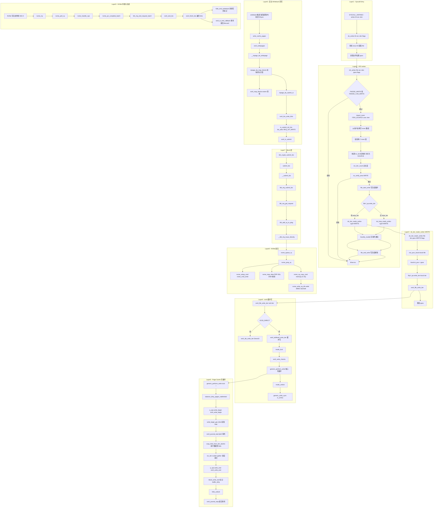

# writev 系统调用完整路径分析

## 1 概述

`writev` 是 Linux 的**聚集写（gather write）** 系统调用。与 `write` 的核心区别在于：`writev` 使用 `struct iovec` 数组描述**多个不连续的用户缓冲区**，内核从这些缓冲区中**聚集**数据后写入文件。

### writev vs readv 核心差异

| 对比项 | readv | writev |
|--|--|--|
| 数据方向 | 文件 → 用户缓冲区 | 用户缓冲区 → 文件 |
| iovec 方向 | `ITER_DEST`（内核写目标） | `ITER_SOURCE`（内核读来源） |
| VFS 写保护 | 无 | `file_start_write / file_end_write` |
| page cache 操作 | `read_folio` 填充缓存 | `write_begin/write_end` 写入并标记脏 |
| 数据拷贝 | `copy_page_to_iter` ← 页→用户 | `copy_folio_from_iter_atomic` → 用户→页 |
| BIO 完成回调 | `mpage_end_io` | `ext4_end_bio` |
| 与写磁盘时机 | 同步（缺页时立即发起 I/O） | **异步**（仅标记脏页，后台 writeback 刷盘） |

### 涉及的内核层

| 层 | 说明 |
|--|--|
| **Syscall Entry** | writev 系统调用分发 (fs/read_write.c) |
| **VFS** | iovec 导入 + kiocb 初始化 (fs/read_write.c) |
| **ext4 缓冲写** | ext4_buffered_write_iter → generic_perform_write (fs/ext4/file.c, mm/filemap.c) |
| **Page Cache** | write_begin 获取 folio + write_end 标记脏 (fs/ext4/inode.c) |
| **ext4 回写** | ext4_writepages → BIO 构造 (fs/ext4/inode.c, fs/ext4/page-io.c) |
| **Block Layer** | BIO 提交 (block/blk-core.c, blk-mq.c) |
| **NVMe 驱动** | 命令提交 + 中断完成 (drivers/nvme/host/pci.c) |

---

## 2 系统调用入口

### 2.1 SYSCALL_DEFINE3(writev)

```c
// fs/read_write.c:1344
SYSCALL_DEFINE3(writev, unsigned long, fd,
                 const struct iovec __user *, vec,
                 unsigned long, vlen)
{
    return do_writev(fd, vec, vlen, 0);
}
```

### 2.2 do_writev - fd 查找与位置获取

```c
// fs/read_write.c:1267
static ssize_t do_writev(unsigned long fd, const struct iovec __user *vec,
                         unsigned long vlen, rwf_t flags)
{
    CLASS(fd_pos, f)(fd);          // 通过 fd 查找 struct fd
    ssize_t ret = -EBADF;

    if (!fd_empty(f)) {
        loff_t pos, *ppos = file_ppos(fd_file(f));
        if (ppos) { pos = *ppos; ppos = &pos; }
        ret = vfs_writev(fd_file(f), vec, vlen, ppos, flags);
        if (ret >= 0 && ppos)
            fd_file(f)->f_pos = pos;  // 更新文件位置
    }

    if (ret > 0)
        add_wchar(current, ret);   // 统计写入字节数
    inc_syscw(current);            // 统计系统调用次数
    return ret;
}
```

---

## 3 VFS 层：vfs_writev

```c
// fs/read_write.c:1204
static ssize_t vfs_writev(struct file *file, const struct iovec __user *vec,
                          unsigned long vlen, loff_t *pos, rwf_t flags)
{
    struct iovec iovstack[UIO_FASTIOV];    // 栈上 iovec (8个)
    struct iovec *iov = iovstack;
    struct iov_iter iter;
    size_t tot_len;
    ssize_t ret = 0;

    // 权限检查
    if (!(file->f_mode & FMODE_WRITE))  return -EBADF;
    if (!(file->f_mode & FMODE_CAN_WRITE)) return -EINVAL;

    // 从用户态拷贝 iovec 数组 → 构建 iov_iter (ITER_SOURCE 表示数据来源)
    ret = import_iovec(ITER_SOURCE, vec, vlen, ARRAY_SIZE(iovstack), &iov, &iter);
    if (ret < 0) return ret;

    tot_len = iov_iter_count(&iter);
    if (!tot_len) goto out;

    ret = rw_verify_area(WRITE, file, pos, tot_len);
    if (ret < 0) goto out;

    file_start_write(file);                // 写前冻结保护
    if (file->f_op->write_iter)
        ret = do_iter_readv_writev(file, &iter, pos, WRITE, flags);
    else
        ret = do_loop_readv_writev(file, &iter, pos, WRITE, flags);
    if (ret > 0)
        fsnotify_modify(file);             // inotify 写事件通知
    file_end_write(file);                  // 写后解冻
out:
    kfree(iov);
    return ret;
}
```

### 与 readv 的 VFS 差异

| 操作 | readv | writev |
|--|--|--|
| 权限检查 | `FMODE_READ` | `FMODE_WRITE` |
| import_iovec 类型 | `ITER_DEST` | `ITER_SOURCE` |
| 写保护 | 无 | `file_start_write / file_end_write` |
| 通知类型 | `fsnotify_access` | `fsnotify_modify` |

---

## 4 do_iter_readv_writev - WRITE 分支

```c
// fs/read_write.c:988
static ssize_t do_iter_readv_writev(struct file *filp, struct iov_iter *iter,
                                    loff_t *ppos, int type, rwf_t flags)
{
    struct kiocb kiocb;
    ssize_t ret;

    init_sync_kiocb(&kiocb, filp);
    kiocb_set_rw_flags(&kiocb, flags, type);
    kiocb.ki_pos = (ppos ? *ppos : 0);

    if (type == READ)
        ret = filp->f_op->read_iter(&kiocb, iter);
    else
        ret = filp->f_op->write_iter(&kiocb, iter);   // WRITE → ext4_file_write_iter

    if (ppos) *ppos = kiocb.ki_pos;
    return ret;
}
```

---

## 5 ext4 缓冲写路径

### 5.1 ext4_file_write_iter

```
ext4_file_write_iter(iocb, from)                    // fs/ext4/file.c:844
  ├─ ext4_emergency_state 检查                       // 文件系统异常检测
  ├─ IS_DAX(inode) → ext4_dax_write_iter            // DAX 路径
  ├─ IOCB_ATOMIC → 原子写入校验                      // 原子写
  ├─ IOCB_DIRECT → ext4_dio_write_iter               // Direct I/O 路径
  └─ 缓冲 I/O → ext4_buffered_write_iter             // ← 默认路径
```

### 5.2 ext4_buffered_write_iter

```c
// fs/ext4/file.c:348
static ssize_t ext4_buffered_write_iter(struct kiocb *iocb,
                                        struct iov_iter *from)
{
    inode_lock(inode);                    // 获取 inode 锁
    ret = ext4_write_checks(iocb, from);  // 写入前检查（边界、限额等）
    if (ret > 0)
        ret = generic_perform_write(iocb, from);  // 核心缓冲写
    inode_unlock(inode);
    if (ret > 0)
        ret = generic_write_sync(iocb, ret);       // 同步（如 O_SYNC 时刷盘）
    return ret;
}
```

### 5.3 generic_perform_write - 核心写循环

```
generic_perform_write(iocb, i)                       // mm/filemap.c:4374
  │
  └─ 循环 (每次处理一个 folio):
       │
       ├─ balance_dirty_pages_ratelimited(mapping)    // 脏页限速
       │
       ├─ a_ops->write_begin(iocb, mapping, pos, bytes,
       │       &folio, &fsdata)                       // mm/filemap.c:4402
       │    └─ ext4_write_begin                        // fs/ext4/inode.c:1360
       │         ├─ write_begin_get_folio(mapping, pos)  // 获取/创建 folio
       │         ├─ __block_write_begin                  // 创建 buffer_head
       │         └─ ext4_journal_start                   // 启动 jbd2 事务
       │
       ├─ copy_folio_from_iter_atomic(folio, offset,
       │       bytes, i)                               // mm/highmem.c
       │    → 从 iov_iter 的多个段 scatter-gather 拷贝到 folio
       │
       ├─ a_ops->write_end(iocb, mapping, pos, bytes,
       │       copied, folio, fsdata)                   // mm/filemap.c:4423
       │    └─ ext4_write_end                           // fs/ext4/inode.c:1514
       │         ├─ block_write_end(pos, len, copied, folio)  // 标记 buffer_dirty
       │         ├─ ext4_update_inode_size                // 更新 i_size
       │         ├─ folio_unlock(folio)                   // 解锁 folio
       │         ├─ folio_put(folio)                      // 释放引用
       │         └─ ext4_journal_stop                     // 提交 jbd2 事务
       │
       └─ cond_resched()                               // 自愿调度
```

**核心区别**：writev 的缓冲写**不直接发起磁盘 I/O**，而是将数据写入 page cache 后标记为脏页，由后台 writeback 机制异步刷盘。

---

## 6 脏页回写路径 (Writeback)

`generic_perform_write` 仅将数据写入页缓存并标记脏。实际的磁盘写入由内核 writeback 机制触发：

```
[dirty pages in page cache]

触发条件:
  ├─ 脏页比例超限 (balance_dirty_pages 强制回写)
  ├─ 后台 flusher 线程 (周期唤醒)
  ├─ fsync/fdatasync/sync 系统调用
  └─ 内存压力回收 (shrink_inactive_list)
       │
       └─ write_cache_pages(mapping, wbc, __mpage_da_writepage)
            │
            └─ ext4_writepages(mapping, wbc)             // fs/ext4/inode.c:3089
                 │
                 ├─ write_cache_pages(mapping, wbc, __mpage_da_writepage)
                 │    │
                 │    └─ __mpage_da_writepage(folio, wbc, mpd)
                 │         │
                 │         └─ mpage_da_map_blocks(mpd)    // 块映射
                 │              ├─ ext4_map_blocks()      // extent 查找/分配
                 │              └─ ext4_ext_map_blocks()  // 物理块分配
                 │
                 └─ mpage_da_submit_io(mpd)               // 提交 I/O
                      │
                      └─ ext4_bio_write_folio(io, folio, len)  // fs/ext4/page-io.c:458
                           │
                           ├─ io_submit_init_bio(io, bh)  // bio_alloc(REQ_OP_WRITE)
                           │    ├─ bio_alloc(bdev, BIO_MAX_VECS, REQ_OP_WRITE, GFP_NOIO)
                           │    ├─ bio->bi_end_io = ext4_end_bio
                           │    └─ bio->bi_iter.bi_sector = bh->b_blocknr
                           │
                           ├─ io_submit_add_bh(io, inode, folio, ...)  // bio_add_folio
                           │
                           └─ ext4_io_submit(io)           // 提交 BIO
                                └─ blk_crypto_submit_bio(io->io_bio)
```

### ext4_writepages 详细路径

```
ext4_writepages(mapping, wbc)
  │
  ├─ ext4_emergency_state 检查
  ├─ ext4_should_journal_data → 日志数据模式处理
  ├─ 初始化 mpage_da_data (mpd)
  │
  ├─ [循环: write_cache_pages]
  │    └─ 对每个脏 folio:
  │         └─ __mpage_da_writepage
  │              ├─ mpage_add_bh_to_extent  // 聚合并区 extent
  │              └─ mpage_da_map_blocks      // extent 满时分配物理块
  │
  ├─ [收尾: mpage_da_submit_io]
  │    └─ 遍历已映射的 folio，提交 BIO
  │
  └─ trace_ext4_writepages_result
```

---

## 7 块设备层

```
blk_crypto_submit_bio(bio)
  └─ submit_bio(bio)                          // block/blk-core.c:992
       └─ __submit_bio(bio)
            └─ blk_mq_submit_bio(bio)         // block/blk-mq.c:3151
                 ├─ blk_mq_get_request()
                 ├─ blk_mq_bio_to_request()
                 ├─ blk_add_rq_to_plug()      // Plug 聚合
                 └─ __blk_mq_issue_directly()
                      └─ hctx->ops->queue_rq
                           └─ nvme_queue_rq
```

---

## 8 NVMe 驱动层

### 8.1 命令提交

```
nvme_queue_rq(hctx, bd)                       // pci.c:1405
  └─ nvme_prep_rq(req)                        // pci.c:1368
       ├─ nvme_setup_cmd(ns, req, cmd)        // nvme_cmd_write
       │    └─ nvme_setup_rw(ns, req, cmd, nvme_cmd_write)
       └─ nvme_map_data(req, cmd)             // PRP/SGL DMA 映射
            └─ dma_map_sg (将 BIO 中的 page 映射到 DMA 地址)
  └─ nvme_sq_copy_cmd(nvmeq, req)             // memcpy 到 SQ ring buffer
  └─ nvme_write_sq_db(nvmeq)                  // writel MMIO doorbell
```

### 8.2 中断完成

```
nvme_irq(irq, nvmeq)                          // pci.c:1599
  └─ nvme_poll_cq(nvmeq, ...)                 // pci.c:1578
       ├─ nvme_handle_cqe(nvmeq, cqe)         // pci.c:1531
       │    ├─ nvme_find_rq(hctx, cqe)        // 定位 request
       │    └─ blk_mq_add_to_batch(req)       // 批量完成
       └─ nvme_ring_cq_doorbell(nvmeq)        // 写 CQ 门铃
  └─ nvme_pci_complete_batch(breq)            // 批量完成
       └─ blk_mq_end_request_batch()
            └─ bio_endio(bio)
                 └─ bio->bi_end_io()
                      └─ ext4_end_bio(bio)    // fs/ext4/page-io.c
                           └─ ext4_finish_bio(bio)
                                └─ 遍历每个 folio:
                                     ├─ folio_end_writeback(folio)
                                     │    → 清除写回标记, 解锁 folio
                                     └─ ext4_io_end_callback(io_end)
                                          → 事务提交、discard 等
```

---

## 9 writev vs write 对比

| 对比项 | write | writev |
|--|--|--|
| 用户参数 | `buf, count` | `vec, vlen` (iovec 数组) |
| 缓冲区数量 | 1 | 任意 |
| 用户态拷贝 | 无 | `import_iovec` 拷贝 iovec 数组 |
| VFS 入口 | `new_sync_write` | `vfs_writev → do_iter_readv_writev` |
| write_iter 调用 | `filp->f_op->write_iter` | 相同 |

---

## 10 writev vs readv 完整对比

| 对比项 | readv | writev |
|--|--|--|
| iovec 方向 | `ITER_DEST` → 内核填充用户缓冲区 | `ITER_SOURCE` → 内核从用户缓冲区读取 |
| page cache | 读缓存（填充 uptodate） | 写缓存（标记 dirty） |
| 缺页处理 | `a_ops->read_folio` 发起 BIO | `a_ops->write_begin` 获取新 folio |
| 数据拷贝 | `copy_page_to_iter` (缓存→用户) | `copy_folio_from_iter_atomic` (用户→缓存) |
| BIO 完成 | `mpage_end_io → folio_end_read` | `ext4_end_bio → folio_end_writeback` |
| I/O 时机 | **同步**（缺页时立即发 BIO） | **异步**（writeback 线程刷盘） |

---

## 11 完整 Mermaid 流程图



---

## 12 完整函数调用链

| 步骤 | 函数 | 文件:行号 | 层 |
|--|--|--|--|
| 1 | `SYSCALL_DEFINE3(writev, fd, vec, vlen)` | fs/read_write.c:1344 | Syscall |
| 2 | `do_writev(fd, vec, vlen, 0)` | fs/read_write.c:1267 | Syscall |
| 3 | `vfs_writev(file, vec, vlen, ppos, flags)` | fs/read_write.c:1204 | VFS |
| 4 | `import_iovec(ITER_SOURCE, vec, vlen, ...)` | lib/iov_iter.c:1436 | VFS |
| 5 | `rw_verify_area(WRITE, file, pos, tot_len)` | fs/read_write.c | VFS |
| 6 | `file_start_write(file)` | fs/file.c | VFS |
| 7 | `do_iter_readv_writev(file, &iter, pos, WRITE, flags)` | fs/read_write.c:988 | VFS |
| 8 | `init_sync_kiocb(&kiocb, filp)` | fs/read_write.c:994 | VFS |
| 9 | `filp->f_op->write_iter(&kiocb, &iter)` | fs/read_write.c:1003 | VFS |
| 10 | `ext4_file_write_iter(iocb, from)` | fs/ext4/file.c:844 | ext4 |
| 11 | `ext4_buffered_write_iter(iocb, from)` | fs/ext4/file.c:348 | ext4 |
| 12 | `ext4_write_checks(iocb, from)` | fs/ext4/file.c | ext4 |
| 13 | `generic_perform_write(iocb, from)` | mm/filemap.c:4374 | Page Cache |
| 14 | `balance_dirty_pages_ratelimited(mapping)` | mm/page-writeback.c | Page Cache |
| 15 | `ext4_write_begin(iocb, mapping, pos, len, ...)` | fs/ext4/inode.c:1360 | ext4 |
| 16 | `write_begin_get_folio(mapping, pos)` | mm/filemap.c | Page Cache |
| 17 | `ext4_journal_start(...)` | fs/ext4/inode.c | ext4/jbd2 |
| 18 | `copy_folio_from_iter_atomic(folio, ...)` | mm/highmem.c | Page Cache |
| 19 | `ext4_write_end(iocb, mapping, pos, len, ...)` | fs/ext4/inode.c:1514 | ext4 |
| 20 | `block_write_end(pos, len, copied, folio)` | fs/buffer.c | Page Cache |
| 21 | `folio_unlock(folio)` | mm/filemap.c | Page Cache |
| 22 | `ext4_journal_stop(handle)` | fs/ext4/inode.c | ext4/jbd2 |
| 23 | **→ 以下为异步 writeback 路径 ←** | | |
| 24 | `ext4_writepages(mapping, wbc)` | fs/ext4/inode.c:3089 | ext4 |
| 25 | `write_cache_pages(mapping, wbc, ...)` | mm/page-writeback.c | Page Cache |
| 26 | `__mpage_da_writepage(folio, wbc, mpd)` | fs/ext4/inode.c | ext4 |
| 27 | `mpage_da_map_blocks(mpd)` | fs/ext4/inode.c | ext4 |
| 28 | `ext4_map_blocks(...)` | fs/ext4/inode.c | ext4 |
| 29 | `mpage_da_submit_io(mpd)` | fs/ext4/inode.c | ext4 |
| 30 | `ext4_bio_write_folio(io, folio, len)` | fs/ext4/page-io.c:458 | ext4 |
| 31 | `ext4_io_submit(io)` | fs/ext4/page-io.c:398 | ext4 |
| 32 | `blk_crypto_submit_bio(bio)` | block/blk-crypto.c | Block |
| 33 | `submit_bio(bio)` | block/blk-core.c:992 | Block |
| 34 | `blk_mq_submit_bio(bio)` | block/blk-mq.c:3151 | Block |
| 35 | `nvme_queue_rq(hctx, bd)` | drivers/nvme/host/pci.c:1405 | NVMe |
| 36 | `nvme_prep_rq(req)` | drivers/nvme/host/pci.c:1368 | NVMe |
| 37 | `nvme_setup_cmd(ns, req, cmd)` | drivers/nvme/host/core.c:1081 | NVMe |
| 38 | `nvme_sq_copy_cmd(nvmeq, req)` | drivers/nvme/host/pci.c:730 | NVMe |
| 39 | `nvme_write_sq_db(nvmeq)` | drivers/nvme/host/pci.c:713 | NVMe |
| 40 | `nvme_irq(irq, nvmeq)` | drivers/nvme/host/pci.c:1599 | NVMe |
| 41 | `nvme_poll_cq(nvmeq, ...)` | drivers/nvme/host/pci.c:1578 | NVMe |
| 42 | `nvme_handle_cqe(nvmeq, cqe)` | drivers/nvme/host/pci.c:1531 | NVMe |
| 43 | `blk_mq_end_request_batch(...)` | block/blk-mq.c | Block |
| 44 | `ext4_end_bio(bio)` | fs/ext4/page-io.c | ext4 |
| 45 | `folio_end_writeback(folio)` | mm/page-writeback.c | Page Cache |
| 46 | `ext4_io_end_callback(io_end)` | fs/ext4/page-io.c | ext4 |

---

## 13 关键数据结构

```
struct iovec (用户态)                  struct iov_iter (内核态)
+------------------------+            +----------------------------+
| iov_base (void*)       |            | iter_type = ITER_IOVEC      |
| iov_len (size_t)       |            | data_source = ITER_SOURCE   |
+------------------------+            | iov (struct iovec*)         |
struct iovec []                       | nr_segs                     |
[0] iov_base=0x7f...                  | iov_offset                  |
    iov_len=4096                      | count                       |
[1] iov_base=0x7f...                  +----------------------------+
    iov_len=2048

struct kiocb                   struct bio (写 BIO)
+------------------------+     +--------------------------+
| ki_filp (struct file*) |     | bi_opf = REQ_OP_WRITE    |
| ki_pos (loff_t)        |     | bi_end_io = ext4_end_bio |
| ki_flags (IOCB_*)      |     | bi_iter.bi_sector        |
+------------------------+     +--------------------------+

struct ext4_io_submit            struct mpage_da_data
+------------------------+     +------------------------------+
| io_bio (struct bio*)   |     | inode                        |
| io_end (ext4_io_end*)  |     | wbc (writeback_control)      |
| io_wbc (wbc*)          |     | can_map                      |
| io_next_block          |     | first_page / next_page       |
+------------------------+     | mpd.extent (逻辑块区间)      |
                               +------------------------------+
```

---

## 14 关键优化与差异机制

### 14.1 写路径 vs 读路径核心差异

| 机制 | 读路径 | 写路径 |
|--|--|--|
| 数据方向 | 磁盘 → 页缓存 → 用户 | 用户 → 页缓存 → 磁盘 |
| page cache 操作 | `read_folio` → `folio_end_read` | `write_begin/write_end` → `folio_end_writeback` |
| I/O 发起时机 | 同步（缺页立即 BIO） | **异步**（标记脏，后台 writeback） |
| 完成回调 | `mpage_end_io` | `ext4_end_bio` |

### 14.2 writev 的 scatter-gather 优势

`copy_folio_from_iter_atomic(folio, offset, bytes, i)` 自动处理 iov_iter 中的多段缓冲区：

```
iov_iter 中的 3 个段:
  [段1: base=0xAAA, len=4K]  → 拷贝 4K 到 folio[0-4K)
  [段2: base=0xBBB, len=2K]  → 拷贝 2K 到 folio[4K-6K)
  [段3: base=0xCCC, len=2K]  → 拷贝 2K 到 folio[6K-8K)

无需逐段调用 write 系统调用，内核一次性完成所有拷贝。
```

### 14.3 延迟分配 (Delayed Allocation)

ext4 在 writeback 时通过 `mpage_da_map_blocks` 做延迟块分配：

```
write(folio data into page cache)
  │
  └─ folio 标记 dirty (buffer_delay 状态，无物理块)
       │
       └─ writeback:
            ├─ mpage_da_map_blocks  // 聚合并区 extent
            └─ ext4_map_blocks      // 真正分配物理块
                 → 写入磁盘
```

### 14.4 批量 BIO 提交

`ext4_bio_write_folio` 通过 `io_submit_init_bio` + `io_submit_add_bh` 将相邻的逻辑块合并到同一个 BIO，减少 I/O 次数。

---

## 15 总结

```
                    writev 系统调用完整数据流

用户态 writev(fd, [{buf1,4K}, {buf2,2K}, {buf3,2K}], 3)
  │
  ├─ 1. 系统调用入口 (SYSCALL_DEFINE3)
  │
  ├─ 2. VFS 写入准备
  │    ├─ import_iovec(ITER_SOURCE): 拷贝 iovec[3] 到内核
  │    ├─ rw_verify_area: 写入权限检查
  │    ├─ file_start_write: 冻结保护
  │    └─ do_iter_readv_writev → ext4_file_write_iter
  │
  ├─ 3. ext4 缓冲写
  │    └─ ext4_buffered_write_iter → generic_perform_write
  │
  ├─ 4. Page Cache 写循环
  │    ├─ ext4_write_begin: 获取 folio + 启动 jbd2 事务
  │    ├─ copy_folio_from_iter_atomic: 8K 数据 scatter 到 folio
  │    └─ ext4_write_end: 标记 dirty + 提交 jbd2 + unlock
  │
  │    [此处 data 仍在 DRAM 中，未写磁盘]
  │
  ├─ 5. 异步 Writeback (后台)
  │    └─ ext4_writepages
  │         ├─ mpage_da_map_blocks: 块映射+分配
  │         └─ ext4_bio_write_folio → ext4_io_submit
  │
  ├─ 6. Block 层
  │    └─ submit_bio → blk_mq_submit_bio
  │
  ├─ 7. NVMe 提交
  │    └─ nvme_setup_cmd(nvme_cmd_write) → writel(Doorbell)
  │
  └─ 8. 中断完成
       └─ nvme_irq → ext4_end_bio → folio_end_writeback
```

**核心要点**：
- writev 将多段用户缓冲区**聚集**写入 page cache，由 `copy_folio_from_iter_atomic` 实现 scatter-gather
- 缓冲 I/O 的磁盘写入是**异步**的——`generic_perform_write` 仅标记脏页，不发起 I/O
- 实际磁盘 I/O 由 writeback 触发 `ext4_writepages` → `ext4_bio_write_folio` 完成
- `ext4_end_bio` 是写完成回调，调用 `folio_end_writeback` 清除写回标记
- 延迟分配（delalloc）在 writeback 时才分配物理块，提升顺序性
- 与 readv 同享 VFS 层 `do_iter_readv_writev` 框架，但数据方向和完成路径完全不同
